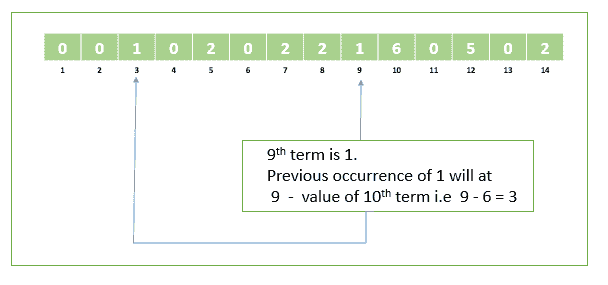

# 统计范埃克序列前 N 项中第 N 项的出现次数

> 原文:[https://www . geesforgeks . org/count-of-in-n-first-n-terms-of-van-ecks-sequence/](https://www.geeksforgeeks.org/count-the-occurrence-of-nth-term-in-first-n-terms-of-van-ecks-sequence/)

**先决条件:** [范埃克的序列](https://www.geeksforgeeks.org/program-to-find-nth-term-of-the-van-ecks-sequence/)

给定一个正整数 **N** ，任务是统计范埃克序列前 N 个项中第 N 个<sup>项的出现次数。</sup>

**示例:**

> **输入:** N = 5
> **输出:** 1
> **解释:**
> 范埃克序列的前 5 项 0，0，1，0，2
> 第 5 项的出现即 2 = 1
> 
> **输入:** 11
> **输出:** 5
> **解释:**
> 范埃克数列的前 11 项 0、0、1、0、2、0、2、2、1、6、0、
> 第 11 项的出现即 0 为 5

1.  **Naive Approach:**
    *   生成范·埃克的序列直到第三个术语
    *   遍历生成的序列，计算第 N <sup>个</sup>项的出现次数。

    为了服务多个查询，我们可以预先计算范埃克的序列。

    以下是上述方法的实现:

    ## C++

    ```
    // C++ program to count the occurrence
    // of nth term in first n terms
    // of Van Eck's sequence

    #include <bits/stdc++.h>
    using namespace std;

    #define MAX 100000
    int sequence[MAX + 1];

    // Utility function to compute
    // Van Eck's sequence
    void vanEckSequence()
    {

        // Initialize sequence array
        for (int i = 0; i < MAX; i++) {
            sequence[i] = 0;
        }

        // Loop to generate sequence
        for (int i = 0; i < MAX; i++) {

            // Check if sequence[i] has occured
            // previously or is new to sequence
            for (int j = i - 1; j >= 0; j--) {
                if (sequence[j] == sequence[i]) {

                    // If occurrence found
                    // then the next term will be
                    // how far back this last term
                    // occured previously
                    sequence[i + 1] = i - j;
                    break;
                }
            }
        }
    }

    // Utility function to count
    // the occurrence of nth term
    // in first n terms of the sequence
    int getCount(int n)
    {

        // Get nth term of the sequence
        int nthTerm = sequence[n - 1];

        int count = 0;

        // Count the occurrence of nth term
        // in first n terms of the sequence
        for (int i = 0; i < n; i++) {

            if (sequence[i] == nthTerm)
                count++;
        }

        // Return count
        return count;
    }

    // Driver code
    int main()
    {

        // Pre-compute Van Eck's sequence
        vanEckSequence();

        int n = 5;

        // Print count of the occurrence of nth term
        // in first n terms of the sequence
        cout << getCount(n) << endl;

        n = 11;

        // Print count of the occurrence of nth term
        // in first n terms of the sequence
        cout << getCount(n) << endl;

        return 0;
    }
    ```

    ## Java 语言(一种计算机语言，尤用于创建网站)

    ```
    // Java program to count the occurrence
    // of nth term in first n terms
    // of Van Eck's sequence

    class GFG {

        static int MAX = 100000;
        static int sequence[] = new int[MAX + 1];

        // Utility function to compute
        // Van Eck's sequence
        static void vanEckSequence()
        {

            // Initialize sequence array
            for (int i = 0; i < MAX; i++) {
                sequence[i] = 0;
            }

            // Loop to generate sequence
            for (int i = 0; i < MAX; i++) {

                // Check if sequence[i] has occured
                // previously or is new to sequence
                for (int j = i - 1; j >= 0; j--) {
                    if (sequence[j] == sequence[i]) {

                        // If occurrence found
                        // then the next term will be
                        // how far back this last term
                        // occured previously
                        sequence[i + 1] = i - j;
                        break;
                    }
                }
            }
        }

        // Utility function to count
        // the occurrence of nth term
        // in first n terms of the sequence
        static int getCount(int n)
        {

            // Get nth term of the sequence
            int nthTerm = sequence[n - 1];

            int count = 0;

            // Count the occurrence of nth term
            // in first n terms of the sequence
            for (int i = 0; i < n; i++) {

                if (sequence[i] == nthTerm)
                    count++;
            }

            // Return count
            return count;
        }

        // Driver code
        public static void main(String[] args)
        {

            // Pre-compute Van Eck's sequence
            vanEckSequence();

            int n = 5;

            // Print count of the occurrence of nth term
            // in first n terms of the sequence
            System.out.println(getCount(n));

            n = 11;

            // Print count of the occurrence of nth term
            // in first n terms of the sequence
            System.out.println(getCount(n));
        }
    }
    ```

    ## 蟒蛇 3

    ```
    # Python3 program to count the occurrence 
    # of nth term in first n terms 
    # of Van Eck's sequence 

    MAX = 10000
    sequence = [0]*(MAX + 1); 

    # Utility function to compute 
    # Van Eck's sequence 
    def vanEckSequence() :

        # Loop to generate sequence 
        for i in range(MAX) :

            # Check if sequence[i] has occured 
            # previously or is new to sequence 
            for j in range(i - 1, -1, -1) :
                if (sequence[j] == sequence[i]) :

                    # If occurrence found 
                    # then the next term will be 
                    # how far back this last term 
                    # occured previously 
                    sequence[i + 1] = i - j; 
                    break; 

    # Utility function to count 
    # the occurrence of nth term 
    # in first n terms of the sequence 
    def getCount(n) : 

        # Get nth term of the sequence 
        nthTerm = sequence[n - 1]; 

        count = 0; 

        # Count the occurrence of nth term 
        # in first n terms of the sequence 
        for i in range(n) :

            if (sequence[i] == nthTerm) :
                count += 1; 

        # Return count 
        return count; 

    # Driver code 
    if __name__ == "__main__" : 

        # Pre-compute Van Eck's sequence 
        vanEckSequence(); 

        n = 5; 

        # Print count of the occurrence of nth term 
        # in first n terms of the sequence 
        print(getCount(n)); 

        n = 11; 

        # Print count of the occurrence of nth term 
        # in first n terms of the sequence 
        print(getCount(n)); 

    # This code is contributed by AnkitRai01
    ```

    ## C#

    ```
    // C# program to count the occurrence
    // of nth term in first n terms
    // of Van Eck's sequence

    using System;
    class GFG {

        static int MAX = 100000;
        static int[] sequence = new int[MAX + 1];

        // Utility function to compute
        // Van Eck's sequence
        static void vanEckSequence()
        {

            // Initialize sequence array
            for (int i = 0; i < MAX; i++) {
                sequence[i] = 0;
            }

            // Loop to generate sequence
            for (int i = 0; i < MAX; i++) {

                // Check if sequence[i] has occured
                // previously or is new to sequence
                for (int j = i - 1; j >= 0; j--) {
                    if (sequence[j] == sequence[i]) {

                        // If occurrence found
                        // then the next term will be
                        // how far back this last term
                        // occured previously
                        sequence[i + 1] = i - j;
                        break;
                    }
                }
            }
        }

        // Utility function to count
        // the occurrence of nth term
        // in first n terms of the sequence
        static int getCount(int n)
        {

            // Get nth term of the sequence
            int nthTerm = sequence[n - 1];

            int count = 0;

            // Count the occurrence of nth term
            // in first n terms of the sequence
            for (int i = 0; i < n; i++) {

                if (sequence[i] == nthTerm)
                    count++;
            }

            // Return count
            return count;
        }

        // Driver code
        public static void Main()
        {

            // Pre-compute Van Eck's sequence
            vanEckSequence();

            int n = 5;

            // Print count of the occurrence of nth term
            // in first n terms of the sequence
            Console.WriteLine(getCount(n));

            n = 11;

            // Print count of the occurrence of nth term
            // in first n terms of the sequence
            Console.WriteLine(getCount(n));
        }
    }
    ```

    **Output:**

    ```
    1
    5

    ```

2.  **Efficient Approach:**
    *   对于[范埃克序列](https://www.geeksforgeeks.org/program-to-find-nth-term-of-the-van-ecks-sequence/)中的给定项，它的下一项表示给定项的最后一次出现之间的距离。
    *   因此，对于第 i <sup>个</sup>术语，其先前的出现将在第 I**I–value(I+1)<sup>个</sup>术语**处。
        例如:
        [](https://media.geeksforgeeks.org/wp-content/uploads/20191225035235/vaneck1.png)
    *   另外，如果序列中的下一项是 0，那么这意味着该项以前没有出现过。
        例如:
        [](https://media.geeksforgeeks.org/wp-content/uploads/20191225035239/VanEck2.png)
    *   **算法:**
        *   让我们把序列的第 N <sup>个</sup>项看作是 S <sub>N</sub>
        *   如果 S <sub>N+1</sub> 非零，则递增计数
            并对(N- S <sub>N+1</sub> ) <sup>第</sup>项进行同样的操作
        *   如果 S <sub>N+1</sub> 为零，则停止。

    以下是上述方法的实现:

    ## 卡片打印处理机（Card Print Processor 的缩写）

    ```
    // C++ program to count the occurrence
    // of nth term in first n terms
    // of Van Eck's sequence

    #include <bits/stdc++.h>
    using namespace std;

    #define MAX 100000
    int sequence[MAX + 1];

    // Utility function to compute
    // Van Eck's sequence
    void vanEckSequence()
    {

        // Initialize sequence array
        for (int i = 0; i < MAX; i++) {
            sequence[i] = 0;
        }

        // Loop to generate sequence
        for (int i = 0; i < MAX; i++) {

            // Check if sequence[i] has occured
            // previously or is new to sequence
            for (int j = i - 1; j >= 0; j--) {
                if (sequence[j] == sequence[i]) {

                    // If occurrence found
                    // then the next term will be
                    // how far back this last term
                    // occured previously
                    sequence[i + 1] = i - j;
                    break;
                }
            }
        }
    }

    // Utility function to count
    // the occurrence of nth term
    // in first n terms of the sequence
    int getCount(int n)
    {

        // Initialize count as 1
        int count = 1;

        int i = n - 1;

        while (sequence[i + 1] != 0) {

            // Increment count if (i+1)th term
            // is non-zero
            count++;

            // Previous occurrence of sequence[i]
            // will be it (i - sequence[i+1])th position
            i = i - sequence[i + 1];
        }

        // Return the count of occurrence
        return count;
    }

    // Driver code
    int main()
    {

        // Pre-compute Van Eck's sequence
        vanEckSequence();

        int n = 5;

        // Print count of the occurrence of nth term
        // in first n terms of the sequence
        cout << getCount(n) << endl;

        n = 11;

        // Print count of the occurrence of nth term
        // in first n terms of the sequence
        cout << getCount(n) << endl;

        return 0;
    }
    ```

    ## Java 语言(一种计算机语言，尤用于创建网站)

    ```
    // Java program to count the occurrence
    // of nth term in first n terms
    // of Van Eck's sequence

    class GFG {

        static int MAX = 100000;
        static int sequence[] = new int[MAX + 1];

        // Utility function to compute
        // Van Eck's sequence
        static void vanEckSequence()
        {

            // Initialize sequence array
            for (int i = 0; i < MAX; i++) {
                sequence[i] = 0;
            }

            // Loop to generate sequence
            for (int i = 0; i < MAX; i++) {

                // Check if sequence[i] has occured
                // previously or is new to sequence
                for (int j = i - 1; j >= 0; j--) {
                    if (sequence[j] == sequence[i]) {

                        // If occurrence found
                        // then the next term will be
                        // how far back this last term
                        // occured previously
                        sequence[i + 1] = i - j;
                        break;
                    }
                }
            }
        }

        // Utility function to count
        // the occurrence of nth term
        // in first n terms of the sequence
        static int getCount(int n)
        {

            // Initialize count as 1
            int count = 1;

            int i = n - 1;
            while (sequence[i + 1] != 0) {

                // Increment count if (i+1)th term
                // is non-zero
                count++;

                // Previous occurrence of sequence[i]
                // will be it (i - sequence[i+1])th position
                i = i - sequence[i + 1];
            }

            // Return the count of occurrence
            return count;
        }

        // Driver code
        public static void main(String[] args)
        {

            // Pre-compute Van Eck's sequence
            vanEckSequence();

            int n = 5;

            // Print count of the occurrence of nth term
            // in first n terms of the sequence
            System.out.println(getCount(n));

            n = 11;

            // Print count of the occurrence of nth term
            // in first n terms of the sequence
            System.out.println(getCount(n));
        }
    }
    ```

    ## 蟒蛇 3

    ```
    # Python3 program to count the occurrence 
    # of nth term in first n terms 
    # of Van Eck's sequence 
    MAX = 10000
    sequence = [0] * (MAX + 1); 

    # Utility function to compute 
    # Van Eck's sequence 
    def vanEckSequence() :

        # Loop to generate sequence 
        for i in range(MAX) : 

            # Check if sequence[i] has occured 
            # previously or is new to sequence 
            for j in range( i - 1, -1, -1) : 
                if (sequence[j] == sequence[i]) :

                    # If occurrence found 
                    # then the next term will be 
                    # how far back this last term 
                    # occured previously 
                    sequence[i + 1] = i - j; 
                    break; 

    # Utility function to count 
    # the occurrence of nth term 
    # in first n terms of the sequence 
    def getCount(n) : 

        # Initialize count as 1 
        count = 1; 

        i = n - 1; 

        while (sequence[i + 1] != 0) :

            # Increment count if (i+1)th term 
            # is non-zero 
            count += 1; 

            # Previous occurrence of sequence[i] 
            # will be it (i - sequence[i+1])th position 
            i = i - sequence[i + 1]; 

        # Return the count of occurrence 
        return count; 

    # Driver code 
    if __name__ == "__main__" : 

        # Pre-compute Van Eck's sequence 
        vanEckSequence(); 

        n = 5; 

        # Print count of the occurrence of nth term 
        # in first n terms of the sequence 
        print(getCount(n)); 

        n = 11; 

        # Print count of the occurrence of nth term 
        # in first n terms of the sequence 
        print(getCount(n)) ; 

    # This code is contributed by AnkitRai01
    ```

    ## C#

    ```
    // C# program to count the occurrence
    // of nth term in first n terms
    // of Van Eck's sequence

    using System;
    class GFG {

        static int MAX = 100000;
        static int[] sequence = new int[MAX + 1];

        // Utility function to compute
        // Van Eck's sequence
        static void vanEckSequence()
        {

            // Initialize sequence array
            for (int i = 0; i < MAX; i++) {
                sequence[i] = 0;
            }

            // Loop to generate sequence
            for (int i = 0; i < MAX; i++) {

                // Check if sequence[i] has occured
                // previously or is new to sequence
                for (int j = i - 1; j >= 0; j--) {
                    if (sequence[j] == sequence[i]) {

                        // If occurrence found
                        // then the next term will be
                        // how far back this last term
                        // occured previously
                        sequence[i + 1] = i - j;
                        break;
                    }
                }
            }
        }

        // Utility function to count
        // the occurrence of nth term
        // in first n terms of the sequence
        static int getCount(int n)
        {

            // Initialize count as 1
            int count = 1;
            int i = n - 1;

            while (sequence[i + 1] != 0) {

                // Increment count if (i+1)th term
                // is non-zero
                count++;

                // Previous occurrence of sequence[i]
                // will be it (i - sequence[i+1])th position
                i = i - sequence[i + 1];
            }

            // Return the count of occurrence
            return count;
        }

        // Driver code
        public static void Main(string[] args)
        {

            // Pre-compute Van Eck's sequence
            vanEckSequence();

            int n = 5;

            // Print count of the occurrence of nth term
            // in first n terms of the sequence
            Console.WriteLine(getCount(n));

            n = 11;

            // Print count of the occurrence of nth term
            // in first n terms of the sequence
            Console.WriteLine(getCount(n));
        }
    }
    ```

    **Output:**

    ```
    1
    5

    ```