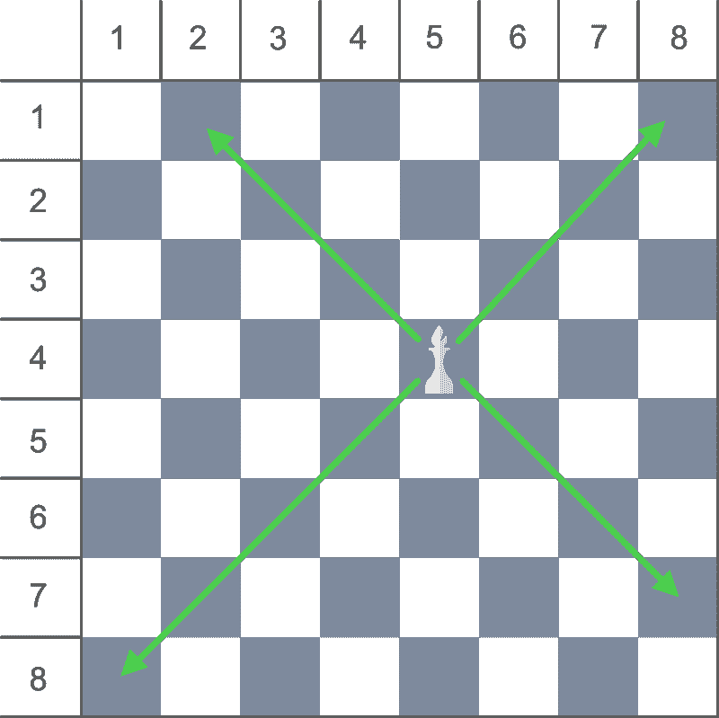

# 统计毕肖普一步可访问的方块总数

> 原文:[https://www . geeksforgeeks . org/count-一气呵成的主教可以访问的方块总数/](https://www.geeksforgeeks.org/count-the-total-number-of-squares-that-can-be-visited-by-bishop-in-one-move/)

给定一个**主教**在 **8 * 8 棋盘**上的位置，任务是计算主教一步可以访问的方块总数。主教的位置用棋盘的行列号来表示。
**例:**

> **输入:**行= 4，列= 4
> **输出:** 13
> **输入:**行= 1，列= 1
> **输出:** 7

**进场:**对弈中，一个毕肖普只能对角移动，每次移动的距离没有限制。



因此，我们也可以说毕肖普可以从当前位置以四种方式移动，即对角左上、右上、左下和右下。
我们可以通过
计算每次移动中被访问的方块数

> **左上移动** =最小(r，c)–1
> **右上移动** =最小(r，9–c)–1
> **左下移动**= 8–最大(r，9–c)
> **右下移动**= 8–最大(r，c)
> 其中， **r** 和 **c** 为

以下是上述方法的实现:

## C++

```
// C++ implementation of above approach
#include <bits/stdc++.h>
using namespace std;

// Function to return the count of
// total positions the Bishop
// can visit in a single move
int countSquares(int row, int column)
{

    // Count top left squares
    int topLeft = min(row, column) - 1;

    // Count bottom right squares
    int bottomRight = 8 - max(row, column);

    // Count top right squares
    int topRight = min(row, 9 - column) - 1;

    // Count bottom left squares
    int bottomLeft = 8 - max(row, 9 - column);

    // Return total count
    return (topLeft + topRight + bottomRight + bottomLeft);
}

// Driver code
int main()
{

    // Bishop's Position
    int row = 4, column = 4;

    cout << countSquares(row, column);

    return 0;
}
```

## Java 语言(一种计算机语言，尤用于创建网站)

```
// Java implementation of above approach
class GFG {

    // Function to return the count of
    // total positions the Bishop
    // can visit in a single move
    static int countSquares(int row, int column)
    {

        // Count top left squares
        int topLeft = Math.min(row, column) - 1;

        // Count bottom right squares
        int bottomRight = 8 - Math.max(row, column);

        // Count top right squares
        int topRight = Math.min(row, 9 - column) - 1;

        // Count bottom left squares
        int bottomLeft = 8 - Math.max(row, 9 - column);

        // Return total count
        return (topLeft + topRight + bottomRight + bottomLeft);
    }

    // Driver code
    public static void main(String[] args)
    {

        // Bishop's Position
        int row = 4, column = 4;

        System.out.println(countSquares(row, column));
    }
}
```

## C#

```
// C# implementation of above approach
using System;
class GFG {

    // Function to return the count of
    // total positions the Bishop
    // can visit in a single move
    static int countSquares(int row, int column)
    {

        // Count top left squares
        int topLeft = Math.Min(row, column) - 1;

        // Count bottom right squares
        int bottomRight = 8 - Math.Max(row, column);

        // Count top right squares
        int topRight = Math.Min(row, 9 - column) - 1;

        // Count bottom left squares
        int bottomLeft = 8 - Math.Max(row, 9 - column);

        // Return total count
        return (topLeft + topRight + bottomRight + bottomLeft);
    }

    // Driver code
    public static void Main()
    {

        // Bishop's Position
        int row = 4, column = 4;

        Console.WriteLine(countSquares(row, column));
    }
}
```

## 蟒蛇 3

```
# Python3 implementation of above approach

# Function to return the count of
# total positions the Bishop
# can visit in a single move
def countSquares(row, column):

    # Count top left squares
    topLeft = min(row, column) - 1

    # Count bottom right squares
    bottomRight = 8 - max(row, column)

    # Count top right squares
    topRight = min(row, 9-column) -1

    # Count bottom left squares
    bottomLeft = 8 - max(row, 9-column)

    # Return total count
    return (topLeft + topRight + bottomRight + bottomLeft)

# Driver code

# Bishop's Position
row = 4
column = 4

print(countSquares(row, column))
```

## 服务器端编程语言（Professional Hypertext Preprocessor 的缩写）

```
<?php
// PHP implementation of above approach

// Function to return the count of
// total positions the Bishop
// can visit in a single move
function countSquares($row, $column)
{

    // Count top left squares
    $topLeft = min($row, $column) - 1;

    // Count bottom right squares
    $bottomRight = 8 - max($row, $column);

    // Count top right squares
    $topRight = min($row, 9 - $column) - 1;

    // Count bottom left squares
    $bottomLeft = 8 - max($row, 9 - $column);

    // Return total count
    return ($topLeft + $topRight +
            $bottomRight + $bottomLeft);
}

// Driver code

// Bishop's Position
$row = 4;
$column = 4;
echo countSquares($row, $column);

// This code is contributed by jit_t
?>
```

## java 描述语言

```
<script>

// Javascript implementation of above approach

// Function to return the count of
// total positions the Bishop
// can visit in a single move
function countSquares(row, column)
{

    // Count top left squares
    var topLeft = Math.min(row, column) - 1;

    // Count bottom right squares
    var bottomRight = 8 - Math.max(row, column);

    // Count top right squares
    var topRight = Math.min(row, 9 - column) - 1;

    // Count bottom left squares
    var bottomLeft = 8 - Math.max(row, 9 - column);

    // Return total count
    return (topLeft + topRight + bottomRight + bottomLeft);
}

// Driver code
// Bishop's Position
var row = 4, column = 4;
document.write( countSquares(row, column));

</script>
```

**Output:** 

```
13
```