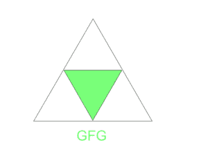
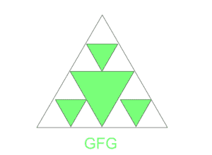

# 计算第 n 次操作后的三角形总数

> 原文:[https://www . geesforgeks . org/count-n 次运算后的三角形总数/](https://www.geeksforgeeks.org/count-the-total-number-of-triangles-after-nth-operation/)

给定一个等边三角形，任务是在执行以下操作 **N** 次后计算三角形的总数。
每一次运算，取未着色的三角形，分成 4 个等边三角形。形成的每个倒三角形都是彩色的。更多详情请参考下图。
对于 **N=1** ，形成的三角形为:



对于 **N=2** ，形成的三角形为:



**例:**

> **输入:** N = 10
> **输出:** 118097
> **输入:** N = 2
> **输出:** 17

**进场:**

> *   Each operation forms three uncolored triangles, one colored triangle and the triangle itself.
> *   Write the above statements mathematically; The triangle count at the nth move = 3 * the triangle count at the (N-1) th move+2
> *   Therefore, the initialization variables **curr = 1** and **tri _ count = 0**
> *   Next, the loop iterates from 1 to n.
> *   For each iteration, perform the above operations.
> *   Finally, return tri _ count.

以下是上述方法的实现:

## C++

```
#include <bits/stdc++.h>
using namespace std;
// function to return the
// total no.of Triangles
int CountTriangles(int n)
{
    int curr = 1;
    int Tri_count = 0;
    for (int i = 1; i <= n; i++) {
        // For every subtriangle formed
        // there are possibilities of
        // generating (curr*3)+2

        Tri_count = (curr * 3) + 2;
        // Changing the curr value to Tri_count
        curr = Tri_count;
    }
    return Tri_count;
}

// driver code
int main()
{
    int n = 10;
    cout << CountTriangles(n);
    return 0;
}
```

## Java 语言(一种计算机语言，尤用于创建网站)

```
class Gfg {
    // Method to return the
    // total no.of Triangles
    public static int CountTriangles(int n)
    {
        int curr = 1;
        int Tri_count = 0;
        for (int i = 1; i <= n; i++) {
            // For every subtriangle formed
            // there are possibilities of
            // generating (curr*3)+2

            Tri_count = (curr * 3) + 2;
            // Changing the curr value to Tri_count
            curr = Tri_count;
        }
        return Tri_count;
    }

    // driver code
    public static void main(String[] args)
    {
        int n = 10;
        System.out.println(CountTriangles(n));
    }
}
```

## 计算机编程语言

```
# Function to return the
# total no.of Triangles
def countTriangles(n):

    curr = 1
    Tri_count = 0
    for i in range(1, n + 1):

        # For every subtriangle formed
        # there are possibilities of
        # generating (curr * 3)+2
        Tri_count = (curr * 3) + 2
        # Changing the curr value to Tri_count
        curr = Tri_count
    return Tri_count

n = 10
print(countTriangles(n))
```

## C#

```
using System;

class Gfg
{
    // Method to return the
    // total no.of Triangles
    public static int CountTriangles(int n)
    {
        int curr = 1;
        int Tri_count = 0;
        for (int i = 1; i <= n; i++)
        {
            // For every subtriangle formed
            // there are possibilities of
            // generating (curr*3)+2
            Tri_count = (curr * 3) + 2;

            // Changing the curr value to Tri_count
            curr = Tri_count;
        }
        return Tri_count;
    }

    // Driver code
    public static void Main(String[] args)
    {
        int n = 10;
        Console.WriteLine(CountTriangles(n));
    }
}

// This code is contributed by 29AjayKumar
```

## java 描述语言

```
<script>
    // Method to return the
    // total no.of Triangles
    function CountTriangles(n)
    {
        var curr = 1;
        var Tri_count = 0;
        for (i = 1; i <= n; i++)
        {

            // For every subtriangle formed
            // there are possibilities of
            // generating (curr*3)+2

            Tri_count = (curr * 3) + 2;
            // Changing the curr value to Tri_count
            curr = Tri_count;
        }
        return Tri_count;
    }

    // driver code
        var n = 10;
        document.write(CountTriangles(n));

// This code is contributed by aashish1995
</script>
```

**Output:** 

```
118097
```