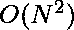

# 统计修改后数组中大于 X 的值

> 原文:[https://www . geeksforgeeks . org/count-the-values-before-in-x-the-modified-array/](https://www.geeksforgeeks.org/count-the-values-greater-than-x-in-the-modified-array/)

给定一个正整数数组 **Arr** 和值 **X** 。任务是找到大于或等于 **X** 的数值。
但扭曲的是，数组的值在每次操作后都会保持变化。有两种可能:

*   如果当前值被选取，那么数组中所有剩余的值将减少 **1** 。
*   如果当前值未被选取，则数组中所有剩余的值将增加 **1** 。

**例:**

> **输入:** arr[] = {10，5，5，4，9}，X = 10
> **输出:** 2
> **解释:**
> Arr = {10，5，5，4，9}，pos = 0
> 10 被拾取
> Arr = {10，4，4，3，8}，pos = 1
> 4 未被拾取
> Arr = {10，4，5，4，9} pos = 3
> 5 未被拾取
> Arr = {10，4，5，5，11}，pos = 4
> 11 被拾取
> 因此两个元素被拾取。
> **输入:** arr[] = {5，4，3，2，1}，X = 4
> **输出:** 1

**天真方法:**想法是遍历数组中的每个值，检查第 **i <sup>第</sup>T5】个值是否大于、小于或等于所需值 **X** 。如果 **i <sup>th</sup>** 值小于要求值，则通过 **1** 将该值从 **(i+1) <sup>th</sup>** 增加到数组**末端**否则如果 **i <sup>th</sup>** 值大于或等于要求值 **X** 则将该值从 **1** 减少
以下是上述方法的实施:** 

## C++

```
// C++ implementation of the approach
#include <bits/stdc++.h>
using namespace std;

// Function to count number
// of values greater or equal to x
int increaseDecreaseValue(int arr[],
                          int x, int n)
{
    int TotalValue = 0;
    for (int i = 0; i < n; i++)
    {
        if (arr[i] < x)
        {

            // Current value is less
            // than required value
            // then we need to increase
            // the value from i + 1 to
            // len(arr) by 1
            for (int j = i + 1; j < n; j++)
            {
                arr[j] += 1;
            }
        }
        else
        {

            // Current value is greater
            // or equal to required
            // value then we need to
            // decrease the value from
            // (i + 1) to len(arr)-1 by 1
            TotalValue += 1;
            for (int j = i + 1; j < n; j++)
            {
                if (arr[j] == 0)
                {
                    continue;
                }
                else
                {
                    arr[j] -= 1;
                }
            }
        }
    }
    return TotalValue;
}

// Driver Code
int main()
{
    int x = 4;
    int arr[] = {5, 4, 3, 2, 1};
    int n = sizeof(arr) / sizeof(arr[0]);
    int countValue = increaseDecreaseValue(arr, x, n);
    cout << countValue;
    return 0;
}

// This code is contributed by Rajput-Ji
```

## Java 语言(一种计算机语言，尤用于创建网站)

```
// Java implementation of the approach
import java.util.*;

class GFG
{

// Function to count number
// of values greater or equal to x
static int increaseDecreaseValue(int []arr, int x)
{
    int TotalValue = 0;
    for (int i = 0; i < arr.length; i++)
    {
        if (arr[i] < x)
        {

            // Current value is less
            // than required value
            // then we need to increase
            // the value from i + 1 to
            // len(arr) by 1
            for (int j = i + 1; j < arr.length; j++)
            {
                arr[j] += 1;
            }
        }
        else
        {

            // Current value is greater
            // or equal to required
            // value then we need to
            // decrease the value from
            // (i + 1) to len(arr)-1 by 1
            TotalValue += 1;
            for (int j = i + 1; j < arr.length; j++)
            {
                if (arr[j] == 0)
                {
                    continue;
                }
                else
                {
                    arr[j] -= 1;
                }
            }
        }
    }
    return TotalValue;
}

// Driver Code
public static void main(String[] args)
{
    int x = 4;
    int[] arr = {5, 4, 3, 2, 1};
    int countValue = increaseDecreaseValue(arr, x);
    System.out.println(countValue);
}
}

// This code is contributed by Rajput-Ji
```

## 蟒蛇 3

```
# Python3 implementation
# of the approach

# Function to count number
# of values greater or equal to x
def increaseDecreaseValue(arr, x):
    TotalValue = 0
    for i in range(len(arr)):
        if arr[i] < x:

            # Current value is less
            # than required value
            # then we need to increase
            # the value from i + 1 to
            # len(arr) by 1
            for j in range(i + 1, len(arr)):
                arr[j] += 1
        else:

            # Current value is greater
            # or equal to required
            # value then we need to
            # decrease the value from
            # (i + 1) to len(arr)-1 by 1
            TotalValue += 1

            for j in range(i + 1, len(arr)):
                if arr[j] == 0:
                    continue
                arr[j] -= 1
    return TotalValue

# Driver Code
if __name__ == "__main__":
    x = 4
    arr = [5, 4, 3, 2, 1]
    countValue =\
            increaseDecreaseValue(arr, x)
    print(countValue)
```

## C#

```
// C# implementation of the approach
using System;

class GFG
{

// Function to count number
// of values greater or equal to x
static int increaseDecreaseValue(int []arr, int x)
{
    int TotalValue = 0;
    for (int i = 0; i < arr.Length; i++)
    {
        if (arr[i] < x)
        {

            // Current value is less
            // than required value
            // then we need to increase
            // the value from i + 1 to
            // len(arr) by 1
            for (int j = i + 1; j < arr.Length; j++)
            {
                arr[j] += 1;
            }
        }
        else
        {

            // Current value is greater
            // or equal to required
            // value then we need to
            // decrease the value from
            // (i + 1) to len(arr)-1 by 1
            TotalValue += 1;
            for (int j = i + 1; j < arr.Length; j++)
            {
                if (arr[j] == 0)
                {
                    continue;
                }
                else
                {
                    arr[j] -= 1;
                }
            }
        }
    }
    return TotalValue;
}

// Driver Code
public static void Main(String[] args)
{
    int x = 4;
    int[] arr = {5, 4, 3, 2, 1};
    int countValue = increaseDecreaseValue(arr, x);
    Console.WriteLine(countValue);
}
}

// This code is contributed by PrinciRaj1992
```

## java 描述语言

```
<script>
    // Javascript implementation of the approach

    // Function to count number
    // of values greater or equal to x
    function increaseDecreaseValue(arr, x)
    {
        let TotalValue = 0;
        for (let i = 0; i < arr.length; i++)
        {
            if (arr[i] < x)
            {

                // Current value is less
                // than required value
                // then we need to increase
                // the value from i + 1 to
                // len(arr) by 1
                for (let j = i + 1; j < arr.length; j++)
                {
                    arr[j] += 1;
                }
            }
            else
            {

                // Current value is greater
                // or equal to required
                // value then we need to
                // decrease the value from
                // (i + 1) to len(arr)-1 by 1
                TotalValue += 1;
                for (let j = i + 1; j < arr.length; j++)
                {
                    if (arr[j] == 0)
                    {
                        continue;
                    }
                    else
                    {
                        arr[j] -= 1;
                    }
                }
            }
        }
        return TotalValue;
    }

    let x = 4;
    let arr = [5, 4, 3, 2, 1];
    let countValue = increaseDecreaseValue(arr, x);
    document.write(countValue);

</script>
```

**Output:** 

```
1
```

**时间复杂度:** 
**高效方法:**

*   这个问题可以进一步优化到。
*   这里的主要思想是检查这个指数值应该改变多少。
*   这可以通过使用一个临时变量来实现，这里是 **currentStatus** ，它将保持先前决策对当前指数的净影响。
*   该效果将被添加到该索引的值中，这将告诉我们更新后的数组原始值。

以下是上述方法的实现:

## C++

```
// C++ implementation of the approach
#include <iostream>
#include <vector>
using namespace std;

// Function to count number
// of values greater or equal to x
int increaseDecreaseValue(int arr[],
                          int x, int n)
{
    int TotalValue = 0;
    for (int i = 0; i < n; i++)
    {
        if (arr[i] < x)
        {

            // Current value is less
            // than required value
            // then we need to increase
            // the value from i + 1 to
            // len(arr) by 1
            for (int j = i + 1; j < n; j++)
            {
                arr[j] += 1;
            }
        }
        else
        {

            // Current value is greater
            // or equal to required
            // value then we need to
            // decrease the value from
            // (i + 1) to len(arr)-1 by 1
            TotalValue += 1;
            for (int j = i + 1; j < n; j++)
            {
                if (arr[j] == 0)
                {
                    continue;
                }
                else
                {
                    arr[j] -= 1;
                }
            }
        }
    }
    return TotalValue;
}

// Driver Code
int main()
{
    int x = 4;
    int arr[] = {5, 4, 3, 2, 1};
    int n = sizeof(arr) / sizeof(arr[0]);
    int countValue = increaseDecreaseValue(arr, x, n);
    cout << countValue;

    return 0;
}

// This code is contributed by 29AjayKumar
```

## Java 语言(一种计算机语言，尤用于创建网站)

```
// Java implementation of the approach
class GFG
{

    // Function to count number
    // of students got selected
    static int increaseDecreaseValue(int arr[], int x)
    {
        int currentStatus = 0;
        int totalValue = 0;

        int i;
        int len = arr.length;

        for (i = 0; i < len ; i++ )
        {

            // Adding currentStatus to the
            // value of that index to get
            // the original value

            // if it is less than X
            if (arr[i] + currentStatus < x)
                currentStatus += 1;

            else
            {
                currentStatus -= 1;
                totalValue += 1;
            }
        }
        return totalValue;
    }

    // Driver Code
    public static void main (String[] args)
    {
        int x = 4;
        int arr[] = {5, 4, 3, 2, 1};
        int countValue = increaseDecreaseValue(arr, x);
        System.out.println(countValue);
    }
}

// This code is contributed by AnkitRai01
```

## 蟒蛇 3

```
# Python3 implementation
# of the approach

# Function to count number
# of students got selected
def increaseDecreaseValue(arr, x):

    currentStatus = 0
    totalValue = 0

    for i in arr:

        # Adding currentStatus to the
        # value of that index to get
        # the original value

        # if it is less than X
        if i + currentStatus < x:
            currentStatus += 1

        else:
            currentStatus -= 1
            totalValue += 1

    return totalValue

# Drivers Code
if __name__ == "__main__":
    x = 4
    arr = [5, 4, 3, 2, 1]
    countValue = increaseDecreaseValue(arr, x)
    print(countValue)
```

## C#

```
// C# implementation of the approach
using System;

class GFG
{
    // Function to count number
    // of students got selected
    static int increaseDecreaseValue(int []arr,
                                     int x)
    {
        int currentStatus = 0;
        int totalValue = 0;

        int i;
        int len = arr.Length;

        for (i = 0; i < len ; i++ )
        {

            // Adding currentStatus to the
            // value of that index to get
            // the original value

            // if it is less than X
            if (arr[i] + currentStatus < x)
                currentStatus += 1;

            else
            {
                currentStatus -= 1;
                totalValue += 1;
            }
        }
        return totalValue;
    }

    // Driver Code
    static public void Main ()
    {
        int x = 4;
        int []arr = {5, 4, 3, 2, 1};
        int countValue = increaseDecreaseValue(arr, x);
        Console.Write(countValue);
    }
}

// This code is contributed by ajit.
```

## java 描述语言

```
<script>
    // Javascript implementation of the approach

    // Function to count number
    // of students got selected
    function increaseDecreaseValue(arr, x)
    {
        let currentStatus = 0;
        let totalValue = 0;

        let i;
        let len = arr.length;

        for (i = 0; i < len ; i++ )
        {

            // Adding currentStatus to the
            // value of that index to get
            // the original value

            // if it is less than X
            if (arr[i] + currentStatus < x)
                currentStatus += 1;

            else
            {
                currentStatus -= 1;
                totalValue += 1;
            }
        }
        return totalValue;
    }

    let x = 4;
    let arr = [5, 4, 3, 2, 1];
    let countValue = increaseDecreaseValue(arr, x);
    document.write(countValue);

</script>
```

**Output:** 

```
1
```

**时间复杂度:** 