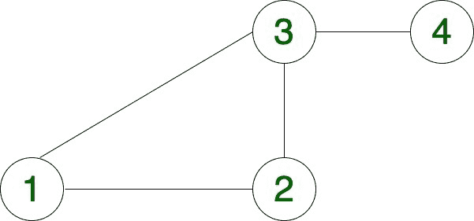
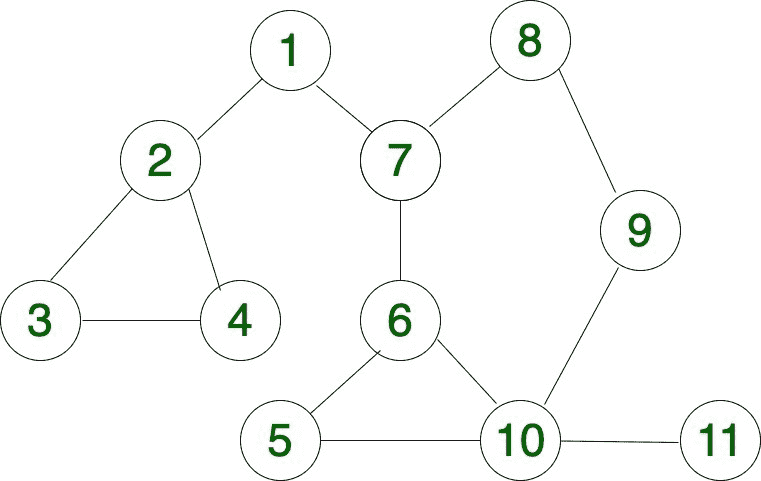

# 在无向图中计算从源到达目的地的总路径数

> 原文:[https://www . geeksforgeeks . org/count-从无向图中的源到达目的地的总途径数/](https://www.geeksforgeeks.org/count-total-ways-to-reach-destination-from-source-in-an-undirected-graph/)

给定一个 [**无向图**](https://www.geeksforgeeks.org/graph-and-its-representations/) 、一个源顶点**和一个目的顶点**【d】**，任务是**计算从给定的**到**【d】**的总路径**。****

****示例****

> ****输入:** s = 1，d = 4**
> 
> ****
> 
>  ****输出:** 2
> **说明:**
> 下面是从 1 到 4 的 2 条路径
> 1->3->4
> 1->2->3->4
> 
> **输入:** s = 3，d = 9
> 
> 
> 
> **输出:** 6
> **说明:**
> 下面是 3 到 9
> 3->2->1->7->6->5->10->9
> 3->2->1->7->6->10->9
> 3-> >4->2->1->7->6->5->10->9
> 3->4->2->1->7->6->10->9
> 3->4->2->1->7-**

****方法:**
想法是对给定的无向图进行[深度优先遍历](https://www.geeksforgeeks.org/depth-first-search-or-dfs-for-a-graph/)。**

*   **从源代码开始遍历。**
*   **继续将访问过的顶点存储在一个数组中，上面写着“已访问[]”。**
*   **如果我们到达目的顶点，将计数增加“1”。**
*   **重要的是将 visited[]中的当前顶点标记为 visited，这样遍历就不会循环进行。**

**下面是上述方法的实现:**

## **C++**

```
// C++ program to count total number of
// ways to reach destination in a graph
#include <iostream>
using namespace std;

// Utility Function to count total ways
int countWays(int mtrx[][11], int vrtx,
              int i, int dest, bool visited[])
{
    // Base condition
    // When reach to the destination
    if (i == dest) {

        return 1;
    }
    int total = 0;
    for (int j = 0; j < vrtx; j++) {
        if (mtrx[i][j] == 1 && !visited[j]) {

            // Make vertex visited
            visited[j] = true;

            // Recursive function, for count ways
            total += countWays(mtrx, vrtx,
                               j, dest, visited);

            // Backtracking
            // Make vertex unvisited
            visited[j] = false;
        }
    }

    // Return total ways
    return total;
}

// Function to count total ways
// to reach destination
int totalWays(int mtrx[][11], int vrtx,
              int src, int dest)
{
    bool visited[vrtx];

    // Loop to make all vertex unvisited,
    // Initially
    for (int i = 0; i < vrtx; i++) {
        visited[i] = false;
    }

    // Make source visited
    visited[src] = true;

    return countWays(mtrx, vrtx, src, dest,
                     visited);
}

int main()
{
    int vrtx = 11;
    int mtrx[11][11] = {
        { 0, 1, 0, 0, 0, 0, 1, 0, 0, 0, 0 },
        { 1, 0, 1, 1, 0, 0, 0, 0, 0, 0, 0 },
        { 0, 1, 0, 1, 0, 0, 0, 0, 0, 0, 0 },
        { 0, 1, 1, 0, 0, 0, 0, 0, 0, 0, 0 },
        { 0, 0, 0, 0, 0, 1, 0, 0, 0, 1, 0 },
        { 0, 0, 0, 0, 1, 0, 1, 0, 0, 1, 0 },
        { 1, 0, 0, 0, 0, 1, 0, 1, 0, 0, 0 },
        { 0, 0, 0, 0, 0, 0, 1, 0, 1, 0, 0 },
        { 0, 0, 0, 0, 0, 0, 0, 1, 0, 1, 0 },
        { 0, 0, 0, 0, 1, 1, 0, 0, 1, 0, 0 },
        { 0, 0, 0, 0, 0, 0, 0, 0, 0, 1, 0 }
    };

    int src = 3;
    int dest = 9;

    // Print total ways
    cout << totalWays(mtrx, vrtx, src - 1,
                      dest - 1);

    return 0;
}
```

## **Java 语言(一种计算机语言，尤用于创建网站)**

```
// Java program to count total number of
// ways to reach destination in a graph
class GFG{

// Utility Function to count total ways
static int countWays(int mtrx[][], int vrtx,
              int i, int dest, boolean visited[])
{
    // Base condition
    // When reach to the destination
    if (i == dest) {

        return 1;
    }
    int total = 0;
    for (int j = 0; j < vrtx; j++) {
        if (mtrx[i][j] == 1 && !visited[j]) {

            // Make vertex visited
            visited[j] = true;

            // Recursive function, for count ways
            total += countWays(mtrx, vrtx,
                               j, dest, visited);

            // Backtracking
            // Make vertex unvisited
            visited[j] = false;
        }
    }

    // Return total ways
    return total;
}

// Function to count total ways
// to reach destination
static int totalWays(int mtrx[][], int vrtx,
              int src, int dest)
{
    boolean []visited = new boolean[vrtx];

    // Loop to make all vertex unvisited,
    // Initially
    for (int i = 0; i < vrtx; i++) {
        visited[i] = false;
    }

    // Make source visited
    visited[src] = true;

    return countWays(mtrx, vrtx, src, dest,
                     visited);
}

public static void main(String[] args)
{
    int vrtx = 11;
    int mtrx[][] = {
        { 0, 1, 0, 0, 0, 0, 1, 0, 0, 0, 0 },
        { 1, 0, 1, 1, 0, 0, 0, 0, 0, 0, 0 },
        { 0, 1, 0, 1, 0, 0, 0, 0, 0, 0, 0 },
        { 0, 1, 1, 0, 0, 0, 0, 0, 0, 0, 0 },
        { 0, 0, 0, 0, 0, 1, 0, 0, 0, 1, 0 },
        { 0, 0, 0, 0, 1, 0, 1, 0, 0, 1, 0 },
        { 1, 0, 0, 0, 0, 1, 0, 1, 0, 0, 0 },
        { 0, 0, 0, 0, 0, 0, 1, 0, 1, 0, 0 },
        { 0, 0, 0, 0, 0, 0, 0, 1, 0, 1, 0 },
        { 0, 0, 0, 0, 1, 1, 0, 0, 1, 0, 0 },
        { 0, 0, 0, 0, 0, 0, 0, 0, 0, 1, 0 }
    };

    int src = 3;
    int dest = 9;

    // Print total ways
    System.out.print(totalWays(mtrx, vrtx, src - 1,
                      dest - 1));

}
}

// This code contributed by Rajput-Ji
```

## **蟒蛇 3**

```
# Python 3 program to count total number of
# ways to reach destination in a graph

# Utility Function to count total ways
def countWays(mtrx, vrtx, i, dest, visited):

    # Base condition
    # When reach to the destination
    if (i == dest):
        return 1

    total = 0
    for j in range(vrtx):
        if (mtrx[i][j] == 1 and not visited[j]):

            # Make vertex visited
            visited[j] = True;

            # Recursive function, for count ways
            total += countWays(mtrx, vrtx, j, dest, visited);

            # Backtracking
            # Make vertex unvisited
            visited[j] = False;

    # Return total ways
    return total

# Function to count total ways
# to reach destination
def totalWays(mtrx, vrtx, src, dest):
    visited = [False]*vrtx

    # Loop to make all vertex unvisited,
    # Initially
    for i in range(vrtx):
        visited[i] = False

    # Make source visited
    visited[src] = True;

    return countWays(mtrx, vrtx, src, dest,visited)

# Driver function
vrtx = 11
mtrx = [
        [0, 1, 0, 0, 0, 0, 1, 0, 0, 0, 0 ],
        [ 1, 0, 1, 1, 0, 0, 0, 0, 0, 0, 0 ],
        [ 0, 1, 0, 1, 0, 0, 0, 0, 0, 0, 0 ],
        [ 0, 1, 1, 0, 0, 0, 0, 0, 0, 0, 0 ],
        [ 0, 0, 0, 0, 0, 1, 0, 0, 0, 1, 0 ],
        [ 0, 0, 0, 0, 1, 0, 1, 0, 0, 1, 0 ],
        [ 1, 0, 0, 0, 0, 1, 0, 1, 0, 0, 0 ],
        [ 0, 0, 0, 0, 0, 0, 1, 0, 1, 0, 0 ],
        [ 0, 0, 0, 0, 0, 0, 0, 1, 0, 1, 0 ],
        [ 0, 0, 0, 0, 1, 1, 0, 0, 1, 0, 0 ],
        [ 0, 0, 0, 0, 0, 0, 0, 0, 0, 1, 0 ]
    ]

src = 3
dest = 9

# Print total ways
print(totalWays(mtrx, vrtx, src - 1,dest - 1))

# This code is contributed by atul kumar shrivastava
```

## **C#**

```
// C# program to count total number of
// ways to reach destination in a graph
using System;

class GFG{

// Utility Function to count total ways
static int countWays(int[,] mtrx, int vrtx,
              int i, int dest, bool[] visited)
{
    // Base condition
    // When reach to the destination
    if (i == dest) {

        return 1;
    }
    int total = 0;
    for (int j = 0; j < vrtx; j++) {
        if (mtrx[i,j] == 1 && !visited[j]) {

            // Make vertex visited
            visited[j] = true;

            // Recursive function, for count ways
            total += countWays(mtrx, vrtx,
                               j, dest, visited);

            // Backtracking
            // Make vertex unvisited
            visited[j] = false;
        }
    }

    // Return total ways
    return total;
}

// Function to count total ways
// to reach destination
static int totalWays(int[,] mtrx, int vrtx,
              int src, int dest)
{
    bool[]visited = new bool[vrtx];

    // Loop to make all vertex unvisited,
    // Initially
    for (int i = 0; i < vrtx; i++) {
        visited[i] = false;
    }

    // Make source visited
    visited[src] = true;

    return countWays(mtrx, vrtx, src, dest,
                     visited);
}

public static void Main()
{
    int vrtx = 11;
    int[,] mtrx = {
        { 0, 1, 0, 0, 0, 0, 1, 0, 0, 0, 0 },
        { 1, 0, 1, 1, 0, 0, 0, 0, 0, 0, 0 },
        { 0, 1, 0, 1, 0, 0, 0, 0, 0, 0, 0 },
        { 0, 1, 1, 0, 0, 0, 0, 0, 0, 0, 0 },
        { 0, 0, 0, 0, 0, 1, 0, 0, 0, 1, 0 },
        { 0, 0, 0, 0, 1, 0, 1, 0, 0, 1, 0 },
        { 1, 0, 0, 0, 0, 1, 0, 1, 0, 0, 0 },
        { 0, 0, 0, 0, 0, 0, 1, 0, 1, 0, 0 },
        { 0, 0, 0, 0, 0, 0, 0, 1, 0, 1, 0 },
        { 0, 0, 0, 0, 1, 1, 0, 0, 1, 0, 0 },
        { 0, 0, 0, 0, 0, 0, 0, 0, 0, 1, 0 }
    };

    int src = 3;
    int dest = 9;

    // Print total ways
    Console.Write(totalWays(mtrx, vrtx, src - 1,
                      dest - 1));

}
}
```

## **java 描述语言**

```
<script>
// Javascript program to count total number of
// ways to reach destination in a graph

// Utility Function to count total ways
function countWays(mtrx,vrtx,i,dest,visited)
{
    // Base condition
    // When reach to the destination
    if (i == dest) {

        return 1;
    }
    let total = 0;
    for (let j = 0; j < vrtx; j++) {
        if (mtrx[i][j] == 1 && !visited[j]) {

            // Make vertex visited
            visited[j] = true;

            // Recursive function, for count ways
            total += countWays(mtrx, vrtx,
                               j, dest, visited);

            // Backtracking
            // Make vertex unvisited
            visited[j] = false;
        }
    }

    // Return total ways
    return total;
}

// Function to count total ways
// to reach destination
function totalWays(mtrx,vrtx,src,dest)
{
    let visited = new Array(vrtx);

    // Loop to make all vertex unvisited,
    // Initially
    for (let i = 0; i < vrtx; i++) {
        visited[i] = false;
    }

    // Make source visited
    visited[src] = true;

    return countWays(mtrx, vrtx, src, dest,
                     visited);
}

let vrtx = 11;
let mtrx=[
        [ 0, 1, 0, 0, 0, 0, 1, 0, 0, 0, 0 ],
        [ 1, 0, 1, 1, 0, 0, 0, 0, 0, 0, 0 ],
        [ 0, 1, 0, 1, 0, 0, 0, 0, 0, 0, 0 ],
        [ 0, 1, 1, 0, 0, 0, 0, 0, 0, 0, 0 ],
        [ 0, 0, 0, 0, 0, 1, 0, 0, 0, 1, 0 ],
        [ 0, 0, 0, 0, 1, 0, 1, 0, 0, 1, 0 ],
        [ 1, 0, 0, 0, 0, 1, 0, 1, 0, 0, 0 ],
        [ 0, 0, 0, 0, 0, 0, 1, 0, 1, 0, 0 ],
        [ 0, 0, 0, 0, 0, 0, 0, 1, 0, 1, 0 ],
        [ 0, 0, 0, 0, 1, 1, 0, 0, 1, 0, 0 ],
        [ 0, 0, 0, 0, 0, 0, 0, 0, 0, 1, 0 ]
    ];

let src = 3;
let dest = 9;
// Print total ways
document.write(totalWays(mtrx, vrtx, src - 1,
                      dest - 1));
// This code is contributed by avanitrachhadiya2155
</script>
```

****Output:** 

```
6
```** 

****性能分析**:**

*   ****时间复杂度**:在上面的方法中，对于一个给定的顶点，我们检查所有的顶点，所以时间复杂度是 **O(N*N)** ，其中 N 是顶点的个数。**
*   ****辅助空间复杂度**:在上面的方法中，我们使用的是大小为 N 的访问数组，其中 N 是顶点的数量，所以辅助空间复杂度为 **O(N)** 。**