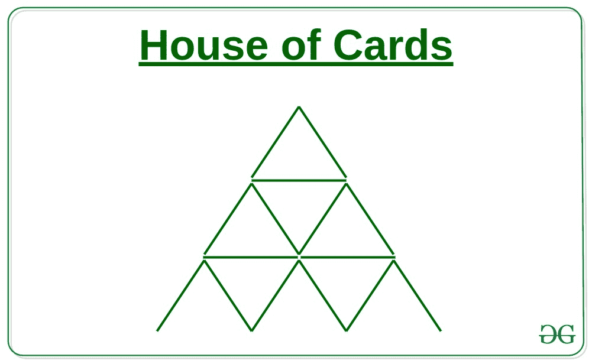
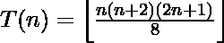

# 计算形成高度为 N 的卡片之家所需的三角形

> 原文:[https://www . geesforgeks . org/count-triangles-需要形成一个高度为 n 的卡片屋/](https://www.geeksforgeeks.org/count-triangles-required-to-form-a-house-of-cards-of-height-n/)

给定一个数字 **N** ，任务是计算组成 **N** 级的[纸牌房子所需的三角形数量。](https://www.geeksforgeeks.org/number-of-cards-needed-build-a-house-of-cards-of-a-given-level-n/)

**示例:**

> **输入:** N = 3
> **输出:** 13
> **解释:**
> 
> 
> 
> 从上图可以得出以下观察结果:
> 单位 1 的三角形数= 9 (6 个非倒三角形和 3 个倒三角形)
> 单位 2 的三角形数= 3
> 单位 3 的三角形数= 1
> 因此，三角形总数= 6 + 3 + 3 + 1 = 13
> 
> **输入:**N = 2
> T3】输出: 5

**方法:**形成 **N** 级的纸牌房子所需的三角形数量可以通过以下公式计算:

> 

插图:

> 对于 N = 3
> 三角形的计数= 3 * (3 + 2) * (6 + 1) / 8 = 13
> 
> 对于 N = 2
> 三角形的计数= 2 * (2 + 2) * (4+ 1) / 8 = 5

下面是上述方法的实现:

## 卡片打印处理机（Card Print Processor 的缩写）

```
// C++ implementation of the
// above approach

#include <bits/stdc++.h>
using namespace std;

// Function to find the
// number of triangles
int noOfTriangles(int n)
{
    return floor(n * (n + 2)
                 * (2 * n + 1) / 8);
}

// Driver Code
int main()
{
    int n = 3;
    // Function call
    cout << noOfTriangles(n) << endl;
    return 0;
}
```

## Java 语言(一种计算机语言，尤用于创建网站)

```
// Java implementation of the
// above approach

import java.lang.*;

class GFG {

    // Function to find number of triangles
    public static int noOfTriangles(int n)
    {
        return (n * (n + 2) * (2 * n + 1) / 8);
    }

    // Driver Code
    public static void main(String args[])
    {
        int n = 3;
        // Function call
        System.out.print(noOfTriangles(n));
    }
}
```

## 蟒蛇 3

```
# Python3 implementation of
# the above approach

# Function to find required
# number of triangles
def noOfTriangles(n):
    return n * (n + 2) * (2 * n + 1) // 8

# Driver Code
n = 3

# Function call
print(noOfTriangles(n))
```

## C#

```
// C# implementation of the
// above approach
using System;

class GFG {
    // Function to find number of triangles
    public static int noOfTriangles(int n)
    {
        return (n * (n + 2) * (2 * n + 1) / 8);
    }

    // Driver Code
    public static void Main(String[] args)
    {
        int n = 3;
        Console.Write(noOfTriangles(n));
    }
}
```

## java 描述语言

```
<script>

// Javascript implementation of the
// above approach

// Function to find the
// number of triangles
function noOfTriangles(n)
{
    return Math.floor(n * (n + 2)
                 * (2 * n + 1) / 8);
}

// Driver Code
var n = 3;
// Function call
document.write(noOfTriangles(n));

</script>
```

**Output:** 

```
13
```

***时间复杂度:** O(1)*
***辅助空间:** O(1)*