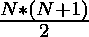

# 从给定的范围中计数三元组，三元组的两个数之和等于第三个数

> 原文:[https://www . geesforgeks . org/count-triples-from-给定范围-具有三重数中的两个数之和-等于第三个数/](https://www.geeksforgeeks.org/count-triplets-from-a-given-range-having-sum-of-two-numbers-of-a-triplet-equal-to-the-third-number/)

给定两个整数 **L** 和 **R** ，任务是找出值在**【L，R】**范围内的唯一三元组的数目，使得任意两个数之和等于第三个数。

**示例:**

> **输入:** L = 1，R = 3
> **输出:** 3
> **说明:**满足必要条件的三个这样的三元组是(1，1，2)，(1，2，3)和(2，1，3)。
> 
> **输入:** L = 2，R = 6
> T3】输出: 6

**天真方法:**解决这个问题最简单的方法是[在范围**【L，R】**](https://www.geeksforgeeks.org/print-all-triplets-with-given-sum/)内生成所有可能的三元组，并从等于第三个数的对中计算出任意两个数之和为[的那些三元组。检查所有三胞胎后，打印获得的总数。
***时间复杂度:**O((R–L)<sup>3</sup>)*
***辅助空间:** O(1)*](https://www.geeksforgeeks.org/c-program-to-add-two-integers/)

**高效方法:**上述方法可以基于以下观察进行优化:

*   如果给定范围之间的差小于 **L** ，则不存在两个数之和等于第三个数的三元组。
*   如果给定范围之间的差值至少为**L**，则**(R–L)**位于范围 **L** 和 **R** 之间，即 **{L，(R–L)，R}** 。可以观察到 **L** 与**【L，R–L】**范围内任意其他数之和最多为**R**。
*   因此，可能的有效三元组的总数，其中第一个元素是 **L** 由**(R–L–L+1)**给出。
*   同样，当第一个元素为 **(L + 1)** 时，那么三胞胎的数量为**(R–L–L)**，以此类推。

从以上观察，三胞胎的总数形成了一个 [AP](https://www.geeksforgeeks.org/arithmetic-progression/) ，术语**(R–L–L+1)，(R–L–L)，(R–L–L–1)，……** 由(R–L–L+1)个术语组成。因此，三胞胎的总数由下式给出:

> 
> 其中，N 为(R–L–L+1)

以下是上述方法的实现:

## C++

```
// C++ program for the above approach

#include <bits/stdc++.h>
using namespace std;

// Function to find the number of triplets
// from the range [L, R] having sum of two
// numbers from the triplet equal to the third number
int totalCombination(int L, int R)
{
    // Stores the total number of triplets
    int count = 0;

    // Find the difference of the range
    int K = R - L;

    // Case 1: If triplets can't
    // be formed, then return 0
    if (K < L)
        return 0;

    // Otherwise
    int ans = K - L;

    // Update the total number of triplets
    count = ((ans + 1) * (ans + 2)) / 2;

    // Return the count
    return count;
}

// Driver Code
int main()
{
    int L = 2, R = 6;
    cout << totalCombination(L, R);

    return 0;
}
```

## Java 语言(一种计算机语言，尤用于创建网站)

```
// Java program for the above approach
import java.util.*;
class GFG
{

  // Function to find the number of triplets
  // from the range [L, R] having sum of two
  // numbers from the triplet equal to the third number
  static int totalCombination(int L, int R)
  {

    // Stores the total number of triplets
    int count = 0;

    // Find the difference of the range
    int K = R - L;

    // Case 1: If triplets can't
    // be formed, then return 0
    if (K < L)
      return 0;

    // Otherwise
    int ans = K - L;

    // Update the total number of triplets
    count = ((ans + 1) * (ans + 2)) / 2;

    // Return the count
    return count;
  }

  // Driven Code
  public static void main(String[] args)
  {
    int L = 2, R = 6;
    System.out.print(totalCombination(L, R));
  }
}

// This code is contributed by susmitakundugoaldanga.
```

## 蟒蛇 3

```
# Python3 program for the above approach

# Function to find the number of triplets
# from the range [L, R] having sum of two
# numbers from the triplet equal to the third number
def totalCombination(L, R):

    # Stores the total number of triplets
    count = 0

    # Find the difference of the range
    K = R - L

    # Case 1: If triplets can't
    # be formed, then return 0
    if (K < L):
        return 0

    # Otherwise
    ans = K - L

    # Update the total number of triplets
    count = ((ans + 1) * (ans + 2)) // 2

    # Return the count
    return count

# Driver Code
if __name__ == '__main__':
    L, R = 2, 6
    print (totalCombination(L, R))

# This code is contributed by mohit kumar 29.
```

## C#

```
// C# program to implement
// the above approach
using System;
class GFG
{

  // Function to find the number of triplets
  // from the range [L, R] having sum of two
  // numbers from the triplet equal to the third number
  static int totalCombination(int L, int R)
  {

    // Stores the total number of triplets
    int count = 0;

    // Find the difference of the range
    int K = R - L;

    // Case 1: If triplets can't
    // be formed, then return 0
    if (K < L)
      return 0;

    // Otherwise
    int ans = K - L;

    // Update the total number of triplets
    count = ((ans + 1) * (ans + 2)) / 2;

    // Return the count
    return count;
  }

  // Driver Code
  public static void Main()
  {
    int L = 2, R = 6;
    Console.WriteLine(totalCombination(L, R));
  }
}

// This code is contributed by sauravghosh0416.
```

## java 描述语言

```
<script>
    // Javascript program for the above approach

    // Function to find the number of triplets
    // from the range [L, R] having sum of two
    // numbers from the triplet equal to the third number
    function totalCombination(L, R)
    {
        // Stores the total number of triplets
        let count = 0;

        // Find the difference of the range
        let K = R - L;

        // Case 1: If triplets can't
        // be formed, then return 0
        if (K < L)
            return 0;

        // Otherwise
        let ans = K - L;

        // Update the total number of triplets
        count = ((ans + 1) * (ans + 2)) / 2;

        // Return the count
        return count;
    }

    let L = 2, R = 6;
    document.write(totalCombination(L, R));

</script>
```

**Output:** 

```
6
```

***时间复杂度:**O(1)*
T5**辅助空间:** O(1)