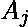

# 计算三元组，使得其中一个数字可以写成另外两个数字的和

> 原文:[https://www . geeksforgeeks . org/count-triples-这样一个数字中的一个可以写成另外两个的和/](https://www.geeksforgeeks.org/count-triplets-such-that-one-of-the-numbers-can-be-written-as-sum-of-the-other-two/)

给定一个由 N 个整数组成的数组 A[]。任务是找到三元组(I，j，k)的数量，其中 I，j，k 是指数和(1 <= i < j < k <= N), such that in the set { 、、)至少有一个数字可以写成另外两个的和。
T4【示例】T5:

```
Input : A[] = {1, 2, 3, 4, 5}
Output : 4
The valid triplets are:
(1, 2, 3), (1, 3, 4), (1, 4, 5), (2, 3, 5)

Input : A[] = {1, 1, 1, 2, 2}
Output : 6
```

这是一个计数问题。假设 **f(x)** 代表我们数组中数字的频率。
存在四种情况:

1.  这三个数字都等于 0。路数= f(0)C3(其中 pCq 是从 p 个数字中选择 q 个数字的路数)。
2.  一个数等于 0，另外两个等于某个 x > 0: f(0) * f(x)C2。
3.  两个数等于某个 x>0，第三个是 2*x: f(x)C2 * f(2 * x)。
4.  这三个数字是 x，y 和 x + y，0 < x，y: f(x) * f(y) * f(x + y)。

以下是上述方法的实现:

## C++

```
// C++ program to count Triplets such that at
// least one of the numbers can be written
// as sum of the other two
#include<bits/stdc++.h>
using namespace std;

    // Function to count the number of ways
    // to choose the triples
    int countWays(int arr[], int n)
    {
        // compute the max value in the array
        // and create frequency array of size
        // max_val + 1.
        // We can also use HashMap to store
        // frequencies. We have used an array
        // to keep remaining code simple.
        int max_val = 0;
        for (int i = 0; i < n; i++)
            max_val = max(max_val, arr[i]);
        int freq[max_val + 1]={0};
        for (int i = 0; i < n; i++)
            freq[arr[i]]++;

        int ans = 0; // stores the number of ways

        // Case 1: 0, 0, 0
        ans += freq[0] * (freq[0] - 1) * (freq[0] - 2) / 6;

        // Case 2: 0, x, x
        for (int i = 1; i <= max_val; i++)
            ans += freq[0] * freq[i] * (freq[i] - 1) / 2;

        // Case 3: x, x, 2*x
        for (int i = 1; 2 * i <= max_val; i++)
            ans += freq[i] * (freq[i] - 1) / 2 * freq[2 * i];

        // Case 4: x, y, x + y
        // iterate through all pairs (x, y)
        for (int i = 1; i <= max_val; i++) {
            for (int j = i + 1; i + j <= max_val; j++)
                ans += freq[i] * freq[j] * freq[i + j];
        }

        return ans;
    }

    // Driver code
    int main()
    {
        int arr[]={ 1, 2, 3, 4, 5 };
        int n = sizeof(arr)/sizeof(int);
        cout<<(countWays(arr, n));
        return 0;
    }

//contributed by Arnab Kundu
```

## Java 语言(一种计算机语言，尤用于创建网站)

```
// Java program to count Triplets such that at
// least one of the numbers can be written
// as a sum of the other two

class GFG {

    // Function to count the number of ways
    // to choose the triples
    static int countWays(int[] arr, int n)
    {
        // compute the max value in the array
        // and create frequency array of size
        // max_val + 1.
        // We can also use HashMap to store
        // frequencies. We have used an array
        // to keep remaining code simple.
        int max_val = 0;
        for (int i = 0; i < n; i++)
            max_val = Math.max(max_val, arr[i]);
        int[] freq = new int[max_val + 1];
        for (int i = 0; i < n; i++)
            freq[arr[i]]++;

        int ans = 0; // stores the number of ways

        // Case 1: 0, 0, 0
        ans += freq[0] * (freq[0] - 1) * (freq[0] - 2) / 6;

        // Case 2: 0, x, x
        for (int i = 1; i <= max_val; i++)
            ans += freq[0] * freq[i] * (freq[i] - 1) / 2;

        // Case 3: x, x, 2*x
        for (int i = 1; 2 * i <= max_val; i++)
            ans += freq[i] * (freq[i] - 1) / 2 * freq[2 * i];

        // Case 4: x, y, x + y
        // iterate through all pairs (x, y)
        for (int i = 1; i <= max_val; i++) {
            for (int j = i + 1; i + j <= max_val; j++)
                ans += freq[i] * freq[j] * freq[i + j];
        }

        return ans;
    }

    // Driver code
    public static void main(String[] args)
    {
        int[] arr = new int[] { 1, 2, 3, 4, 5 };
        int n = arr.length;
        System.out.println(countWays(arr, n));
    }
}
```

## 蟒蛇 3

```
# Python3 program to count Triplets such
# that at least one of the numbers can be
# written as sum of the other two
import math as mt

# Function to count the number of ways
# to choose the triples
def countWays(arr, n):

    # compute the max value in the array
    # and create frequency array of size
    # max_val + 1.
    # We can also use HashMap to store
    # frequencies. We have used an array
    # to keep remaining code simple.
    max_val = 0
    for i in range(n):
        max_val = max(max_val, arr[i])

    freq = [0 for i in range(max_val + 1)]

    for i in range(n):
        freq[arr[i]] += 1

    ans = 0 # stores the number of ways

    # Case 1: 0, 0, 0
    ans += (freq[0] * (freq[0] - 1) *
           (freq[0] - 2) // 6)

    # Case 2: 0, x, x
    for i in range(1, max_val + 1):
        ans += (freq[0] * freq[i] *
               (freq[i] - 1) // 2)

    # Case 3: x, x, 2*x
    for i in range(1, (max_val + 1) // 2):
        ans += (freq[i] *
               (freq[i] - 1) // 2 * freq[2 * i])

    # Case 4: x, y, x + y
    # iterate through all pairs (x, y)
    for i in range(1, max_val + 1):
        for j in range(i + 1, max_val - i + 1):
            ans += freq[i] * freq[j] * freq[i + j]

    return ans

# Driver code
arr = [ 1, 2, 3, 4, 5]
n = len(arr)
print(countWays(arr, n))

# This code is contributed by
# mohit kumar 29
```

## C#

```
// C# program to count Triplets
// such that at least one of the
// numbers can be written as sum
// of the other two
using System;

class GFG
{

// Function to count the number
// of ways to choose the triples
static int countWays(int[] arr, int n)
{
    // compute the max value in the array
    // and create frequency array of size
    // max_val + 1.
    // We can also use HashMap to store
    // frequencies. We have used an array
    // to keep remaining code simple.
    int max_val = 0;
    for (int i = 0; i < n; i++)
        max_val = Math.Max(max_val, arr[i]);

    int[] freq = new int[max_val + 1];
    for (int i = 0; i < n; i++)
        freq[arr[i]]++;

    int ans = 0; // stores the number of ways

    // Case 1: 0, 0, 0
    ans += freq[0] * (freq[0] - 1) *
                     (freq[0] - 2) / 6;

    // Case 2: 0, x, x
    for (int i = 1; i <= max_val; i++)
        ans += freq[0] * freq[i] *
                        (freq[i] - 1) / 2;

    // Case 3: x, x, 2*x
    for (int i = 1;
             2 * i <= max_val; i++)
        ans += freq[i] * (freq[i] - 1) /
                      2 * freq[2 * i];

    // Case 4: x, y, x + y
    // iterate through all pairs (x, y)
    for (int i = 1; i <= max_val; i++)
    {
        for (int j = i + 1;
                 i + j <= max_val; j++)
            ans += freq[i] * freq[j] *
                             freq[i + j];
    }

    return ans;
}

// Driver code
public static void Main()
{
    int[] arr = { 1, 2, 3, 4, 5 };
    int n = arr.Length;
    Console.WriteLine(countWays(arr, n));
}
}

// This code is contributed by shs..
```

## 服务器端编程语言（Professional Hypertext Preprocessor 的缩写）

```
<?php
// PHP program to count Triplets such that at
// least one of the numbers can be written
// as sum of the other two

// Function to count the number of ways
// to choose the triples
function countWays($arr, $n)
{
    // compute the max value in the array
    // and create frequency array of size
    // max_val + 1.
    // We can also use HashMap to store
    // frequencies. We have used an array
    // to keep remaining code simple.
    $max_val = 0;
    for ($i = 0; $i < $n; $i++)
        $max_val = max($max_val, $arr[$i]);
    $freq = array_fill(0, $max_val + 1, 0);
    for ($i = 0; $i < $n; $i++)
        $freq[$arr[$i]]++;

    $ans = 0; // stores the number of ways

    // Case 1: 0, 0, 0
    $ans += (int)($freq[0] * ($freq[0] - 1) *
                             ($freq[0] - 2) / 6);

    // Case 2: 0, x, x
    for ($i = 1; $i <= $max_val; $i++)
        $ans += (int)($freq[0] * $freq[$i] *
                     ($freq[$i] - 1) / 2);

    // Case 3: x, x, 2*x
    for ($i = 1; 2 * $i <= $max_val; $i++)
        $ans += (int)($freq[$i] * ($freq[$i] - 1) / 2 *
                                   $freq[2 * $i]);

    // Case 4: x, y, x + y
    // iterate through all pairs (x, y)
    for ($i = 1; $i <= $max_val; $i++)
    {
        for ($j = $i + 1; $i + $j <= $max_val; $j++)
            $ans += $freq[$i] * $freq[$j] *
                                $freq[$i + $j];
    }

    return $ans;
}

// Driver code
$arr = array( 1, 2, 3, 4, 5 );
$n = count($arr);
echo countWays($arr, $n);

// This code is contributed by mits
?>
```

## java 描述语言

```
<script>

// JavaScript program to count Triplets such that at
// least one of the numbers can be written
// as a sum of the other two   

    // Function to count the number of ways
    // to choose the triples
    function countWays(arr,n)
    {
        // compute the max value in the array
        // and create frequency array of size
        // max_val + 1.
        // We can also use HashMap to store
        // frequencies. We have used an array
        // to keep remaining code simple.
        let max_val = 0;
        for (let i = 0; i < n; i++)
            max_val = Math.max(max_val, arr[i]);
        let freq = new Array(max_val + 1);
        for(let i=0;i<freq.length;i++)
        {
            freq[i]=0;
        }
        for (let i = 0; i < n; i++)
            freq[arr[i]]++;

        let ans = 0; // stores the number of ways

        // Case 1: 0, 0, 0
        ans += freq[0] * (freq[0] - 1) * (freq[0] - 2) / 6;

        // Case 2: 0, x, x
        for (let i = 1; i <= max_val; i++)
            ans += freq[0] * freq[i] * (freq[i] - 1) / 2;

        // Case 3: x, x, 2*x
        for (let i = 1; 2 * i <= max_val; i++)
            ans += freq[i] * (freq[i] - 1) / 2 * freq[2 * i];

        // Case 4: x, y, x + y
        // iterate through all pairs (x, y)
        for (let i = 1; i <= max_val; i++) {
            for (let j = i + 1; i + j <= max_val; j++)
                ans += freq[i] * freq[j] * freq[i + j];
        }

        return ans;
    }

    // Driver code
    let arr=[1, 2, 3, 4, 5];
    let n = arr.length;
    document.write(countWays(arr, n));

// This code is contributed by patel2127

</script>
```

**Output:** 

```
4
```