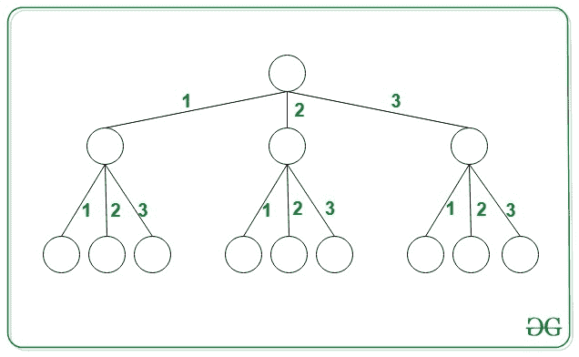

# 计算 N 元树中给定和的唯一路径

> 原文:[https://www . geesforgeks . org/count-唯一路径-带给定 n 进制求和树/](https://www.geeksforgeeks.org/count-unique-paths-with-given-sum-in-an-n-ary-tree/)

给定整数 **X** 和整数 **N** ，任务是找到从 [N 元树](https://www.geeksforgeeks.org/generic-treesn-array-trees/)中的根开始的唯一路径的数量，使得所有这些路径的总和等于 **X** 。 **N** 元树满足以下条件:

*   所有的节点都有 **N** 个子节点，每个边的权重都是不同的，都在**【1，N】**的范围内。
*   这棵树一直延伸到无限远。

**示例:**

> **输入:** N = 3，X = 2
> 
> [](https://media.geeksforgeeks.org/wp-content/cdn-uploads/20201102101430/Tree2.jpg)
> 
> **输出:** 2
> **说明:**路径和等于 2 的两条路径分别为{1，1}和{2}。
> 
> **输入:** N = 3，X = 6
> T3】输出: 24

**天真法:**最简单的方法是[递归](https://www.geeksforgeeks.org/recursion/)找到所有可能的方法，得到等于 **X** 的路径和，打印得到的计数。

***时间复杂度:** O(N * X)*
***辅助空间:** O(1)*

**高效途径:**优化上述途径，思路是使用[动态规划](https://www.geeksforgeeks.org/dynamic-programming/)。按照以下步骤解决问题:

*   初始化一个 **dp[]** 数组，对于每个 **i** <sup>第</sup>个索引，该数组存储合计到 **i** 的路径计数。
*   对于每个顶点，从强> 1 迭代到最小(X，N)，即其子节点的所有可能值，并从考虑的每个节点找到给定和的可能路径数。
*   将使用边缘 **1** 生成的所有路径添加到 **N** 中，并检查计数是否已经计算。如果已经计算，则返回值。否则，通过考虑从当前顶点扩展树的所有可能方式，递归地计算和等于当前值的路径数。
*   更新 **dp[]** 数组，返回得到的计数。

下面是上述方法的实现:

## C++

```
// C++ program for the above approach
#include <bits/stdc++.h>
#define ll long long
using namespace std;
const int mod = (int)1e9 + 7;

// Function for counting total
// no of paths possible with
// the sum is equal to X
ll findTotalPath(int X, int n,
                 vector<int>& dp)
{

    // If the path of the sum
    // from the root to current
    // node is stored in sum
    if (X == 0) {
        return 1;
    }
    ll ans = 0;

    // If already computed
    if (dp[X] != -1) {
        return dp[X];
    }

    // Count different no of paths
    // using all possible ways
    for (int i = 1; i <= min(X, n); ++i) {

        ans += findTotalPath(
                   X - i, n, dp)
               % mod;
        ans %= mod;
    }

    // Return total no of paths
    return dp[X] = ans;
}

// Driver Code
int main()
{

    int n = 3, X = 2;

    // Stores the number of ways
    // to obtains sums 0 to X
    vector<int> dp(X + 1, -1);

    // Function call
    cout << findTotalPath(X, n, dp);
}
```

## Java 语言(一种计算机语言，尤用于创建网站)

```
// Java program for the above approach
import java.io.*;
import java.util.*;

class GFG{

static int mod = (int)1e9 + 7;

// Function for counting total
// no of paths possible with
// the sum is equal to X
static int findTotalPath(int X, int n,
                         ArrayList<Integer> dp)
{

    // If the path of the sum
    // from the root to current
    // node is stored in sum
    if (X == 0)
    {
        return 1;
    }
    int ans = 0;

    // If already computed
    if (dp.get(X) != -1)
    {
        return dp.get(X);
    }

    // Count different no of paths
    // using all possible ways
    for(int i = 1; i <= Math.min(X, n); ++i)
    {
        ans += findTotalPath(X - i, n, dp) % mod;
        ans %= mod;
    }

    // Return total no of paths
    dp.set(X, ans);
    return ans;
}

// Driver Code
public static void main(String[] args)
{
    int n = 3, X = 2;

    // Stores the number of ways
    // to obtains sums 0 to X
    ArrayList<Integer> dp = new ArrayList<Integer>(
        Collections.nCopies(X + 1, -1));

    // Function call
    System.out.print(findTotalPath(X, n, dp));
}
}

// This code is contributed by akhilsaini
```

## 蟒蛇 3

```
# Python3 program for the above approach
mod = int(1e9 + 7)

# Function for counting total
# no of paths possible with
# the sum is equal to X
def findTotalPath(X, n, dp):

  # If the path of the sum
  # from the root to current
  # node is stored in sum
  if (X == 0):
    return 1

  ans = 0

  # If already computed
  if (dp[X] != -1):
    return dp[X]

  # Count different no of paths
  # using all possible ways
  for i in range(1, min(X, n) + 1):
    ans = ans + findTotalPath(X - i, n, dp) % mod;
    ans %= mod;

  # Return total no of paths
  dp[X] = ans
  return ans

# Driver Code
if __name__ == '__main__':

  n = 3
  X = 2

  # Stores the number of ways
  # to obtains sums 0 to X
  dp = [-1] * (X + 1)

  # Function call
  print(findTotalPath(X, n, dp))

# This code is contributed by akhilsaini
```

## C#

```
// C# program for the above approach
using System;
using System.Collections;
using System.Collections.Generic;

class GFG{

static int mod = (int)1e9 + 7;

// Function for counting total
// no of paths possible with
// the sum is equal to X
static int findTotalPath(int X, int n, int[] dp)
{

    // If the path of the sum
    // from the root to current
    // node is stored in sum
    if (X == 0)
    {
        return 1;
    }
    int ans = 0;

    // If already computed
    if (dp[X] != -1)
    {
        return dp[X];
    }

    // Count different no of paths
    // using all possible ways
    for(int i = 1; i <= Math.Min(X, n); ++i)
    {
        ans += findTotalPath(X - i, n, dp) % mod;
        ans %= mod;
    }

    // Return total no of paths
    dp[X] = ans;
    return ans;
}

// Driver Code
public static void Main()
{
    int n = 3, X = 2;

    // Stores the number of ways
    // to obtains sums 0 to X
    int[] dp = new int[X + 1];
    Array.Fill(dp, -1);

    // Function call
    Console.WriteLine(findTotalPath(X, n, dp));
}
}

// This code is contributed by akhilsaini
```

## java 描述语言

```
<script>

// Javascript program for the above approach
var mod = 1000000007;

// Function for counting total
// no of paths possible with
// the sum is equal to X
function findTotalPath(X, n, dp)
{

    // If the path of the sum
    // from the root to current
    // node is stored in sum
    if (X == 0) {
        return 1;
    }
    var ans = 0;

    // If already computed
    if (dp[X] != -1) {
        return dp[X];
    }

    // Count different no of paths
    // using all possible ways
    for (var i = 1; i <= Math.min(X, n); ++i) {

        ans += findTotalPath(
                   X - i, n, dp)
               % mod;
        ans %= mod;
    }

    // Return total no of paths
    return dp[X] = ans;
}

// Driver Code
var n = 3, X = 2;
// Stores the number of ways
// to obtains sums 0 to X
var dp = Array(X + 1).fill(-1);
// Function call
document.write( findTotalPath(X, n, dp));

</script>
```

**Output:** 

```
2
```

***时间复杂度:** O(min (N，X))*
***辅助空间:** O(X)*