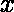
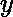
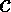

# 对无序对(I，j)进行计数，使得 a[i]和 a[j]的乘积是 2 的幂

> 原文:[https://www . geeksforgeeks . org/count-无序对-ij-这样-ai 和-aj 的乘积是 2 的幂/](https://www.geeksforgeeks.org/count-unordered-pairs-ij-such-that-product-of-ai-and-aj-is-power-of-two/)

给定一个由 N 个元素组成的数组。任务是计算数组中的**无序对** (i，j)，使得 a[i]和 a[j]的乘积可以表示为 2 的幂。
**示例** :

```
Input : arr[] = {2, 3, 4, 8, 10}
Output : 3
Explanation: The pair of array element will be 
(2, 4), (2, 8), (4, 8) whose product are 
8, 16, 32 respectively which can be expressed 
as power of 2, like 2^3, 2^4, 2^5.

Input : arr[] = { 2, 5, 8, 16, 128 }
Output : 6
```

如果将和相乘，它们的乘积变成，那么 z=x*y，现在如果可以将表示为二的幂，那么可以证明和都可以表示为二的幂。基本上**z = 2<sup>a</sup>= 2<sup>(b+c)</sup>= 2<sup>b</sup>* 2<sup>c</sup>= x * y**，其中和两个
都可以保持最小值 0。
所以现在我们要计算数组中的元素个数，可以表示为 2 的幂。如果计数是 k，那么答案将是 kC2 = k*(k-1)/2，因为我们需要无序对的计数。
以下是上述办法的实施:

## C++

```
// C++ program to Count unordered pairs (i, j)
// in array such that product of a[i] and a[j]
// can be expressed as power of two
#include <bits/stdc++.h>
using namespace std;

/* Function to check if x is power of 2*/
bool isPowerOfTwo(int x)
{
  /* First x in the below expression is
     for the case when x is 0 */
  return x && (!(x&(x-1)));
}

// Function to Count unordered pairs
void Count_pairs(int a[], int n)
{
    int count = 0;

    for (int i = 0; i < n; i++) {

        // is a number can be expressed
        // as power of two
        if (isPowerOfTwo(a[i]))
            count++;
    }

    // count total number
    // of unordered pairs
    int ans = (count * (count - 1)) / 2;

    cout << ans << "\n";
}

// Driver code
int main()
{
    int a[] = { 2, 5, 8, 16, 128 };

    int n = sizeof(a) / sizeof(a[0]);

    Count_pairs(a, n);

    return 0;
}
```

## Java 语言(一种计算机语言，尤用于创建网站)

```
// Java program to Count unordered pairs (i, j)
// in array such that product of a[i] and a[j]
// can be expressed as power of two

import java.io.*;

class GFG {

/* Function to check if x is power of 2*/
static boolean isPowerOfTwo(int x)
{
/* First x in the below expression is
    for the case when x is 0 */
return (x >0&& (!((x&(x-1))>0)));
}

// Function to Count unordered pairs
static void Count_pairs(int a[], int n)
{
    int count = 0;

    for (int i = 0; i < n; i++) {

        // is a number can be expressed
        // as power of two
        if (isPowerOfTwo(a[i]))
            count++;
    }

    // count total number
    // of unordered pairs
    int ans = (count * (count - 1)) / 2;

    System.out.println( ans);
}

// Driver code

    public static void main (String[] args) {
            int a[] = { 2, 5, 8, 16, 128 };

    int n = a.length;
    Count_pairs(a, n);

    }
}

// This code is contributed
// by shs
```

## 蟒蛇 3

```
# Python3 program to Count unordered pairs
# (i, j) in array such that product of a[i]
# and a[j] can be expressed as power of two

# Function to check if x is power of 2
def isPowerOfTwo(x) :

    # First x in the below expression
    # is for the case when x is 0
    return (x and(not(x & (x - 1))))

# Function to Count unordered pairs
def Count_pairs(a, n) :

    count = 0

    for i in range(n) :

        # is a number can be expressed
        # as power of two
        if isPowerOfTwo(a[i]) :
            count += 1

    # count total number
    # of unordered pairs
    ans = (count * (count - 1)) / 2

    print(ans)

# Driver code    
if __name__ == "__main__" :

    a = [ 2, 5, 8, 16, 128]

    n = len(a)

    Count_pairs(a, n)

# This code is contributed by ANKITRAI1
```

## C#

```
// C# program to Count unordered pairs (i, j)
// in array such that product of a[i] and a[j]
// can be expressed as power of two

using System;

public class GFG{

/* Function to check if x is power of 2*/
static bool isPowerOfTwo(int x)
{
/* First x in the below expression is
    for the case when x is 0 */
return (x >0&& (!((x&(x-1))>0)));
}

// Function to Count unordered pairs
static void Count_pairs(int []a, int n)
{
    int count = 0;

    for (int i = 0; i < n; i++) {

        // is a number can be expressed
        // as power of two
        if (isPowerOfTwo(a[i]))
            count++;
    }

    // count total number
    // of unordered pairs
    int ans = (count * (count - 1)) / 2;

    Console.WriteLine( ans);
}

// Driver code

    static public void Main (){
            int []a = { 2, 5, 8, 16, 128 };

    int n = a.Length;
    Count_pairs(a, n);

    }
}

// This code is contributed
// by Sach_Code
```

## 服务器端编程语言（Professional Hypertext Preprocessor 的缩写）

```
<?php
// PHP program to Count unordered
// pairs (i, j) in array such that
// product of a[i] and a[j] can be
// expressed as power of two

/* Function to check if x is power of 2*/
function isPowerOfTwo($x)
{
    /* First x in the below expression is
        for the case when x is 0 */
    return ($x && (!($x & ($x - 1))));
}

// Function to Count unordered pairs
function Count_pairs($a, $n)
{
    $count = 0;

    for ($i = 0; $i < $n; $i++)
    {

        // is a number can be expressed
        // as power of two
        if (isPowerOfTwo($a[$i]))
            $count++;
    }

    // count total number
    // of unordered pairs
    $ans = ($count * ($count - 1)) / 2;

    echo $ans , "\n";
}

// Driver code
$a = array( 2, 5, 8, 16, 128 );

$n = sizeof($a);

Count_pairs($a, $n);

// This code is contributed
// by Sach_code
?>
```

## java 描述语言

```
<script>

// JavaScript program to
// Count unordered pairs (i, j)
// in array such that product of a[i] and a[j]
// can be expressed as power of two

/* Function to check if x is power of 2*/
function isPowerOfTwo( x)
{
/* First x in the below expression is
    for the case when x is 0 */
return (x >0&& (!((x&(x-1))>0)));
}

// Function to Count unordered pairs
function Count_pairs(a,n)
{
    let count = 0;

    for (let i = 0; i < n; i++) {

        // is a number can be expressed
        // as power of two
        if (isPowerOfTwo(a[i]))
            count++;
    }

    // count total number
    // of unordered pairs
    let ans = (count * (count - 1)) / 2;

    document.write( ans);
}

// Driver code

    let a = [ 2, 5, 8, 16, 128 ];

    let n = a.length;
    Count_pairs(a, n);

// This code is contributed by sravan kumar

</script>
```

**Output:** 

```
6
```

**时间复杂度:** O(N)，其中 N 为数组中的元素个数。