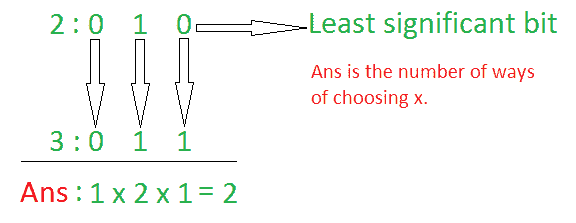

# 与 A 按位“或”等于 B 的计数值

> 原文:[https://www . geesforgeks . org/count-values-其与 a 的位或等于 b/](https://www.geeksforgeeks.org/count-values-whose-bitwise-or-with-a-is-equal-to-b/)

给定两个整数 **A** 和 **B** ，任务是计算满足条件 **A | X = B** 的 **X** 的可能值。
***注:** **|** 代表[按位 OR](https://www.geeksforgeeks.org/bitwise-operators-in-c-cpp/) 运算。*

**示例:**

> **输入:** A = 2，B = 3
> **输出:** 2
> **解释:**
> 自，2 | 1 = 3 和 2 | 3 = 3。因此，x 的可能值是 1 和 3。
> 
> **输入:** A = 5，B = 7
> T3】输出: 4

**天真法:**解决这个问题最简单的方法就是[迭代范围](https://www.geeksforgeeks.org/loops-in-c-and-cpp/)**【1，B】**检查每个数字，其与 **A** 的**位 OR** 是否等于 **B** 。如果条件满足，增加计数。
***时间复杂度:** O(b)*
***辅助空间:** O(1)*

**高效方法:**上述方法可以基于以下观察进行优化:

*   [将数字 A 和 B 转换成各自的二进制表示](https://www.geeksforgeeks.org/program-decimal-binary-conversion/)。

    > T3】逐位或运算真值表:
    > 1 | 1 = 1
    > 1 | 0 = 1
    > 0 | 1 = 1
    > 0 | 0 = 0T9】

*   For each same-positioned bit, count number of ways the i<sup>th</sup> bit in **A** can be converted to the i<sup>th</sup> bit in **B** by performing **Bitwise OR** operation.

    

    按照以下步骤解决问题:

    *   初始化一个变量**和**来存储需要的结果。
    *   使用变量 **i** 同时遍历 **a** 和 **b** 的位
        *   如果设置了 **a** 的第 I 位，同时也设置了 **b** 的第 I 位，那么 **x** 的第 I 位可以取 2 个值，即 0 或 1。因此，将**和**乘以 2。
        *   如果 **a** 的第 I 位未置位，而 **b** 的第 I 位置位，那么 **x** 的第 I 位只能取 1，即 1。因此，将**和**乘以 1。
        *   如果 **a** 的第 ith 位被置位，而 **b** 的第 ith 位未置位，那么无论 **x** 的第 ith 位是什么，都不能将 **a** 的第 ith 位转换为 **b** 的第 ith 位。因此，将 **ans** 更新为 0，[脱离循环](https://www.geeksforgeeks.org/break-statement-cc/)。
    *   打印**和**的值作为结果

    下面是上述方法的实现:

    ## C++

    ```
    // C++ program for the above approach
    #include <bits/stdc++.h>
    using namespace std;

    // Function to count possible values of
    // X whose Bitwise OR with A is equal to B
    int numWays(int a, int b)
    {

        // Store the required result
        int res = 1;

        // Iterate over all bits
        while (a && b) {

            // If i-th bit of a is set
            if ((a & 1) == 1) {

                // If i-th bit of b is set
                if ((b & 1) == 1) {

                    // The i-th bit in x
                    // can be both 1 and 0
                    res = res * 2;
                }
                else {

                    // a|x is equal to 1
                    // Therefore, it cannot
                    // be converted to b
                    return 0;
                }
            }

            // Right shift a and b by 1
            a = a >> 1;
            b = b >> 1;
        }

        return res;
    }

    // Driver Code
    int main()
    {
        // Given Input
        int a = 2, b = 3;

        // Function Call
        cout << numWays(a, b);

        return 0;
    }
    ```

    **Output:**

    ```
    2

    ```

    ***时间复杂度:** O(max(log a，log b))*
    ***辅助空间:** O(1)*