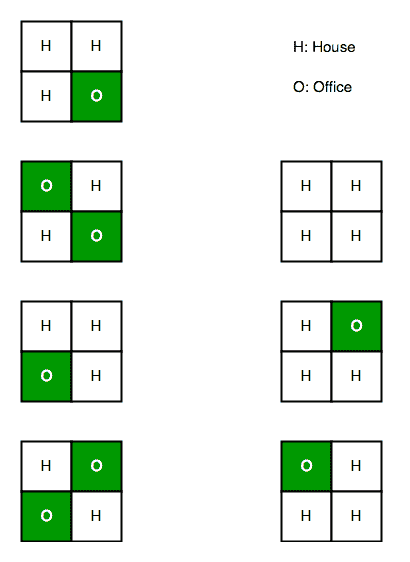

# 计算在给定约束条件下建造街道的方式

> 原文:[https://www . geesforgeks . org/count-way-build-street-given-constraints/](https://www.geeksforgeeks.org/count-ways-build-street-given-constraints/)

有一条长度为 n 的街道，我们知道它有两边。因此，总共有 2 * n 个可用点。在这些地点中的每一个都可以建造房屋或办公室，但有以下两个限制:

1.街道同一侧的两个办公室不能相邻。
2。街道不同侧的两个办公室不能完全相对，也就是说，它们不能互相俯视。
建房子没有限制，每个点要么有房子，要么有办公室。
给定街道的长度 n，找出建造街道的总方法数。

**示例:**

```
Input : 2
Output : 7
Please see below diagram for explanation.

Input : 3
Output : 17
```

下图描述了用 N = 2
建造街道的 7 种可能方式



```
Ways for building street with length 1
with 2 houses: (H H) = {1}
with 1 office and 1 house: (O H) (H O) = {2}
(O O) is not allowed according to the problem statement.
Total = 1  + 2 = 3
```

```
For length = 2,
with 2 houses: (H H) can be added to all
the cases of length 1:

(H H)    (H H)    (H H)
(H H)    (O H)    (H O) = {3}

with 1 office and 1 house:
(O H) and (H O) can both be added to all 
the cases of length 1 with last row (H H)

(O H)    (H O)
(H H)    (H H) = {2}

when last row of a case of length 1 
contains 1 office, it can only be 
extended in one way to build an office
in row 2\. 
(H O)    (O H)    
(O H)    (H O) = {2}

(O H)    (H O) (O O)    
(O H)    (H O) (O H) etc are not allowed.

Total = 3 + 2 + 2 = 7
```

由于该问题可以通过为较小的子问题寻找解决方案，然后扩展相同的逻辑来解决，因此可以使用动态编程来解决。我们以一个单位长度的步数移动。对于每一排，我们有两个选择:
在两个地点建造房屋
建造一个房屋和一个办公室
第一个可以不受任何限制地完成。在长度为 I 的两个地点都有一种建造房屋的方法。所以使用这种选择的总方法=长度为 I-1 的总方法。
对于第二种选择，如果第(i-1)排在两个地点都有房子，我们有两种方法来建造办公室，即(H O)和(O H)
如果第(i-1)排在两个地点中的一个地点有办公室，我们只有一种方法在第一排建造办公室。如果前一排有(O H) curr row 将有(H O)，同样，对于前一排= (H O) curr row = (O H)。
从上面的逻辑来看，这种选择的总途径= 2 *(选择 1(i-1)) +选择 2(i-1)
我们将为此构建一个 2D dp。
dp[0][i]表示选项 1，dp[1][i]表示第 I 行的选项 2。

以下是上述想法的实现:

## C++

```
// C++ program to count ways to build street
// under given constraints
#include <bits/stdc++.h>
using namespace std;

// function to count ways of building
// a street of n rows
long countWays(int n)
{
    long dp[2][n + 1];

    // base case
    dp[0][1] = 1;
    dp[1][1] = 2;

    for (int i = 2; i <= n; i++) {

        // ways of building houses in both
        // the spots of ith row
        dp[0][i] = dp[0][i - 1] + dp[1][i - 1];

        // ways of building an office in one of
        // the two spots of ith row
        dp[1][i] = dp[0][i - 1] * 2 + dp[1][i - 1];
    }

    // total ways for n rows
    return dp[0][n] + dp[1][n];
}

// driver program for checking above function
int main()
{

    int n = 5;
    cout << "Total no of ways with n = " << n
         << " are: " << countWays(n) << endl;
}
```

## Java 语言(一种计算机语言，尤用于创建网站)

```
// Java program to count ways to build street
// under given constraints
public class GFG {

// function to count ways of building
// a street of n rows
    static long countWays(int n) {
        long dp[][] = new long[2][n + 1];

        // base case
        dp[0][1] = 1;
        dp[1][1] = 2;

        for (int i = 2; i <= n; i++) {

            // ways of building houses in both
            // the spots of ith row
            dp[0][i] = dp[0][i - 1] + dp[1][i - 1];

            // ways of building an office in one of
            // the two spots of ith row
            dp[1][i] = dp[0][i - 1] * 2 + dp[1][i - 1];
        }

        // total ways for n rows
        return dp[0][n] + dp[1][n];
    }

// driver program for checking above function
    public static void main(String[] args) {

        int n = 5;
        System.out.print("Total no of ways with n = " + n
                + " are: " + countWays(n));
    }

}

/*This code is contributed by PrinciRaj1992*/
```

## 蟒蛇 3

```
# Python3 program to count ways to build
# street under given constraints

# function to count ways of building
# a street of n rows
def countWays(n) :

    dp = [[0] * (n + 1) for i in range(2)]

    # base case
    dp[0][1] = 1
    dp[1][1] = 2

    for i in range(2, n + 1) :

        # ways of building houses in both
        # the spots of ith row
        dp[0][i] = dp[0][i - 1] + dp[1][i - 1]

        # ways of building an office in one of
        # the two spots of ith row
        dp[1][i] = (dp[0][i - 1] * 2 +
                    dp[1][i - 1])

    # total ways for n rows
    return dp[0][n] + dp[1][n]

# Driver Code
if __name__ == "__main__" :

    n = 5
    print("Total no of ways with n =",
              n, "are:", countWays(n))

# This code is contributed by Ryuga
```

## C#

```
// C# program to count ways to build street
// under given constraints

using System;
public class GFG{

// function to count ways of building
// a street of n rows
    static long countWays(int n) {
        long [,]dp = new long[2 , n + 1];

        // base case
        dp[0,1] = 1;
        dp[1,1] = 2;

        for (int i = 2; i <= n; i++) {

            // ways of building houses in both
            // the spots of ith row
            dp[0 , i] = dp[0 , i - 1] + dp[1 , i - 1];

            // ways of building an office in one of
            // the two spots of ith row
            dp[1 , i] = dp[0 , i - 1] * 2 + dp[1 , i - 1];
        }

        // total ways for n rows
        return dp[0 , n] + dp[1 , n];
    }

// driver program for checking above function
    public static void Main() {

        int n = 5;
        Console.Write("Total no of ways with n = " + n
                + " are: " + countWays(n));
    }

}

/*This code is contributed by PrinciRaj1992*/
```

## 服务器端编程语言（Professional Hypertext Preprocessor 的缩写）

```
<?php
// PHP program to count ways to build street
// under given constraints

// function to count ways of building
// a street of n rows
function countWays($n)
{

    // base case
    $dp[0][1] = 1;
    $dp[1][1] = 2;

    for ($i = 2; $i <= $n; $i++) {

        // ways of building houses in both
        // the spots of ith row
        $dp[0][$i] = $dp[0][$i - 1] +
                     $dp[1][$i - 1];

        // ways of building an office in one of
        // the two spots of ith row
        $dp[1][$i] = $dp[0][$i - 1] *
                     2 + $dp[1][$i - 1];
    }

    // total ways for n rows
    return $dp[0][$n] + $dp[1][$n];
}

    // Driver Code
    $n = 5;
    echo "Total no of ways with n = ",$n,
         " are: " ,countWays($n),"\n";

// This code is contributed by jit_t
?>
```

## java 描述语言

```
<script>

// Javascript program to count ways to
// build street under given constraints

// Function to count ways of building
// a street of n rows
function countWays(n)
{
    let dp = new Array(2);

    for(let i = 0; i < 2; i++)
    {
        dp[i] = new Array(n + 1);
    }

    // Base case
    dp[0][1] = 1;
    dp[1][1] = 2;

    for(let i = 2; i <= n; i++)
    {

        // Ways of building houses in both
        // the spots of ith row
        dp[0][i] = dp[0][i - 1] + dp[1][i - 1];

        // Ways of building an office in one of
        // the two spots of ith row
        dp[1][i] = dp[0][i - 1] * 2 + dp[1][i - 1];
    }

    // Total ways for n rows
    return dp[0][n] + dp[1][n];
}

// Driver code
let n = 5;
document.write("Total no of ways with n = " +
               n + " are: " + countWays(n));

// This code is contributed by suresh07

</script>
```

**Output**

```
Total no of ways with n = 5 are: 99
```

**时间复杂度:**O(N)
T3】辅助空间: O(N)

**另一种方法**
假设你有 A(n-1)和 A(n-2)，其中 A(i)描绘了 2*i 个建筑的道路，那么:
A(n) =(你在 A(n-1)中有(H H)的道路数)*3 +(你在 A(n-1)中有(O H)的道路数)*2
这些情况是如何产生的？简单地说，你可以想出 2 种状态，正如上面的解释所考察的那样。
A(n-1)中你有(H H)的路数=在第(n-1)个位置固定 H H，这等于 n-2 个位置的路数(固定 n-1 到 H H)。
你在 A(n-1)位置有(O H)的路数=(n-1)位置的路数–(H H 在 A(n-1)位置的路数)。
所以 A(n)= 3 * A(n-2)+2 *(A(n-1)-A(n-2))= 2 * A(n-1)+A(n-2)

## C++

```
// C++ program of above approach
#include <iostream>
using namespace std;

// Program to count ways
int countways(long long n)
{
    long long A[n+1];
    A[0] = 1;
    A[1] = 3;
    A[2] = 7;

    // Iterate from 2 to n
    for(int i=2;i<=n;i++)
    {
        A[i] = 2*A[i-1]+A[i-2];
    }
    return A[n];
}

// Driver code
int main() {
    int n = 5;

    // Count Ways 
    cout << countways(5) << endl;
    return 0;
}
```

## Java 语言(一种计算机语言，尤用于创建网站)

```
// Java program of above approach
import java.io.*;

class GFG{

// Program to count ways
static int countways(int n)
{
    int [] A = new int[n+1];
    A[0] = 1;
    A[1] = 3;
    A[2] = 7;

    // Iterate from 2 to n
    for(int i = 2; i <= n; i++)
    {
        A[i] = 2 * A[i - 1] + A[i - 2];
    }
    return A[n];
}

// Driver code
public static void main(String[] args)
{
    int n = 5;

    // Count Ways 
    System.out.println(countways(5));
}
}

// This code is contributed by Ankita saini
```

## 蟒蛇 3

```
# Python3 program of above approach

# Program to count ways
def countways(n):

    A = [0 for i in range(n + 2)]
    A[0] = 1
    A[1] = 3
    A[2] = 7

    # Iterate from 2 to n
    for i in range(2, n + 1):
        A[i] = 2 * A[i - 1] + A[i - 2]

    return A[n]

# Driver code
n = 5

# Count Ways
print(countways(5))

# This code is contributed by Sanjit_Prasad
```

## C#

```
// C# program of above approach
using System;

class GFG{

// Program to count ways
static int countways(int n)
{
    int [] A = new int[n+1];
    A[0] = 1;
    A[1] = 3;
    A[2] = 7;

    // Iterate from 2 to n
    for(int i = 2; i <= n; i++)
    {
        A[i] = 2 * A[i - 1] + A[i - 2];
    }
    return A[n];
}

// Driver code
public static void Main()
{
    int n = 5;

    // Count Ways 
    Console.Write(countways(n));
}
}

// This code is contributed by bunnyram19.
```

## java 描述语言

```
<script>

// Javascript program of above approach

// Program to count ways
function countways(n)
{
    let A = new Array(n+1).fill(0);
    A[0] = 1;
    A[1] = 3;
    A[2] = 7;

    // Iterate from 2 to n
    for(let i=2;i<=n;i++)
    {
        A[i] = 2*A[i-1]+A[i-2];
    }
    return A[n];
}

// driver program

        let n = 5;

    // Count Ways 
    document.write(countways(5))

</script>
```

**Output**

```
99
```

**时间复杂度:**O(N)
T3】辅助空间: O(N)

本文由**阿迪提·夏尔马**供稿。如果你喜欢 GeeksforGeeks 并想投稿，你也可以使用[write.geeksforgeeks.org](https://write.geeksforgeeks.org)写一篇文章或者把你的文章邮寄到 review-team@geeksforgeeks.org。看到你的文章出现在极客博客主页上，帮助其他极客。
如果你发现任何不正确的地方，或者你想分享更多关于上面讨论的话题的信息，请写评论。