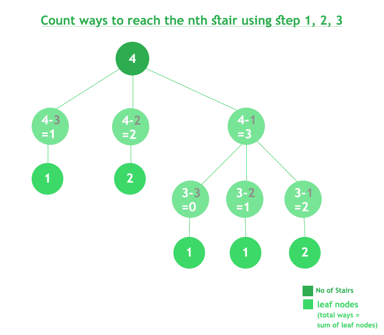

# 使用步骤 1、2 或 3 计算到达第 n 级楼梯的方式

> 原文:[https://www . geesforgeks . org/count-way-reach-n th-stage-using-step-1-2-3/](https://www.geeksforgeeks.org/count-ways-reach-nth-stair-using-step-1-2-3/)

一个孩子跑上 n 级楼梯，一次可以跳 1 级、2 级或 3 级。实施一种方法，计算孩子可以跑上楼梯的可能方式。

**示例:**

```
Input : 4
Output : 7
Explanation:
Below are the seven ways
 1 step + 1 step + 1 step + 1 step
 1 step + 2 step + 1 step
 2 step + 1 step + 1 step 
 1 step + 1 step + 2 step
 2 step + 2 step
 3 step + 1 step
 1 step + 3 step

Input : 3
Output : 4
Explanation:
Below are the four ways
 1 step + 1 step + 1 step
 1 step + 2 step
 2 step + 1 step
 3 step
```

**解决这个问题有两种方法:**

1.  递归方法
2.  动态规划

**<u>方法 1</u> :** 递归。
共有 n 级楼梯，一个人可以跳下一级楼梯，跳过一级楼梯或跳过两级楼梯。所以有 n 个楼梯。所以如果一个人站在 I 级楼梯，这个人可以移动到 i+1，i+2，i+3 级楼梯。可以形成递归函数，其中在当前索引 I 处，针对 i+1、i+2 和 i+3 级递归调用该函数。
递归函数的形成还有另一种方式。要到达 I 级楼梯，一个人必须从 i-1、i-2 或 i-3 级楼梯跳下，或者 I 是起始楼梯。

**算法:**

1.  创建一个只接受一个参数的递归函数(count(int n))。
2.  检查基本情况。如果 n 的值小于 0，则返回 0，如果 n 的值等于 0，则返回 1，因为它是起始楼梯。
3.  用值 n-1、n-2 和 n-3 递归调用该函数，并对返回的值求和，即 sum = count(n-1)+count(n-2)+count(n-3)
4.  返回总和的值。

## C++

```
// C++ Program to find n-th stair using step size
// 1 or 2 or 3.
#include <iostream>
using namespace std;

class GFG {

    // Returns count of ways to reach n-th stair
    // using 1 or 2 or 3 steps.
public:
    int findStep(int n)
    {
        if (n == 0)
            return 1;
        else if (n < 0)
            return 0;

        else
            return findStep(n - 3) + findStep(n - 2)
                   + findStep(n - 1);
    }
};

// Driver code
int main()
{
    GFG g;
    int n = 4;
    cout << g.findStep(n);
    return 0;
}

// This code is contributed by SoM15242
```

## C

```
// Program to find n-th stair using step size
// 1 or 2 or 3.
#include <stdio.h>

// Returns count of ways to reach n-th stair
// using 1 or 2 or 3 steps.
int findStep(int n)
{
    if (n == 0)
       return 1;
    else if (n < 0)
        return 0;

    else
        return findStep(n - 3) + findStep(n - 2)
               + findStep(n - 1);
}

// Driver code
int main()
{
    int n = 4;
    printf("%d\n", findStep(n));
    return 0;
}
```

## Java 语言(一种计算机语言，尤用于创建网站)

```
// Program to find n-th stair
// using step size 1 or 2 or 3.
import java.lang.*;
import java.util.*;

public class GfG {

    // Returns count of ways to reach
    // n-th stair using 1 or 2 or 3 steps.
    public static int findStep(int n)
    {
        if ( n == 0)
            return 0;
        else if (n < 0)
            return 0;

        else
            return findStep(n - 3) + findStep(n - 2)
                + findStep(n - 1);
    }

    // Driver function
    public static void main(String argc[])
    {
        int n = 4;
        System.out.println(findStep(n));
    }
}

/* This code is contributed by Sagar Shukla */
```

## 计算机编程语言

```
# Python program to find n-th stair
# using step size 1 or 2 or 3.

# Returns count of ways to reach n-th
# stair using 1 or 2 or 3 steps.

def findStep(n):
    if ( n == 0 ):
        return 1
    elif (n < 0):
        return 0

    else:
        return findStep(n - 3) + findStep(n - 2) + findStep(n - 1)

# Driver code
n = 4
print(findStep(n))

# This code is contributed by Nikita Tiwari.
```

## C#

```
// Program to find n-th stair
// using step size 1 or 2 or 3.
using System;

public class GfG {

    // Returns count of ways to reach
    // n-th stair using 1 or 2 or 3 steps.
    public static int findStep(int n)
    {
        if ( n == 0)
            return 1;
        else if (n < 0)
            return 0;

        else
            return findStep(n - 3) + findStep(n - 2)
                + findStep(n - 1);
    }

    // Driver function
    public static void Main()
    {
        int n = 4;
        Console.WriteLine(findStep(n));
    }
}

/* This code is contributed by vt_m */
```

## 服务器端编程语言（Professional Hypertext Preprocessor 的缩写）

```
<?php
// PHP Program to find n-th stair
// using step size 1 or 2 or 3.

// Returns count of ways to
// reach n-th stair using 
// 1 or 2 or 3 steps.
function findStep($n)
{
    if ( $n == 0)
        return 1;
    else if ($n < 0)
        return 0;

    else
        return findStep($n - 3) +
               findStep($n - 2) +
                findStep($n - 1);
}

// Driver code
$n = 4;
echo findStep($n);

// This code is contributed by m_kit
?>
```

## java 描述语言

```
<script>

// JavaScript Program to find n-th stair using step size
// 1 or 2 or 3.

    // Returns count of ways to reach n-th stair
    // using 1 or 2 or 3 steps.
    function findStep(n)
    {
        if (n == 0)
            return 1;
        else if (n < 0)
            return 0;

        else
            return findStep(n - 3) + findStep(n - 2)
                                + findStep(n - 1);
    }

// Driver code

    let n = 4;
     document.write(findStep(n));

// This code is contributed by Surbhi Tyagi.

</script>
```

**Output**

```
7
```

**工作:**



**复杂度分析:**

*   **时间复杂度:** O(3 <sup>n</sup> )。
    上述解的时间复杂度是指数的，一个接近的上限将是 O(3 <sup>n</sup> )。从每个状态，调用 3 个递归函数。所以 n 个状态的上限是 O(3 <sup>n</sup> )。
*   **空间复杂度:** O(1)。
    因为不需要额外的空间。

**注:**程序的时间复杂度可以使用动态规划进行优化。

**<u>方法二</u> :** 动态规划。
想法类似，但可以观察到有 n 个状态但递归函数被称为 3 ^ n 次。这意味着一些状态被反复调用。所以这个想法是存储状态的值。这可以通过两种方式实现。

*   *自上而下的方法:*第一种方法是保持递归结构不变，只需将值存储在 HashMap 中，并且每当再次调用该函数时，返回值存储，而无需计算()。
*   *自下而上的方法:*第二种方法是取一个 n 大小的额外空间，从 1，2 开始计算状态值..到 n，即计算 I，i+1，i+2 的值，然后用它们来计算 i+3 的值。

**算法:**

1.  创建一个大小为 n + 1 的数组，并用 1，1，2 初始化前 3 个变量。基本情况。
2.  运行从 3 到 n 的循环。
3.  对于每个索引 I，I 位置的计算机值为 dp[i] = dp[i-1] + dp[i-2] + dp[i-3]。
4.  打印 dp[n]的值，作为到达第 n 步的路数的计数。

## C++

```
// A C++ program to count number of ways
// to reach n't stair when
#include <iostream>
using namespace std;

// A recursive function used by countWays
int countWays(int n)
{
    int res[n + 1];
    res[0] = 1;
    res[1] = 1;
    res[2] = 2;
    for (int i = 3; i <= n; i++)
        res[i] = res[i - 1] + res[i - 2] + res[i - 3];

    return res[n];
}

// Driver program to test above functions
int main()
{
    int n = 4;
    cout << countWays(n);
    return 0;
}
// This code is contributed by shubhamsingh10
```

## C

```
// A C program to count number of ways
// to reach n't stair when
#include <stdio.h>

// A recursive function used by countWays
int countWays(int n)
{
    int res[n + 1];
    res[0] = 1;
    res[1] = 1;
    res[2] = 2;
    for (int i = 3; i <= n; i++)
        res[i] = res[i - 1] + res[i - 2] + res[i - 3];

    return res[n];
}

// Driver program to test above functions
int main()
{
    int n = 4;
    printf("%d", countWays(n));
    return 0;
}
```

## Java 语言(一种计算机语言，尤用于创建网站)

```
// Program to find n-th stair
// using step size 1 or 2 or 3.
import java.lang.*;
import java.util.*;

public class GfG {

    // A recursive function used by countWays
    public static int countWays(int n)
    {
        int[] res = new int[n + 1];
        res[0] = 1;
        res[1] = 1;
        res[2] = 2;

        for (int i = 3; i <= n; i++)
            res[i] = res[i - 1] + res[i - 2] + res[i - 3];

        return res[n];
    }

    // Driver function
    public static void main(String argc[])
    {
        int n = 4;
        System.out.println(countWays(n));
    }
}

/* This code is contributed by Sagar Shukla */
```

## 计算机编程语言

```
# Python program to find n-th stair
# using step size 1 or 2 or 3.

# A recursive function used by countWays

def countWays(n):
    res = [0] * (n + 2)
    res[0] = 1
    res[1] = 1
    res[2] = 2

    for i in range(3, n + 1):
        res[i] = res[i - 1] + res[i - 2] + res[i - 3]

    return res[n]

# Driver code
n = 4
print(countWays(n))

# This code is contributed by Nikita Tiwari.
```

## C#

```
// Program to find n-th stair
// using step size 1 or 2 or 3.
using System;

public class GfG {

    // A recursive function used by countWays
    public static int countWays(int n)
    {
        int[] res = new int[n + 2];
        res[0] = 1;
        res[1] = 1;
        res[2] = 2;

        for (int i = 3; i <= n; i++)
            res[i] = res[i - 1] + res[i - 2] + res[i - 3];

        return res[n];
    }

    // Driver function
    public static void Main()
    {
        int n = 4;
        Console.WriteLine(countWays(n));
    }
}

/* This code is contributed by vt_m */
```

## 服务器端编程语言（Professional Hypertext Preprocessor 的缩写）

```
<?php
// A PHP program to count
// number of ways to reach
// n'th stair when

// A recursive function
// used by countWays
function countWays($n)
{
    $res[0] = 1;
    $res[1] = 1;
    $res[2] = 2;
    for ($i = 3; $i <= $n; $i++)
        $res[$i] = $res[$i - 1] +
                   $res[$i - 2] +
                   $res[$i - 3];

    return $res[$n];
}

// Driver Code
$n = 4;
echo countWays($n);

// This code is contributed by ajit
?>
```

## java 描述语言

```
<script>
    // JavaScript Program to find n-th stair
    // using step size 1 or 2 or 3.

    // A recursive function used by countWays
    function countWays(n)
    {
        let res = new Array(n + 2);
        res[0] = 1;
        res[1] = 1;
        res[2] = 2;

        for (let i = 3; i <= n; i++)
            res[i] = res[i - 1] + res[i - 2] + res[i - 3];

        return res[n];
    }

    let n = 4;
      document.write(countWays(n));

// This code is contributed by rameshtravel07.
</script>
```

**Output**

```
7
```

*   **工作:**

```
1 -> 1 -> 1 -> 1
1 -> 1 -> 2
1 -> 2 -> 1
1 -> 3
2 -> 1 -> 1
2 -> 2
3 -> 1

So Total ways: 7
```

*   **复杂度分析:**
    *   **时间复杂度:** O(n)。
        只需要遍历一次数组。所以时间复杂度是 O(n)。
    *   **空间复杂度:** O(n)。
        要在 DP 中存储值，需要 n 个额外的空间。

#### 方法 3:矩阵指数法

矩阵求幂是解决时间复杂度更高的动态规划问题的数学方法。矩阵求幂技术有大小为 K×K 的变换矩阵和函数向量(K×1)。取变换矩阵的 n-1 次幂，与函数向量相乘，给出结果向量，称其大小为 k1。Res 的第一个元素将是给定 n 值的答案。这种方法将采用 O(K^3logn 时间复杂度，即寻找变换矩阵的(n-1)次幂的复杂度。

#### 关键条款:

k = F(n)依赖的项数，从递推关系我们可以说 F(n)依赖于 F(n-1)和 F(n-2)。=> K =3

F1 =包含前 K 项的 F(n)值的向量(1D 数组)。因为 K=3 =>F1 将有前 2 项的 F(n)值。F1=[1，2，4]

T =变换矩阵，它是大小为 K×K 的 2D 矩阵，由对角线后的所有 1 组成，除最后一行外其余都为零。最后一行将具有所有 K 项的系数，其中 F(n)以相反的顺序依赖。=> T =[ [0 1 0]，[0 0 1]，[1 1 1] ]。

#### 算法:

```
1)Take Input N
2)If N < K then Return Precalculated Answer  //Base Condition
3)construct F1 Vector and T (Transformation Matrix)
4)Take N-1th  power of T by using  Optimal Power(T,N) Methods and assign it in T
5)return (TXF)[1]
```

关于最佳功率(T，N)方法，请参考以下文章:[https://www . geeksforgeeks . org/write-a-c-program-to-compute-powxn/](https://www.geeksforgeeks.org/write-a-c-program-to-calculate-powxn/)

## C++

```
#include <bits/stdc++.h>
#define k 3
using namespace std;

// Multiply Two Matrix Function
vector<vector<int> > multiply(vector<vector<int> > A,
                              vector<vector<int> > B)
{
    // third matrix to store multiplication of Two matrix9*
    vector<vector<int> > C(k + 1, vector<int>(k + 1));

    for (int i = 1; i <= k; i++) {
        for (int j = 1; j <= k; j++) {
            for (int x = 1; x <= k; x++) {
                C[i][j] = (C[i][j] + (A[i][x] * B[x][j]));
            }
        }
    }

    return C;
}
// Optimal Way For finding pow(t,n)
// If n Is Odd then It Will be t*pow(t,n-1)
// else return pow(t,n/2)*pow(t,n/2)
vector<vector<int> > pow(vector<vector<int> > t, int n)
{
    // base Case
    if (n == 1) {
        return t;
    }
    // Recurrence Case
    if (n & 1) {
        return multiply(t, pow(t, n - 1));
    }
    else {
        vector<vector<int> > X = pow(t, n / 2);
        return multiply(X, X);
    }
}

int compute(int n)
{
    // base Case
    if (n == 0)
        return 1;
    if (n == 1)
        return 1;
    if (n == 2)
        return 2;

    // Function Vector(indexing 1 )
    // that is [1,2]
    int f1[k + 1] = {};
    f1[1] = 1;
    f1[2] = 2;
    f1[3] = 4;

    // Constructing Transformation Matrix that will be
    /*[[0,1,0],[0,0,1],[3,2,1]]
     */
    vector<vector<int> > t(k + 1, vector<int>(k + 1));
    for (int i = 1; i <= k; i++) {
        for (int j = 1; j <= k; j++) {
            if (i < k) {
                // Store 1 in cell that is next to diagonal
                // of Matrix else Store 0 in cell
                if (j == i + 1) {
                    t[i][j] = 1;
                }
                else {
                    t[i][j] = 0;
                }
                continue;
            }
            // Last Row - store the Coefficients in reverse
            // order
            t[i][j] = 1;
        }
    }

    // Computing T^(n-1) and Setting Transformation matrix T
    // to T^(n-1)
    t = pow(t, n - 1);
    int sum = 0;
    // Computing first cell (row=1,col=1) For Resultant
    // Matrix TXF
    for (int i = 1; i <= k; i++) {
        sum += t[1][i] * f1[i];
    }
    return sum;
}
int main()
{
    int n = 4;
    cout << compute(n) << endl;
    n = 5;
    cout << compute(n) << endl;
    n = 10;
    cout << compute(n) << endl;

    return 0;
}
```

## Java 语言(一种计算机语言，尤用于创建网站)

```
import java.io.*;
import java.util.*;

class GFG {

    static int k = 3;

    // Multiply Two Matrix Function
    static int[][] multiply(int[][] A, int[][] B)
    {

        // Third matrix to store multiplication
        // of Two matrix9*
        int[][] C = new int[k + 1][k + 1];

        for (int i = 1; i <= k; i++) {
            for (int j = 1; j <= k; j++) {
                for (int x = 1; x <= k; x++) {
                    C[i][j]
                        = (C[i][j] + (A[i][x] * B[x][j]));
                }
            }
        }
        return C;
    }

    // Optimal Way For finding pow(t,n)
    // If n Is Odd then It Will be t*pow(t,n-1)
    // else return pow(t,n/2)*pow(t,n/2)
    static int[][] pow(int[][] t, int n)
    {

        // Base Case
        if (n == 1) {
            return t;
        }

        // Recurrence Case
        if ((n & 1) != 0) {
            return multiply(t, pow(t, n - 1));
        }
        else {
            int[][] X = pow(t, n / 2);
            return multiply(X, X);
        }
    }

    static int compute(int n)
    {

        // Base Case
        if (n == 0)
            return 1;
        if (n == 1)
            return 1;
        if (n == 2)
            return 2;

        // Function int(indexing 1 )
        // that is [1,2]
        int f1[] = new int[k + 1];
        f1[1] = 1;
        f1[2] = 2;
        f1[3] = 4;

        // Constructing Transformation Matrix that will be
        /*[[0,1,0],[0,0,1],[3,2,1]]
         */
        int[][] t = new int[k + 1][k + 1];
        for (int i = 1; i <= k; i++) {
            for (int j = 1; j <= k; j++) {
                if (i < k) {

                    // Store 1 in cell that is next to
                    // diagonal of Matrix else Store 0 in
                    // cell
                    if (j == i + 1) {
                        t[i][j] = 1;
                    }
                    else {
                        t[i][j] = 0;
                    }
                    continue;
                }

                // Last Row - store the Coefficients
                // in reverse order
                t[i][j] = 1;
            }
        }

        // Computing T^(n-1) and Setting
        // Transformation matrix T to T^(n-1)
        t = pow(t, n - 1);
        int sum = 0;

        // Computing first cell (row=1,col=1)
        // For Resultant Matrix TXF
        for (int i = 1; i <= k; i++) {
            sum += t[1][i] * f1[i];
        }
        return sum;
    }

    // Driver Code
    public static void main(String[] args)
    {

        // Input
        int n = 4;
        System.out.println(compute(n));
        n = 5;
        System.out.println(compute(n));
        n = 10;
        System.out.println(compute(n));
    }
}

// This code is contributed by Shubhamsingh10
```

## 蟒蛇 3

```
k = 3

# Multiply Two Matrix Function

def multiply(A, B):

    # third matrix to store multiplication of Two matrix9*
    C = [[0 for x in range(k+1)] for y in range(k+1)]

    for i in range(1, k+1):
        for j in range(1, k+1):
            for x in range(1, k+1):
                C[i][j] = (C[i][j] + (A[i][x] * B[x][j]))

    return C

# Optimal Way For finding pow(t,n)
# If n Is Odd then It Will be t*pow(t,n-1)
# else return pow(t,n/2)*pow(t,n/2)

def pow(t,  n):
    # base Case
    if (n == 1):
        return t
    # Recurrence Case
    if (n & 1):
        return multiply(t, pow(t, n - 1))
    else:
        X = pow(t, n // 2)
    return multiply(X, X)

def compute(n):
    # base Case
    if (n == 0):
        return 1
    if (n == 1):
        return 1
    if (n == 2):
        return 2

    # Function Vector(indexing 1 )
    # that is [1,2]
    f1 = [0]*(k + 1)
    f1[1] = 1
    f1[2] = 2
    f1[3] = 4

    # Constructing Transformation Matrix that will be
    # [[0,1,0],[0,0,1],[3,2,1]]

    t = [[0 for x in range(k+1)] for y in range(k+1)]
    for i in range(1, k+1):
        for j in range(1, k+1):
            if (i < k):
                # Store 1 in cell that is next to diagonal of Matrix else Store 0 in
                # cell
                if (j == i + 1):
                    t[i][j] = 1
                else:
                    t[i][j] = 0
                continue
            # Last Row - store the Coefficients in reverse order
            t[i][j] = 1

    # Computing T^(n-1) and Setting Transformation matrix T to T^(n-1)
    t = pow(t, n - 1)
    sum = 0
    # Computing first cell (row=1,col=1) For Resultant Matrix TXF
    for i in range(1, k+1):
        sum += t[1][i] * f1[i]
    return sum

# Driver Code
n = 4
print(compute(n))

n = 5
print(compute(n))

n = 10
print(compute(n))

# This code is contributed by Shubhamsingh10
```

## C#

```
// C# program for the above approach
using System;

class GFG {

    static int k = 3;

    // Multiply Two Matrix Function
    static int[, ] multiply(int[, ] A, int[, ] B)
    {

        // Third matrix to store multiplication
        // of Two matrix9*
        int[, ] C = new int[k + 1, k + 1];

        for (int i = 1; i <= k; i++) {
            for (int j = 1; j <= k; j++) {
                for (int x = 1; x <= k; x++) {
                    C[i, j]
                        = (C[i, j] + (A[i, x] * B[x, j]));
                }
            }
        }
        return C;
    }

    // Optimal Way For finding pow(t,n)
    // If n Is Odd then It Will be t*pow(t,n-1)
    // else return pow(t,n/2)*pow(t,n/2)
    static int[, ] pow(int[, ] t, int n)
    {

        // Base Case
        if (n == 1) {
            return t;
        }

        // Recurrence Case
        if ((n & 1) != 0) {
            return multiply(t, pow(t, n - 1));
        }
        else {
            int[, ] X = pow(t, n / 2);
            return multiply(X, X);
        }
    }

    static int compute(int n)
    {

        // Base Case
        if (n == 0)
            return 1;
        if (n == 1)
            return 1;
        if (n == 2)
            return 2;

        // Function int(indexing 1 )
        // that is [1,2]
        int[] f1 = new int[k + 1];
        f1[1] = 1;
        f1[2] = 2;
        f1[3] = 4;

        // Constructing Transformation Matrix that will be
        /*[[0,1,0],[0,0,1],[3,2,1]]
         */
        int[, ] t = new int[k + 1, k + 1];
        for (int i = 1; i <= k; i++) {
            for (int j = 1; j <= k; j++) {
                if (i < k) {

                    // Store 1 in cell that is next to
                    // diagonal of Matrix else Store 0 in
                    // cell
                    if (j == i + 1) {
                        t[i, j] = 1;
                    }
                    else {
                        t[i, j] = 0;
                    }
                    continue;
                }

                // Last Row - store the Coefficients
                // in reverse order
                t[i, j] = 1;
            }
        }

        // Computing T^(n-1) and Setting
        // Transformation matrix T to T^(n-1)
        t = pow(t, n - 1);
        int sum = 0;

        // Computing first cell (row=1,col=1)
        // For Resultant Matrix TXF
        for (int i = 1; i <= k; i++) {
            sum += t[1, i] * f1[i];
        }
        return sum;
    }

    // Driver Code
    static public void Main()
    {

        // Input
        int n = 4;
        Console.WriteLine(compute(n));
        n = 5;
        Console.WriteLine(compute(n));
        n = 10;
        Console.WriteLine(compute(n));
    }
}

// This code is contributed by Shubhamsingh10
```

## java 描述语言

```
<script>

let k = 3;

// Multiply Two Matrix Function
function multiply(A,B)
{
    // Third matrix to store multiplication
    // of Two matrix9*
    let C = new Array(k + 1);
    for(let i=0;i<k+1;i++)
    {
        C[i]=new Array(k+1);
        for(let j=0;j<k+1;j++)
        {
            C[i][j]=0;
        }
    }

    for(let i = 1; i <= k; i++)
    {
        for(let j = 1; j <= k; j++)
        {
            for(let x = 1; x <= k; x++)
            {
                C[i][j] = (C[i][j] + (A[i][x] * B[x][j]));
            }
        }
    }
    return C;
}

// Optimal Way For finding pow(t,n)
// If n Is Odd then It Will be t*pow(t,n-1)
// else return pow(t,n/2)*pow(t,n/2)
function pow(t,n)
{
    // Base Case
    if (n == 1)
    {
        return t;
    }

    // Recurrence Case
    if ((n & 1) != 0)
    {
        return multiply(t, pow(t, n - 1));
    }
    else
    {
        let X = pow(t, n / 2);
        return multiply(X, X);
    }
}

function compute(n)
{
    // Base Case
    if (n == 0) return 1;
    if (n == 1) return 1;
    if (n == 2) return 2;

    // Function int(indexing 1 )
    // that is [1,2]
    let f1=new Array(k + 1);
    f1[1] = 1;
    f1[2] = 2;
    f1[3] = 4;

    // Constructing Transformation Matrix that will be
    /*[[0,1,0],[0,0,1],[3,2,1]]
    */
    let t = new Array(k + 1);
    for(let i=0;i<k+1;i++)
    {
        t[i]=new Array(k+1);
        for(let j=0;j<k+1;j++)
        {
            t[i][j]=0;
        }
    }

    for(let i = 1; i <= k; i++)
    {
        for(let j = 1; j <= k; j++)
        {
            if (i < k)
            {

                // Store 1 in cell that is next to
                // diagonal of Matrix else Store 0 in
                // cell
                if (j == i + 1)
                {
                    t[i][j] = 1;
                }
                else
                {
                    t[i][j] = 0;
                }
                continue;
            }

            // Last Row - store the Coefficients
            // in reverse order
            t[i][j] = 1;
        }
    }

    // Computing T^(n-1) and Setting
    // Transformation matrix T to T^(n-1)
    t = pow(t, n - 1);
    let sum = 0;

    // Computing first cell (row=1,col=1)
    // For Resultant Matrix TXF
    for(let i = 1; i <= k; i++)
    {
        sum += t[1][i] * f1[i];
    }
    return sum;
}

// Driver Code
// Input
let n = 4;
document.write(compute(n)+"<br>");
n = 5;
document.write(compute(n)+"<br>");
n = 10;
document.write(compute(n)+"<br>");

// This code is contributed by avanitrachhadiya2155

</script>
```

**Output**

```
7
13
274
```

```
Explanation:
We Know For This Question 
Transformation Matrix M= [[0,1,0],[0,0,1],[1,1,1]]
Functional Vector F1 = [1,2,4]
for n=2 :
    ans = (M X F1)[1]  
    ans = [2,4,7][1]  
    ans = 2 //[2,4,7][1] = First cell value of [2,4,7] i.e 2
for n=3 :
    ans = (M X M X F1)[1]  //M^(3-1) X F1 = M X M X F1
    ans = (M X [2,4,7])[1] 
    ans = [4,7,13][1]
    ans = 4
for n = 4 :
    ans = (M^(4-1) X F1)[1]
    ans = (M X M X M X F1) [1] 
    ans = (M X [4,7,13])[1] 
    ans = [7,13,24][1]
    ans = 7
for n = 5 :
    ans = (M^4 X F1)[1]
    ans = (M X [7,13,24])[1]
    ans = [13,24,44][1]
    ans = 13
```

#### 时间复杂性:

```
O(K^3log(n)) //For Computing pow(t,n-1)
For this question K is 3
So Overall Time Complexity is O(27log(n))=O(logn)
```

**方法 4:使用四个变量**

这个想法是基于斐波那契数列，但这里有 3 个和。我们将前三个楼梯的值保存在 3 个变量中，并将使用第四个变量来找到路的数量。

## C++

```
// A C++ program to count number of ways
// to reach nth stair when
#include <iostream>
using namespace std;

// A recursive function used by countWays
int countWays(int n)
{
    int a = 1, b = 2, c = 4; // declaring three variables
                             // and holding the ways
                             // for first three stairs
    int d = 0; // fourth variable
    if (n == 0 || n == 1 || n == 2)
        return n;
    if (n == 3)
        return c;

    for (int i = 4; i <= n; i++) { // starting from 4 as
        d = c + b + a; // already counted for 3 stairs
        a = b;
        b = c;
        c = d;
    }
    return d;
}

// Driver program to test above functions
int main()
{
    int n = 4;
    cout << countWays(n);
    return 0;
}
// This code is contributed by Naveen Shah
```

## Java 语言(一种计算机语言，尤用于创建网站)

```
// A Java program to count number of ways
// to reach nth stair when
import java.io.*;

class GFG{

// A recursive function used by countWays
static int countWays(int n)
{

    // Declaring three variables
    // and holding the ways
    // for first three stairs
    int a = 1, b = 2, c = 4;

    // Fourth variable                        
    int d = 0;
    if (n == 0 || n == 1 || n == 2)
        return n;
    if (n == 3)
        return c;

    for(int i = 4; i <= n; i++)
    {
        // Starting from 4 as
        // already counted for 3 stairs
        d = c + b + a;
        a = b;
        b = c;
        c = d;
    }
    return d;
}

// Driver code
public static void main(String[] args)
{
    int n = 4;

    System.out.println(countWays(n));
}
}

// This code is contributed by shivanisinghss2110
```

## 蟒蛇 3

```
# A Python program to count number of ways
# to reach nth stair when
# A recursive function used by countWays
def countWays(n):

    # declaring three variables
    # and holding the ways
    # for first three stairs
    a = 1
    b = 2
    c = 4

    d = 0 # fourth variable
    if (n == 0 or n == 1 or n == 2):
        return n
    if (n == 3):
        return c

    for i in range(4,n+1):

        # starting from 4 as
        d = c + b + a # already counted for 3 stairs
        a = b
        b = c
        c = d
    return d

# Driver program to test above functions
n = 4
print(countWays(n))

# This code is contributed by shivanisinghss2110
```

## C#

```
// A C# program to count number of ways
// to reach nth stair when
using System;

class GFG{

// A recursive function used by countWays
static int countWays(int n)
{

    // Declaring three variables
    // and holding the ways
    // for first three stairs
    int a = 1, b = 2, c = 4;

    // Fourth variable                        
    int d = 0;
    if (n == 0 || n == 1 || n == 2)
        return n;
    if (n == 3)
        return c;

    for(int i = 4; i <= n; i++)
    {
        // Starting from 4 as
        // already counted for 3 stairs
        d = c + b + a;
        a = b;
        b = c;
        c = d;
    }
    return d;
}

// Driver code
public static void Main(String[] args)
{
    int n = 4;

    Console.Write(countWays(n));
}
}

// This code is contributed by shivanisinghss2110
```

## java 描述语言

```
<script>
// A JavaScript program to count number of ways
// to reach nth stair when
// A recursive function used by countWays
function countWays( n)
{

    // Declaring three variables
    // and holding the ways
    // for first three stairs
    var a = 1, b = 2, c = 4;

    // Fourth variable                        
    var d = 0;
    if (n == 0 || n == 1 || n == 2)
        return n;
    if (n == 3)
        return c;

    for(var i = 4; i <= n; i++)
    {
        // Starting from 4 as
        // already counted for 3 stairs
        d = c + b + a;
        a = b;
        b = c;
        c = d;
    }
    return d;
}

// Driver code
    var n = 4;

    document.write(countWays(n));

// This code is contributed by shivanisinghss2110
</script>
```

**Output**

```
7
```

**时间复杂度:**O(n)
T3】辅助 T5】空间: O(1)。