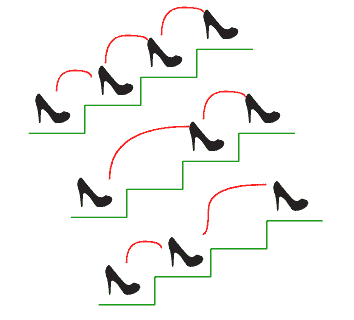

# 计算到达第 n 级楼梯的方式

> 原文:[https://www.geeksforgeeks.org/count-ways-reach-nth-stair/](https://www.geeksforgeeks.org/count-ways-reach-nth-stair/)

有 n 个楼梯，站在底部的人想到达顶部。这个人一次可以爬 1 级或 2 级楼梯。数一数，这个人可以达到顶峰。



考虑图中所示的示例。n 的值是 3。有 3 种方法可以到达顶端。该图取自[更容易的斐波那契难题](http://www.maths.surrey.ac.uk/hosted-sites/R.Knott/Fibonacci/fibpuzzles.html)

**示例:**

```
Input: n = 1
Output: 1
There is only one way to climb 1 stair

Input: n = 2
Output: 2
There are two ways: (1, 1) and (2)

Input: n = 4
Output: 5
(1, 1, 1, 1), (1, 1, 2), (2, 1, 1), (1, 2, 1), (2, 2) 
```

**<u>方法 1</u> :** 第一种方法使用递归的技巧来解决这个问题。
**做法:**我们很容易发现上面问题的递归性。人可以从**(n-1)**楼梯或从**(n-2)**楼梯到达 **n <sup>第</sup>T10】楼梯。因此，对于每个楼梯 **n** ，我们试图找出到达 **n-1 <sup>th</sup>** 楼梯和 **n-2 <sup>th</sup>** 楼梯的途径数量，并将其相加，给出 **n <sup>th</sup>** 楼梯的答案。因此，这种方法的表达式是:**

```
ways(n) = ways(n-1) + ways(n-2)
```

上面的表达式其实是[斐波那契数](https://www.geeksforgeeks.org/program-for-nth-fibonacci-number/)的表达式，但是有一点需要注意，ways)的值等于斐波那契(n+1)。

```
ways(1) = fib(2) = 1
ways(2) = fib(3) = 2
ways(3) = fib(4) = 3
```

为了更好地理解，让我们参考下面的递归树:

```
Input: N = 4

                  fib(5)
           '3'  /        \   '2'
               /          \
           fib(4)         fib(3)
     '2'  /      \ '1'   /      \  
         /        \     /        \ 
     fib(3)     fib(2)fib(2)      fib(1) 
     /    \ '1' /   \ '0'
'1' /   '1'\   /     \ 
   /        \ fib(1) fib(0) 
fib(2)     fib(1)
```

所以我们可以用斐波那契数的函数来求 ways)的值。下面是上述思想的 C++实现。

## C++

```
// C++ program to count number of
// ways to reach Nth stair
#include <bits/stdc++.h>
using namespace std;

// A simple recursive program to
// find N'th fibonacci number
int fib(int n)
{
    if (n <= 1)
        return n;
    return fib(n - 1) + fib(n - 2);
}

// Returns number of ways to
// reach s'th stair
int countWays(int s)
{
    return fib(s + 1);
}

// Driver C
int main()
{
    int s = 4;

    cout << "Number of ways = " << countWays(s);

    return 0;
}

// This code is contributed by shubhamsingh10
```

## C

```
// C Program to count number of
// ways to reach Nth stair
#include <stdio.h>

// A simple recursive program to
// find n'th fibonacci number
int fib(int n)
{
    if (n <= 1)
        return n;
    return fib(n - 1) + fib(n - 2);
}

// Returns number of ways to reach s'th stair
int countWays(int s)
{
    return fib(s + 1);
}

// Driver program to test above functions
int main()
{
    int s = 4;
    printf("Number of ways = %d", countWays(s));
    getchar();
    return 0;
}
```

## Java 语言(一种计算机语言，尤用于创建网站)

```
class stairs {
    // A simple recursive program to find
    // n'th fibonacci number
    static int fib(int n)
    {
        if (n <= 1)
            return n;
        return fib(n - 1) + fib(n - 2);
    }

    // Returns number of ways to reach s'th stair
    static int countWays(int s)
    {
        return fib(s + 1);
    }

    /* Driver program to test above function */
    public static void main(String args[])
    {
        int s = 4;
        System.out.println("Number of ways = " + countWays(s));
    }
} /* This code is contributed by Rajat Mishra */
```

## 计算机编程语言

```
# Python program to count
# ways to reach nth stair

# Recursive function to find
# Nth fibonacci number
def fib(n):
    if n <= 1:
        return n
    return fib(n-1) + fib(n-2)

# Returns no. of ways to
# reach sth stair
def countWays(s):
    return fib(s + 1)

# Driver program
s = 4
print "Number of ways = ",
print countWays(s)

# Contributed by Harshit Agrawal
```

## C#

```
// C# program to count the
// number of ways to reach
// n'th stair
using System;

class GFG {
    // A simple recursive
    // program to find n'th
    // fibonacci number
    static int fib(int n)
    {
        if (n <= 1)
            return n;
        return fib(n - 1) + fib(n - 2);
    }

    // Returns number of ways
    // to reach s'th stair
    static int countWays(int s)
    {
        return fib(s + 1);
    }

    // Driver Code
    static public void Main()
    {
        int s = 4;
        Console.WriteLine("Number of ways = " + countWays(s));
    }
}

// This code is contributed
// by akt_mit
```

## 服务器端编程语言（Professional Hypertext Preprocessor 的缩写）

```
<?php
// A PHP program to count
// number of ways to reach
// n'th stair when a person
// can climb 1, 2, ..m stairs
// at a time.

// A simple recursive
// function to find n'th
// fibonacci number
function fib($n)
{
if ($n <= 1)
    return $n;
return fib($n - 1) +
       fib($n - 2);
}

// Returns number of
// ways to reach s'th stair
function countWays($s)
{
    return fib($s + 1);
}

// Driver Code
$s = 4;
echo "Number of ways = ",
           countWays($s);

// This code is contributed
// by m_kit
?>
```

## java 描述语言

```
<script>
// A Javascript program to count
// number of ways to reach
// n'th stair when a person
// can climb 1, 2, ..m stairs
// at a time.

// A simple recursive
// function to find n'th
// fibonacci number
function fib(n)
{
if (n <= 1)
    return n;
return fib(n - 1) +
       fib(n - 2);
}

// Returns number of
// ways to reach s'th stair
function countWays(s)
{
    return fib(s + 1);
}

// Driver Code
let s = 4;
document.write("Number of ways = " + countWays(s));

// This code is contributed
// by _saurabh_jaiswal
</script>
```

**输出:**

```
Number of ways = 5
```

**复杂度分析:**

*   **时间复杂度:** *O(2^n)*
    由于冗余计算，上述实现的时间复杂度是指数级的(黄金比例提升到 n 次方)。可以使用之前讨论的[斐波那契函数优化](https://www.geeksforgeeks.org/program-for-nth-fibonacci-number/)将其优化为在 0(Logn)时间内工作。
*   **辅助空间:** *O(1)*

**问题的一般化**
对于给定值 m，如何统计人最多能爬 m 级楼梯的次数，例如 m 为 4，人一次能爬 1 级楼梯或 2 级楼梯或 3 级楼梯或 4 级楼梯。

**方法:**对于上述方法的推广，可以使用以下递归关系。

```
ways(n, m) = ways(n-1, m) + ways(n-2, m) + ... ways(n-m, m) 
```

在此方法中，要到达第 n 个楼梯，请尝试从当前楼梯爬过所有小于或等于 n 个**楼梯。**

以下是上述循环的实现。

## C++

```
// C++ program to count number of ways
// to reach nth stair when a person
// can climb either 1 or 2 stairs at a time
#include <bits/stdc++.h>
using namespace std;

// A recursive function used by countWays
int countWaysUtil(int n, int m)
{
    if (n <= 1)
    {
        return n;
    }

    int res = 0;
    for(int i = 1; i <= m && i <= n; i++)
    {
       res += countWaysUtil(n - i, m);
    }
    return res;
}

// Returns number of ways to reach s'th stair
int countWays(int s, int m)
{
    return countWaysUtil(s + 1, m);
}

// Driver code
int main()
{
    int s = 4, m = 2;
    cout << "Number of ways = " << countWays(s, m);

    return 0;
}

// This code is contribute by shubhamsingh10
```

## C

```
// C program to count number of ways
// to reach nth stair when a person
// can climb either 1 or 2 stairs at a time
#include <stdio.h>

// A recursive function used by countWays
int countWaysUtil(int n, int m)
{
    if (n <= 1)
        return n;
    int res = 0;
    for (int i = 1; i <= m && i <= n; i++)
        res += countWaysUtil(n - i, m);
    return res;
}

// Returns number of ways to reach s'th stair
int countWays(int s, int m)
{
    return countWaysUtil(s + 1, m);
}

// Driver program to test above functions-
int main()
{
    int s = 4, m = 2;
    printf("Number of ways = %d", countWays(s, m));
    return 0;
}
```

## Java 语言(一种计算机语言，尤用于创建网站)

```
class stairs {
    // A recursive function used by countWays
    static int countWaysUtil(int n, int m)
    {
        if (n <= 1)
            return n;
        int res = 0;
        for (int i = 1; i <= m && i <= n; i++)
            res += countWaysUtil(n - i, m);
        return res;
    }

    // Returns number of ways to reach s'th stair
    static int countWays(int s, int m)
    {
        return countWaysUtil(s + 1, m);
    }

    /* Driver program to test above function */
    public static void main(String args[])
    {
        int s = 4, m = 2;
        System.out.println("Number of ways = "
                           + countWays(s, m));
    }
} /* This code is contributed by Rajat Mishra */
```

## 计算机编程语言

```
# A program to count the number of ways
# to reach n'th stair

# Recursive function used by countWays
def countWaysUtil(n, m):
    if n <= 1:
        return n
    res = 0
    i = 1
    while i<= m and i<= n:
        res = res + countWaysUtil(n-i, m)
        i = i + 1
    return res

# Returns number of ways to reach s'th stair   
def countWays(s, m):
    return countWaysUtil(s + 1, m)

# Driver program
s, m = 4, 2
print "Number of ways =", countWays(s, m)

# Contributed by Harshit Agrawal
```

## C#

```
using System;
public class stairs
{

    // A recursive function used by countWays
    static int countWaysUtil(int n, int m)
    {
        if (n <= 1)
            return n;
        int res = 0;
        for (int i = 1; i <= m && i <= n; i++)
            res += countWaysUtil(n - i, m);
        return res;
    }

    // Returns number of ways to reach s'th stair
    static int countWays(int s, int m)
    {
        return countWaysUtil(s + 1, m);
    }

    /* Driver program to test above function */
    public static void Main(String []args)
    {
        int s = 4, m = 2;
        Console.WriteLine("Number of ways = "
                           + countWays(s, m));
    }
}

// This code is contributed by umadevi9616
```

## 服务器端编程语言（Professional Hypertext Preprocessor 的缩写）

```
<?php
// A PHP program to count
// number of ways to reach
// n'th stair when a person
// can climb either 1 or 2
// stairs at a time

// A recursive function
// used by countWays
function countWaysUtil($n, $m)
{
    if ($n <= 1)
        return $n;
    $res = 0;
    for ($i = 1; $i <= $m &&
                 $i <= $n; $i++)
        $res += countWaysUtil($n - $i, $m);
    return $res;
}

// Returns number of ways
// to reach s'th stair
function countWays($s, $m)
{
    return countWaysUtil($s + 1, $m);
}

// Driver Code
$s = 4; $m = 2;
echo "Number of ways = ",
      countWays($s, $m);

// This code is contributed
// by akt_mit
?>
```

## java 描述语言

```
<script>
// A Javascript program to count
// number of ways to reach
// n'th stair when a person
// can climb either 1 or 2
// stairs at a time

// A recursive function
// used by countWays
function countWaysUtil(n, m)
{
    if (n <= 1)
        return n;
    let res = 0;
    for (let i = 1; i <= m &&
                 i <= n; i++)
        res += countWaysUtil(n - i, m);
    return res;
}

// Returns number of ways
// to reach s'th stair
function countWays(s, m)
{
    return countWaysUtil(s + 1, m);
}

// Driver Code
let s = 4;
let m = 2;
document.write("Number of ways = " + countWays(s, m));

// This code is contributed by _saurabh_jaiswal
</script>
```

**输出:**

```
Number of ways = 5
```

**复杂度分析:**

*   **时间复杂度:** *O(2^n)*
    由于冗余计算，上述实现的时间复杂度是指数级的(黄金比例提升到 n 次方)。利用动态规划可以优化到 O(m*n)。
*   **辅助空间:** *O(1)*

**<u>方法二</u> :** 该方法利用[动态规划](http://www.geeksforgeeks.org/dynamic-programming/)的技巧，得出解。

**方法:**我们使用以下关系以自下而上的方式创建一个表**RES【】**:

```
res[i] = res[i] + res[i-j] for every (i-j) >= 0
```

使得阵列的第**I**索引将包含到达第 **i <sup>第</sup>** 步所需的路径数量，考虑了所有的爬升可能性(即从 1 到第 **i** )。

下面的代码实现了上述方法:

## C++

```
// C++ program to count number of ways
// to reach n'th stair when a person
// can climb 1, 2, ..m stairs at a time
#include <iostream>
using namespace std;

// A recursive function used by countWays
int countWaysUtil(int n, int m)
{
    int res[n];
    res[0] = 1;
    res[1] = 1;

    for(int i = 2; i < n; i++)
    {
       res[i] = 0;

       for(int j = 1; j <= m && j <= i; j++)
          res[i] += res[i - j];
    }
    return res[n - 1];
}

// Returns number of ways to reach s'th stair
int countWays(int s, int m)
{
    return countWaysUtil(s + 1, m);
}

// Driver code
int main()
{
    int s = 4, m = 2;

    cout << "Number of ways = "
         << countWays(s, m);

    return 0;
}

// This code is contributed by shubhamsingh10
```

## C

```
// A C program to count number of ways
// to reach n'th stair when
// a person can climb 1, 2, ..m stairs at a time
#include <stdio.h>

// A recursive function used by countWays
int countWaysUtil(int n, int m)
{
    int res[n];
    res[0] = 1;
    res[1] = 1;
    for (int i = 2; i < n; i++) {
        res[i] = 0;
        for (int j = 1; j <= m && j <= i; j++)
            res[i] += res[i - j];
    }
    return res[n - 1];
}

// Returns number of ways to reach s'th stair
int countWays(int s, int m)
{
    return countWaysUtil(s + 1, m);
}

// Driver program to test above functions
int main()
{
    int s = 4, m = 2;
    printf("Number of ways = %d", countWays(s, m));
    return 0;
}
```

## Java 语言(一种计算机语言，尤用于创建网站)

```
// Java program to count number of ways
// to reach n't stair when a person
// can climb 1, 2, ..m stairs at a time

class GFG {
    // A recursive function used by countWays
    static int countWaysUtil(int n, int m)
    {
        int res[] = new int[n];
        res[0] = 1;
        res[1] = 1;
        for (int i = 2; i < n; i++) {
            res[i] = 0;
            for (int j = 1; j <= m && j <= i; j++)
                res[i] += res[i - j];
        }
        return res[n - 1];
    }

    // Returns number of ways to reach s'th stair
    static int countWays(int s, int m)
    {
        return countWaysUtil(s + 1, m);
    }

    // Driver method
    public static void main(String[] args)
    {
        int s = 4, m = 2;
        System.out.println("Number of ways = "
                           + countWays(s, m));
    }
}
```

## 计算机编程语言

```
# A program to count the number of
# ways to reach n'th stair

# Recursive function used by countWays
def countWaysUtil(n, m):
    # Creates list res with all elements 0
    res = [0 for x in range(n)]
    res[0], res[1] = 1, 1

    for i in range(2, n):
        j = 1
        while j<= m and j<= i:
            res[i] = res[i] + res[i-j]
            j = j + 1
    return res[n-1]

# Returns number of ways to reach s'th stair
def countWays(s, m):
    return countWaysUtil(s + 1, m)

# Driver Program
s, m = 4, 2
print "Number of ways =", countWays(s, m)

# Contributed by Harshit Agrawal
```

## C#

```
// C# program to count number
// of ways to reach n'th stair when
// a person can climb 1, 2, ..m
// stairs at a time
using System;
class GFG {

    // A recursive function
    // used by countWays
    static int countWaysUtil(int n, int m)
    {
        int[] res = new int[n];
        res[0] = 1;
        res[1] = 1;
        for (int i = 2; i < n; i++) {
            res[i] = 0;
            for (int j = 1; j <= m && j <= i; j++)
                res[i] += res[i - j];
        }
        return res[n - 1];
    }

    // Returns number of ways
    // to reach s'th stair
    static int countWays(int s, int m)
    {
        return countWaysUtil(s + 1, m);
    }

    // Driver Code
    public static void Main()
    {
        int s = 4, m = 2;
        Console.WriteLine("Number of ways = "
                          + countWays(s, m));
    }
}

// This code is contributed by anuj_67.
```

## 服务器端编程语言（Professional Hypertext Preprocessor 的缩写）

```
<?php
// A PHP program to count number
// of ways to reach n't stair when
// a person can climb 1, 2, ..m
// stairs at a time

// A recursive function used by countWays
function countWaysUtil($n, $m)
{
    $res[0] = 1; $res[1] = 1;
    for ($i = 2; $i < $n; $i++)
    {
        $res[$i] = 0;
        for ($j = 1; $j <= $m && $j <= $i; $j++)
        $res[$i] += $res[$i - $j];
    }
    return $res[$n - 1];
}

// Returns number of ways
// to reach s'th stair
function countWays($s, $m)
{
    return countWaysUtil($s + 1, $m);
}

    // Driver Code
    $s = 4;
    $m = 2;
    echo "Number of ways = ", countWays($s, $m);

// This code is contributed by m_kit
?>
```

## java 描述语言

```
<script>

// A Javascript program to count number
// of ways to reach n't stair when
// a person can climb 1, 2, ..m
// stairs at a time

// A recursive function used by countWays
function countWaysUtil(n, m)
{
    let res = [];
    res[0] = 1;
    res[1] = 1;
    for (let i = 2; i < n; i++)
    {
        res[i] = 0;
        for (let j = 1; j <= m && j <= i; j++)
        res[i] += res[i - j];
    }
    return res[n - 1];
}

// Returns number of ways
// to reach s'th stair
function countWays(s, m)
{
    return countWaysUtil(s + 1, m);
}

    // Driver Code
    let s = 4;
    let m = 2;
    document.write("Number of ways = " + countWays(s, m));

// This code is contributed by _saurabh_jaiswal

</script>
```

**输出:**

```
Number of ways = 5
```

**复杂度分析:**

*   **时间复杂度:** *O(m*n)*
*   **辅助空间:**T2【O(n)

**<u>方法三</u> :** 第三种方法利用[滑动窗口](https://www.geeksforgeeks.org/window-sliding-technique/)的手法得出解。
**方法:**该方法有效地实现了上述动态规划方法。
在这个 **i <sup>第</sup>** 级楼梯的方法中，我们保留一个最后 **m** 个可能楼梯的总和的窗口，我们可以从该窗口爬上 **i <sup>第</sup>** 级楼梯。我们不运行内部循环，而是将内部循环的结果保存在临时变量中。我们移除前一个窗口的元素，添加当前窗口的元素，并更新总和。

下面的代码实现了上面的想法

## C++

```
// A C++ program to count the number of ways
// to reach n'th stair when user
// climb 1 .. m stairs at a time.
// Contributor: rsampaths16
#include <iostream>
using namespace std;

// Returns number of ways
// to reach s'th stair
int countWays(int n, int m)
{
    int res[n + 1];
    int temp = 0;
    res[0] = 1;
    for (int i = 1; i <= n; i++)
    {
        int s = i - m - 1;
        int e = i - 1;
        if (s >= 0)
        {
            temp -= res[s];
        }
        temp += res[e];
        res[i] = temp;
    }
    return res[n];
}

// Driver Code
int main()
{
    int n = 5, m = 3;
    cout << "Number of ways = "
         << countWays(n, m);
    return 0;
}

// This code is contributed by shubhamsingh10
```

## C

```
// A C program to count the number of ways
// to reach n'th stair when user
// climb 1 .. m stairs at a time.
// Contributor: rsampaths16
#include <stdio.h>

// Returns number of ways
// to reach s'th stair
int countWays(int n, int m)
{
    int res[n + 1];
    int temp = 0;
    res[0] = 1;
    for (int i = 1; i <= n; i++) {
        int s = i - m - 1;
        int e = i - 1;
        if (s >= 0) {
            temp -= res[s];
        }
        temp += res[e];
        res[i] = temp;
    }
    return res[n];
}

// Driver Code
int main()
{
    int n = 5, m = 3;
    printf("Number of ways = %d",
           countWays(n, m));
    return 0;
}
```

## Java 语言(一种计算机语言，尤用于创建网站)

```
// Java program to count number of
// ways to reach n't stair when a
// person can climb 1, 2, ..m
// stairs at a time
class GFG{

// Returns number of ways
// to reach s'th stair
static int countWays(int n, int m)
{
    int res[] = new int[n + 1];
    int temp = 0;
    res[0] = 1;

    for(int i = 1; i <= n; i++)
    {
       int s = i - m - 1;
       int e = i - 1;
       if (s >= 0)
       {
           temp -= res[s];
       }
       temp += res[e];
       res[i] = temp;
    }
    return res[n];
}

// Driver Code
public static void main(String[] args)
{
    int n = 5, m = 3;
    System.out.println("Number of ways = " +
                       countWays(n, m));
}
}

// This code is contributed by equbalzeeshan
```

## 蟒蛇 3

```
# Python3 program to count the number
# of ways to reach n'th stair when
# user climb 1 .. m stairs at a time.

# Function to count number of ways
# to reach s'th stair
def countWays(n, m):

    temp = 0
    res = [1]

    for i in range(1, n + 1):
        s = i - m - 1
        e = i - 1
        if (s >= 0):
            temp -= res[s]
        temp += res[e]
        res.append(temp)

    return res[n]

# Driver Code
n = 5
m = 3

print('Number of ways =', countWays(n, m))

# This code is contributed by 31ajaydandge
```

## C#

```
// C# program to count number of
// ways to reach n'th stair when
// a person can climb 1, 2, ..m
// stairs at a time
using System;
class GFG{

// Returns number of ways
// to reach s'th stair
static int countWays(int n, int m)
{
    int[] res = new int[n + 1];
    int temp = 0;
    res[0] = 1;

    for(int i = 1; i <= n; i++)
    {
       int s = i - m - 1;
       int e = i - 1;
       if (s >= 0)
       {
           temp -= res[s];
       }
       temp += res[e];
       res[i] = temp;
    }
    return res[n];
}

// Driver Code
public static void Main()
{
    int n = 5, m = 3;
    Console.WriteLine("Number of ways = " +
                      countWays(n, m));
}
}

// This code is contributed by equbalzeeshan
```

## java 描述语言

```
<script>

// Javascript program to count number of
// ways to reach n't stair when a
// person can climb 1, 2, ..m
// stairs at a time   

// Returns number of ways
// to reach s'th stair
    function countWays(n , m)
    {
        var res = Array(n + 1).fill(0);
        var temp = 0;
        res[0] = 1;

        for (i = 1; i <= n; i++) {
            var s = i - m - 1;
            var e = i - 1;
            if (s >= 0) {
                temp -= res[s];
            }
            temp += res[e];
            res[i] = temp;
        }
        return res[n];
    }

    // Driver Code

        var n = 5, m = 3;
        document.write("Number of ways = " +
        countWays(n, m));

// This code contributed by Rajput-Ji

</script>
```

**输出:**

```
Number of ways = 13
```

**复杂度分析:**

*   **时间复杂度:** *O(n)*
*   **辅助空间:**T2【O(n)

本文由 **Abhishek** 供稿。如果您发现任何不正确的地方，或者您想分享关于上面讨论的主题的更多信息，请写评论

**<u>方法 4</u>** :第四种方法用的是简单的数学，但这只适用于**(顺序无关紧要)**一边数步的情况。

**<u>逼近</u>** :在这个方法中，我们简单地计算有 2 个的集合的数量。

## C++

```
#include <iostream>
using namespace std;

int main() {
    int n;
    n=5;

    // Here n/2 is done to count the number 2's in n
    // 1 is added for case where there is no 2.
    // eg: if n=4 ans will be 3.
    // {1,1,1,1} set having no 2.
    // {1,1,2} ans {2,2} (n/2) sets containing 2.

    cout<<"Number of ways when order of steps does not matter is : "<<1+(n/2)<<endl;   

    return 0;
}
```

## Java 语言(一种计算机语言，尤用于创建网站)

```
import java.util.*;

class GFG{

public static void main(String[] args)
{
    int n;
    n = 5;

    // Here n/2 is done to count the number 2's
    // in n 1 is added for case where there is no 2.
    // eg: if n=4 ans will be 3.
    // {1,1,1,1} set having no 2.
    // {1,1,2} ans {2,2} (n/2) sets containing 2.
    System.out.print("Number of ways when order of steps " +
                     "does not matter is : " + (1 + (n / 2)));
}
}

// This code is contributed by todaysgaurav
```

## 蟒蛇 3

```
n = 5

# Here n/2 is done to count the number 2's in n
# 1 is added for case where there is no 2.
# eg: if n=4 ans will be 3.
# {1,1,1,1} set having no 2.
# {1,1,2} ans {2,2} (n/2) sets containing 2.
print("Number of ways when order "
      "of steps does not matter is : ", 1 + (n // 2)) 

# This code is contributed by rohitsingh07052
```

## C#

```
using System;

class GFG{
static public void Main()
{
    int n;
    n = 5;

    // Here n/2 is done to count the number 2's
    // in n 1 is added for case where there is no 2.
    // eg: if n=4 ans will be 3.
    // {1,1,1,1} set having no 2.
    // {1,1,2} ans {2,2} (n/2) sets containing 2.
    Console.WriteLine("Number of ways when order of steps " +
                      "does not matter is : " + (1 + (n / 2)));

}
}

// This code is contributed by Ankita saini
```

## java 描述语言

```
<script>

var n;
n = 5;

// Here n/2 is done to count the number 2's in n
// 1 is added for case where there is no 2.
// eg: if n=4 ans will be 3.
// {1,1,1,1} set having no 2.
// {1,1,2} ans {2,2} (n/2) sets containing 2.
document.write("Number of ways when order " +
               "of steps does not matter is : ",
               parseInt(1 + (n / 2)));   

// This code is contributed by Ankita saini

</script>
```

**<u>输出:</u>**

```
Number of ways when order of steps does not matter is : 3
```

**<u>复杂度分析:</u>**

*   **时间复杂度:** *O(1)*
*   **空间复杂度:** *O(1)*

**<u>注:</u>** 此方法仅适用于**数第 N 级路(顺序无关紧要)的问题。**

顺序无关紧要意味着 n = 4 {1 2 1}、{2 1 1}、{1 1 2} **被认为是相同的。**

**<u>方法五:</u>** 该方法利用[矩阵求幂](https://www.hackerearth.com/practice/notes/solving-linear-recurrence-relation/)的技巧，得出解。

**方法:**到达 n <sup>第</sup>级楼梯(顺序事项)的路数等于到达(n-1) <sup>第</sup>级楼梯和(n-2) <sup>第</sup>级楼梯的路数之和

这对应于以下循环关系:

```
f(n) = f(n-1) + f(n-2)

f(1) = 1
f(2) = 2
```

其中 f(n)表示到达第 n <sup>个</sup>级楼梯的路数

**<u>注:</u>**

f(1) = 1，因为只有一条路可以到达 n=1 的楼梯{1}

f(2) = 2，因为有 2 种方法可以到达 n=2 个楼梯{1，1}，{2}

它是一类常系数的线性递推关系，我们可以用[矩阵求幂](https://www.hackerearth.com/practice/notes/solving-linear-recurrence-relation/)方法求解，该方法基本上为给定的递推关系找到一个变换矩阵，并将这个变换反复应用于一个基向量，从而得到解)。

```
F(n) = CN-1F(1)
where
C is the transformation matrix
F(1) is the base vector
F(n) is the desired solution
```

因此，对于我们的情况，变换矩阵 C 将是:

<figure class="table">

| Zero | one |
| one | one |

C <sup>N-1</sup> 可以用分治法计算，用 O( (K^3) Log n)表示，其中 k 是 c 的维数

和 F(1):

<figure class="table">

| one |
| Two |

例如，对于 n= 4:

F(4) = C <sup>3</sup> F(1)

C <sup>3</sup> =

<figure class="table">

| one | Two |
| Two | three |

因此，C <sup>3</sup> F(1) =

<figure class="table">

| five |
| eight |

## C++

```
#include <bits/stdc++.h>
using namespace std;
typedef vector<vector<long long> > matrix;

#define LOOP(i, n) for (int i = 1; i < n; i++)

// Computes A*B
// where A,B are square matrices
matrix mul(matrix A, matrix B, long long MOD = 1000000007)
{
    int K = A.size();
    matrix C(K, vector<long long>(K, 0));
    LOOP(i, K)
        LOOP(j, K)
            LOOP(k, K)
                C[i][j] = (C[i][j] + A[i][k] * B[k][j]) % MOD;
    return C;
}

// Computes A^n
matrix power(matrix A, long long n)
{
    if (n == 1)
        return A;
    if (n % 2 != 0) {
        // n is odd
        // A^n = A * [ A^(n-1) ]
        A = mul(A, power(A, n - 1));
    }
    else {
        // n is even
        // A^n = [ A^(n/2) ] * [ A^(n/2) ]
        A = power(A, n / 2);
        A = mul(A, A);
    }
    return A;
}

long long ways(int n)
{
    vector<long long> F(3);
    F[1] = 1;
    F[2] = 2;
    int K = 2;
    long long MOD = 1000000007;
    // create K*K matrix
    matrix C(K + 1, vector<long long>(K + 1, 0));
    /*
      A matrix with (i+1)th element as 1 and last row
      contains constants
      [
          [0 1 0 0 ... 0]
          [0 0 1 0 ... 0]
          [0 0 0 1 ... 0]
          [. . . . ... .]
          [. . . . ... .]
          [c(k) c(k-1) c(k-2) ... c1]
      ]
    */
    for (int i = 1; i < K; ++i) {
        C[i][i + 1] = 1;
    }
    // Last row is the constants c(k) c(k-1) ... c1
    // f(n) = 1*f(n-1) + 1*f(n-2)
    C[K][1] = 1;
    C[K][2] = 1;

    if (n <= 2)
        return F[n];

    // f(n) = C^(n-1)*F
    C = power(C, n - 1);

    long long result = 0;

    // result will be the first row of C^(n-1)*F
    for (int i = 1; i <= K; ++i) {
        result = (result + C[1][i] * F[i]) % MOD;
    }
    return result;
}

int main()
{
    int n = 4;
    cout << "Number of ways = " << ways(n) << endl;
}

// This code is contributed by darshang631
```

## Java 语言(一种计算机语言，尤用于创建网站)

```
import java.util.*;

class GFG
{

    // Computes A*B
    // where A,B are square matrices
    static long[][] mul(long[][] A, long[][] B, long MOD) {
        int K = A.length;
        long[][] C = new long[K][K];
        for (int i = 1; i < K; i++)
            for (int j = 1; j < K; j++)
                for (int k = 1; k < K; k++)
                    C[i][j] = (C[i][j] + A[i][k] * B[k][j]) % MOD;
        return C;
    }

    // Computes A^n
    static long[][] power(long[][] A, long n) {
        if (n == 1)
            return A;
        if (n % 2 != 0)
        {

            // n is odd
            // A^n = A * [ A^(n-1) ]
            A = mul(A, power(A, n - 1), 1000000007);
        }
      else
      {
            // n is even
            // A^n = [ A^(n/2) ] * [ A^(n/2) ]
            A = power(A, n / 2);
            A = mul(A, A, 1000000007);
        }
        return A;
    }

    static long ways(int n) {
        long[] F = new long[3];
        F[1] = 1;
        F[2] = 2;
        int K = 2;
        long MOD = 1000000007;

        // create K*K matrix
        long[][] C = new long[K + 1][K + 1];
        /*
         * A matrix with (i+1)th element as 1 and last row contains constants [ [0 1 0 0
         * ... 0] [0 0 1 0 ... 0] [0 0 0 1 ... 0] [. . . . ... .] [. . . . ... .] [c(k)
         * c(k-1) c(k-2) ... c1] ]
         */
        for (int i = 1; i < K; ++i) {
            C[i][i + 1] = 1;
        }
        // Last row is the constants c(k) c(k-1) ... c1
        // f(n) = 1*f(n-1) + 1*f(n-2)
        C[K][1] = 1;
        C[K][2] = 1;

        if (n <= 2)
            return F[n];

        // f(n) = C^(n-1)*F
        C = power(C, n - 1);

        long result = 0;

        // result will be the first row of C^(n-1)*F
        for (int i = 1; i <= K; ++i) {
            result = (result + C[1][i] * F[i]) % MOD;
        }
        return result;
    }

    public static void main(String[] args) {
        int n = 4;
        System.out.print("Number of ways = " + ways(n) + "\n");
    }
}

// This code is contributed by umadevi9616
```

## 蟒蛇 3

```
# Computes A*B
# where A,B are square matrices
def mul(A, B, MOD):
    K = len(A);
    C = [[0 for i in range(K)] for j in range(K)] ;
    for i in range(1, K):
        for j in range(1, K):
            for k in range(1, K):
                C[i][j] = (C[i][j] + A[i][k] * B[k][j]) % MOD;
    return C;

# Computes A^n
def power( A,  n):
    if (n == 1):
        return A;
    if (n % 2 != 0):

        # n is odd
        # A^n = A * [ A^(n-1) ]
        A = mul(A, power(A, n - 1), 1000000007);
    else:
        # n is even
        # A^n = [ A^(n/2) ] * [ A^(n/2) ]
        A = power(A, n // 2);
        A = mul(A, A, 1000000007);

    return A;

def ways(n):
    F = [0 for i in range(3)];
    F[1] = 1;
    F[2] = 2;
    K = 2;
    MOD = 1000000007;

    # create K*K matrix
    C = [[0 for i in range(K+1)] for j in range(K+1)];
    '''
     * A matrix with (i+1)th element as 1 and last row contains constants [ [0 1 0 0
     * ... 0] [0 0 1 0 ... 0] [0 0 0 1 ... 0] [. . . . ... .] [. . . . ... .] [c(k)
     * c(k-1) c(k-2) ... c1] ]
     '''
    for i in range(1,K):
        C[i][i + 1] = 1;

    # Last row is the constants c(k) c(k-1) ... c1
    # f(n) = 1*f(n-1) + 1*f(n-2)
    C[K][1] = 1;
    C[K][2] = 1;

    if (n <= 2):
        return F[n];

    # f(n) = C^(n-1)*F
    C = power(C, n - 1);
    result = 0;

    # result will be the first row of C^(n-1)*F
    for i in range(1,K+1):
        result = (result + C[1][i] * F[i]) % MOD;

    return result;

# Driver code
if __name__ == '__main__':
    n = 4;
    print("Number of ways = " , ways(n) , "");

# This code is contributed by gauravrajput1
```

## C#

```
using System;

public class GFG {

    // Computes A*B
    // where A,B are square matrices
    static long[,] mul(long[,] A, long[,] B, long MOD) {
        int K = A.GetLength(0);
        long[,] C = new long[K,K];
        for (int i = 1; i < K; i++)
            for (int j = 1; j < K; j++)
                for (int k = 1; k < K; k++)
                    C[i,j] = (C[i,j] + A[i,k] * B[k,j]) % MOD;
        return C;
    }

    // Computes A^n
    static long[,] power(long[,] A, long n) {
        if (n == 1)
            return A;
        if (n % 2 != 0) {

            // n is odd
            // A^n = A * [ A^(n-1) ]
            A = mul(A, power(A, n - 1), 1000000007);
        } else {
            // n is even
            // A^n = [ A^(n/2) ] * [ A^(n/2) ]
            A = power(A, n / 2);
            A = mul(A, A, 1000000007);
        }
        return A;
    }

    static long ways(int n) {
        long[] F = new long[3];
        F[1] = 1;
        F[2] = 2;
        int K = 2;
        long MOD = 1000000007;

        // create K*K matrix
        long[,] C = new long[K + 1,K + 1];
        /*
         * A matrix with (i+1)th element as 1 and last row contains constants [ [0 1 0 0
         * ... 0] [0 0 1 0 ... 0] [0 0 0 1 ... 0] [. . . . ... .] [. . . . ... .] [c(k)
         * c(k-1) c(k-2) ... c1] ]
         */
        for (int i = 1; i < K; ++i) {
            C[i,i + 1] = 1;
        }
        // Last row is the constants c(k) c(k-1) ... c1
        // f(n) = 1*f(n-1) + 1*f(n-2)
        C[K,1] = 1;
        C[K,2] = 1;

        if (n <= 2)
            return F[n];

        // f(n) = C^(n-1)*F
        C = power(C, n - 1);

        long result = 0;

        // result will be the first row of C^(n-1)*F
        for (int i = 1; i <= K; ++i) {
            result = (result + C[1,i] * F[i]) % MOD;
        }
        return result;
    }

    public static void Main(String[] args) {
        int n = 4;
        Console.Write("Number of ways = " + ways(n) + "\n");
    }
}

// This code is contributed by umadevi9616
```

## java 描述语言

```
<script>
    // Computes A*B
    // where A,B are square matrices
     function mul( A,  B , MOD) {
        var K = A.length;
        var C = Array(K).fill().map(()=>Array(K).fill(0));
        for (var i = 1; i < K; i++)
            for (var j = 1; j < K; j++)
                for (var k = 1; k < K; k++)
                    C[i][j] = (C[i][j] + A[i][k] * B[k][j]) % MOD;
        return C;
    }

    // Computes A^n
     function power( A , n) {
        if (n == 1)
            return A;
        if (n % 2 != 0) {

            // n is odd
            // A^n = A * [ A^(n-1) ]
            A = mul(A, power(A, n - 1), 1000000007);
        } else {
            // n is even
            // A^n = [ A^(n/2) ] * [ A^(n/2) ]
            A = power(A, n / 2);
            A = mul(A, A, 1000000007);
        }
        return A;
    }

    function ways(n) {
        var F = Array(3).fill(0);
        F[1] = 1;
        F[2] = 2;
        var K = 2;
        var MOD = 1000000007;

        // create K*K matrix
    var  C = Array(K+1).fill().map(()=>Array(K+1).fill(0));
        /*
         * A matrix with (i+1)th element as 1 and last row contains constants [ [0 1 0 0
         * ... 0] [0 0 1 0 ... 0] [0 0 0 1 ... 0] [. . . . ... .] [. . . . ... .] [c(k)
         * c(k-1) c(k-2) ... c1] ]
         */
        for (var i = 1; i < K; ++i) {
            C[i][i + 1] = 1;
        }
        // Last row is the constants c(k) c(k-1) ... c1
        // f(n) = 1*f(n-1) + 1*f(n-2)
        C[K][1] = 1;
        C[K][2] = 1;

        if (n <= 2)
            return F[n];

        // f(n) = C^(n-1)*F
        C = power(C, n - 1);

        var result = 0;

        // result will be the first row of C^(n-1)*F
        for (var i = 1; i <= K; ++i) {
            result = (result + C[1][i] * F[i]) % MOD;
        }
        return result;
    }

        var n = 4;
        document.write("Number of ways = " + ways(n) + "\n");

// This code is contributed by umadevi9616
</script>
```

**Output**

```
Number of ways = 5
```

**复杂度分析:**

*   **时间复杂度:O(Log n)**
*   **空间复杂度:O(1)**

**<u>问题概括:</u>**

给定数组 A {a1，a2，…。，am}包含所有有效步骤，计算到达第 n <sup>级</sup>级楼梯的路径数。(秩序很重要)

**示例**:

```
Input:
    A = [1,2] 
    n = 4  
Output: 5  
Explanation:
This is the given problem, i.e, count the number of ways to reach n=4 stairs with climbing 1 or 2 stairs at a time
Therefore, ways will be: {1,1,1,1} {1,1,2} {1,2,1} {2,1,1} {2,2} = 5

Input:
    A = [2,4,5]
    n = 9
Output: 5
Explanation:
There are 5 ways to reach n=9 stairs with climbing 2 or 4 or 5 stairs at a time
Therefore, ways will be: {5,4} {4,5} {2,2,5} {2,5,2} {5,2,2} = 5 
```

**进场:**

到达第 n 级楼梯的路径数由以下递归关系给出

设 K 是 a 中最大的元素。

**步骤 1:** 计算基向量 f(1)(由 F(1)组成……)。(英国)

可以在 0(m<sup>2</sup>K)时间内使用动态编程方法完成，如下所示:

我们以 A = {2，4，5}为例。为了计算 F(1) = { f(1)，f(2)，f(3)，f(4)，f(5) }我们将维护一个初始为空的数组，并迭代地向其追加 A <sub>i</sub> ，对于每个 A <sub>i</sub> ，我们将找到到达[A <sub>i-1</sub> ，到达 A <sub>i，</sub><sub>的途径数</sub>

因此对于 A = {2，4，5}

假设 T 是最初的空数组

```
Iteration 1: T = {2}        n = {1,2}        dp = {0,1}         (Number of ways to reach n=1,2 with steps given by T) 
Iteration 2: T = {2,4}        n = {1,2,3,4}    dp = {0,1,0,2}     (Number of ways to reach n=1,2,3,4 with steps given by T)
Iteration 3: T = {2,4,5}    n = {1,2,3,4,5}    dp = {0,1,0,2,1} (Number of ways to reach n=1,2,3,4,5 with steps given by T)
```

**注**:由于已经计算了一些值(迭代 2 为 1，2 等)。)我们可以循环地避开它们

在所有迭代之后，dp 数组将是:[0，1，0，2，1]

因此，A = [2，4，5]的基向量 F(1)为:

<figure class="table">

| Zero |
| one |
| Zero |
| Two |
| one |

现在我们有了基向量 F(1)，计算 C(变换矩阵)就很容易了

**第二步:**计算变换矩阵 C

它是一个矩阵，元素 A <sub>i，i+1</sub> = 1，最后一行包含常数

常数可以由 A 中元素的存在来确定

所以对于 A = [2，4，5]常数将是 c = [1，1，0，1，0] (C <sub>i</sub> = 1 如果(K-i+1)存在于 A 中，或者 0，其中 1 < = i < = K)

因此，A =[2，4，5]的变换矩阵 C 为:

<figure class="table">

| Zero | one | Zero | Zero | Zero |
| Zero | Zero | one | Zero | Zero |
| Zero | Zero | Zero | one | Zero |
| Zero | Zero | Zero | Zero | one |
| one | one | Zero | one | Zero |

**第三步:**计算 F(n)

为了计算 F(n)，使用以下公式:

```
F(n) = Cn-1F(1)
```

现在我们有了 C 和 F(1)，我们可以使用分治法来找到 C <sup>n-1</sup> ，从而得到想要的输出

## C++

```
#include <bits/stdc++.h>
using namespace std;
typedef vector<vector<long long> > matrix;

#define LOOP(i, n) for (int i = 1; i < n; i++)

// Computes A*B when A,B are square matrices of equal
// dimensions)
matrix mul(matrix A, matrix B, long long MOD = 1000000007)
{
    int K = A.size();
    matrix C(K, vector<long long>(K, 0));
    LOOP(i, K)
        LOOP(j, K)
            LOOP(k, K)
                C[i][j] = (C[i][j] + A[i][k] * B[k][j]) % MOD;
    return C;
}

matrix power(matrix A, long long n)
{
    if (n == 1)
        return A;
    if (n % 2 != 0) {
        // n is odd
        // A^n = A * [ A^(n-1) ]
        A = mul(A, power(A, n - 1));
    }
    else {
        // n is even
        // A^n = [ A^(n/2) ] * [ A^(n/2) ]
        A = power(A, n / 2);
        A = mul(A, A);
    }
    return A;
}

vector<long long> initialize(vector<long long> A)
{
    // Initializes the base vector F(1)

    int K = A[A.size() - 1]; // Assuming A is sorted
    vector<long long> F(K + 1, 0);
    vector<long long> dp(K + 1);
    dp[0] = 0;
    dp[A[1]] = 1; // There is one and only one way to reach
                  // first element
    F[A[1]] = 1;
    for (int i = 2; i < A.size(); ++i) {
        // Loop through A[i-1] to A[i] and fill the dp array
        for (int j = A[i - 1] + 1; j <= A[i]; ++j) {

            // dp[j] = dp[j-A[0]] + .. + dp[j-A[i-1]]
            for (int k = 1; k < i; ++k) {
                dp[j] += dp[j - A[k]];
            }
        }
        // There will be one more way to reach A[i]
        dp[A[i]] += 1;
        F[A[i]] = dp[A[i]];
    }
    return F;
}
long long ways(vector<long long> A, int n)
{
    int K = A[A.size() - 1]; // Assuming A is sorted
    vector<long long> F = initialize(A); // O(m^2*K)
    int MOD = 1000000007;
    // create K*K matrix
    matrix C(K + 1, vector<long long>(K + 1, 0));
    /*
    A matrix with (i+1)th element as 1 and last row contains
    constants
    [
        [0 1 0 0 ... 0]
        [0 0 1 0 ... 0]
        [0 0 0 1 ... 0]
        [. . . . ... .]
        [. . . . ... .]
        [c(k) c(k-1) c(k-2) ... c1]
    ]
    */
    for (int i = 1; i < K; ++i) {
        C[i][i + 1] = 1;
    }
    // Last row is the constants c(k) c(k-1) ... c1
    // f(n) = 1*f(n-1) + 1*f(n-2)
    for (int i = 1; i < A.size(); ++i) {
        C[K][K - A[i] + 1] = 1;
    }

    if (n <= K)
        return F[n];
    // F(n) = C^(n-1)*F
    C = power(C, n - 1); // O(k^3Log(n))

    long long result = 0;

    // result will be the first row of C^(n-1)*F
    for (int i = 1; i <= K; ++i) {
        result = (result + C[1][i] * F[i]) % MOD;
    }
    return result;
}

int main()
{
    int n = 9;
    vector<long long> A = {
        0, 2, 4, 5
    }; // 0 is just because we are using 1 based indexing
    cout << "Number of ways = " << ways(A, n) << endl;
}

// This code is contributed by darshang631
```

## Java 语言(一种计算机语言，尤用于创建网站)

```
import java.util.*;

class GFG{

  // Computes A*B when A,B are square matrices of equal
  // dimensions)
  static int[][] mul(int[][] A, int[][] B,int MOD)
  {
    int K = A.length;
    int[][] C = new int[K][K];
    for (int i = 1; i < K; i++)
      for (int j = 1; j < K; j++)
        for (int k = 1; k < K; k++)
          C[i][j] = (C[i][j] + A[i][k] * B[k][j]) % MOD;
    return C;
  }

  static int[][] power(int[][] A, long n)
  {
    if (n == 1)
      return A;
    if (n % 2 != 0)
    {

      // n is odd
      // A^n = A * [ A^(n-1) ]
      A = mul(A, power(A, n - 1), 1000000007);
    }
    else {
      // n is even
      // A^n = [ A^(n/2) ] * [ A^(n/2) ]
      A = power(A, n / 2);
      A = mul(A, A, 1000000007);
    }
    return A;
  }

  static int[] initialize(int[] A)
  {
    // Initializes the base vector F(1)

    int K = A[A.length - 1]; // Assuming A is sorted
    int[] F = new int[K+1];
    int[] dp = new int[K+1];
    dp[0] = 0;
    dp[A[1]] = 1; // There is one and only one way to reach
    // first element
    F[A[1]] = 1;
    for (int i = 2; i < A.length; ++i)
    {

      // Loop through A[i-1] to A[i] and fill the dp array
      for (int j = A[i - 1] + 1; j <= A[i]; ++j) {

        // dp[j] = dp[j-A[0]] + .. + dp[j-A[i-1]]
        for (int k = 1; k < i; ++k) {
          dp[j] += dp[j - A[k]];
        }
      }

      // There will be one more way to reach A[i]
      dp[A[i]] += 1;
      F[A[i]] = dp[A[i]];
    }
    return F;
  }
  static int ways(int[] A, int n)
  {
    int K = A[A.length - 1]; // Assuming A is sorted
    int[] F = initialize(A); // O(m^2*K)
    int MOD = 1000000007;

    // create K*K matrix
    int[][] C = new int[K + 1][K + 1];

    /*
    A matrix with (i+1)th element as 1 and last row contains
    constants
    [
        [0 1 0 0 ... 0]
        [0 0 1 0 ... 0]
        [0 0 0 1 ... 0]
        [. . . . ... .]
        [. . . . ... .]
        [c(k) c(k-1) c(k-2) ... c1]
    ]
    */
    for (int i = 1; i < K; ++i) {
      C[i][i + 1] = 1;
    }

    // Last row is the constants c(k) c(k-1) ... c1
    // f(n) = 1*f(n-1) + 1*f(n-2)
    for (int i = 1; i < A.length; ++i) {
      C[K][K - A[i] + 1] = 1;
    }

    if (n <= K)
      return F[n];
    // F(n) = C^(n-1)*F
    C = power(C, n - 1); // O(k^3Log(n))

    int result = 0;

    // result will be the first row of C^(n-1)*F
    for (int i = 1; i <= K; ++i) {
      result = (result + C[1][i] * F[i]) % MOD;
    }
    return result;
  }

  public static void main(String[] args)
  {
    int n = 9;
    int[] A = {0, 2, 4, 5};

    // 0 is just because we are using 1 based indexing
    System.out.print("Number of ways = " +  ways(A, n) +"\n");
  }
}

// This code is contributed by umadevi9616
```

## 蟒蛇 3

```
# Computes A*B when A,B are square matrices of equal
# dimensions)
def mul(A, B, MOD):
    K = len(A);
    C = [[0 for i in range(K)] for j in range(K)] ;
    for i in range(1, K):
        for j in range(1, K):
            for k in range(1, K):
                C[i][j] = (C[i][j] + A[i][k] * B[k][j]) % MOD;
    return C;

def power(A, n):
    if (n == 1):
        return A;
    if (n % 2 != 0):

        # n is odd
        # A^n = A * [ A^(n-1) ]
        A = mul(A, power(A, n - 1), 1000000007);
    else:
        # n is even
        # A^n = [ A^(n/2) ] * [ A^(n/2) ]
        A = power(A, n // 2);
        A = mul(A, A, 1000000007);

    return A;

def initialize(A):
    # Initializes the base vector F(1)

    K = A[len(A)-1]; # Assuming A is sorted
    F = [0 for i in range(K+1)];
    dp = [0 for i in range(K+1)];
    dp[0] = 0;
    dp[A[1]] = 1; # There is one and only one way to reach
    # first element
    F[A[1]] = 1;
    for i in range(2,len(A)):

        # Loop through A[i-1] to A[i] and fill the dp array
        for j in range(A[i - 1] + 1,A[i]+1):

            # dp[j] = dp[j-A[0]] + .. + dp[j-A[i-1]]
            for k in range(1,i):
                dp[j] += dp[j - A[k]];

        # There will be one more way to reach A[i]
        dp[A[i]] += 1;
        F[A[i]] = dp[A[i]];

    return F;

def ways(A, n):
    K = A[len(A) - 1]; # Assuming A is sorted
    F = initialize(A); # O(m^2*K)
    MOD = 1000000007;

    # create K*K matrix
    C = [[0 for i in range(K+1)] for j in range(K+1)];

    '''
     * A matrix with (i+1)th element as 1 and last row contains constants [ [0 1 0 0
     * ... 0] [0 0 1 0 ... 0] [0 0 0 1 ... 0] [. . . . ... .] [. . . . ... .] [c(k)
     * c(k-1) c(k-2) ... c1] ]
     '''
    for i in range(1,K):
        C[i][i + 1] = 1;

    # Last row is the constants c(k) c(k-1) ... c1
    # f(n) = 1*f(n-1) + 1*f(n-2)
    for i in range(1, len(A)):
        C[K][K - A[i] + 1] = 1;

    if (n <= K):
        return F[n];
    # F(n) = C^(n-1)*F
    C = power(C, n - 1); # O(k^3Log(n))

    result = 0;

    # result will be the first row of C^(n-1)*F
    for i in range(1, K+1):
        result = (result + C[1][i] * F[i]) % MOD;

    return result;

# Driver code
if __name__ == '__main__':
    n = 9;
    A = [ 0, 2, 4, 5] ;

    # 0 is just because we are using 1 based indexing
    print("Number of ways = " ,ways(A, n));

# This code is contributed by gauravrajput1
```

## C#

```
using System;

public class GFG {

    // Computes A*B when A,B are square matrices of equal
    // dimensions)
    static int[,] mul(int[,] A, int[,] B, int MOD) {
        int K = A.GetLength(0);
        int[,] C = new int[K,K];
        for (int i = 1; i < K; i++)
            for (int j = 1; j < K; j++)
                for (int k = 1; k < K; k++)
                    C[i,j] = (C[i,j] + A[i,k] * B[k,j]) % MOD;
        return C;
    }

    static int[,] power(int[,] A, long n) {
        if (n == 1)
            return A;
        if (n % 2 != 0) {

            // n is odd
            // A^n = A * [ A^(n-1) ]
            A = mul(A, power(A, n - 1), 1000000007);
        } else {
            // n is even
            // A^n = [ A^(n/2) ] * [ A^(n/2) ]
            A = power(A, n / 2);
            A = mul(A, A, 1000000007);
        }
        return A;
    }

    static int[] initialize(int[] A) {
        // Initializes the base vector F(1)

        int K = A[A.Length - 1]; // Assuming A is sorted
        int[] F = new int[K + 1];
        int[] dp = new int[K + 1];
        dp[0] = 0;
        dp[A[1]] = 1; // There is one and only one way to reach
        // first element
        F[A[1]] = 1;
        for (int i = 2; i < A.Length; ++i) {

            // Loop through A[i-1] to A[i] and fill the dp array
            for (int j = A[i - 1] + 1; j <= A[i]; ++j) {

                // dp[j] = dp[j-A[0]] + .. + dp[j-A[i-1]]
                for (int k = 1; k < i; ++k) {
                    dp[j] += dp[j - A[k]];
                }
            }

            // There will be one more way to reach A[i]
            dp[A[i]] += 1;
            F[A[i]] = dp[A[i]];
        }
        return F;
    }

    static int ways(int[] A, int n) {
        int K = A[A.Length - 1]; // Assuming A is sorted
        int[] F = initialize(A); // O(m^2*K)
        int MOD = 1000000007;

        // create K*K matrix
        int[,] C = new int[K + 1,K + 1];

        /*
         * A matrix with (i+1)th element as 1 and last row contains constants [ [0 1 0 0
         * ... 0] [0 0 1 0 ... 0] [0 0 0 1 ... 0] [. . . . ... .] [. . . . ... .] [c(k)
         * c(k-1) c(k-2) ... c1] ]
         */
        for (int i = 1; i < K; ++i) {
            C[i,i + 1] = 1;
        }

        // Last row is the constants c(k) c(k-1) ... c1
        // f(n) = 1*f(n-1) + 1*f(n-2)
        for (int i = 1; i < A.GetLength(0); ++i) {
            C[K,K - A[i] + 1] = 1;
        }

        if (n <= K)
            return F[n];
        // F(n) = C^(n-1)*F
        C = power(C, n - 1); // O(k^3Log(n))

        int result = 0;

        // result will be the first row of C^(n-1)*F
        for (int i = 1; i <= K; ++i) {
            result = (result + C[1,i] * F[i]) % MOD;
        }
        return result;
    }

    public static void Main(String[] args) {
        int n = 9;
        int[] A = { 0, 2, 4, 5 };

        // 0 is just because we are using 1 based indexing
        Console.Write("Number of ways = " + ways(A, n) + "\n");
    }
}

// This code is contributed by gauravrajput1
```

## java 描述语言

```
<script>
    // Computes A*B when A,B are square matrices of equal
    // dimensions)
     function mul(A,  B , MOD) {
        var K = A.length;
        var  C = Array(K).fill().map(()=>Array(K).fill(0));
        for (var i = 1; i < K; i++)
            for (var j = 1; j < K; j++)
                for (var k = 1; k < K; k++)
                    C[i][j] = (C[i][j] + A[i][k] * B[k][j]) % MOD;
        return C;
    }

     function power(A , n) {
        if (n == 1)
            return A;
        if (n % 2 != 0) {

            // n is odd
            // A^n = A * [ A^(n-1) ]
            A = mul(A, power(A, n - 1), 1000000007);
        } else {
            // n is even
            // A^n = [ A^(n/2) ] * [ A^(n/2) ]
            A = power(A, parseInt(n / 2));
            A = mul(A, A, 1000000007);
        }
        return A;
    }

     function initialize(A) {
        // Initializes the base vector F(1)

        var K = A[A.length - 1]; // Assuming A is sorted
        var F = Array(K+1).fill(0);
        var dp = Array(K+1).fill(0);
        dp[0] = 0;
        dp[A[1]] = 1; // There is one and only one way to reach
        // first element
        F[A[1]] = 1;
        for (var i = 2; i < A.length; ++i) {

            // Loop through A[i-1] to A[i] and fill the dp array
            for (var j = A[i - 1] + 1; j <= A[i]; ++j) {

                // dp[j] = dp[j-A[0]] + .. + dp[j-A[i-1]]
                for (var k = 1; k < i; ++k) {
                    dp[j] += dp[j - A[k]];
                }
            }

            // There will be one more way to reach A[i]
            dp[A[i]] += 1;
            F[A[i]] = dp[A[i]];
        }
        return F;
    }

    function ways(A , n) {
        var K = A[A.length - 1]; // Assuming A is sorted
        var F = initialize(A); // O(m^2*K)
        var MOD = 1000000007;

        // create K*K matrix
        var C = Array(K+1).fill().map(()=>Array(K+1).fill(0));

        /*
         * A matrix with (i+1)th element as 1 and last row contains constants [ [0 1 0 0
         * ... 0] [0 0 1 0 ... 0] [0 0 0 1 ... 0] [. . . . ... .] [. . . . ... .] [c(k)
         * c(k-1) c(k-2) ... c1] ]
         */
        for (var i = 1; i < K; ++i) {
            C[i][i + 1] = 1;
        }

        // Last row is the constants c(k) c(k-1) ... c1
        // f(n) = 1*f(n-1) + 1*f(n-2)
        for (var i = 1; i < A.length; ++i) {
            C[K][K - A[i] + 1] = 1;
        }

        if (n <= K)
            return F[n];
        // F(n) = C^(n-1)*F
        C = power(C, n - 1); // O(k^3Log(n))

        var result = 0;

        // result will be the first row of C^(n-1)*F
        for (var i = 1; i <= K; ++i) {
            result = (result + C[1][i] * F[i]) % MOD;
        }
        return result;
    }

        var n = 9;
        var A = [ 0, 2, 4, 5 ];

        // 0 is just because we are using 1 based indexing
        document.write("Number of ways = " + ways(A, n) + "\n");

// This code is contributed by gauravrajput1
</script>
```

**Output**

```
Number of ways = 5
```

**复杂度分析:**

```
Time Complexity: O( m2K + K3Logn )
            where
                m is the size of Array A
                K is the largest element in A
                n denotes the stair number (nth stair)
Space Complexity: O(K2)
```

**注:**

当 n 对于迭代来说太大时，这种方法是理想的

例如:当(1 ≤ n ≤ 10 <sup>9</sup> )和(1 ≤ m，k ≤ 10 <sup>2</sup> )时，考虑这种方法

</figure>

</figure>

</figure>

</figure>

</figure>

</figure>