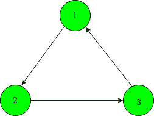
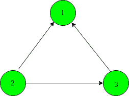
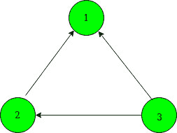
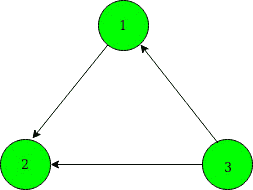
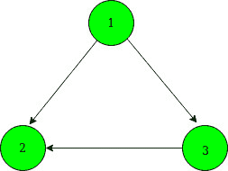
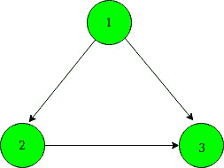
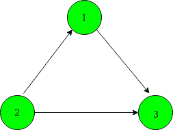

# 计算改变边方向的方法，使图形成为无环的

> 原文:[https://www . geesforgeks . org/count-way-to-to-change-direction-of-edges-this-graph-on-noncycle/](https://www.geeksforgeeks.org/count-ways-to-change-direction-of-edges-such-that-graph-becomes-acyclic/)

给定一个由 **N 个**顶点和一个[数组](https://www.geeksforgeeks.org/introduction-to-arrays/)**arr【】**组成的有向无权重图，其中**和**顶点有一条到**arr【I】**的有向边。任务是找到改变边的方向的方法，使得给定的图是非循环的。

**示例:**

> **输入:** N = 3，arr[] = {2，3，1}
> 给定信息形成的有向图为:
> 
> 
> 
> **输出:** 6
> **说明:**
> 有 6 种可能的方法可以改变边的方向，使图无环:
> 
> 
> 
> 
> 
> 
> 
> 
> 
> 
> 
> 

**方式:**思路是检查[连接组件](https://www.geeksforgeeks.org/program-to-count-number-of-connected-components-in-an-undirected-graph/)是否形成循环。

*   如果组件是一条路径，那么无论我们如何定向边，我们都不会形成一个循环。
*   如果组件有一个有 N 条边的循环，那么有 **2 <sup>N</sup> 种方式来排列所有的边，其中只有 2 种方式会形成一个循环。所以有**(2<sup>N</sup>–2)**种方法可以改变边，让图变得无环。**

**步骤**:

1.  使用[深度优先搜索(DFS)](https://www.geeksforgeeks.org/depth-first-search-or-dfs-for-a-graph/) 遍历找到给定图中的循环以及与每个循环相关联的顶点数。
2.  [DFS 遍历](https://www.geeksforgeeks.org/depth-first-search-or-dfs-for-a-graph/)后，改变边方向的方式总数是以下的乘积:
    *   **X** 顶点的每个循环形成的路数由**(2<sup>X</sup>–2)**给出。
    *   **Y** 顶点的每条路径形成的路数由 **(2 <sup>Y</sup> )** 给出。

下面是上述方法的实现:

## C++

```
// C++ program to count the
// number of ways to change
// the direction of edges
// such that no cycle is
// present in the graph
#include <bits/stdc++.h>
using namespace std;

// Vector cycles[] to store
// the cycle with vertices
// associated with each cycle
vector<int> cycles;

// Count of cycle
int cyclecnt;

// Function to count the
// number of vertices in the
// current cycle
void DFSUtil(int u, int arr[], int vis[])
{
    cycles[cyclecnt]++;
    vis[u] = 3;

    // Returns when the same
    // initial vertex is found
    if (vis[arr[u]] == 3) {
        return;
    }

    // Recurr for next vertex
    DFSUtil(arr[u], arr, vis);
}

// DFS traversal to detect
// the cycle in graph
void DFS(int u, int arr[], int vis[])
{
    // Marke vis[u] to 2 to
    // check for any cycle form
    vis[u] = 2;

    // If the vertex arr[u]
    // is not visited
    if (vis[arr[u]] == 0) {
        // Call DFS
        DFS(arr[u], arr, vis);
    }

    // If current node is
    // processed
    else if (vis[arr[u]] == 1) {
        vis[u] = 1;
        return;
    }

    // Cycle found, call DFSUtil
    // to count the number of
    // vertices in the current
    // cycle
    else {
        cycles.push_back(0);

        // Count number of
        // vertices in cycle
        DFSUtil(u, arr, vis);
        cyclecnt++;
    }

    // Current Node is processed
    vis[u] = 1;
}

// Function to count the
// number of ways
int countWays(int arr[], int N)
{

    int i, ans = 1;

    // To precompute the power
    // of 2
    int dp[N + 1];
    dp[0] = 1;

    // Storing power of 2
    for (int i = 1; i <= N; i++) {
        dp[i] = (dp[i - 1] * 2);
    }

    // Array vis[] created for
    // DFS traversal
    int vis[N + 1] = { 0 };

    // DFS traversal from Node 1
    for (int i = 1; i <= N; i++) {
        if (vis[i] == 0) {

            // Calling DFS
            DFS(i, arr, vis);
        }
    }

    int cnt = N;

    // Traverse the cycles array
    for (i = 0; i < cycles.size(); i++) {

        // Remove the vertices
        // which are part of a
        // cycle
        cnt -= cycles[i];

        // Count form by number
        // vertices form cycle
        ans *= dp[cycles[i]] - 2;
    }

    // Count form by number of
    // vertices not forming
    // cycle
    ans = (ans * dp[cnt]);

    return ans;
}

// Driver's Code
int main()
{
    int N = 3;
    int arr[] = { 0, 2, 3, 1 };

    // Function to count ways
    cout << countWays(arr, N);
    return 0;
}
```

## Java 语言(一种计算机语言，尤用于创建网站)

```
// Java program to count the number
// of ways to change the direction
// of edges such that no cycle is
// present in the graph
import java.util.*;
import java.lang.*;
import java.io.*;

class GFG{

// Vector cycles[] to store
// the cycle with vertices
// associated with each cycle
static ArrayList<Integer> cycles;

// Count of cycle
static int cyclecnt;

// Function to count the
// number of vertices in the
// current cycle
static void DFSUtil(int u, int arr[],
                           int vis[])
{
    cycles.set(cyclecnt,
    cycles.get(cyclecnt) + 1);
    vis[u] = 3;

    // Returns when the same
    // initial vertex is found
    if (vis[arr[u]] == 3)
    {
        return;
    }

    // Recurr for next vertex
    DFSUtil(arr[u], arr, vis);
}

// DFS traversal to detect
// the cycle in graph
static void DFS(int u, int arr[], int vis[])
{

    // Marke vis[u] to 2 to
    // check for any cycle form
    vis[u] = 2;

    // If the vertex arr[u]
    // is not visited
    if (vis[arr[u]] == 0)
    {

        // Call DFS
        DFS(arr[u], arr, vis);
    }

    // If current node is
    // processed
    else if (vis[arr[u]] == 1)
    {
        vis[u] = 1;
        return;
    }

    // Cycle found, call DFSUtil
    // to count the number of
    // vertices in the current
    // cycle
    else
    {
        cycles.add(0);

        // Count number of
        // vertices in cycle
        DFSUtil(u, arr, vis);
        cyclecnt++;
    }

    // Current Node is processed
    vis[u] = 1;
}

// Function to count the
// number of ways
static int countWays(int arr[], int N)
{
    int i, ans = 1;

    // To precompute the power
    // of 2
    int[] dp = new int[N + 1];
    dp[0] = 1;

    // Storing power of 2
    for(i = 1; i <= N; i++)
    {
        dp[i] = (dp[i - 1] * 2);
    }

    // Array vis[] created for
    // DFS traversal
    int[] vis = new int[N + 1];

    // DFS traversal from Node 1
    for(i = 1; i <= N; i++)
    {
        if (vis[i] == 0)
        {

            // Calling DFS
            DFS(i, arr, vis);
        }
    }

    int cnt = N;

    // Traverse the cycles array
    for(i = 0; i < cycles.size(); i++)
    {

        // Remove the vertices
        // which are part of a
        // cycle
        cnt -= cycles.get(i);

        // Count form by number
        // vertices form cycle
        ans *= dp[cycles.get(i)] - 2;
    }

    // Count form by number of
    // vertices not forming
    // cycle
    ans = (ans * dp[cnt]);

    return ans;
}

// Driver code
public static void main(String[] args)
{
    int N = 3;
    int arr[] = { 0, 2, 3, 1 };

    cycles = new ArrayList<>();

    // Function to count ways
    System.out.println(countWays(arr, N));
}
}

// This code is contributed by offbeat
```

## 蟒蛇 3

```
# Python3 program to count the
# number of ways to change
# the direction of edges
# such that no cycle is
# present in the graph

# List cycles[] to store
# the cycle with vertices
# associated with each cycle
cycles = []

# Function to count the
# number of vertices in the
# current cycle
def DFSUtil(u, arr, vis, cyclecnt):

    cycles[cyclecnt] += 1
    vis[u] = 3

    # Returns when the same
    # initial vertex is found
    if (vis[arr[u]] == 3) :
        return

    # Recurr for next vertex
    DFSUtil(arr[u], arr, vis, cyclecnt)

# DFS traversal to detect
# the cycle in graph
def DFS( u, arr, vis, cyclecnt):

    # Marke vis[u] to 2 to
    # check for any cycle form
    vis[u] = 2

    # If the vertex arr[u]
    # is not visited
    if (vis[arr[u]] == 0) :

        # Call DFS
        DFS(arr[u], arr, vis, cyclecnt)

    # If current node is
    # processed
    elif (vis[arr[u]] == 1):
        vis[u] = 1
        return

    # Cycle found, call DFSUtil
    # to count the number of
    # vertices in the current
    # cycle
    else :
        cycles.append(0)

        # Count number of
        # vertices in cycle
        DFSUtil(u, arr, vis,cyclecnt)
        cyclecnt += 1

    # Current Node is processed
    vis[u] = 1

# Function to count the
# number of ways
def countWays(arr, N,cyclecnt):

    ans = 1

    # To precompute the power
    # of 2
    dp = [0]*(N + 1)
    dp[0] = 1

    # Storing power of 2
    for i in range(1, N + 1):
        dp[i] = (dp[i - 1] * 2)

    # Array vis[] created for
    # DFS traversal
    vis = [0]*(N + 1)

    # DFS traversal from Node 1
    for i in range(1, N + 1) :
        if (vis[i] == 0) :

            # Calling DFS
            DFS(i, arr, vis, cyclecnt)

    cnt = N

    # Traverse the cycles array
    for i in range(len(cycles)) :

        # Remove the vertices
        # which are part of a
        # cycle
        cnt -= cycles[i]

        # Count form by number
        # vertices form cycle
        ans *= dp[cycles[i]] - 2

    # Count form by number of
    # vertices not forming
    # cycle
    ans = (ans * dp[cnt])

    return ans

# Driver's Code
if __name__ == "__main__":

    N = 3
    cyclecnt = 0
    arr = [ 0, 2, 3, 1 ]

    # Function to count ways
    print(countWays(arr, N,cyclecnt))

# This code is contributed by chitranayal
```

## C#

```
// C# program to count the number
// of ways to change the direction
// of edges such that no cycle is
// present in the graph
using System;
using System.Collections;
using System.Collections.Generic;

class GFG{

// Vector cycles[] to store
// the cycle with vertices
// associated with each cycle
static ArrayList cycles;

// Count of cycle
static int cyclecnt;

// Function to count the
// number of vertices in the
// current cycle
static void DFSUtil(int u, int []arr,
                           int []vis)
{
    cycles[cyclecnt] = (int)cycles[cyclecnt] + 1;
    vis[u] = 3;

    // Returns when the same
    // initial vertex is found
    if (vis[arr[u]] == 3)
    {
        return;
    }

    // Recurr for next vertex
    DFSUtil(arr[u], arr, vis);
}

// DFS traversal to detect
// the cycle in graph
static void DFS(int u, int []arr, int []vis)
{

    // Marke vis[u] to 2 to
    // check for any cycle form
    vis[u] = 2;

    // If the vertex arr[u]
    // is not visited
    if (vis[arr[u]] == 0)
    {

        // Call DFS
        DFS(arr[u], arr, vis);
    }

    // If current node is
    // processed
    else if (vis[arr[u]] == 1)
    {
        vis[u] = 1;
        return;
    }

    // Cycle found, call DFSUtil
    // to count the number of
    // vertices in the current
    // cycle
    else
    {
        cycles.Add(0);

        // Count number of
        // vertices in cycle
        DFSUtil(u, arr, vis);
        cyclecnt++;
    }

    // Current Node is processed
    vis[u] = 1;
}

// Function to count the
// number of ways
static int countWays(int []arr, int N)
{
    int i, ans = 1;

    // To precompute the power
    // of 2
    int[] dp = new int[N + 1];
    dp[0] = 1;

    // Storing power of 2
    for(i = 1; i <= N; i++)
    {
        dp[i] = (dp[i - 1] * 2);
    }

    // Array vis[] created for
    // DFS traversal
    int[] vis = new int[N + 1];

    // DFS traversal from Node 1
    for(i = 1; i <= N; i++)
    {
        if (vis[i] == 0)
        {

            // Calling DFS
            DFS(i, arr, vis);
        }
    }

    int cnt = N;

    // Traverse the cycles array
    for(i = 0; i < cycles.Count; i++)
    {

        // Remove the vertices
        // which are part of a
        // cycle
        cnt -= (int)cycles[i];

        // Count form by number
        // vertices form cycle
        ans *= dp[(int)cycles[i]] - 2;
    }

    // Count form by number of
    // vertices not forming
    // cycle
    ans = (ans * dp[cnt]);

    return ans;
}

// Driver code
public static void Main(string[] args)
{
    int N = 3;
    int []arr = new int[]{ 0, 2, 3, 1 };

    cycles = new ArrayList();

    // Function to count ways
    Console.Write(countWays(arr, N));
}
}

// This code is contributed by rutvik_56
```

## java 描述语言

```
<script>

// JavaScript program to count the number
// of ways to change the direction
// of edges such that no cycle is
// present in the graph

// Vector cycles[] to store
// the cycle with vertices
// associated with each cycle
let cycles;
// Count of cycle
let cyclecnt=0;

// Function to count the
// number of vertices in the
// current cycle
function DFSUtil(u,arr,vis)
{
    cycles[cyclecnt]++;
    vis[u] = 3;

    // Returns when the same
    // initial vertex is found
    if (vis[arr[u]] == 3)
    {
        return;
    }

    // Recurr for next vertex
    DFSUtil(arr[u], arr, vis);
}

// DFS traversal to detect
// the cycle in graph
function DFS(u,arr,vis)
{
    // Marke vis[u] to 2 to
    // check for any cycle form
    vis[u] = 2;

    // If the vertex arr[u]
    // is not visited
    if (vis[arr[u]] == 0)
    {

        // Call DFS
        DFS(arr[u], arr, vis);
    }

    // If current node is
    // processed
    else if (vis[arr[u]] == 1)
    {
        vis[u] = 1;
        return;
    }

    // Cycle found, call DFSUtil
    // to count the number of
    // vertices in the current
    // cycle
    else
    {
        cycles.push(0);

        // Count number of
        // vertices in cycle
        DFSUtil(u, arr, vis);
        cyclecnt++;
    }

    // Current Node is processed
    vis[u] = 1;
}

// Function to count the
// number of ways
function countWays(arr,N)
{
    let i, ans = 1;

    // To precompute the power
    // of 2
    let dp = new Array(N + 1);
    for(let i=0;i<dp.length;i++)
    {
        dp[i]=0;
    }
    dp[0] = 1;

    // Storing power of 2
    for(i = 1; i <= N; i++)
    {
        dp[i] = (dp[i - 1] * 2);
    }

    // Array vis[] created for
    // DFS traversal
    let vis = new Array(N + 1);
       for(let i=0;i<vis.length;i++)
    {
        vis[i]=0;
    }
    // DFS traversal from Node 1
    for(i = 1; i <= N; i++)
    {
        if (vis[i] == 0)
        {

            // Calling DFS
            DFS(i, arr, vis);
        }
    }

    let cnt = N;

    // Traverse the cycles array
    for(i = 0; i < cycles.length; i++)
    {

        // Remove the vertices
        // which are part of a
        // cycle
        cnt -= cycles[i];

        // Count form by number
        // vertices form cycle
        ans *= dp[cycles[i]] - 2;
    }

    // Count form by number of
    // vertices not forming
    // cycle
    ans = (ans * dp[cnt]);

    return ans;
}

// Driver code
let N = 3;
let arr=[0, 2, 3, 1];
cycles =[];
// Function to count ways
document.write(countWays(arr, N));

// This code is contributed by avanitrachhadiya2155

</script>
```

**Output:** 

```
6
```

**时间复杂度:** O(V + E)