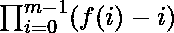

# 计算精确分配一枚硬币给每个工人的方式

> 原文:[https://www . geeksforgeeks . org/count-向每个员工分发一枚硬币的方法/](https://www.geeksforgeeks.org/count-ways-to-distribute-exactly-one-coin-to-each-worker/)

给定两个数组**硬币[]** 和**薪水[]** ，其中**硬币【I】**代表 **i <sup>th</sup>** 硬币的价值，**薪水【j】**代表 **j <sup>th</sup>** 工人将接受的硬币的最低价值。任务是计算给每个工人精确分配一枚硬币的方法数量。由于答案可以很大，所以以 **10 <sup>9</sup> + 7** 为模打印。
T21【例:

> **输入:**硬币[] = {1，2，3}，工资[] = {1，2}
> **输出:** 4
> **说明:**
> 如果没有使用价值 1 的硬币，那么剩下的两个硬币是双方工人都可以接受的，贡献两种可能的方式支付给工人。
> 如果使用价值 1 的硬币，那么它只能用于第一个工人。然后剩下的硬币中的任何一个都可以用来支付第二个工人。这也有助于两种可能的方式。
> 因此，支付给两个工人的四种方式是[2，3]，[3，2]，[1，2]，[1，3]。
> **输入:**硬币[] = {1，2}，薪水[] = {2}
> **输出:** 1

**方法:**思路是用[排序](https://www.geeksforgeeks.org/sorting-algorithms/)和[两个指针](https://www.geeksforgeeks.org/two-pointers-technique/)的手法来解决问题。按照以下步骤解决问题:

*   [按降序排列**工资**。](https://www.geeksforgeeks.org/sorting-algorithms/)
*   假设 **f(i)** 是在没有其他工人的情况下支付给**I<sup>th</sup>T5【工人】的硬币数量。由于**工资[]** 数组是排序的，所以第一个工人要求最高工资，最后一个工人要求最低工资。因此，结果是:**

> 

*   对于函数 **f(i)** ， **i** 等于假设所有以前的工人都已被支付，可用于支付当前工人的硬币数量。
*   由于工人是按工资的非递增顺序排列的，所以任何用于支付给前工人的硬币都保证可以用来支付给现在的工人。因此，可用于支付给当前工人的硬币数量将始终等于**f(I)I**，与之前的选择无关。
*   为了高效地计算 **f(i)** ，使用两个指针来跟踪当前有效的硬币数量。
*   完成上述所有步骤后，打印总路数。

下面是上述方法的实现:

## C++

```
// C++ program for the above approach

#include <bits/stdc++.h>
using namespace std;

const int MOD = 1000000007;

// Function to find number of way to
// distribute coins giving exactly one
// coin to each person
int solve(vector<int>& values,
          vector<int>& salary)
{
    long long ret = 1;
    int amt = 0;

    // Sort the given arrays
    sort(values.begin(), values.end());
    sort(salary.begin(), salary.end());

    // Start from bigger salary
    while (salary.size()) {
        while (values.size()
               && values.back()
                      >= salary.back()) {

            // Increment the amount
            amt++;
            values.pop_back();
        }
        if (amt == 0)
            return 0;

        // Reduce amount of valid
        // coins by one each time
        ret *= amt--;
        ret %= MOD;
        salary.pop_back();
    }

    // Return the result
    return ret;
}

// Driver code
int main()
{
    // Given two arrays
    vector<int> values{ 1, 2 }, salary{ 2 };

    // Function Call
    cout << solve(values, salary);

    return 0;
}
```

## Java 语言(一种计算机语言，尤用于创建网站)

```
// Java program for
// the above approach
import java.util.*;
class GFG{

static int MOD = 1000000007;

// Function to find number of way to
// distribute coins giving exactly one
// coin to each person
static int solve(Vector<Integer> values,
                 Vector<Integer> salary)
{
  int ret = 1;
  int amt = 0;

  // Sort the given arrays
  Collections.sort(values);
  Collections.sort(salary);

  // Start from bigger salary
  while (salary.size() > 0)
  {
    while (values.size() > 0 &&
           values.get(values.size() - 1) >=
           salary.get(salary.size() - 1))
    {
      // Increment the amount
      amt++;
      values.remove(values.size() - 1);
    }

    if (amt == 0)
      return 0;

    // Reduce amount of valid
    // coins by one each time
    ret *= amt--;
    ret %= MOD;
    salary.remove(salary.size() - 1);
  }

  // Return the result
  return ret;
}

// Driver code
public static void main(String[] args)
{
  // Given two arrays
  Vector<Integer> values = new Vector<Integer>();
  values.add(1);
  values.add(2);
  Vector<Integer> salary = new Vector<Integer>();
  salary.add(2);

  // Function Call
  System.out.print(solve(values, salary));
}
}

// This code is contributed by Princi Singh
```

## 蟒蛇 3

```
# Python3 program for the above approach
MOD = 1000000007

# Function to find number of way to
# distribute coins giving exactly one
# coin to each person
def solve(values, salary):

    ret = 1
    amt = 0

    # Sort the given arrays
    values = sorted(values)
    salary = sorted(salary)

    # Start from bigger salary
    while (len(salary) > 0):
        while ((len(values) and
                values[-1] >= salary[-1])):

            # Increment the amount
            amt += 1
            del values[-1]

        if (amt == 0):
            return 0

        # Reduce amount of valid
        # coins by one each time
        ret *= amt
        amt -= 1
        ret %= MOD
        del salary[-1]

    # Return the result
    return ret

# Driver code
if __name__ == '__main__':

    # Given two arrays
    values = [ 1, 2 ]
    salary = [2]

    # Function call
    print(solve(values, salary))

# This code is contributed by mohit kumar 29
```

## C#

```
// C# program for
// the above approach
using System;
using System.Collections;
class GFG{

static int MOD = 1000000007;

// Function to find number of way to
// distribute coins giving exactly one
// coin to each person
static int solve(ArrayList values,
                 ArrayList salary)
{
  int ret = 1;
  int amt = 0;

  // Sort the given arrays
  values.Sort();
  salary.Sort();

  // Start from bigger salary
  while (salary.Count > 0)
  {
    while (values.Count > 0 &&
           (int)values[values.Count - 1] >=
           (int)salary[salary.Count - 1])
    {
      // Increment the amount
      amt++;
      values.RemoveAt(values.Count - 1);
    }

    if (amt == 0)
      return 0;

    // Reduce amount of valid
    // coins by one each time
    ret *= amt--;
    ret %= MOD;
    salary.RemoveAt(salary.Count - 1);
  }

  // Return the result
  return ret;
}

// Driver code
public static void Main(string[] args)
{
  // Given two arrays
  ArrayList values = new ArrayList();
  values.Add(1);
  values.Add(2);
  ArrayList salary = new ArrayList();
  salary.Add(2);

  // Function Call
  Console.Write(solve(values, salary));
}
}

// This code is contributed by Rutvik_56
```

## java 描述语言

```
<script>

// Javascript program for the above approach
var MOD = 1000000007;

// Function to find number of way to
// distribute coins giving exactly one
// coin to each person
function solve(values, salary)
{
    var ret = 1;
    var amt = 0;

    // Sort the given arrays
    values.sort((a,b)=>a-b);
    salary.sort((a,b)=>a-b);

    // Start from bigger salary
    while (salary.length) {
        while (values.length
               && values[values.length-1]
                      >= salary[salary.length-1]) {

            // Increment the amount
            amt++;
            values.pop();
        }
        if (amt == 0)
            return 0;

        // Reduce amount of valid
        // coins by one each time
        ret *= amt--;
        ret %= MOD;
        salary.pop();
    }

    // Return the result
    return ret;
}

// Driver code
// Given two arrays
var values = [1, 2 ], salary = [2];

// Function Call
document.write( solve(values, salary));

// This code is contributed by itsok.
</script>
```

**Output:** 

```
1
```

***时间复杂度:** O(N*log N)*
***辅助空间:** O(1)*