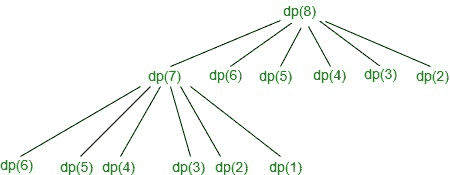

# 计算通过重复掷骰子获得给定和的方法

> 原文:[https://www . geeksforgeeks . org/count-通过重复掷骰子获得给定总和的方法/](https://www.geeksforgeeks.org/count-ways-to-obtain-given-sum-by-repeated-throws-of-a-dice/)

给定一个整数 **N** ，任务是通过反复掷骰子找到求和 **N** 的方法数。

**示例:**

> **输入:** N = 3
> **输出:** 4
> **解释:**
> 获取 N 的四种可能方式是:
> 
> *   1 + 1 + 1
> *   1 + 2
> *   2 + 1
> *   three
> 
> **输入:** N = 2
> **输出:** 2
> **解释:**
> 获取 N 的两种可能方式是:
> 
> *   1 + 1
> *   Two

[**递归**](https://www.geeksforgeeks.org/recursion/) **方法:**思想是对骰子的每个可能值进行迭代，得到所需的和 **N** 。以下是步骤:

1.  让**find way()**成为 sum **N** 的必选项。
2.  掷骰子得到的唯一数字是**【1，6】**，每一个数字在一次掷骰子中的概率相等。
3.  因此，对于每个状态，重复前面的**(N–I)**状态(其中 1 ≤ i ≤ 6)。因此，递归关系如下:

> 查找路径(N) =查找路径(N–1)+查找路径(N–2)+查找路径(N–3)+查找路径(N–4)+查找路径(N–5)+查找路径(N–6)

下面是上述方法的实现:

## C++

```
// C++ program for the above approach

#include <bits/stdc++.h>
using namespace std;

// Function to find the number of ways
// to get the sum N with throw of dice
int findWays(int N)
{
    // Base Case
    if (N == 0) {
        return 1;
    }

    // Stores the count of total
    // number of ways to get sum N
    int cnt = 0;

    // Recur for all 6 states
    for (int i = 1; i <= 6; i++) {

        if (N - i >= 0) {

            cnt = cnt
                  + findWays(N - i);
        }
    }

    // Return answer
    return cnt;
}

// Driver Code
int main()
{
    int N = 4;

    // Function call
    cout << findWays(N);

    return 0;
}
```

## Java 语言(一种计算机语言，尤用于创建网站)

```
// Java program for the above approach
import java.util.*;

class GFG{

// Function to find the number of ways
// to get the sum N with throw of dice
static int findWays(int N)
{

    // Base Case
    if (N == 0)
    {
        return 1;
    }

    // Stores the count of total
    // number of ways to get sum N
    int cnt = 0;

    // Recur for all 6 states
    for(int i = 1; i <= 6; i++)
    {
        if (N - i >= 0)
        {
            cnt = cnt +
                  findWays(N - i);
        }
    }

    // Return answer
    return cnt;
}

// Driver Code
public static void main(String[] args)
{
    int N = 4;

    // Function call
    System.out.print(findWays(N));
}
}

// This code is contributed by 29AjayKumar
```

## 蟒蛇 3

```
# Python3 program for the above approach

# Function to find the number of ways
# to get the sum N with throw of dice
def findWays(N):

    # Base case
    if (N == 0):
        return 1

    # Stores the count of total
    # number of ways to get sum N
    cnt = 0

    # Recur for all 6 states
    for i in range(1, 7):
        if (N - i >= 0):
            cnt = cnt + findWays(N - i)

    # Return answer
    return cnt

# Driver Code
if __name__ == '__main__':

    N = 4

    # Function call
    print(findWays(N))

# This code is contributed by mohit kumar 29
```

## C#

```
// C# program for
// the above approach
using System;
class GFG{

// Function to find the number of ways
// to get the sum N with throw of dice
static int findWays(int N)
{
  // Base Case
  if (N == 0)
  {
    return 1;
  }

  // Stores the count of total
  // number of ways to get sum N
  int cnt = 0;

  // Recur for all 6 states
  for(int i = 1; i <= 6; i++)
  {
    if (N - i >= 0)
    {
      cnt = cnt + findWays(N - i);
    }
  }

  // Return answer
  return cnt;
}

// Driver Code
public static void Main()
{
  int N = 4;

  // Function call
  Console.Write(findWays(N));
}
}

// This code is contributed by sanjoy_62
```

## java 描述语言

```
<script>

// JavaScript program for the above approach

// Function to find the number of ways
// to get the sum N with throw of dice
function findWays(N)
{
    // Base Case
    if (N == 0) {
        return 1;
    }

    // Stores the count of total
    // number of ways to get sum N
    var cnt = 0;

    // Recur for all 6 states
    for (var i = 1; i <= 6; i++) {

        if (N - i >= 0) {

            cnt = cnt
                  + findWays(N - i);
        }
    }

    // Return answer
    return cnt;
}

// Driver Code
var N = 4;

// Function call
document.write( findWays(N));

</script>
```

**Output:** 

```
8
```

***时间复杂度:**O(6<sup>N</sup>)*
***辅助空间:** O(1)*

[**动态规划方法:**](https://www.geeksforgeeks.org/dynamic-programming/) 上述递归方法需要通过处理以下[重叠子问题](https://www.geeksforgeeks.org/overlapping-subproblems-property-in-dynamic-programming-dp-1/)进行优化:

> **重叠子问题:**T2**N = 8**的部分递归树:
> 
> [](https://media.geeksforgeeks.org/wp-content/uploads/20200827114521/dp.jpg)

[**最优子结构:**](https://www.geeksforgeeks.org/optimal-substructure-property-in-dynamic-programming-dp-2/) 对于每个状态，6 个状态都发生递归，因此 **dp(N)** 的递归定义如下:

> DP[n]= DP[n-1]+DP[n-2]+DP[n-3]+DP[n-4]+DP[n-5]+DP[n-6]

按照以下步骤解决问题:

*   用初始值 **-1** 初始化一个大小为 **N + 1** 的辅助数组 **dp[]** ，其中 **dp[i]** 存储有和 **i** 的路数。
*   解决这个问题的基本情况是如果 **N 在任何状态下都等于 0** ，那么这样一个状态的结果就是 **1** 。
*   如果对于任何状态 **dp[i]** 不等于 **-1** ，则该子结构的该值已经被计算。

**自上而下的方法:**下面是 ***自上而下的**方法*的实现:

## C++

```
// C++ Program for the above approach

#include <bits/stdc++.h>
using namespace std;

// Function to calculate the total
// number of ways to have sum N
int findWays(int N, int dp[])
{
    // Base Case
    if (N == 0) {
        return 1;
    }

    // Return already stored result
    if (dp[N] != -1) {

        return dp[N];
    }

    int cnt = 0;

    // Recur for all 6 states
    for (int i = 1; i <= 6; i++) {

        if (N - i >= 0) {
            cnt = cnt
                  + findWays(N - i, dp);
        }
    }

    // Return the result
    return dp[N] = cnt;
}

// Driver Code
int main()
{
    // Given sum N
    int N = 4;

    // Initialize the dp array
    int dp[N + 1];

    memset(dp, -1, sizeof(dp));

    // Function Call
    cout << findWays(N, dp);

    return 0;
}
```

## Java 语言(一种计算机语言，尤用于创建网站)

```
// Java Program for
// the above approach
import java.util.*;
class GFG{

// Function to calculate the total
// number of ways to have sum N
static int findWays(int N, int dp[])
{
    // Base Case
    if (N == 0)
    {
        return 1;
    }

    // Return already
    // stored result
    if (dp[N] != -1)
    {
        return dp[N];
    }

    int cnt = 0;

    // Recur for all 6 states
    for (int i = 1; i <= 6; i++)
    {
        if (N - i >= 0)
        {
            cnt = cnt +
                  findWays(N - i, dp);
        }
    }

    // Return the result
    return dp[N] = cnt;
}

// Driver Code
public static void main(String[] args)
{
    // Given sum N
    int N = 4;

    // Initialize the dp array
    int []dp = new int[N + 1];

    for (int i = 0; i < dp.length; i++)
        dp[i] = -1;

    // Function Call
    System.out.print(findWays(N, dp));
}
}

// This code is contributed by 29AjayKumar
```

## 蟒蛇 3

```
# Python3 Program for the
# above approach

# Function to calculate
# the total number of ways
# to have sum N
def findWays(N, dp):

    # Base Case
    if (N == 0):
        return 1

    # Return already
    # stored result
    if (dp[N] != -1):
        return dp[N]

    cnt = 0

    # Recur for all 6 states
    for i in range (1, 7):
        if (N - i >= 0):
            cnt = (cnt +
                   findWays(N - i, dp))

    # Return the result
    dp[N] = cnt
    return dp[N]

# Driver Code
if __name__ == "__main__":

    # Given sum N
    N = 4

    # Initialize the dp array
    dp = [-1] * (N + 1)

    # Function Call
    print(findWays(N, dp))

# This code is contributed by Chitranayal
```

## C#

```
// C# Program for
// the above approach
using System;
class GFG{

// Function to calculate the total
// number of ways to have sum N
static int findWays(int N, int []dp)
{
  // Base Case
  if (N == 0)
  {
    return 1;
  }

  // Return already stored result
  if (dp[N] != -1)
  {
    return dp[N];
  }

  int cnt = 0;

  // Recur for all 6 states
  for (int i = 1; i <= 6; i++)
  {
    if (N - i >= 0)
    {
      cnt = cnt + findWays(N - i, dp);
    }
  }

  // Return the result
  return dp[N] = cnt;
}

// Driver Code
public static void Main(String[] args)
{
  // Given sum N
  int N = 4;

  // Initialize the dp array
  int []dp = new int[N + 1];

  for (int i = 0; i < dp.Length; i++)
    dp[i] = -1;

  // Function Call
  Console.Write(findWays(N, dp));
}
}

// This code is contributed by Rajput-Ji
```

## java 描述语言

```
<script>
// Javascript Program for
// the above approach

// Function to calculate the total
// number of ways to have sum N
function findWays(N,dp)
{
    // Base Case
    if (N == 0)
    {
        return 1;
    }

    // Return already
    // stored result
    if (dp[N] != -1)
    {
        return dp[N];
    }

    let cnt = 0;

    // Recur for all 6 states
    for (let i = 1; i <= 6; i++)
    {
        if (N - i >= 0)
        {
            cnt = cnt +
                  findWays(N - i, dp);
        }
    }

    // Return the result
    return dp[N] = cnt;
}

// Driver Code
let N = 4;

// Initialize the dp array
let dp = new Array(N + 1);

for (let i = 0; i < dp.length; i++)
    dp[i] = -1;

// Function Call
document.write(findWays(N, dp));

// This code is contributed by unknown2108
</script>
```

**Output:** 

```
8
```

***时间复杂度:**O(N)*
T5**辅助空间:** O(N)

**自下而上的方法:**下面是 ***自下而上的*** [动态规划](https://www.geeksforgeeks.org/dynamic-programming/)方法的实现:

## C++

```
// C++ Program for the above approach

#include <bits/stdc++.h>
using namespace std;

// Function to calculate the total
// number of ways to have sum N
void findWays(int N)
{
    // Initialize dp array
    int dp[N + 1];

    dp[0] = 1;

    // Iterate over all the possible
    // intermediate values to reach N
    for (int i = 1; i <= N; i++) {

        dp[i] = 0;

        // Calculate the sum for
        // all 6 faces
        for (int j = 1; j <= 6; j++) {

            if (i - j >= 0) {
                dp[i] = dp[i] + dp[i - j];
            }
        }
    }

    // Print the total number of ways
    cout << dp[N];
}

// Driver Code
int main()
{
    // Given sum N
    int N = 4;

    // Function call
    findWays(N);

    return 0;
}
```

## Java 语言(一种计算机语言，尤用于创建网站)

```
// Java program for the above approach
import java.util.*;

class GFG{

// Function to calculate the total
// number of ways to have sum N
static void findWays(int N)
{

    // Initialize dp array
    int []dp = new int[N + 1];

    dp[0] = 1;

    // Iterate over all the possible
    // intermediate values to reach N
    for(int i = 1; i <= N; i++)
    {
        dp[i] = 0;

        // Calculate the sum for
        // all 6 faces
        for(int j = 1; j <= 6; j++)
        {
            if (i - j >= 0)
            {
                dp[i] = dp[i] + dp[i - j];
            }
        }
    }

    // Print the total number of ways
    System.out.print(dp[N]);
}

// Driver Code
public static void main(String[] args)
{

    // Given sum N
    int N = 4;

    // Function call
    findWays(N);
}
}

// This code is contributed by Amit Katiyar
```

## 蟒蛇 3

```
# Python3 program for
# the above approach

# Function to calculate the total
# number of ways to have sum N
def findWays(N):

    # Initialize dp array
    dp = [0] * (N + 1);
    dp[0] = 1;

    # Iterate over all the
    # possible intermediate
    # values to reach N
    for i in range(1, N + 1):
        dp[i] = 0;

        # Calculate the sum for
        # all 6 faces
        for j in range(1, 7):
            if (i - j >= 0):
                dp[i] = dp[i] + dp[i - j];

    # Print total number of ways
    print(dp[N]);

# Driver Code
if __name__ == '__main__':

    # Given sum N
    N = 4;

    # Function call
    findWays(N);

# This code is contributed by 29AjayKumar
```

## C#

```
// C# program for
// the above approach
using System;
class GFG{

// Function to calculate the total
// number of ways to have sum N
static void findWays(int N)
{
  // Initialize dp array
  int []dp = new int[N + 1];

  dp[0] = 1;

  // Iterate over all the possible
  // intermediate values to reach N
  for(int i = 1; i <= N; i++)
  {
    dp[i] = 0;

    // Calculate the sum for
    // all 6 faces
    for(int j = 1; j <= 6; j++)
    {
      if (i - j >= 0)
      {
        dp[i] = dp[i] + dp[i - j];
      }
    }
  }

  // Print the total number of ways
  Console.Write(dp[N]);
}

// Driver Code
public static void Main(String[] args)
{
  // Given sum N
  int N = 4;

  // Function call
  findWays(N);
}
}

// This code is contributed by 29AjayKumar
```

## java 描述语言

```
<script>

// JavaScript program for the above approach

// Function to calculate the total
// number of ways to have sum N
function findWays(N)
{
    // Initialize dp array
    let dp = new Array(N + 1);

    dp[0] = 1;

    // Iterate over all the possible
    // intermediate values to reach N
    for(let i = 1; i <= N; i++)
    {
        dp[i] = 0;

        // Calculate the sum for
        // all 6 faces
        for(let j = 1; j <= 6; j++)
        {
            if (i - j >= 0)
            {
                dp[i] = dp[i] + dp[i - j];
            }
        }
    }

    // Print the total number of ways
    document.write(dp[N]);
}

// Driver Code
 // Given sum N
let N = 4;

// Function call
findWays(N);

// This code is contributed by patel2127

</script>
```

**Output:** 

```
8
```

***时间复杂度:**O(N)*
T5**辅助空间:** O(N)