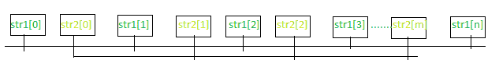
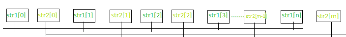
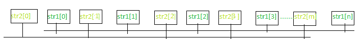

# 计算交替放置两个给定字符串的所有字符的方法

> 原文:[https://www . geesforgeks . org/count-way-to-place-两个给定字符串的所有字符-交替/](https://www.geeksforgeeks.org/count-ways-to-place-all-the-characters-of-two-given-strings-alternately/)

给定两个字符串，长度为 **N** 的 **str1** 和长度为 **M** 的 **str2** 的不同字符，任务是计算交替放置 **str1** 和 **str2** 所有字符的方式数。

**注:**| n–m |≤1

**示例:**

> **输入:**str 1 =“AE**”、**str 2 =“BD**”**
> **输出:** 8
> **解释:**
> 重新排列后可能出现的字符串有:{“abed**”、**“ebad**”、**“adeb**、**“edab”“bade**、**“bed 因此，所需的输出为 8。
> 
> **输入:**str 1 =“aegh”**、**str 2 =“rsw”
> **输出:** 144

**方法:**根据以下观察结果可以解决问题:

**如果 N！= M:** 只考虑 **N > M** 的情况，因为同样的，它也会适用于 **N < M** 的情况。

[](https://media.geeksforgeeks.org/wp-content/cdn-uploads/20200914191731/swapEqual1.png)

交替放置 **str1[]** 和 **str2[]** 的可能方法

> 重新排列 **str1** = **N 所有字符的方法总数！**
> 重新排列 **str2** = **M 所有字符的方式总数！**。
> 因此 **str1** 和 **str2** 所有字符交替放置的方式总数为= **N！* M！**

**如果 N == M:**

[](https://media.geeksforgeeks.org/wp-content/cdn-uploads/20200914202836/swapEqual2.png)

首先放置 str1[]的字符，然后放置 str2[]的字符

[](https://media.geeksforgeeks.org/wp-content/cdn-uploads/20200914202947/swapEqual3.png)

首先放置 str2[]的字符，然后放置 str1[]的字符

> 重新排列 **str1** = **N 所有字符的方法总数！**
> 重新排列 **str2** = **M 所有字符的方式总数！**
> 现在，
> 这里有两种可能的情况:
> 
> *   首先放置 **str1** 的字符，然后放置 **str2** 的字符。
> *   首先放置 **str2** 的字符，然后放置 **str1** 的字符。
> 
> 因此，途径总数= **(2 * N！* M！)**。

下面是上述方法的实现:

## C++

```
// C++ Program to implement
// the above approach

#include <bits/stdc++.h>
using namespace std;

// Function to get the
// factorial of N
int fact(int n)
{
    int res = 1;
    for (int i = 1; i <= n; i++) {
        res = res * i;
    }
    return res;
}

// Function to get the total
// number of  distinct ways
int distinctWays(string str1, string str2)
{
    // Length of str1
    int n = str1.length();

    // Length of str2
    int m = str2.length();

    // If both strings have equal length
    if (n == m) {
        return 2 * fact(n) * fact(m);
    }

    // If both strings do not have
    // equal length
    return fact(n) * fact(m);
}

// Driver code
int main()
{
    string str1 = "aegh";
    string str2 = "rsw";

    cout << distinctWays(str1, str2);
}
```

## Java 语言(一种计算机语言，尤用于创建网站)

```
// Java program to implement
// the above approach
import java.io.*;

class GFG{

// Function to get the
// factorial of N
static int fact(int n)
{
    int res = 1;
    for(int i = 1; i <= n; i++)
    {
        res = res * i;
    }
    return res;
}

// Function to get the total
// number of distinct ways
static int distinctWays(String str1,
                        String str2)
{

    // Length of str1
    int n = str1.length();

    // Length of str2
    int m = str2.length();

    // If both strings have equal length
    if (n == m)
    {
        return 2 * fact(n) * fact(m);
    }

    // If both strings do not have
    // equal length
    return fact(n) * fact(m);
}

// Driver code
public static void main (String[] args)
{
    String str1 = "aegh";
    String str2 = "rsw";

    System.out.print(distinctWays(str1, str2));
}
}

// This code is contributed by code_hunt
```

## 蟒蛇 3

```
# Python3 program to implement
# the above approach

# Function to get the
# factorial of N
def fact(n):

    res = 1
    for i in range(1, n + 1):
        res = res * i

    return res

# Function to get the total
# number of distinct ways
def distinctWays(str1, str2):

    # Length of str1
    n = len(str1)

    # Length of str2
    m = len(str2)

    # If both strings have equal length
    if (n == m):
        return 2 * fact(n) * fact(m)

    # If both strings do not have
    # equal length
    return fact(n) * fact(m)

# Driver code
str1 = "aegh"
str2 = "rsw"

print(distinctWays(str1, str2))

# This code is contributed by code_hunt
```

## C#

```
// C# program to implement
// the above approach
using System;

class GFG{

// Function to get the
// factorial of N
static int fact(int n)
{
    int res = 1;
    for(int i = 1; i <= n; i++)
    {
        res = res * i;
    }
    return res;
}

// Function to get the total
// number of distinct ways
static int distinctWays(string str1,
                        string str2)
{

    // Length of str1
    int n = str1.Length;

    // Length of str2
    int m = str2.Length;

    // If both strings have equal length
    if (n == m)
    {
        return 2 * fact(n) * fact(m);
    }

    // If both strings do not have
    // equal length
    return fact(n) * fact(m);
}

// Driver code
public static void Main ()
{
    string str1 = "aegh";
    string str2 = "rsw";

    Console.Write(distinctWays(str1, str2));
}
}

// This code is contributed by code_hunt
```

## java 描述语言

```
<script>

// JavaScript program to implement
// the above approach

    // Function to get the
    // factorial of N
    function fact(n) {
        var res = 1;
        for (i = 1; i <= n; i++) {
            res = res * i;
        }
        return res;
    }

    // Function to get the total
    // number of distinct ways
    function distinctWays( str1,  str2) {

        // Length of str1
        var n = str1.length;

        // Length of str2
        var m = str2.length;

        // If both strings have equal length
        if (n == m) {
            return 2 * fact(n) * fact(m);
        }

        // If both strings do not have
        // equal length
        return fact(n) * fact(m);
    }

    // Driver code

        var str1 = "aegh";
        var str2 = "rsw";

        document.write(distinctWays(str1, str2));

// This code is contributed by todaysgaurav

</script>
```

**Output:** 

```
144
```

***时间复杂度:** O(N + M)*
***辅助空间:** O(1)*