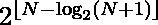

# 计数方式表示 N 为不超过 N 的不同整数的异或

> 原文:[https://www . geeksforgeeks . org/count-way-to-表示-n-as-xor-of-distinct-整数-不超过-n/](https://www.geeksforgeeks.org/count-ways-to-represent-n-as-xor-of-distinct-integers-not-exceeding-n/)

给定一个正整数 **N** ，任务是找出将 **N** 表示为小于或等于 **N** 的不同正整数的[按位异或](https://www.geeksforgeeks.org/bitwise-operators-in-c-cpp/)的方法数。

**示例:**

> **输入:** N = 5
> **输出:** 4
> **说明:**给定的数字 N(= 5)可以表示为:
> 
> 1.  5 = 5
> 2.  5 = (4 ^ 1)
> 3.  5 = (5 ^ 3 ^ 2 ^ 1)
> 4.  5 = (4 ^ 3 ^ 2)
> 
> 因此，总数为 4。
> 
> **输入:**N = 6
> T3】输出: 8

**天真法:**解决问题最简单的方法是[先找到**N**T6】自然数](https://www.geeksforgeeks.org/find-distinct-subsets-given-set/)的所有子集，然后对那些具有[按位异或](https://www.geeksforgeeks.org/bitwise-operators-in-c-cpp/)值 **N** 的子集进行计数。检查所有子集后，打印获得的总数。

***时间复杂度:**O(N * 2<sup>N</sup>)*
***辅助空间:** O(1)*

**高效方法:**上述方法可以通过观察来优化，即将 **N** 表示为不同正整数的**按位异或**的方式数由给出。

下面是上述方法的实现:

## C++

```
// C++ program for the above approach
#include<bits/stdc++.h>
using namespace std;

// Function to count number of ways
// to represent N as the Bitwise
// XOR of distinct integers
void countXorPartition(int N)
{

    // Count number of subsets using
    // above-mentioned formula
    double a = pow(2, floor(N - log(N + 1) /
                                log(2)));

    // Print the resultant count
    cout << a;
}

// Driver Code
int main()
{
    int N = 5;

    countXorPartition(N);
}

// This code is contributed by SURENDRA_GANGWAR
```

## Java 语言(一种计算机语言，尤用于创建网站)

```
// java program for the above approach
import java.io.*;

class GFG{

// Function to count number of ways
// to represent N as the Bitwise
// XOR of distinct integers
static void countXorPartition(int N)
{

    // Count number of subsets using
    // above-mentioned formula
    double a = Math.pow(2, (int)(N - Math.log(N + 1) /
                                Math.log(2)));

    // Print the resultant count
    System.out.print(a);
}

// Driver Code
public static void main(String[] args)
{
    int N = 5;  
    countXorPartition(N);
}
}

// This code is contributed by shivanisinghss2110
```

## 计算机编程语言

```
# Python program for the above approach

from math import * 

# Function to count number of ways
# to represent N as the Bitwise
# XOR of distinct integers
def countXorPartition(N):

  # Count number of subsets using
  # above-mentioned formula
  a = 2**floor(N - log(N + 1)/log(2))

  # Print the resultant count
  print(int(a))

# Driver Code

N = 5
countXorPartition(N)
```

## C#

```
// C# program for the above approach
using System;
using System.Collections.Generic;

class GFG{

// Function to count number of ways
// to represent N as the Bitwise
// XOR of distinct integers
static void countXorPartition(int N)
{

    // Count number of subsets using
    // above-mentioned formula
    double a = Math.Pow(2, (int)(N - Math.Log(N + 1) /
                                Math.Log(2)));

    // Print the resultant count
    Console.Write(a);
}

// Driver Code
public static void Main()
{
    int N = 5;  
    countXorPartition(N);
}
}

// This code is contributed by ipg2016107.
```

## java 描述语言

```
<script>

// JavaScript program for the above approach

// Function to count number of ways
// to represent N as the Bitwise
// XOR of distinct integers
function countXorPartition(N)
{

    // Count number of subsets using
    // above-mentioned formula
    let a = Math.pow(2, Math.floor(N - Math.log(N + 1) /
                                Math.log(2)));

    // Print the resultant count
    document.write(a);
}

// Driver Code
    let N = 5;

    countXorPartition(N);

</script>
```

**Output:** 

```
4
```

***时间复杂度:**O(1)*
T5**辅助空间:** O(1)