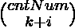

# 计算选择位于给定范围内的 K 个阵列元素的方法

> 原文:[https://www . geesforgeks . org/count-way-to-select-k-array-elements-躺在给定范围内/](https://www.geeksforgeeks.org/count-ways-to-select-k-array-elements-lying-in-a-given-range/)

给定三个正整数， **L** 、 **R** 、 **K** 以及由 **N** 个正整数组成的[数组](https://www.geeksforgeeks.org/array-data-structure/)**arr【】**，任务是计算从给定数组中选择至少 **K** 个数组元素的方法数，这些元素的值在**【L，R】**的范围内。

**示例:**

> **输入:** arr[] = {12，4，6，13，5，10}，K = 3，L = 4，R = 10
> **输出:** 5
> **解释:**
> 选择至少 K(= 3)个值在[4，10]范围内的数组元素的可能方式有:{ (arr[1]，arr[2]，arr[4])，(arr[1]，arr[2]，arr[5])，(arr[1]，arr
> 
> **输入:** arr[] = {1，2，3，4，5}，K = 4，L = 1，R = 5
> T3】输出: 6

**方法:**按照以下步骤解决问题:

*   初始化一个变量，比如说**路**，存储选择至少 **K** 个数组元素的路数，数组元素的值在**【L，R】**的范围内。
*   初始化一个变量，比如 **cntNum** 来存储给定数组中数值在给定范围内的数字的计数。
*   最后，打印所有可能值的和，使得 **(K + i)** 小于或等于 **cntNum** 。

下面是上述方法的实现:

## C++

```
// C++ program to implement
// the above approach

#include <bits/stdc++.h>
using namespace std;

// Function to calculate factorial
// of all the numbers up to N
vector<int> calculateFactorial(int N)
{
    vector<int> fact(N + 1);

    // Factorial of 0 is 1
    fact[0] = 1;

    // Calculate factorial of
    // all the numbers upto N
    for (int i = 1; i <= N; i++) {

        // Calculate factorial of i
        fact[i] = fact[i - 1] * i;
    }

    return fact;
}

// Function to find the count of ways to select
// at least K elements whose values in range [L, R]
int cntWaysSelection(int arr[], int N, int K,
                     int L, int R)
{

    // Stores count of ways to select at least
    // K elements whose values in range [L, R]
    int cntWays = 0;

    // Stores count of numbers having
    // value lies in the range [L, R]
    int cntNum = 0;

    // Traverse the array
    for (int i = 0; i < N; i++) {

        // Checks if the array elements
        // lie in the given range
        if (arr[i] >= L && arr[i] <= R) {

            // Update cntNum
            cntNum++;
        }
    }

    // Stores factorial of numbers upto N
    vector<int> fact
        = calculateFactorial(cntNum);

    // Calculate total ways to select at least
    // K elements whose values lies in [L, R]
    for (int i = K; i <= cntNum; i++) {

        // Update cntWays
        cntWays += fact[cntNum] / (fact[i]
                                   * fact[cntNum - i]);
    }

    return cntWays;
}

// Driver Code
int main()
{
    int arr[] = { 12, 4, 6, 13, 5, 10 };
    int N = sizeof(arr) / sizeof(arr[0]);
    int K = 3;
    int L = 4;
    int R = 10;

    cout << cntWaysSelection(arr, N, K, L, R);
}
```

## Java 语言(一种计算机语言，尤用于创建网站)

```
// Java program to implement
// the above approach
class GFG{

// Function to calculate factorial
// of all the numbers up to N
static int[] calculateFactorial(int N)
{
    int []fact = new int[N + 1];

    // Factorial of 0 is 1
    fact[0] = 1;

    // Calculate factorial of
    // all the numbers upto N
    for (int i = 1; i <= N; i++) {

        // Calculate factorial of i
        fact[i] = fact[i - 1] * i;
    }

    return fact;
}

// Function to find the count of ways to select
// at least K elements whose values in range [L, R]
static int cntWaysSelection(int arr[], int N, int K,
                     int L, int R)
{

    // Stores count of ways to select at least
    // K elements whose values in range [L, R]
    int cntWays = 0;

    // Stores count of numbers having
    // value lies in the range [L, R]
    int cntNum = 0;

    // Traverse the array
    for (int i = 0; i < N; i++) {

        // Checks if the array elements
        // lie in the given range
        if (arr[i] >= L && arr[i] <= R) {

            // Update cntNum
            cntNum++;
        }
    }

    // Stores factorial of numbers upto N
    int []fact
        = calculateFactorial(cntNum);

    // Calculate total ways to select at least
    // K elements whose values lies in [L, R]
    for (int i = K; i <= cntNum; i++) {

        // Update cntWays
        cntWays += fact[cntNum] / (fact[i]
                                   * fact[cntNum - i]);
    }

    return cntWays;
}

// Driver Code
public static void main(String[] args)
{
    int arr[] = { 12, 4, 6, 13, 5, 10 };
    int N = arr.length;
    int K = 3;
    int L = 4;
    int R = 10;

    System.out.print(cntWaysSelection(arr, N, K, L, R));
}
}

// This code is contributed by Amit Katiyar
```

## 蟒蛇 3

```
# Python3 program to implement the
# above approach

# Function to calculate factorial
# of all the numbers up to N
def calculateFactorial(N):

    fact = [0] * (N + 1)

    # Factorial of 0 is 1
    fact[0] = 1

    # Calculate factorial of all
    # the numbers upto N
    for i in range(1, N + 1):

        # Calculate factorial of i
        fact[i] = fact[i - 1] * i

    return fact

# Function to find count of ways to select
# at least K elements whose values in range[L,R]
def cntWaysSelection(arr, N, K, L, R):

    # Stores count of ways to select at leas
    # K elements whose values in range[L,R]
    cntWays = 0

    # Stores count of numbers having
    # Value lies in the range[L,R]
    cntNum = 0

    # Traverse the array
    for i in range(0, N):

        # Check if the array elements
        # Lie in the given range
        if (arr[i] >= L and arr[i] <= R):

            # Update cntNum
            cntNum += 1

    # Stores factorial of numbers upto N
    fact = list(calculateFactorial(cntNum))

    # Calculate total ways to select at least
    # K elements whose values Lies in [L,R]
    for i in range(K, cntNum + 1):

        # Update cntWays
        cntWays += fact[cntNum] // (fact[i] *
                                    fact[cntNum - i])

    return cntWays

# Driver code
if __name__ == "__main__":

    arr = [ 12, 4, 6, 13, 5, 10 ]
    N = len(arr)
    K = 3
    L = 4
    R = 10

    print(cntWaysSelection(arr, N, K, L, R))

# This code is contributed by Virusbuddah
```

## C#

```
// C# program to implement
// the above approach
using System;

class GFG{

// Function to calculate factorial
// of all the numbers up to N
static int[] calculateFactorial(int N)
{
    int[] fact = new int[(N + 1)];

    // Factorial of 0 is 1
    fact[0] = 1;

    // Calculate factorial of
    // all the numbers upto N
    for(int i = 1; i <= N; i++)
    {

        // Calculate factorial of i
        fact[i] = fact[i - 1] * i;
    }
    return fact;
}

// Function to find the count of ways to select
// at least K elements whose values in range [L, R]
static int cntWaysSelection(int[] arr, int N, int K,
                            int L, int R)
{

    // Stores count of ways to select at least
    // K elements whose values in range [L, R]
    int cntWays = 0;

    // Stores count of numbers having
    // value lies in the range [L, R]
    int cntNum = 0;

    // Traverse the array
    for(int i = 0; i < N; i++)
    {

        // Checks if the array elements
        // lie in the given range
        if (arr[i] >= L && arr[i] <= R)
        {

            // Update cntNum
            cntNum++;
        }
    }

    // Stores factorial of numbers upto N
    int[] fact = calculateFactorial(cntNum);

    // Calculate total ways to select at least
    // K elements whose values lies in [L, R]
    for(int i = K; i <= cntNum; i++)
    {

        // Update cntWays
        cntWays += fact[cntNum] / (fact[i] *
                   fact[cntNum - i]);
    }
    return cntWays;
}

// Driver Code
public static void Main()
{
    int[] arr = { 12, 4, 6, 13, 5, 10 };
    int N = arr.Length;
    int K = 3;
    int L = 4;
    int R = 10;

    Console.WriteLine(cntWaysSelection(
        arr, N, K, L, R));
}
}

// This code is contributed by code_hunt
```

## java 描述语言

```
<script>

// Javascript program to implement
// the above approach

// Function to calculate factorial
// of all the numbers up to N
function calculateFactorial(N)
{
    var fact = Array(N + 1);

    // Factorial of 0 is 1
    fact[0] = 1;

    // Calculate factorial of
    // all the numbers upto N
    for (var i = 1; i <= N; i++) {

        // Calculate factorial of i
        fact[i] = fact[i - 1] * i;
    }

    return fact;
}

// Function to find the count of ways to select
// at least K elements whose values in range [L, R]
function cntWaysSelection(arr, N, K, L, R)
{

    // Stores count of ways to select at least
    // K elements whose values in range [L, R]
    var cntWays = 0;

    // Stores count of numbers having
    // value lies in the range [L, R]
    var cntNum = 0;

    // Traverse the array
    for (var i = 0; i < N; i++) {

        // Checks if the array elements
        // lie in the given range
        if (arr[i] >= L && arr[i] <= R) {

            // Update cntNum
            cntNum++;
        }
    }

    // Stores factorial of numbers upto N
    var fact = calculateFactorial(cntNum);

    // Calculate total ways to select at least
    // K elements whose values lies in [L, R]
    for (var i = K; i <= cntNum; i++) {

        // Update cntWays
        cntWays += fact[cntNum] / (fact[i]
                                   * fact[cntNum - i]);
    }

    return cntWays;
}

// Driver Code
var arr = [ 12, 4, 6, 13, 5, 10 ];
var N = arr.length;
var K = 3;
var L = 4;
var R = 10;
document.write( cntWaysSelection(arr, N, K, L, R));

</script>
```

**Output:** 

```
5
```

***时间复杂度:**O(N)*
T5**辅助空间:** O(N)