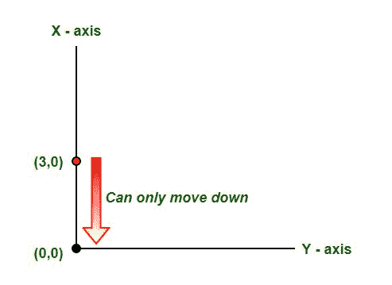
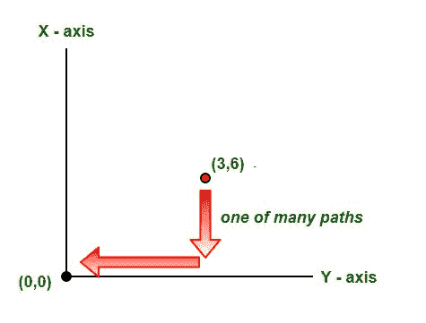

# 计算从一点到原点的路径数

> 原文:[https://www . geesforgeks . org/counts-path-point-reach-origin/](https://www.geeksforgeeks.org/counts-paths-point-reach-origin/)

你站在一个点 **(n，m)** 上，你想向左或向下走**步或**步回到原点 **(0，0)** ，即从每个点开始，你可以在 **(n-1，m)** 或 **(n，m-1)** 中移动。找出从点到原点的路径数。

**示例:**

```
Input : 3 6
Output : Number of Paths 84

Input : 3 0
Output : Number of Paths 1
```





由于我们被限制只能向下和向左移动，所以我们将对可以采取的
步的每个组合运行一个递归循环。

```
// Recursive function to count number of paths
countPaths(n, m)
{
    // If we reach bottom or top left, we are
    // have only one way to reach (0, 0)
    if (n==0 || m==0)
        return 1;

    // Else count sum of both ways
    return (countPaths(n-1, m) + countPaths(n, m-1));
} 
```

下面是上述步骤的实现。

## C++

```
// C++ program to count total number of
// paths from a point to origin
#include<bits/stdc++.h>
using namespace std;

// Recursive function to count number of paths
int countPaths(int n, int m)
{
    // If we reach bottom or top left, we are
    // have only one way to reach (0, 0)
    if (n==0 || m==0)
        return 1;

    // Else count sum of both ways
    return (countPaths(n-1, m) + countPaths(n, m-1));
}

// Driver Code
int main()
{
    int n = 3, m = 2;
    cout << " Number of Paths " << countPaths(n, m);
    return 0;
}
```

## Java 语言(一种计算机语言，尤用于创建网站)

```
// Java program to count total number of
// paths from a point to origin
import java.io.*;

class GFG {

    // Recursive function to count number of paths
    static int countPaths(int n, int m)
    {
        // If we reach bottom or top left, we are
        // have only one way to reach (0, 0)
        if (n == 0 || m == 0)
            return 1;

        // Else count sum of both ways
        return (countPaths(n - 1, m) + countPaths(n, m - 1));
    }

    // Driver Code
    public static void main (String[] args)
    {
        int n = 3, m = 2;
        System.out.println (" Number of Paths "
                            + countPaths(n, m));

    }
}

// This code is contributed by vt_m
```

## 蟒蛇 3

```
# Python3 program to count
# total number of
# paths from a point to origin
# Recursive function to 
# count number of paths
def countPaths(n,m):

    # If we reach bottom
    # or top left, we are
    # have only one way to reach (0, 0)
    if (n==0 or m==0):
        return 1

    # Else count sum of both ways
    return (countPaths(n-1, m) + countPaths(n, m-1))

# Driver Code
n = 3
m = 2
print(" Number of Paths ", countPaths(n, m))

# This code is contributed
# by Azkia Anam.
```

## C#

```
// C# program to count total number of
// paths from a point to origin
using System;

public class GFG {

    // Recursive function to count number
    // of paths
    static int countPaths(int n, int m)
    {

        // If we reach bottom or top left,
        // we are have only one way to
        // reach (0, 0)
        if (n == 0 || m == 0)
            return 1;

        // Else count sum of both ways
        return (countPaths(n - 1, m) 
                 + countPaths(n, m - 1));
    }

    // Driver Code
    public static void Main ()
    {
        int n = 3, m = 2;

        Console.WriteLine (" Number of"
         + " Paths " + countPaths(n, m));

    }
}

// This code is contributed by Sam007.
```

## 服务器端编程语言（Professional Hypertext Preprocessor 的缩写）

```
<?php
// PHP program to count total number
// of paths from a point to origin

// Recursive function to 
// count number of paths
function countPaths($n, $m)
{

    // If we reach bottom or 
    // top left, we are
    // have only one way to
    // reach (0, 0)
    if ($n == 0 || $m == 0)
        return 1;

    // Else count sum of both ways
    return (countPaths($n - 1, $m) + 
            countPaths($n, $m - 1));
}

    // Driver Code
    $n = 3; 
    $m = 2;
    echo " Number of Paths " 
      , countPaths($n, $m);

// This code is contributed by aj_36
?>
```

## java 描述语言

```
<script>

// Javascript program to count total number of
// paths from a point to origin

    // Recursive function to count number of paths
    function countPaths( n , m) {
        // If we reach bottom or top left, we are
        // have only one way to reach (0, 0)
        if (n == 0 || m == 0)
            return 1;

        // Else count sum of both ways
        return (countPaths(n - 1, m) + countPaths(n, m - 1));
    }

    // Driver Code

        let n = 3, m = 2;
        document.write(" Number of Paths " + countPaths(n, m));

// This code is contributed by shikhasingrajput

</script>
```

**Output**

```
 Number of Paths 10
```

我们可以使用动态规划，因为有重叠的子问题。我们可以画递归树来看重叠问题。例如，在 count path(4，4)的情况下，我们多次计算 count path(3，3)。

## C++

```
// C++ program to count total number of
// paths from a point to origin
#include<bits/stdc++.h>
using namespace std;

// DP based function to count number of paths
int countPaths(int n, int m)
{
    int dp[n+1][m+1];

    // Fill entries in bottommost row and leftmost
    // columns
    for (int i=0; i<=n; i++)
      dp[i][0] = 1;
    for (int i=0; i<=m; i++)
      dp[0][i] = 1;

    // Fill DP in bottom up manner
    for (int i=1; i<=n; i++)
       for (int j=1; j<=m; j++)
          dp[i][j] = dp[i-1][j] + dp[i][j-1];

    return dp[n][m];
}

// Driver Code
int main()
{
    int n = 3, m = 2;
    cout << " Number of Paths " << countPaths(n, m);
    return 0;
}
```

## Java 语言(一种计算机语言，尤用于创建网站)

```
// Java program to count total number of
// paths from a point to origin
import java.io.*;

class GFG {

    // DP based function to count number of paths
    static int countPaths(int n, int m)
    {
        int dp[][] = new int[n + 1][m + 1];

        // Fill entries in bottommost row and leftmost
        // columns
        for (int i = 0; i <= n; i++)
            dp[i][0] = 1;
        for (int i = 0; i <= m; i++)
            dp[0][i] = 1;

        // Fill DP in bottom up manner
        for (int i = 1; i <= n; i++)
        for (int j = 1; j <= m; j++)
            dp[i][j] = dp[i - 1][j] + dp[i][j - 1];

        return dp[n][m];
    }

    // Driver Code
    public static void main (String[] args) {
        int n = 3, m = 2;
        System.out.println(" Number of Paths "
                           + countPaths(n, m));

    }
}

// This code is contributed by vt_m
```

## 蟒蛇 3

```
# Python3 program to count total 
# number of paths from a po to origin

# Recursive function to count
# number of paths
def countPaths(n, m):

    # If we reach bottom or top 
    # left, we are have only one 
    # way to reach (0, 0)
    if (n == 0 or m == 0):
        return 1

    # Else count sum of both ways
    return (countPaths(n - 1, m) + 
            countPaths(n, m - 1))

# Driver Code
n = 3
m = 2
print("Number of Paths",
       countPaths(n, m))

# This code is contributed by ash264
```

## C#

```
// C# program to count total number of
// paths from a point to origin
using System;

public class GFG {

    // DP based function to count number
    // of paths
    static int countPaths(int n, int m)
    {
        int [,]dp = new int[n + 1,m + 1];

        // Fill entries in bottommost row
        // and leftmost columns
        for (int i = 0; i <= n; i++)
            dp[i,0] = 1;
        for (int i = 0; i <= m; i++)
            dp[0,i] = 1;

        // Fill DP in bottom up manner
        for (int i = 1; i <= n; i++)
            for (int j = 1; j <= m; j++)
                dp[i,j] = dp[i - 1,j]
                         + dp[i,j - 1];

        return dp[n,m];
    }

    // Driver Code
    public static void Main ()
    {
        int n = 3, m = 2;

        Console.WriteLine(" Number of"
        + " Paths " + countPaths(n, m));

    }
}

// This code is contributed by Sam007.
```

## 服务器端编程语言（Professional Hypertext Preprocessor 的缩写）

```
<?php
// PHP program to count total number of
// paths from a point to origin

// DP based function to 
// count number of paths
function countPaths($n, $m)
{

    //$dp[$n+1][$m+1];
    // Fill entries in bottommost
    // row and leftmost columns
    for ($i = 0; $i <= $n; $i++)
        $dp[$i][0] = 1;

    for ($i = 0; $i <= $m; $i++)
        $dp[0][$i] = 1;

    // Fill DP in bottom up manner
    for ($i = 1; $i <= $n; $i++)
    for ($j = 1; $j <= $m; $j++)
        $dp[$i][$j] = $dp[$i - 1][$j] + 
                      $dp[$i][$j - 1];

    return $dp[$n][$m];
}

    // Driver Code
    $n = 3;
    $m = 2;
    echo " Number of Paths " , countPaths($n, $m);

// This code is contributed by m_kit
?>
```

## java 描述语言

```
<script>
// javascript program to count total number of
// paths from a point to origin

// DP based function to count number of paths
function countPaths(n , m)
{
    var dp = Array(n+1).fill(0).map(x => Array(m+1).fill(0));

    // Fill entries in bottommost row and leftmost
    // columns
    for (i = 0; i <= n; i++)
        dp[i][0] = 1;
    for (i = 0; i <= m; i++)
        dp[0][i] = 1;

    // Fill DP in bottom up manner
    for (i = 1; i <= n; i++)
    for (j = 1; j <= m; j++)
        dp[i][j] = dp[i - 1][j] + dp[i][j - 1];

    return dp[n][m];
}

// Driver Code
var n = 3, m = 2;
document.write(" Number of Paths "
                   + countPaths(n, m));  

// This code is contributed by Amit Katiyar 
</script>
```

**Output**

```
 Number of Paths 10
```

**另一种方法:**

使用帕斯卡的三角形方法，我们还通过计算**<sup>n+m</sup>C<sub>n</sub>T5】的值来解决这个问题。当增加 **m** 的值，保持 **n** 的值不变时，可以观察到一种模式。
以下是上述方法的实施:**

## C++

```
// C++ Program for above approach
#include <iostream>
#include <bits/stdc++.h>
using namespace std;

// Function to find 
// binomial Coefficient
int binomialCoeff(int n, int k) 
{ 
    int C[k+1]; 
    memset(C, 0, sizeof(C)); 
    C[0] = 1;

    // Constructing Pascal's Triangle
    for (int i = 1; i <= n; i++) 
    {
        for (int j = min(i, k); j > 0; j--) 
            C[j] = C[j] + C[j-1]; 
    } 
    return C[k]; 
} 

//Driver Code
int main() 
{
    int n=3, m=2;
    cout<<"Number of Paths: "<< 
                binomialCoeff(n+m,n)<<endl;
    return 0;
}

//Contributed by Vismay_7
```

## Java 语言(一种计算机语言，尤用于创建网站)

```
// Java Program for above approach
import java.io.*;
import java.util.*;

class GFG 
{
    static int min(int a,int b)
    {
        return a<b?a:b;
    }

    // Function for binomial 
    // Coefficient
    static int binomialCoeff(int n, int k) 
    { 
        int C[] = new int[k + 1]; 
        C[0] = 1;  

        //Constructing Pascal's Triangle
        for (int i = 1; i <= n; i++) 
        { 
            for (int j = min(i,k); j > 0; j--) 
                C[j] = C[j] + C[j-1]; 
        } 
        return C[k]; 
    }

    // Driver Code
    public static void main (String[] args) 
    {
        int n=3,m=2;
        System.out.println("Number of Paths: " + 
                           binomialCoeff(n+m,n));
    }
}
//Contributed by Vismay_7
```

## 蟒蛇 3

```
# Python3 program for above approach
def binomialCoeff(n,k):

    C = [0]*(k+1)
    C[0] = 1

    # Computing Pascal's Triangle
    for i in range(1, n + 1): 

        j = min(i ,k) 
        while (j > 0): 
            C[j] = C[j] + C[j-1] 
            j -= 1

    return C[k] 

# Driver Code
n=3
m=2
print("Number of Paths:",binomialCoeff(n+m,n))

# Contributed by Vismay_7
```

## C#

```
// C# program for above approach
using System;

class GFG{

// Function to find 
// binomial Coefficient
static int binomialCoeff(int n, int k) 
{ 
    int[] C = new int[k + 1];
    C[0] = 1;

    // Constructing Pascal's Triangle
    for(int i = 1; i <= n; i++) 
    {
        for(int j = Math.Min(i, k); j > 0; j--) 
            C[j] = C[j] + C[j - 1]; 
    } 
    return C[k]; 
} 

// Driver code
static void Main() 
{
    int n = 3, m = 2;

    Console.WriteLine("Number of Paths: " + 
                      binomialCoeff(n + m, n));
}
}

// This code is contributed by divyesh072019
```

## java 描述语言

```
<script>
// javascript Program for above approach
    function min(a , b) 
    {
        return a < b ? a : b;
    }

    // Function for binomial
    // Coefficient
    function binomialCoeff(n , k) 
    {
        var C = Array(k + 1).fill(0);
        C[0] = 1;

        // Constructing Pascal's Triangle
        for (i = 1; i <= n; i++)
        {
            for (j = min(i, k); j > 0; j--)
                C[j] = C[j] + C[j - 1];
        }
        return C[k];
    }

    // Driver Code
    var n = 3, m = 2;
    document.write("Number of Paths: " + binomialCoeff(n + m, n));

// This code is contributed by Amit Katiyar  
</script>
```

**Output**

```
Number of Paths: 10
```

本文由 **Nikhil Rawat** 供稿。
如果你喜欢 GeeksforGeeks 并想投稿，你也可以使用[write.geeksforgeeks.org](https://write.geeksforgeeks.org)写一篇文章或者把你的文章邮寄到 review-team@geeksforgeeks.org。看到你的文章出现在极客博客主页上，帮助其他极客。
如果发现有不正确的地方，或者想分享更多关于上述话题的信息，请写评论。