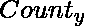
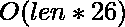

# 用最少的替换将字符串 X 转换为字符串 Y 的字谜

> 原文:[https://www . geesforgeks . org/convert-string-x-anagram-string-y-minimum-replacements/](https://www.geeksforgeeks.org/covert-string-x-anagram-string-y-minimum-replacements/)

给定两个字符串 X 和 Y，我们需要用最少的替换将字符串 X 转换成字符串 Y 的字谜。如果我们有多种实现目标的方法，我们会选择字典上较小的字符串，其中每个字符串的长度![\in [1, 100000]   ](img/c818897e357c9b72720aaa4a2ec1f118.png "Rendered by QuickLaTeX.com")
**示例:**

```
Input : X = "CDBABC" 
        Y = "ADCABD"
Output : Anagram : ADBADC
         Number of changes made: 2

Input : X = "PJPOJOVMAK"
        Y = "FVACRHLDAP"
Output : Anagram : ACPDFHVLAR
         Number of changes made: 7
```

**使用的方法:**
我们必须将字符串 X 转换成字典上最小的字符串 Y 的字谜，对原始字符串 X 进行最小替换。我们维护两个计数器数组，存储两个字符串中每个字符的计数/频率。让两根弦的计数器分别为和。现在，字谜顾名思义就是两个字谜中的字符出现的频率总是相等的。因此，要将字符串 X 转换为字符串 Y 的字谜，字符的频率应该相等。因此，我们将字符串 X 转换为字符串 Y 的字谜总共需要进行的修改次数为
，其中我们对每个字符 *i* 进行迭代。
工作已经完成了一半，因为我们知道需要更换多少人。我们现在需要字典上较小的字符串。现在，对于一个特定的位置，我们寻找从“A”到“Z”的所有可能的字符，并检查每个字符是否适合这个位置或现在。为了更好地理解，我们对字符串中的每个位置进行迭代。检查字符串 Y 中是否有字符，而不是字符串 X 中的字符(或者字符串 Y 中的字符频率更高，字符串 X 中的字符频率更低)。现在，如果有，我们检查一下，X 中当前位置的字符，是不是没有必要？也就是说，它在字符串 X 中的频率更高，而在字符串 y 中的频率更低。现在，如果所有的框都被勾选，我们进一步检查我们是否在这个位置插入了字符，因为我们需要生成字典上较小的字符串。如果所有条件都为真，我们用字符串 y 中的字符替换字符串 X 中的字符。在所有这样的替换之后，我们可以打印更改后的字符串 X 作为输出。

## C++

```
// C++ program to convert string X to
// string Y which minimum number of changes.
#include <bits/stdc++.h>
using namespace std;

#define MAX 26

// Function that converts string X
// into lexicographically smallest
// anagram of string Y with minimal changes
void printAnagramAndChanges(string X, string Y)
{
    int countx[MAX] = {0}, county[MAX] = {0},
        ctrx[MAX] = {0}, ctry[MAX] = {0};

    int change = 0;
    int l = X.length();

    // Counting frequency of characters
    // in each string.
    for (int i = 0; i < l; i++) {
        countx[X[i] - 'A']++;
        county[Y[i] - 'A']++;
    }

    // We maintain two more counter arrays
    // ctrx[] and ctry[]
    // Ctrx[] maintains the count of extra
    // elements present in string X than
    // string Y
    // Ctry[] maintains the count of
    // characters missing from string X
    // which should be present in string Y.
    for (int i = 0; i < MAX; i++) {
        if (countx[i] > county[i])
            ctrx[i] += (countx[i] - county[i]);
        else if (countx[i] < county[i])
            ctry[i] += (county[i] - countx[i]);
        change += abs(county[i] - countx[i]);
    }

    for (int i = 0; i < l; i++) {

        // This means that we cannot edit the
        // current character as it's frequency
        // in string X is equal to or less
        // than the frequency in string Y.
        // Thus, we go to the next position
        if (ctrx[X[i] - 'A'] == 0)
            continue;

        // Here, we try to find that character,
        // which has more frequency in string Y
        // and less in string X. We try to find
        // this character in lexicographical
        // order so that we get
        // lexicographically smaller string
        int j;
        for (j = 0; j < MAX; j++)
            if ((ctry[j]) > 0)
                break;

        // This portion deals with the
        // lexicographical property.
        // Now, we put a character in string X
        // when either this character has smaller
        // value than the character present there
        // right now or if this is the last position
        // for it to exchange, else we fix the
        // character already present here in
        // this position.
        if (countx[X[i] - 'A'] == ctrx[X[i] - 'A']
            || X[i] - 'A' > j) {

            countx[X[i] - 'A']--;
            ctrx[X[i] - 'A']--;
            ctry[j]--;
            X[i] = 'A' + j;
        }
        else
            countx[X[i] - 'A']--;
    }

    cout << "Anagram : " << X << endl;
    cout << "Number of changes made : " << change / 2;
}

// Driver program
int main()
{
    string x = "CDBABC", y = "ADCABD";
    printAnagramAndChanges(x, y);
    return 0;
}
```

## Java 语言(一种计算机语言，尤用于创建网站)

```
// Java program to convert string X to
// string Y which minimum number of changes.
class GFG
{

    static final int MAX = 26;

    // Function that converts string X
    // into lexicographically smallest
    // anagram of string Y with minimal changes
    static void printAnagramAndChanges(char[] X,
                                        char[] Y)
    {
        int countx[] = new int[MAX], county[] = new int[MAX],
            ctrx[] = new int[MAX], ctry[] = new int[MAX];

        int change = 0;
        int l = X.length;

        // Counting frequency of characters
        // in each string.
        for (int i = 0; i < l; i++)
        {
            countx[X[i] - 'A']++;
            county[Y[i] - 'A']++;
        }

        // We maintain two more counter arrays
        // ctrx[] and ctry[]
        // Ctrx[] maintains the count of extra
        // elements present in string X than
        // string Y
        // Ctry[] maintains the count of
        // characters missing from string X
        // which should be present in string Y.
        for (int i = 0; i < MAX; i++)
        {
            if (countx[i] > county[i])
            {
                ctrx[i] += (countx[i] - county[i]);
            }
            else if (countx[i] < county[i])
            {
                ctry[i] += (county[i] - countx[i]);
            }
            change += Math.abs(county[i] - countx[i]);
        }

        for (int i = 0; i < l; i++)
        {

            // This means that we cannot edit the
            // current character as it's frequency
            // in string X is equal to or less
            // than the frequency in string Y.
            // Thus, we go to the next position
            if (ctrx[X[i] - 'A'] == 0)
            {
                continue;
            }

            // Here, we try to find that character,
            // which has more frequency in string Y
            // and less in string X. We try to find
            // this character in lexicographical
            // order so that we get
            // lexicographically smaller string
            int j;
            for (j = 0; j < MAX; j++)
            {
                if ((ctry[j]) > 0)
                {
                    break;
                }
            }

            // This portion deals with the
            // lexicographical property.
            // Now, we put a character in string X
            // when either this character has smaller
            // value than the character present there
            // right now or if this is the last position
            // for it to exchange, else we fix the
            // character already present here in
            // this position.
            if (countx[X[i] - 'A'] == ctrx[X[i] - 'A']
                || X[i] - 'A' > j)
            {

                countx[X[i] - 'A']--;
                ctrx[X[i] - 'A']--;
                ctry[j]--;
                X[i] = (char) ('A' + j);
            }
            else
            {
                countx[X[i] - 'A']--;
            }
        }
        System.out.println("Anagram : " + String.valueOf(X));
        System.out.println("Number of changes made : " + change / 2);
    }

    // Driver code
    public static void main(String[] args)
    {
        String x = "CDBABC", y = "ADCABD";
        printAnagramAndChanges(x.toCharArray(), y.toCharArray());
    }
}

// This code is contributed by Rajput-Ji
```

## 蟒蛇 3

```
# Python3 program to convert string X to
# string Y which minimum number of changes.
MAX = 26

# Function that converts string X
# into lexicographically smallest
# anagram of string Y with minimal changes
def printAnagramAndChanges(x, y):
    x = list(x)
    y = list(y)
    countx, county = [0] * MAX, [0] * MAX
    ctrx, ctry = [0] * MAX, [0] * MAX

    change = 0
    l = len(x)

    # Counting frequency of characters
    # in each string.
    for i in range(l):
        countx[ord(x[i]) - ord('A')] += 1
        county[ord(y[i]) - ord('A')] += 1

    # We maintain two more counter arrays
    # ctrx[] and ctry[]
    # Ctrx[] maintains the count of extra
    # elements present in string X than
    # string Y
    # Ctry[] maintains the count of
    # characters missing from string X
    # which should be present in string Y.
    for i in range(MAX):
        if countx[i] > county[i]:
            ctrx[i] += (countx[i] - county[i])
        elif countx[i] < county[i]:
            ctry[i] += (county[i] - countx[i])
        change += abs(county[i] - countx[i])

    for i in range(l):

        # This means that we cannot edit the
        # current character as it's frequency
        # in string X is equal to or less
        # than the frequency in string Y.
        # Thus, we go to the next position
        if ctrx[ord(x[i]) - ord('A')] == 0:
            continue

        # Here, we try to find that character,
        # which has more frequency in string Y
        # and less in string X. We try to find
        # this character in lexicographical
        # order so that we get
        # lexicographically smaller string
        j = 0
        for j in range(MAX):
            if ctry[j] > 0:
                break

        # This portion deals with the
        # lexicographical property.
        # Now, we put a character in string X
        # when either this character has smaller
        # value than the character present there
        # right now or if this is the last position
        # for it to exchange, else we fix the
        # character already present here in
        # this position.
        if countx[ord(x[i]) -
                ord('A')] == ctrx[ord(x[i]) - ord('A')] or \
                                  ord(x[i]) - ord('A') > j:
            countx[ord(x[i]) - ord('A')] -= 1
            ctrx[ord(x[i]) - ord('A')] -= 1
            ctry[j] -= 1
            x[i] = chr(ord('A') + j)
        else:
            countx[ord(x[i]) - ord('A')] -= 1

    print("Anagram :", ''.join(x))
    print("Number of changes made :", change // 2)

# Driver Code
if __name__ == "__main__":
    x = "CDBABC"
    y = "ADCABD"
    printAnagramAndChanges(x, y)

# This code is contributed by
# sanjeev2552
```

## C#

```
// C# program to convert string X to
// string Y which minimum number of changes.
using System;

class GFG
{

    static readonly int MAX = 26;

    // Function that converts string X
    // into lexicographically smallest
    // anagram of string Y with minimal changes
    static void printAnagramAndChanges(char[] X,
                                        char[] Y)
    {
        int []countx = new int[MAX];
        int []county = new int[MAX];
        int []ctrx = new int[MAX];
        int []ctry = new int[MAX];

        int change = 0;
        int l = X.Length;

        // Counting frequency of characters
        // in each string.
        for (int i = 0; i < l; i++)
        {
            countx[X[i] - 'A']++;
            county[Y[i] - 'A']++;
        }

        // We maintain two more counter arrays
        // ctrx[] and ctry[]
        // Ctrx[] maintains the count of extra
        // elements present in string X than
        // string Y
        // Ctry[] maintains the count of
        // characters missing from string X
        // which should be present in string Y.
        for (int i = 0; i < MAX; i++)
        {
            if (countx[i] > county[i])
            {
                ctrx[i] += (countx[i] - county[i]);
            }
            else if (countx[i] < county[i])
            {
                ctry[i] += (county[i] - countx[i]);
            }
            change += Math.Abs(county[i] - countx[i]);
        }

        for (int i = 0; i < l; i++)
        {

            // This means that we cannot edit the
            // current character as it's frequency
            // in string X is equal to or less
            // than the frequency in string Y.
            // Thus, we go to the next position
            if (ctrx[X[i] - 'A'] == 0)
            {
                continue;
            }

            // Here, we try to find that character,
            // which has more frequency in string Y
            // and less in string X. We try to find
            // this character in lexicographical
            // order so that we get
            // lexicographically smaller string
            int j;
            for (j = 0; j < MAX; j++)
            {
                if ((ctry[j]) > 0)
                {
                    break;
                }
            }

            // This portion deals with the
            // lexicographical property.
            // Now, we put a character in string X
            // when either this character has smaller
            // value than the character present there
            // right now or if this is the last position
            // for it to exchange, else we fix the
            // character already present here in
            // this position.
            if (countx[X[i] - 'A'] == ctrx[X[i] - 'A']
                || X[i] - 'A' > j)
            {

                countx[X[i] - 'A']--;
                ctrx[X[i] - 'A']--;
                ctry[j]--;
                X[i] = (char) ('A' + j);
            }
            else
            {
                countx[X[i] - 'A']--;
            }
        }
        Console.WriteLine("Anagram : " +
                        String.Join("",X));
        Console.WriteLine("Number of changes made : " +
                            change / 2);
    }

    // Driver code
    public static void Main(String[] args)
    {
        String x = "CDBABC", y = "ADCABD";
        printAnagramAndChanges(x.ToCharArray(),
                                y.ToCharArray());
    }
}

// This code is contributed by 29AjayKumar
```

## java 描述语言

```
<script>

      // JavaScript program to convert string X to
      // string Y which minimum number of changes.
      const MAX = 26;

      // Function that converts string X
      // into lexicographically smallest
      // anagram of string Y with minimal changes
      function printAnagramAndChanges(X, Y)
      {
        var countx = new Array(MAX).fill(0);
        var county = new Array(MAX).fill(0);
        var ctrx = new Array(MAX).fill(0);
        var ctry = new Array(MAX).fill(0);

        var change = 0;
        var l = X.length;

        // Counting frequency of characters
        // in each string.
        for (var i = 0; i < l; i++) {
          countx[X[i].charCodeAt(0) - "A".charCodeAt(0)]++;
          county[Y[i].charCodeAt(0) - "A".charCodeAt(0)]++;
        }

        // We maintain two more counter arrays
        // ctrx[] and ctry[]
        // Ctrx[] maintains the count of extra
        // elements present in string X than
        // string Y
        // Ctry[] maintains the count of
        // characters missing from string X
        // which should be present in string Y.
        for (var i = 0; i < MAX; i++) {
          if (countx[i] > county[i]) {
            ctrx[i] += countx[i] - county[i];
          } else if (countx[i] < county[i]) {
            ctry[i] += county[i] - countx[i];
          }
          change += Math.abs(county[i] - countx[i]);
        }

        for (var i = 0; i < l; i++) {
          // This means that we cannot edit the
          // current character as it's frequency
          // in string X is equal to or less
          // than the frequency in string Y.
          // Thus, we go to the next position
          if (ctrx[X[i].charCodeAt(0) -
          "A".charCodeAt(0)] === 0)
          {
            continue;
          }

          // Here, we try to find that character,
          // which has more frequency in string Y
          // and less in string X. We try to find
          // this character in lexicographical
          // order so that we get
          // lexicographically smaller string
          var j;
          for (j = 0; j < MAX; j++) {
            if (ctry[j] > 0) {
              break;
            }
          }

          // This portion deals with the
          // lexicographical property.
          // Now, we put a character in string X
          // when either this character has smaller
          // value than the character present there
          // right now or if this is the last position
          // for it to exchange, else we fix the
          // character already present here in
          // this position.
          if (
            countx[X[i].charCodeAt(0) - "A".charCodeAt(0)] ===
              ctrx[X[i].charCodeAt(0) - "A".charCodeAt(0)] ||
            X[i].charCodeAt(0) - "A".charCodeAt(0) > j
          ) {
            countx[X[i].charCodeAt(0) - "A".charCodeAt(0)]--;
            ctrx[X[i].charCodeAt(0) - "A".charCodeAt(0)]--;
            ctry[j]--;
            X[i] = String.fromCharCode("A".charCodeAt(0) + j);
          } else {
            countx[X[i].charCodeAt(0) - "A".charCodeAt(0)]--;
          }
        }
        document.write("Anagram : " + X.join("") + "<br>");
        document.write("Number of changes made : " + change / 2);
      }

      // Driver code
      var x = "CDBABC",
          y = "ADCABD";
      printAnagramAndChanges(x.split(""), y.split(""));

</script>
```

**输出:**

```
Anagram : ADBADC
Number of changes made : 2
```

总的时间复杂度是，当我们忽略常数时，复杂度是