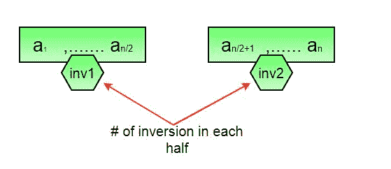
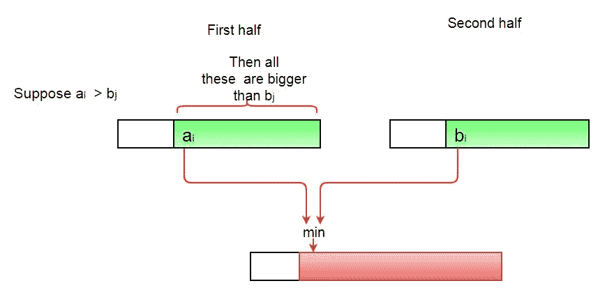
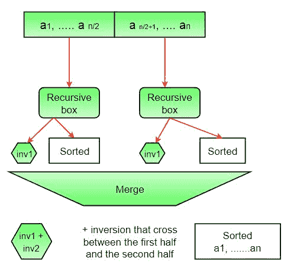

# 用于计算数组中反转的 C++程序–集合 1(使用合并排序)

> 原文:[https://www . geeksforgeeks . org/CPP-program-for-counting-inversion-in-a-array-set-1-use-merge-sort/](https://www.geeksforgeeks.org/cpp-program-for-counting-inversions-in-an-array-set-1-using-merge-sort/)

*数组的反转计数*表示数组离排序有多远(或多近)。如果数组已经排序，则反转计数为 0，但是如果数组以相反的顺序排序，则反转计数为最大值。
形式上讲，如果 a[I]>a[j]I<j
**例:**

```
Input: arr[] = {8, 4, 2, 1}
Output: 6
Explanation: Given array has six inversions:
(8, 4), (4, 2), (8, 2), (8, 1), (4, 1), (2, 1).

Input: arr[] = {3, 1, 2}
Output: 2
Explanation: Given array has two inversions:
(3, 1), (3, 2) 
```

**<u>方法 1(简单):</u>**

**方法:**遍历数组，对于每个索引，找到数组右侧较小元素的数量。这可以使用嵌套循环来完成。合计数组中所有索引的计数，并打印总和。

**算法:**

1.  从头到尾遍历数组
2.  对于每个元素，使用另一个循环查找小于当前数字的元素计数，直到该索引。
3.  合计每个索引的反转计数。
4.  打印倒计数。

**实施:**

## C++

```
// C++ program to Count Inversions
// in an array
#include <bits/stdc++.h>
using namespace std;

int getInvCount(int arr[], int n)
{
    int inv_count = 0;
    for (int i = 0; i < n - 1; i++)
        for (int j = i + 1; j < n; j++)
            if (arr[i] > arr[j])
                inv_count++;

    return inv_count;
}

// Driver Code
int main()
{
    int arr[] = {1, 20, 6, 4, 5};
    int n = sizeof(arr) / sizeof(arr[0]);
    cout << " Number of inversions are " << 
              getInvCount(arr, n);
    return 0;
}
// This code is contributed by Akanksha Rai
```

**输出:**

```
 Number of inversions are 5
```

**复杂度分析:**

*   **时间复杂度:** O(n^2)，需要两个嵌套循环从头到尾遍历数组，所以时间复杂度为 O(n^2)
*   **空间**复杂度 **:** O(1)，不需要额外空间。

**<u>方法 2(增强合并排序):</u>**

**逼近:**
假设数组左半部分和右半部分的逆序个数(设为 inv1 和 inv 2)；Inv1 + Inv2 中有哪些类型的反转没有被考虑？答案是–在合并步骤中需要计算的反转。因此，要得到需要相加的逆的总数，需要左子阵、右子阵和 merge()中的逆的个数。



**如何得到 merge()中的求逆次数？**
在合并过程中，let i 用于索引左子数组，j 用于索引右子数组。在 merge()中的任何一步，如果 a[i]大于 a[j]，则有(mid–I)个反转。因为左右子阵列是排序的，所以左子阵列中的所有剩余元素(a[i+1]，a[i+2] … a[mid])都将大于 a[j]



**全图:**



**算法:**

1.  这个想法类似于合并排序，在每一步中将数组分成相等或几乎相等的两半，直到达到基本大小写。
2.  创建一个函数 merge，计算当数组的两个半部分被合并时的求逆次数，创建两个索引 I 和 j，I 是前半部分的索引，j 是后半部分的索引。如果 a[i]大于 a[j]，则存在(mid–I)反转。因为左右子阵是排序的，所以左子阵中所有剩余的元素(a[i+1]，a[i+2] … a[mid])都会大于 a[j]。
3.  创建一个递归函数，将数组分成两半，通过相加求逆的次数是前半部分，后半部分求逆的次数和两者合并求逆的次数来找到答案。
4.  递归的基本情况是给定的一半只有一个元素。
5.  打印答案

**实施:**

## C++

```
// C++ program to Count Inversions in 
// an array using Merge Sort
#include <bits/stdc++.h>
using namespace std;

int _mergeSort(int arr[], int temp[], 
               int left, int right);
int merge(int arr[], int temp[], 
          int left, int mid, int right);

/* This function sorts the input 
   array and returns the number 
   of inversions in the array */
int mergeSort(int arr[], int array_size)
{
    int temp[array_size];
    return _mergeSort(arr, temp, 0, 
                      array_size - 1);
}

/* An auxiliary recursive function that 
   sorts the input array and returns the 
   number of inversions in the array. */
int _mergeSort(int arr[], int temp[], 
               int left, int right)
{
    int mid, inv_count = 0;
    if (right > left) 
    {
        /* Divide the array into two parts and 
           call _mergeSortAndCountInv() for 
           each of the parts */
        mid = (right + left) / 2;

        /* Inversion count will be sum of inversions 
           in left-part, right-part and number of 
           inversions in merging */
        inv_count += _mergeSort(arr, temp, 
                                left, mid);
        inv_count += _mergeSort(arr, temp, 
                                mid + 1, right);

        // Merge the two parts
        inv_count += merge(arr, temp, 
                           left, mid + 1, right);
    }
    return inv_count;
}

/* This funt merges two sorted arrays and 
   returns inversion count in the arrays.*/
int merge(int arr[], int temp[], 
          int left, int mid, int right)
{
    int i, j, k;
    int inv_count = 0;

    // i is index for left subarray
    i = left;

    // j is index for right subarray 
    j = mid; 

    // k is index for resultant merged 
    // subarray
    k = left; 

    while ((i <= mid - 1) && 
           (j <= right)) 
    {
        if (arr[i] <= arr[j]) 
        {
            temp[k++] = arr[i++];
        }
        else 
        {
            temp[k++] = arr[j++];

            /* This is tricky -- see above 
               explanation/diagram for merge()*/
            inv_count = inv_count + (mid - i);
        }
    }

    /* Copy the remaining elements of left 
       subarray (if there are any) to temp*/
    while (i <= mid - 1)
        temp[k++] = arr[i++];

    /* Copy the remaining elements of right 
       subarray (if there are any) to temp*/
    while (j <= right)
        temp[k++] = arr[j++];

    /* Copy back the merged elements to 
       original array*/
    for (i = left; i <= right; i++)
        arr[i] = temp[i];

    return inv_count;
}

// Driver code
int main()
{
    int arr[] = {1, 20, 6, 4, 5};
    int n = sizeof(arr) / sizeof(arr[0]);
    int ans = mergeSort(arr, n);
    cout << " Number of inversions are " << ans;
    return 0;
}

// This is code is contributed by rathbhupendra
```

**输出:**

```
Number of inversions are 5
```

**复杂度分析:**

*   **时间复杂度:** O(n log n)，使用的算法是分治法，所以在每一层都需要一次全数组遍历，而且有 log n 层，所以时间复杂度为 O(n log n)。
*   **空间**复杂度 **:** O(n)，临时阵。

请注意，上面的代码修改(或排序)了输入数组。如果我们只想计算逆序，我们需要创建一个原始数组的副本，并在副本上调用 mergeSort()来保持原始数组的顺序。