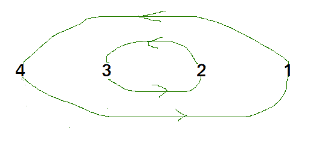

# 循环排序的 C++程序

> 原文:[https://www.geeksforgeeks.org/cpp-program-for-cycle-sort/](https://www.geeksforgeeks.org/cpp-program-for-cycle-sort/)

循环排序是一种就地排序算法，[不稳定排序算法](https://en.wikipedia.org/wiki/Sorting_algorithm#Stability)，这是一种比较排序，就对原始阵列的总写入次数而言，理论上是最佳的。

*   就内存写入次数而言，它是最佳的。它[最小化要排序的内存写入次数](https://www.geeksforgeeks.org/which-sorting-algorithm-makes-minimum-number-of-writes/)(每个值要么被写入零次，如果它已经在它的正确位置，要么被写入一次到它的正确位置。)
*   它基于这样的思想，即将被排序的数组可以被划分为循环。周期可以被可视化为图形。如果排序数组中第 I 个索引处的元素必须出现在第 j 个索引处，那么我们有 n 个节点和一条从节点 I 指向节点 j 的边。
    在 arr[]中循环= {4，5，2，1，5}


在 arr[]中循环= {4，3，2，1}



我们一个一个考虑所有的周期。我们首先考虑包含第一个元素的循环。我们找到第一个元素的正确位置，把它放在正确的位置，比如 j。我们考虑 arr[j]的旧值，找到它的正确位置，我们一直这样做，直到当前周期的所有元素都放在正确的位置，也就是说，我们没有回到周期的起点。

## C++

```
// C++ program to implement cycle sort
#include <iostream>
using namespace std;

// Function sort the array using Cycle sort
void cycleSort (int arr[], int n)
{
    // count number of memory writes
    int writes = 0;

    // traverse array elements and put it to on
    // the right place
    for (int cycle_start=0; cycle_start<=n-2; cycle_start++)
    {
        // initialize item as starting point
        int item = arr[cycle_start];

        // Find position where we put the item. We basically
        // count all smaller elements on right side of item.
        int pos = cycle_start;
        for (int i = cycle_start+1; i<n; i++)
            if (arr[i] < item)
                pos++;

        // If item is already in correct position
        if (pos == cycle_start)
            continue;

        // ignore all duplicate  elements
        while (item == arr[pos])
            pos += 1;

        // put the item to it\'s right position
        if (pos != cycle_start)
        {
            swap(item, arr[pos]);
            writes++;
        }

        // Rotate rest of the cycle
        while (pos != cycle_start)
        {
            pos = cycle_start;

            // Find position where we put the element
            for (int i = cycle_start+1; i<n; i++)
                if (arr[i] < item)
                    pos += 1;

            // ignore all duplicate  elements
            while (item == arr[pos])
                pos += 1;

            // put the item to it\'s right position
            if (item != arr[pos])
            {
                swap(item, arr[pos]);
                writes++;
            }
        }
    }

    // Number of memory writes or swaps
    // cout << writes << endl ;
}

// Driver program to test above function
int main()
{
    int arr[] = {1, 8, 3, 9, 10, 10, 2, 4 };
    int n = sizeof(arr)/sizeof(arr[0]);
    cycleSort(arr,  n) ;

    cout << "After sort : " <<endl;
    for (int i =0; i<n; i++)
        cout << arr[i] << " ";
    return 0;
}
```

**输出:**

```
After sort : 
1 2 3 4 8 9 10 10 
```

详情请参考[循环排序](https://www.geeksforgeeks.org/cycle-sort/)整篇文章！