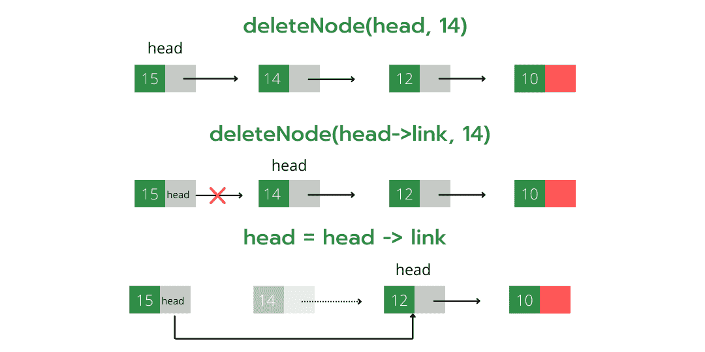

# 删除链表中节点的 C++程序

> 原文:[https://www . geesforgeks . org/CPP-删除链表中节点的程序/](https://www.geeksforgeeks.org/cpp-program-for-deleting-a-node-in-a-linked-list/)

我们在之前关于单链表的文章中讨论过[链表介绍](https://www.geeksforgeeks.org/linked-list-set-1-introduction/)和[链表插入](https://www.geeksforgeeks.org/linked-list-set-2-inserting-a-node/)。
让我们制定问题陈述，了解删除过程。*给定一个‘键’，删除链表中该键的第一次出现*。

**<u>迭代方法:</u>**
要从链表中删除一个节点，我们需要做以下步骤。
1)找到要删除节点的上一个节点。
2)更改上一个节点的下一个。
3)为要删除的节点释放内存。


由于链表的每个节点都是使用 C 语言中的 malloc()动态分配的，所以我们需要调用 [free()](http://www.cplusplus.com/reference/cstdlib/free/) 来释放分配给待删除节点的内存。

## C++

```
// A complete working C++ program to
// demonstrate deletion in singly 
// linked list with class 
#include <bits/stdc++.h>
using namespace std;

// A linked list node
class Node{
public:
    int data;
    Node* next;
};

// Given a reference (pointer to pointer)
// to the head of a list and an int, 
// inserts a new node on the front of the
// list. 
void push(Node** head_ref, int new_data)
{
    Node* new_node = new Node();
    new_node->data = new_data;
    new_node->next = (*head_ref);
    (*head_ref) = new_node;
}

// Given a reference (pointer to pointer)
// to the head of a list and a key, deletes
// the first occurrence of key in linked list 
void deleteNode(Node** head_ref, int key)
{

    // Store head node
    Node* temp = *head_ref;
    Node* prev = NULL;

    // If head node itself holds
    // the key to be deleted
    if (temp != NULL && temp->data == key)
    {
        *head_ref = temp->next; // Changed head
        delete temp;            // free old head
        return;
    }

    // Else Search for the key to be deleted, 
    // keep track of the previous node as we
    // need to change 'prev->next' */
      else
    {
    while (temp != NULL && temp->data != key)
    {
        prev = temp;
        temp = temp->next;
    }

    // If key was not present in linked list
    if (temp == NULL)
        return;

    // Unlink the node from linked list
    prev->next = temp->next;

    // Free memory
    delete temp;
    }
}

// This function prints contents of
// linked list starting from the 
// given node 
void printList(Node* node)
{
    while (node != NULL) 
    {
        cout << node->data << " ";
        node = node->next;
    }
}

// Driver code
int main()
{

    // Start with the empty list 
    Node* head = NULL;

    // Add elements in linked list
    push(&head, 7);
    push(&head, 1);
    push(&head, 3);
    push(&head, 2);

    puts("Created Linked List: ");
    printList(head);

    deleteNode(&head, 1);
    puts("
Linked List after Deletion of 1: ");

    printList(head);

    return 0;
}

// This code is contributed by ac121102
```

**Output:**

```
Created Linked List: 
 2  3  1  7 
Linked List after Deletion of 1: 
 2  3  7
```

**<u>递归法:</u>**

要递归删除链表的一个节点，我们需要做以下步骤。

1.我们传递节点*(节点指针)作为对函数的引用(如节点* &head)

2.现在，由于当前节点指针是从上一个节点的 next(通过引用传递)派生而来的，所以现在，如果当前节点指针的值发生了变化，则上一个下一个节点的值也会发生变化，这是删除节点时所需的操作(即，将上一个节点的 next 指向当前节点的 next(包含键)。

3.找到包含给定值的节点。

4.存储此节点，以便稍后使用 free()函数解除分配。

5.更改此节点指针，使其指向下一个节点，并且通过执行此操作，前一个节点的下一个节点也将正确链接。



下面是上述方法的实现。

## C++

```
// C++ program to delete a node in
// singly linked list recursively

#include <bits/stdc++.h>
using namespace std;

struct node {
    int info;
    node* link = NULL;
    node() {}
    node(int a)
        : info(a)
    {
    }
};

/*
Deletes the node containing 'info' part as val and
alter the head of the linked list (recursive method)
*/
void deleteNode(node*& head, int val)
{

    // Check if list is empty or we 
    // reach at the end of the
    // list.
    if (head == NULL) {
        cout << "Element not present in the list
";
        return;
    }
    // If current node is the node to be deleted
    if (head->info == val) {
        node* t = head;
        head = head->link; // If it's start of the node head
                           // node points to second node
        delete (t); // Else changes previous node's link to
                    // current node's link
        return;
    }
    deleteNode(head->link, val);
}

// Utility function to add a 
// node in the linked list
// Here we are passing head by 
// reference thus no need to
// return it to the main function
void push(node*& head, int data)
{
    node* newNode = new node(data);
    newNode->link = head;
    head = newNode;
}

// Utility function to print 
// the linked list (recursive
// method)
void print(node* head)
{

    // cout<<endl gets implicitly 
    // typecasted to bool value
    // 'true'
    if (head == NULL and cout << endl)
        return;
    cout << head->info << ' ';
    print(head->link);
}

int main()
{
    // Starting with an empty linked list
    node* head = NULL;

    // Adds new element at the 
    // beginning of the list
    push(head, 10);
    push(head, 12);
    push(head, 14);
    push(head, 15);

    // original list
    print(head);

    deleteNode(head, 20); // Call to delete function
    print(head); // 20 is not present thus no change in the
                 // list

    deleteNode(head, 10);
    print(head);

    deleteNode(head, 14);
    print(head);

    return 0;
}
```

**Output:**

```
Element not present in the list
15 14 12 10 
15 14 12 
15 12 
```

详情请参考[链表|集合 3(删除节点)](https://www.geeksforgeeks.org/linked-list-set-3-deleting-node/)整篇文章！