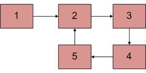
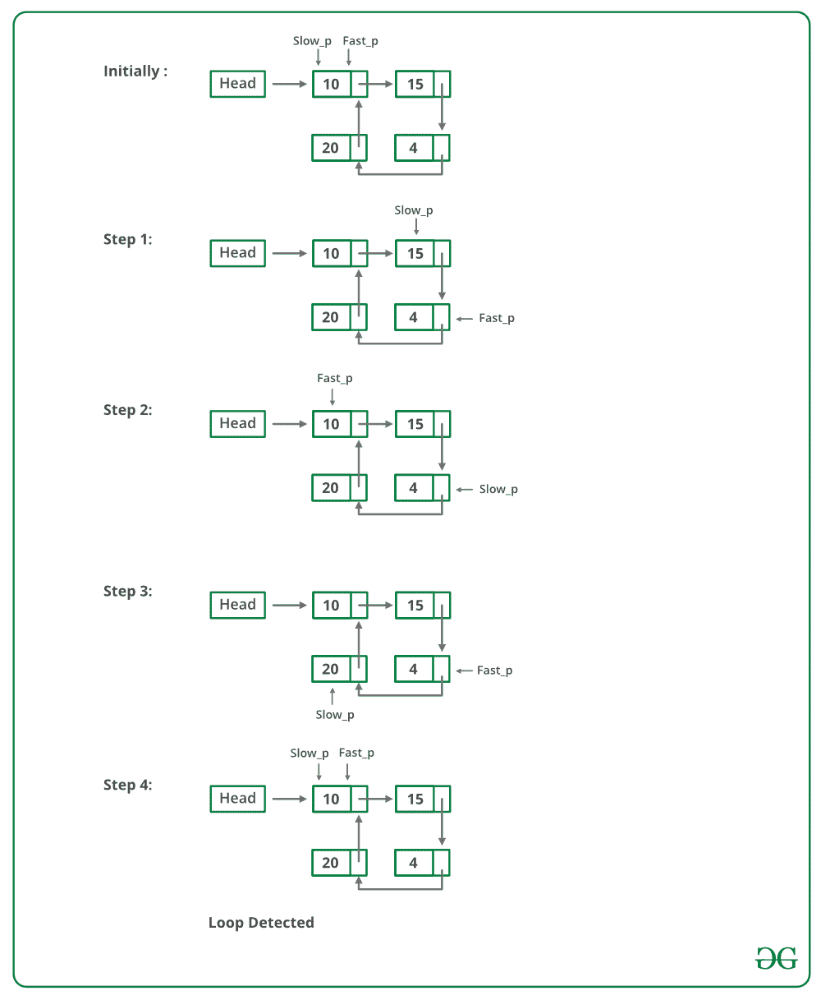

# 检测链表中循环的 C++程序

> 原文:[https://www . geesforgeks . org/CPP-检测链表中循环的程序/](https://www.geeksforgeeks.org/cpp-program-for-detecting-loop-in-a-linked-list/)

给定一个链表，检查链表是否有循环。下图显示了一个带有循环的链表。



以下是不同的方法。

**<u>解决方案 1:</u> 哈希方法:**

逐一遍历列表，并不断将节点地址放入哈希表中。在任何时候，如果达到空值，则返回假，如果下一个当前节点指向哈希中先前存储的任何节点，则返回真。

## C++

```
// C++ program to detect loop in a linked list
#include <bits/stdc++.h>
using namespace std;

/* Link list node */
struct Node {
    int data;
    struct Node* next;
};

void push(struct Node** head_ref, int new_data)
{
    /* allocate node */
    struct Node* new_node = new Node;

    /* put in the data  */
    new_node->data = new_data;

    /* link the old list off the new node */
    new_node->next = (*head_ref);

    /* move the head to point to the new node */
    (*head_ref) = new_node;
}

// Returns true if there is a loop in linked list
// else returns false.
bool detectLoop(struct Node* h)
{
    unordered_set<Node*> s;
    while (h != NULL) {
        // If this node is already present
        // in hashmap it means there is a cycle
        // (Because you we encountering the
        // node for the second time).
        if (s.find(h) != s.end())
            return true;

        // If we are seeing the node for
        // the first time, insert it in hash
        s.insert(h);

        h = h->next;
    }

    return false;
}

/* Driver program to test above function*/
int main()
{
    /* Start with the empty list */
    struct Node* head = NULL;

    push(&head, 20);
    push(&head, 4);
    push(&head, 15);
    push(&head, 10);

    /* Create a loop for testing */
    head->next->next->next->next = head;

    if (detectLoop(head))
        cout << "Loop found";
    else
        cout << "No Loop";

    return 0;
}
// This code is contributed by Geetanjali
```

**Output**

```
Loop found
```

**复杂度分析:**

*   **时间复杂度:** O(n)。
    只需要遍历一次循环。
*   **辅助空间:** O(n)。
    n 是在 hashmap 中存储值所需的空间。

**<u>解决方案 2</u> :** 通过修改链表数据结构，不用 hashmap 就可以解决这个问题。
**方法:**该解决方案需要修改基本链表数据结构。

*   每个节点都有一个访问标志。
*   遍历链表并继续标记被访问的节点。
*   如果你再次看到一个被访问的节点，那么就会出现一个循环。该解决方案适用于 O(n)，但需要每个节点的附加信息。
*   不需要修改基本数据结构的这个解决方案的变体可以使用散列来实现，只需将访问节点的地址存储在散列中，如果您看到散列中已经存在一个地址，那么就会有一个循环。

## C++

```
// C++ program to detect loop in a linked list
#include <bits/stdc++.h>
using namespace std;

/* Link list node */
struct Node {
    int data;
    struct Node* next;
    int flag;
};

void push(struct Node** head_ref, int new_data)
{
    /* allocate node */
    struct Node* new_node = new Node;

    /* put in the data */
    new_node->data = new_data;

    new_node->flag = 0;

    /* link the old list off the new node */
    new_node->next = (*head_ref);

    /* move the head to point to the new node */
    (*head_ref) = new_node;
}

// Returns true if there is a loop in linked list
// else returns false.
bool detectLoop(struct Node* h)
{
    while (h != NULL) {
        // If this node is already traverse
        // it means there is a cycle
        // (Because you we encountering the
        // node for the second time).
        if (h->flag == 1)
            return true;

        // If we are seeing the node for
        // the first time, mark its flag as 1
        h->flag = 1;

        h = h->next;
    }

    return false;
}

/* Driver program to test above function*/
int main()
{
    /* Start with the empty list */
    struct Node* head = NULL;

    push(&head, 20);
    push(&head, 4);
    push(&head, 15);
    push(&head, 10);

    /* Create a loop for testing */
    head->next->next->next->next = head;

    if (detectLoop(head))
        cout << "Loop found";
    else
        cout << "No Loop";

    return 0;
}
// This code is contributed by Geetanjali
```

**Output**

```
Loop found
```

**复杂度分析:**

*   **时间复杂度:** O(n)。
    只需要遍历一次循环。
*   **辅助空间:** O(1)。
    不需要额外的空间。

**<u>解 3</u> :弗洛伊德的寻周算法**
**进场:**这是最快的方法，下面已经介绍过了:

*   使用两个指针遍历链表。
*   将一个指针(slow_p)移动一个，将另一个指针(fast_p)移动两个。
*   如果这些指针在同一个节点相遇，那么就有一个循环。如果指针没有相遇，那么链表就没有循环。

下图显示了 detectloop 函数在代码中的工作方式:



弗洛伊德循环查找算法的实现；

## C++

```
// C++ program to detect loop in a linked list
#include <bits/stdc++.h>
using namespace std;

/* Link list node */
class Node {
public:
    int data;
    Node* next;
};

void push(Node** head_ref, int new_data)
{
    /* allocate node */
    Node* new_node = new Node();

    /* put in the data */
    new_node->data = new_data;

    /* link the old list off the new node */
    new_node->next = (*head_ref);

    /* move the head to point to the new node */
    (*head_ref) = new_node;
}

int detectLoop(Node* list)
{
    Node *slow_p = list, *fast_p = list;

    while (slow_p && fast_p && fast_p->next) {
        slow_p = slow_p->next;
        fast_p = fast_p->next->next;
        if (slow_p == fast_p) {
            return 1;
        }
    }
    return 0;
}

/* Driver code*/
int main()
{
    /* Start with the empty list */
    Node* head = NULL;

    push(&head, 20);
    push(&head, 4);
    push(&head, 15);
    push(&head, 10);

    /* Create a loop for testing */
    head->next->next->next->next = head;
    if (detectLoop(head))
        cout << "Loop found";
    else
        cout << "No Loop";
    return 0;
}

// This is code is contributed by rathbhupendra
```

**Output**

```
Loop found
```

**复杂度分析:**

*   **时间复杂度:** O(n)。
    只需要遍历一次循环。
*   **辅助空间:** O(1)。
    不需要空间。

**以上算法是如何工作的？**
请看:[弗洛伊德的慢速和快速指针进场是如何工作的？](https://www.geeksforgeeks.org/how-does-floyds-slow-and-fast-pointers-approach-work/)
https://www.youtube.com/watch?v=Aup0kOWoMVg

**<u>解决方案 4</u> :在不修改链表数据结构的情况下标记已访问节点**
在该方法中，创建一个临时节点。遍历的每个节点的下一个指针指向这个临时节点。通过这种方式，我们使用节点的下一个指针作为标志来指示该节点是否已经被遍历。检查每个节点，看下一个节点是否指向临时节点。在循环的第一个节点的情况下，当我们第二次遍历它时，这个条件将为真，因此我们发现循环存在。如果我们遇到一个指向 null 的节点，那么这个循环就不存在。

下面是上述方法的实现:

## C++

```
// C++ program to return first node of loop
#include <bits/stdc++.h>
using namespace std;

struct Node {
    int key;
    struct Node* next;
};

Node* newNode(int key)
{
    Node* temp = new Node;
    temp->key = key;
    temp->next = NULL;
    return temp;
}

// A utility function to print a linked list
void printList(Node* head)
{
    while (head != NULL) {
        cout << head->key << " ";
        head = head->next;
    }
    cout << endl;
}

// Function to detect first node of loop
// in a linked list that may contain loop
bool detectLoop(Node* head)
{

    // Create a temporary node
    Node* temp = new Node;
    while (head != NULL) {

        // This condition is for the case
        // when there is no loop
        if (head->next == NULL) {
            return false;
        }

        // Check if next is already
        // pointing to temp
        if (head->next == temp) {
            return true;
        }

        // Store the pointer to the next node
        // in order to get to it in the next step
        Node* nex = head->next;

        // Make next point to temp
        head->next = temp;

        // Get to the next node in the list
        head = nex;
    }

    return false;
}

/* Driver program to test above function*/
int main()
{
    Node* head = newNode(1);
    head->next = newNode(2);
    head->next->next = newNode(3);
    head->next->next->next = newNode(4);
    head->next->next->next->next = newNode(5);

    /* Create a loop for testing(5 is pointing to 3) */
    head->next->next->next->next->next = head->next->next;

    bool found = detectLoop(head);
    if (found)
        cout << "Loop Found";
    else
        cout << "No Loop";

    return 0;
}
```

**Output**

```
Loop Found
```

**复杂度分析:**

*   **时间复杂度:** O(n)。
    只需要遍历一次循环。
*   **辅助空间:** O(1)。
    不需要空间。

**<u>解决方案 5:门店长度</u>**

在这个方法中，创建了两个指针，第一个(总是指向头部)和最后一个。每次最后一个指针移动时，我们计算第一个和最后一个之间的节点数，并检查当前的节点数是否>先前的节点数，如果是，我们通过移动最后一个指针继续，否则这意味着我们已经到达循环的末尾，因此我们相应地返回输出。

## C++

```
// C++ program to return first node of loop
#include <bits/stdc++.h>
using namespace std;

struct Node {
    int key;
    struct Node* next;
};

Node* newNode(int key)
{
    Node* temp = new Node;
    temp->key = key;
    temp->next = NULL;
    return temp;
}

// A utility function to print a linked list
void printList(Node* head)
{
    while (head != NULL) {
        cout << head->key << " ";
        head = head->next;
    }
    cout << endl;
}

/*returns distance between first and last node every time
 * last node moves forwards*/
int distance(Node* first, Node* last)
{
    /*counts no of nodes between first and last*/
    int counter = 0;

    Node* curr;
    curr = first;

    while (curr != last) {
        counter += 1;
        curr = curr->next;
    }

    return counter + 1;
}

// Function to detect first node of loop
// in a linked list that may contain loop
bool detectLoop(Node* head)
{

    // Create a temporary node
    Node* temp = new Node;

    Node *first, *last;

    /*first always points to head*/
    first = head;
    /*last pointer initially points to head*/
    last = head;

    /*current_length stores no of nodes between current
     * position of first and last*/
    int current_length = 0;

    /*current_length stores no of nodes between previous
     * position of first and last*/
    int prev_length = -1;

    while (current_length > prev_length && last != NULL) {
        // set prev_length to current length then update the
        // current length
          prev_length = current_length;
        // distance is calculated
        current_length = distance(first, last);
        // last node points the next node
        last = last->next;
    }

    if (last == NULL) {
        return false;
    }
    else { 
        return true;
    }
}

/* Driver program to test above function*/
int main()
{
    Node* head = newNode(1);
    head->next = newNode(2);
    head->next->next = newNode(3);
    head->next->next->next = newNode(4);
    head->next->next->next->next = newNode(5);

    /* Create a loop for testing(5 is pointing to 3) */
    head->next->next->next->next->next = head->next->next;

    bool found = detectLoop(head);
    if (found)
        cout << "Loop Found";
    else
        cout << "No Loop Found";

    return 0;
}
```

**Output**

```
Loop Found
```

**复杂度分析:**

*   **时间复杂度:** O(n <sup>2</sup>
*   **辅助空间:** O(1)

#### 另一种方法:

1.  这是给定问题的最简单的方法，我们唯一要做的就是给链表中不在给定范围内的节点的每个数据赋值。
2.  Examplesuppose (1 <= data on node <="10^3)" then after visiting assign the as -1 it is out of given range.< ol>

    为了更好地理解，请遵循下面给出的代码:

    ## C++

    ```
    // C++ program to return first node of loop
    #include <bits/stdc++.h>
    using namespace std;

    struct Node {
        int key;
        struct Node* next;
    };

    Node* newNode(int key)
    {
        Node* temp = new Node;
        temp->key = key;
        temp->next = NULL;
        return temp;
    }

    // Function to detect first node of loop
    // in a linked list that may contain loop
    bool detectLoop(Node* head)
    {

        // If the head is null we will return false
        if (!head)
            return 0;
        else {

            // Traversing the linked list 
            // for detecting loop
            while (head) {
                // If loop found
                if (head->key == -1) {
                    return true;
                }

                // Changing the data of visited node to any
                // value which is outside th given range here it
                // is supposed the given range is (1 <= Data on
                // Node <= 10^3)
                else {
                    head->key = -1;
                    head = head->next;
                }
            }
            // If loop not found return false
            return 0;
        }
    }

    /* Driver program to test above function*/
    int main()
    {
        Node* head = newNode(1);
        head->next = newNode(2);
        head->next->next = newNode(3);
        head->next->next->next = newNode(4);
        head->next->next->next->next = newNode(5);

        /* Create a loop for testing(5 is pointing to 3) */
        head->next->next->next->next->next = head->next->next;

        bool found = detectLoop(head);
        cout << found << endl;
        return 0;
    }
    ```

    **Output**

    ```
    1
    ```

    **时间复杂度:** O(N)

    **辅助空间:** O(1)

    更多详情请参考完整文章[检测链表中的循环](https://www.geeksforgeeks.org/detect-loop-in-a-linked-list/)！

    =>