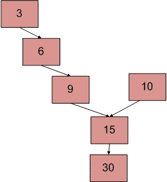
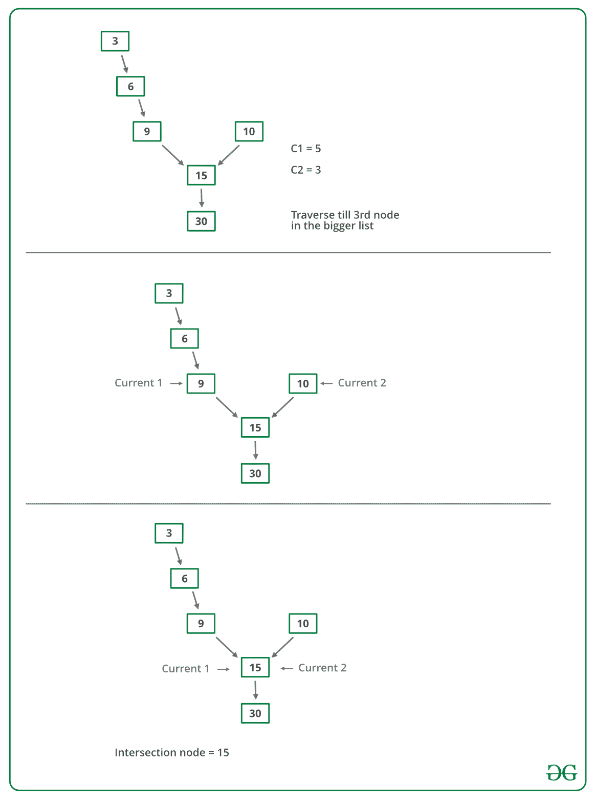

# 寻找两个链表交点的 C++程序

> 原文:[https://www . geesforgeks . org/CPP-寻找两个链表交叉点的程序/](https://www.geeksforgeeks.org/cpp-program-for-finding-intersection-point-of-two-linked-lists/)

一个系统中有两个单链表。由于某种编程错误，其中一个链表的结束节点被链接到第二个链表，形成一个倒 Y 形链表。写一个程序来得到两个链表合并的点。



上图显示了一个例子，两个链表有 15 个交叉点。

**方法 1(简单使用两个循环):**
使用 2 嵌套循环。外部循环将用于第一个列表的每个节点，内部循环将用于第二个列表。在内部循环中，检查第二个列表的任何节点是否与第一个链表的当前节点相同。该方法的时间复杂度为 O(M * N)，其中 M 和 N 是两个列表中的节点数。

**方法 2(标记访问节点):**
该解决方案需要修改基本链表数据结构。每个节点都有一个访问标志。遍历第一个链表，并继续标记被访问的节点。现在遍历第二个链表，如果你再次看到一个被访问的节点，那么有一个交叉点，返回相交节点。该解决方案适用于 **O(m+n)** ，但需要每个节点的附加信息。这种解决方案的变体不需要修改基本数据结构，可以使用散列来实现。遍历第一个链表，并将访问节点的地址存储在一个散列中。现在遍历第二个链表，如果你看到散列中已经存在一个地址，那么返回相交节点。

**方法 3(利用节点数的差异):**

*   获取第一个列表中节点的计数，让计数为 c1。
*   获取第二个列表中节点的计数，让计数为 c2。
*   求计数之差**d = ABS(C1–C2)**
*   现在遍历更大的列表，从第一个节点到 d 个节点，这样从这里开始，两个列表的节点数相等
*   然后，我们可以并行遍历这两个列表，直到遇到一个公共节点。(请注意，获取公共节点是通过比较节点的地址来完成的)

下图是上述方法的模拟运行:



下面是上述方法的实现:

## C++

```
// C++ program to get intersection point of two linked list
#include <bits/stdc++.h>
using namespace std;

// Link list node 
class Node 
{
    public:
    int data;
    Node* next;
};

// Function to get the counts of 
// node in a linked list 
int getCount(Node* head);

/*  Function to get the intersection 
    point of two linked lists head1 
    and head2 where head1 has d more 
    nodes than head2 */
int _getIntesectionNode(int d, Node* head1,
                        Node* head2);

/* Function to get the intersection point 
   of two linked lists head1 and head2 */
int getIntesectionNode(Node* head1, 
                       Node* head2)
{
    // Count the number of nodes in
    // both the linked list
    int c1 = getCount(head1);
    int c2 = getCount(head2);
    int d;

    // If first is greater
    if (c1 > c2) 
    {
        d = c1 - c2;
        return _getIntesectionNode(d, head1,
                                   head2);
    }
    else 
    {
        d = c2 - c1;
        return _getIntesectionNode(d, head2, 
                                   head1);
    }
}

/* Function to get the intersection point 
   of two linked lists head1 and head2 
   where head1 has d more nodes than head2 */
int _getIntesectionNode(int d, Node* head1, 
                        Node* head2)
{
    // Stand at the starting of the 
    // bigger list
    Node* current1 = head1;
    Node* current2 = head2;

    // Move the pointer forward
    for (int i = 0; i < d; i++) 
    {
        if (current1 == NULL) 
        {
            return -1;
        }
        current1 = current1->next;
    }

    // Move both pointers of both list till 
    // they intersect with each other
    while (current1 != NULL && 
           current2 != NULL) 
    {
        if (current1 == current2)
            return current1->data;

        // Move both the pointers forward
        current1 = current1->next;
        current2 = current2->next;
    }

    return -1;
}

/* Takes head pointer of the linked list and 
   returns the count of nodes in the list */
int getCount(Node* head)
{
    Node* current = head;

    // Counter to store count of nodes
    int count = 0;

    // Iterate till NULL
    while (current != NULL) 
    {
        // Increase the counter
        count++;

        // Move the Node ahead
        current = current->next;
    }

    return count;
}

// Driver Code
int main()
{
    /* Create two linked lists     
        1st 3->6->9->15->30 
        2nd 10->15->30     
        15 is the intersection point */
    Node* newNode;

    // Addition of new nodes
    Node* head1 = new Node();
    head1->data = 10;

    Node* head2 = new Node();
    head2->data = 3;

    newNode = new Node();
    newNode->data = 6;
    head2->next = newNode;

    newNode = new Node();
    newNode->data = 9;
    head2->next->next = newNode;

    newNode = new Node();
    newNode->data = 15;
    head1->next = newNode;
    head2->next->next->next = newNode;

    newNode = new Node();
    newNode->data = 30;
    head1->next->next = newNode;

    head1->next->next->next = NULL;

    cout << "The node of intersection is " << 
             getIntesectionNode(head1, head2);
}
// This code is contributed by rathbhupendra
```

**输出:**

```
The node of intersection is 15
```