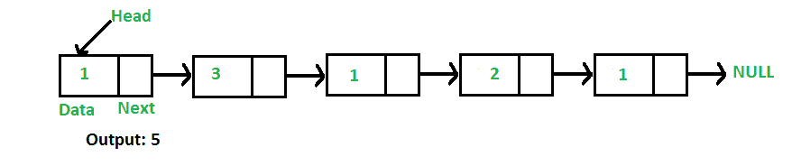

# 用于查找链表长度的 C++程序

> 原文:[https://www . geesforgeks . org/CPP-查找链表长度的程序-迭代递归方法/](https://www.geeksforgeeks.org/cpp-program-for-finding-length-of-a-linked-list-iterative-and-recursive-approach/)

编写一个函数来计算给定单链表中的节点数。



例如，对于链表 1->3->1->2->1，函数应该返回 5。

**迭代解:**

```
1) Initialize count as 0 
2) Initialize a node pointer, current = head.
3) Do following while current is not NULL
     a) current = current -> next
     b) count++;
4) Return count 
```

下面是上述算法的迭代实现，用于查找给定单链表中的节点数。

## C++

```
// Iterative C++ program to find length 
// or count of nodes in a linked list 
#include <bits/stdc++.h>
using namespace std;

// Link list node
class Node 
{ 
    public:
    int data; 
    Node* next; 
}; 

/* Given a reference (pointer to pointer)
   to the head of a list and an int, push 
   a new node on the front of the list. */
void push(Node** head_ref, int new_data) 
{ 
    // Allocate node
    Node* new_node =new Node();

    // Put in the data
    new_node->data = new_data; 

    // Link the old list off the 
    // new node
    new_node->next = (*head_ref); 

    // Move the head to point to 
    // the new node
    (*head_ref) = new_node; 
} 

// Counts no. of nodes in linked list
int getCount(Node* head) 
{ 
    // Initialize count 
    int count = 0; 

    // Initialize current 
    Node* current = head;
    while (current != NULL) 
    { 
        count++; 
        current = current->next; 
    } 
    return count; 
} 

// Driver code
int main() 
{ 
    // Start with the empty list
    Node* head = NULL; 

    // Use push() to construct list 
    // 1->2->1->3->1
    push(&head, 1); 
    push(&head, 3); 
    push(&head, 1); 
    push(&head, 2); 
    push(&head, 1); 

    // Check the count function
    cout << "count of nodes is " << 
             getCount(head); 
    return 0; 
} 

// This is code is contributed by rathbhupendra
```

**输出:**

```
count of nodes is 5
```

**递归解:**

```
int getCount(head)
1) If head is NULL, return 0.
2) Else return 1 + getCount(head->next) 
```

下面是上述算法的递归实现，用于查找给定单链表中的节点数。

## C++

```
// Recursive C++ program to find length
// or count of nodes in a linked list
#include <bits/stdc++.h>
using namespace std;

// Link list node
class Node 
{
    public:
    int data;
    Node* next;
};

/* Given a reference (pointer to pointer) 
   to the head of a list and an int, 
   push a new node on the front of the list. */
void push(Node** head_ref, int new_data)
{
    // Allocate node 
    Node* new_node = new Node();

    // Put in the data
    new_node->data = new_data;

    // Link the old list off the 
    // new node 
    new_node->next = (*head_ref);

    // Move the head to point to 
    // the new node
    (*head_ref) = new_node;
}

// Recursively count number of 
// nodes in linked list 
int getCount(Node* head)
{
    // Base Case
    if (head == NULL) 
    {
        return 0;
    }
    // Count this node plus the rest 
    // of the list
    else 
    {
        return 1 + getCount(head->next);
    }
}

// Driver code
int main()
{
    // Start with the empty list
    Node* head = NULL;

    // Use push() to construct list
    // 1->2->1->3->1
    push(&head, 1);
    push(&head, 3);
    push(&head, 1);
    push(&head, 2);
    push(&head, 1);

    // Check the count function
    cout << "Count of nodes is " << 
             getCount(head);
    return 0;
}
// This is code is contributed by rajsanghavi9
```

**输出:**

```
Count of nodes is 5
```

详情请参考[求链表长度(迭代和递归)](https://www.geeksforgeeks.org/find-length-of-a-linked-list-iterative-and-recursive/)整篇文章！