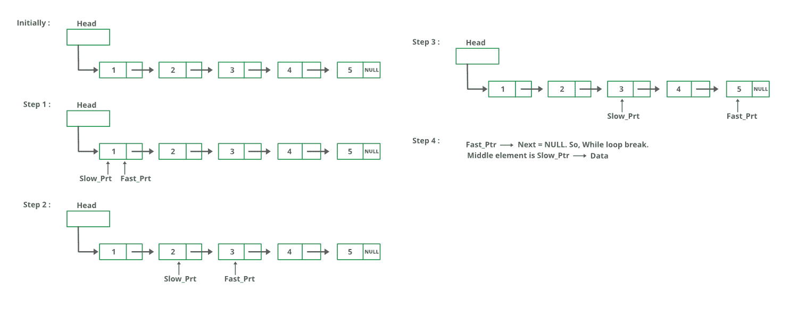

# 寻找给定链表中间元素的 C++程序

> 原文:[https://www . geeksforgeeks . org/CPP-寻找给定链表中间元素的程序/](https://www.geeksforgeeks.org/cpp-program-for-finding-the-middle-element-of-a-given-linked-list/)

给定一个单链表，找到链表的中间。例如，如果给定的链表是 1->2->3->4->5，那么输出应该是 3。
如果有偶数个节点，那么就会有两个中间节点，我们需要打印第二个中间元素。例如，如果给定的链表是 1->2->3->4->5->6，那么输出应该是 4。

**方法 1:**
遍历整个链表，统计节点数。现在再次遍历列表，直到 count/2，并在 count/2 返回节点。

**方法 2:**
使用两个指针遍历链表。将一个指针移动一个，将另一个指针移动两个。当快速指针到达末尾时，慢速指针将到达链表的中间。

下图显示了 printMiddle 函数在代码中的工作方式:



## C++

```
// C++ program for the above approach

#include <iostream>
using namespace std;

class Node{
    public:
        int data;
        Node *next;
};

class NodeOperation{
  public: 

    // Function to add a new node
    void pushNode(class Node** head_ref,int data_val){

        // Allocate node 
        class Node *new_node = new Node();

         // Put in the data 
        new_node->data = data_val;

        // Link the old list off the new node 
        new_node->next = *head_ref;

        // move the head to point to the new node 
        *head_ref = new_node;
    }

    // A utility function to print a given linked list
    void printNode(class Node *head){
        while(head != NULL){
            cout <<head->data << "->";
            head = head->next;
        }
        cout << "NULL" << endl;
    }

    void printMiddle(class Node *head){
        struct Node *slow_ptr = head;
        struct Node *fast_ptr = head;

        if (head!=NULL)
        {
            while (fast_ptr != NULL && fast_ptr->next != NULL)
            {
                fast_ptr = fast_ptr->next->next;
                slow_ptr = slow_ptr->next;
            }
            cout << "The middle element is [" << slow_ptr->data << "]" << endl;
        }
    }
};

// Driver Code
int main(){
    class Node *head = NULL;
    class NodeOperation *temp = new NodeOperation();
    for(int i=5; i>0; i--){
        temp->pushNode(&head, i);
        temp->printNode(head);
        temp->printMiddle(head);
    }
    return 0;
}
```

**Output**

```
5->NULL
The middle element is [5]

4->5->NULL
The middle element is [5]

3->4->5->NULL
The middle element is [4]

2->3->4->5->NULL
The middle element is [4]

1->2->3->4->5->NULL
The middle element is [3]
```

**方法 3:**
将中间元素初始化为 head，将一个计数器初始化为 0。从头开始遍历列表，遍历时递增计数器，当计数器为奇数时，将中间变为下一个中间>。所以 mid 只会移动列表总长度的一半。
感谢纳伦德拉·康拉尔卡尔提出这个方法。

## C++

```
#include <bits/stdc++.h>
using namespace std;

// Link list node 
struct node
{
    int data;
    struct node* next;
};

// Function to get the middle of
// the linked list
void printMiddle(struct node* head)
{
    int count = 0;
    struct node* mid = head;

    while (head != NULL)
    {

        // Update mid, when 'count'
        // is odd number 
        if (count & 1)
            mid = mid->next;

        ++count;
        head = head->next;
    }

    // If empty list is provided 
    if (mid != NULL)
        printf("The middle element is [%d]

", 
                mid->data);
}

void push(struct node** head_ref, int new_data)
{

    // Allocate node 
    struct node* new_node = (struct node*)malloc(
        sizeof(struct node));

    // Put in the data 
    new_node->data = new_data;

    // Link the old list off the new node 
    new_node->next = (*head_ref);

    // Move the head to point to
    // the new node 
    (*head_ref) = new_node;
}

// A utility function to print 
// a given linked list
void printList(struct node* ptr)
{
    while (ptr != NULL)
    {
        printf("%d->", ptr->data);
        ptr = ptr->next;
    }
    printf("NULL
");
}

// Driver code
int main()
{

    // Start with the empty list 
    struct node* head = NULL;
    int i;

    for(i = 5; i > 0; i--) 
    {
        push(&head, i);
        printList(head);
        printMiddle(head);
    }
    return 0;
}

// This code is contributed by ac121102
```

**Output**

```
5->NULL
The middle element is [5]

4->5->NULL
The middle element is [5]

3->4->5->NULL
The middle element is [4]

2->3->4->5->NULL
The middle element is [4]

1->2->3->4->5->NULL
The middle element is [3]
```

更多详情请参考[找到给定链表](https://www.geeksforgeeks.org/write-a-c-function-to-print-the-middle-of-the-linked-list/)中间的整篇文章！