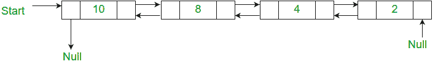

# 双链表合并排序的 C++程序

> 原文:[https://www . geesforgeks . org/CPP-program-for-merge-sort-for-double-link-list/](https://www.geeksforgeeks.org/cpp-program-for-merge-sort-for-doubly-linked-list/)

给定一个双向链表，编写一个函数，使用合并排序按升序对双向链表进行排序。
例如，下面的双向链表应该改为 24810



[单链表的合并排序](https://www.geeksforgeeks.org/merge-sort-for-linked-list/)已经讨论过了。这里重要的变化是在合并两个列表时也要修改前面的指针。

下面是双链表合并排序的实现。

## C++

```
// C++ program for merge sort on doubly 
// linked list 
#include <bits/stdc++.h>
using namespace std;
class Node 
{ 
    public:
    int data; 
    Node *next, *prev; 
}; 

Node *split(Node *head); 

// Function to merge two linked lists 
Node *merge(Node *first, Node *second) 
{ 
    // If first linked list is empty 
    if (!first) 
        return second; 

    // If second linked list is empty 
    if (!second) 
        return first; 

    // Pick the smaller value 
    if (first->data < second->data) 
    { 
        first->next = merge(first->next,
                            second); 
        first->next->prev = first; 
        first->prev = NULL; 
        return first; 
    } 
    else
    { 
        second->next = merge(first,second->next); 
        second->next->prev = second; 
        second->prev = NULL; 
        return second; 
    } 
} 

// Function to do merge sort 
Node *mergeSort(Node *head) 
{ 
    if (!head || !head->next) 
        return head; 
    Node *second = split(head); 

    // Recur for left and right halves 
    head = mergeSort(head); 
    second = mergeSort(second); 

    // Merge the two sorted halves 
    return merge(head,second); 
} 

// A utility function to insert a new node 
// at the beginning of doubly linked list 
void insert(Node **head, int data) 
{ 
    Node *temp = new Node();
    temp->data = data; 
    temp->next = temp->prev = NULL; 
    if (!(*head)) 
        (*head) = temp; 
    else
    { 
        temp->next = *head; 
        (*head)->prev = temp; 
        (*head) = temp; 
    } 
} 

// A utility function to print a doubly 
// linked list in both forward and 
// backward directions 
void print(Node *head) 
{ 
    Node *temp = head; 
    cout << 
    "Forward Traversal using next pointer"; 
    while (head) 
    { 
        cout << head->data << " "; 
        temp = head; 
        head = head->next; 
    } 
    cout << 
    "Backward Traversal using prev pointer"; 
    while (temp) 
    { 
        cout << temp->data << " "; 
        temp = temp->prev; 
    } 
} 

// Utility function to swap two integers 
void swap(int *A, int *B) 
{ 
    int temp = *A; 
    *A = *B; 
    *B = temp; 
} 

// Split a doubly linked list (DLL) into
// 2 DLLs of half sizes 
Node *split(Node *head) 
{ 
    Node *fast = head,*slow = head; 
    while (fast->next && fast->next->next) 
    { 
        fast = fast->next->next; 
        slow = slow->next; 
    } 
    Node *temp = slow->next; 
    slow->next = NULL; 
    return temp; 
} 

// Driver program 
int main(void) 
{ 
    Node *head = NULL; 
    insert(&head, 5); 
    insert(&head, 20); 
    insert(&head, 4); 
    insert(&head, 3); 
    insert(&head, 30); 
    insert(&head, 10); 
    head = mergeSort(head); 
    cout << "Linked List after sorting"; 
    print(head); 
    return 0; 
}
// This is code is contributed by rathbhupendra
```

**输出:**

```
Linked List after sorting
Forward Traversal using next pointer
3 4 5 10 20 30
Backward Traversal using prev pointer
30 20 10 5 4 3
```

**时间复杂度:**上述实现的时间复杂度与[数组合并排序](http://geeksquiz.com/merge-sort/)的时间复杂度相同。需要θ(nLogn)时间。

**空间复杂度:** O(1)。我们只使用恒定量的额外空间。
你可能还想看[快速排序双链表](https://www.geeksforgeeks.org/quicksort-for-linked-list/)T5】详情请参考[合并排序双链表](https://www.geeksforgeeks.org/merge-sort-for-doubly-linked-list/)完整文章！