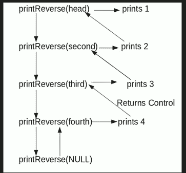

# C++程序打印链表的反转而不实际反转

> 原文:[https://www . geesforgeks . org/CPP-打印程序-反向链接列表-不实际反向/](https://www.geeksforgeeks.org/cpp-program-for-printing-reverse-of-a-linked-list-without-actually-reversing/)

给定一个链表，使用递归函数打印它的逆序。例如，如果给定的链表是 1->2->3->4，那么输出应该是 4->3->2->1。
注意，问题只是关于打印反面。要反转列表本身请参见[本](https://www.geeksforgeeks.org/reverse-a-linked-list/)T3**难度等级:**菜鸟



**算法:**

```
printReverse(head)
  1\. call print reverse for head->next
  2\. print head->data
```

**实施:**

## C++

```
// C++ program to print reverse of a linked list
#include <bits/stdc++.h>
using namespace std;

// Link list node
class Node
{
    public:
    int data;
    Node* next;
};

// Function to reverse the
// linked list
void printReverse(Node* head)
{
    // Base case
    if (head == NULL)
    return;

    // Print the list after head node
    printReverse(head->next);

    // After everything else is printed,
    // print head
    cout << head->data << " ";
}

// UTILITY FUNCTIONS
/* Push a node to linked list.
   Note that this function
   changes the head */
void push(Node** head_ref,
          char new_data)
{
    // Allocate node
    Node* new_node = new Node();

    // Put in the data
    new_node->data = new_data;

    // Link the old list off the
    // new node
    new_node->next = (*head_ref);

    // Move the head to point to
    // the new node
    (*head_ref) = new_node;
}

// Driver code
int main()
{
    // Let us create linked list
    // 1->2->3->4
    Node* head = NULL;
    push(&head, 4);
    push(&head, 3);
    push(&head, 2);
    push(&head, 1);

    printReverse(head);
    return 0;
}
// This code is contributed by rathbhupendra
```

**输出:**

```
4 3 2 1
```

**时间复杂度:** O(n)

更多详情请参考[打印链表的反转而不实际反转](https://www.geeksforgeeks.org/print-reverse-of-a-linked-list-without-actually-reversing/)的完整文章！