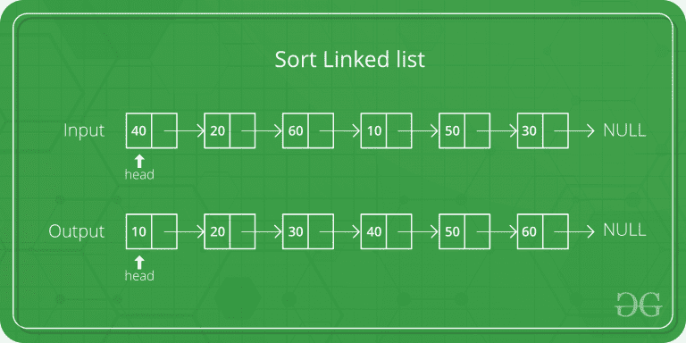

# 单链表快速排序的 C++程序

> 原文:[https://www . geesforgeks . org/CPP-program-for-quick sort-on-single-link-list/](https://www.geeksforgeeks.org/cpp-program-for-quicksort-on-singly-linked-list/)

[在双链表上快速排序](https://www.geeksforgeeks.org/quicksort-for-linked-list/)在这里[讨论](https://www.geeksforgeeks.org/quicksort-for-linked-list/)。单链表上的快速排序是作为练习给出的。关于实现的重要事情是，它改变指针而不是交换数据，并且时间复杂度与双链表的实现相同。



在**分区()**中，我们将最后一个元素视为轴心。我们遍历当前列表，如果一个节点的值大于 pivot，我们将它移到 tail 之后。如果节点的值较小，我们会将其保持在当前位置。

在**quick sort recursive()**中，我们首先调用 partition()将 pivot 放在正确的位置并返回 pivot。在枢轴被放置在正确的位置之后，我们找到左侧(枢轴之前的列表)的尾部节点，并为左侧列表重现。最后，我们重现正确的列表。

## C++

```
// C++ program for Quick Sort on 
// Singly Linked List
#include <cstdio>
#include <iostream>
using namespace std;

// A node of the singly 
// linked list 
struct Node 
{
    int data;
    struct Node* next;
};

/* A utility function to insert a 
   node at the beginning of 
   linked list */
void push(struct Node** head_ref, 
          int new_data)
{
    // Allocate node 
    struct Node* new_node = new Node;

    // Put in the data 
    new_node->data = new_data;

    // Link the old list off the 
    // new node 
    new_node->next = (*head_ref);

    // Move the head to point to 
    // the new node 
    (*head_ref) = new_node;
}

// A utility function to print 
// linked list 
void printList(struct Node* node)
{
    while (node != NULL) 
    {
        printf("%d ", node->data);
        node = node->next;
    }
    printf("");
}

// Returns the last node of the list
struct Node* getTail(struct Node* cur)
{
    while (cur != NULL &&
           cur->next != NULL)
        cur = cur->next;
    return cur;
}

// Partitions the list taking the 
// last element as the pivot
struct Node* partition(struct Node* head, 
                       struct Node* end,
                       struct Node** newHead,
                       struct Node** newEnd)
{
    struct Node* pivot = end;
    struct Node *prev = NULL, 
                *cur = head, *tail = pivot;

    // During partition, both the head and 
    // end of the list might change which 
    // is updated in the newHead and newEnd 
    // variables
    while (cur != pivot) 
    {
        if (cur->data < pivot->data) 
        {
            // First node that has a value 
            // less than the pivot - becomes 
            // the new head
            if ((*newHead) == NULL)
                (*newHead) = cur;

            prev = cur;
            cur = cur->next;
        }

        // If cur node is greater than pivot
        else 
        {
            // Move cur node to next of tail, 
            // and change tail
            if (prev)
                prev->next = cur->next;
            struct Node* tmp = cur->next;
            cur->next = NULL;
            tail->next = cur;
            tail = cur;
            cur = tmp;
        }
    }

    // If the pivot data is the smallest element 
    // in the current list, pivot becomes the head
    if ((*newHead) == NULL)
        (*newHead) = pivot;

    // Update newEnd to the current last node
    (*newEnd) = tail;

    // Return the pivot node
    return pivot;
}

// here the sorting happens exclusive of the 
// end node
struct Node* quickSortRecur(struct Node* head,
                            struct Node* end)
{
    // Base condition
    if (!head || head == end)
        return head;

    Node *newHead = NULL, *newEnd = NULL;

    // Partition the list, newHead and newEnd 
    // will be updated by the partition function
    struct Node* pivot = partition(head, end, 
                                   &newHead, &newEnd);

    // If pivot is the smallest element - no need 
    // to recur for the left part.
    if (newHead != pivot)
    {
        // Set the node before the pivot node 
        // as NULL
        struct Node* tmp = newHead;
        while (tmp->next != pivot)
            tmp = tmp->next;
        tmp->next = NULL;

        // Recur for the list before pivot
        newHead = quickSortRecur(newHead, tmp);

        // Change next of last node of the 
        // left half to pivot
        tmp = getTail(newHead);
        tmp->next = pivot;
    }

    // Recur for the list after the 
    // pivot element
    pivot->next = quickSortRecur(pivot->next, 
                                 newEnd);

    return newHead;
}

// The main function for quick sort. 
// This is a wrapper over recursive 
// function quickSortRecur()
void quickSort(struct Node** headRef)
{
    (*headRef) = quickSortRecur(*headRef, 
                                 getTail(*headRef));
    return;
}

// Driver code
int main()
{
    struct Node* a = NULL;
    push(&a, 5);
    push(&a, 20);
    push(&a, 4);
    push(&a, 3);
    push(&a, 30);

    cout << "Linked List before sorting ";
    printList(a);

    quickSort(&a);

    cout << "Linked List after sorting ";
    printList(a);

    return 0;
}
```

**输出:**

```
Linked List before sorting 
30 3 4 20 5 
Linked List after sorting 
3 4 5 20 30 
```

详情请参考[单链表快速排序](https://www.geeksforgeeks.org/quicksort-on-singly-linked-list/)整篇文章！