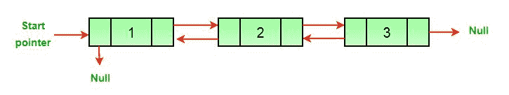
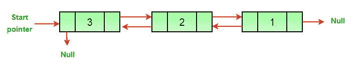

# 反转双向链表的 C++程序

> 原文:[https://www . geeksforgeeks . org/CPP-反向程序-双向链表/](https://www.geeksforgeeks.org/cpp-program-for-reversing-a-doubly-linked-list/)

给定一个[双链表](https://www.geeksforgeeks.org/doubly-linked-list/)，任务是反转给定的双链表。

例如，见下图。

```
(a) Original Doubly Linked List 
```



```
(b) Reversed Doubly Linked List 
```



这里有一个简单的方法来反转双向链表。我们所需要做的就是交换所有节点的上一个和下一个指针，改变头(或开始)的上一个，最后改变头指针。

## C++

```
/* C++ program to reverse a doubly 
   linked list */
#include <bits/stdc++.h>
using namespace std;

// A node of the doubly linked list 
class Node 
{ 
    public:
    int data; 
    Node *next; 
    Node *prev; 
}; 

/* Function to reverse a Doubly 
   Linked List */
void reverse(Node **head_ref) 
{ 
    Node *temp = NULL; 
    Node *current = *head_ref; 

    /* Swap next and prev for all nodes of 
       doubly linked list */
    while (current != NULL) 
    { 
        temp = current->prev; 
        current->prev = current->next; 
        current->next = temp;             
        current = current->prev; 
    } 

    /* Before changing the head, check for 
       the cases like empty list and list 
       with only one node */
    if(temp != NULL ) 
        *head_ref = temp->prev; 
} 

// UTILITY FUNCTIONS 
/* Function to insert a node at the
   beginning of the Doubly Linked List */
void push(Node** head_ref, int new_data) 
{ 
    // Allocate node 
    Node* new_node = new Node();

    // Put in the data
    new_node->data = new_data; 

    /* Since we are adding at the beginning, 
       prev is always NULL */
    new_node->prev = NULL; 

    /* Link the old list off the 
       new node */
    new_node->next = (*head_ref);     

    /* Change prev of head node to 
       new node */
    if((*head_ref) != NULL) 
    (*head_ref)->prev = new_node ; 

    /* Move the head to point to the 
       new node */
    (*head_ref) = new_node; 
} 

/* Function to print nodes in a given 
   doubly linked list. This function is 
   same as printList() of singly linked list */
void printList(Node *node) 
{ 
    while(node != NULL) 
    { 
        cout << node->data << " "; 
        node = node->next; 
    } 
} 

// Driver code 
int main() 
{ 
    // Start with the empty list 
    Node* head = NULL; 

    /* Let us create a sorted linked list 
       to test the functions. Created linked 
       list will be 10->8->4->2 */
    push(&head, 2); 
    push(&head, 4); 
    push(&head, 8); 
    push(&head, 10); 

    cout << 
    "Original Linked list" << endl; 
    printList(head); 

    // Reverse doubly linked list 
    reverse(&head); 

    cout << 
    "Reversed Linked list" << endl; 
    printList(head);         

    return 0;
} 
// This code is contributed by rathbhupendra
```

**输出:**

```
Original linked list 
10 8 4 2 
The reversed Linked List is 
2 4 8 10
```

**时间复杂度:** O(N)，其中 N 表示双向链表中的节点数。
辅助空间:O(1)
我们也可以交换数据而不是指针来反转双链表。[反转数组的方法](https://www.geeksforgeeks.org/write-a-program-to-reverse-an-array-or-string/)可以用来交换数据。与指针相比，如果数据项的大小更大，交换数据的成本会更高。
如发现以上代码/算法有不正确的地方，请写评论，或者找到更好的方法解决同样的问题。

**方法二:**

同样的问题也可以用 Stacks 来做。

步骤:

1.  继续在堆栈中推送节点的数据。-> O(n)
2.  不断弹出元素并更新双向链表

## C++

```
// C++ program to reverse a doubly linked list
#include <bits/stdc++.h>
using namespace std;
struct LinkedList 
{
    struct Node 
    {
        int data;
        Node *next, *prev;
        Node(int d)
        {
            data = d;
            next = prev = NULL;
        }
    };
    Node* head = NULL;

    /* Function to reverse a Doubly Linked 
       List using Stacks */
    void reverse()
    {
        stack<int> st;
        Node* temp = head;
        while (temp != NULL) 
        {
            st.push(temp->data);
            temp = temp->next;
        }

        // Added all the elements sequence 
        // wise in the set
        temp = head;
        while (temp != NULL) 
        {
            temp->data = st.top();
            st.pop();
            temp = temp->next;
        }

        // Popped all the elements and the 
        // added in the linked list, which 
        // are in the reversed order->
    }

    // UTILITY FUNCTIONS 
    /* Function to insert a node at the 
       beginning of the Doubly Linked List */
    void Push(int new_data)
    {
        // Allocate node 
        Node* new_node = 
              new Node(new_data);

        /* Since we are adding at the 
           beginning, prev is always NULL */
        new_node->prev = NULL;

        /* Link the old list off the 
           new node */
        new_node->next = head;

        /* Change prev of head node to 
           new node */
        if (head != NULL) 
        {
            head->prev = new_node;
        }

        /* Move the head to point to the 
           new node */
        head = new_node;
    }

    /* Function to print nodes in a given 
       doubly linked list. This function is 
       same as printList() of singly linked list */
    void printList(Node* node)
    {
        while (node)
        {
            cout << node->data << " ";
            node = node->next;
        }
    }
};

// Driver Code
int main()
{
    LinkedList list;

    /* Let us create a sorted linked list 
       to test the functions Created linked 
       list will be 10->8->4->2 */
    list.Push(2);
    list.Push(4);
    list.Push(8);
    list.Push(10);
    cout << 
    "Original linked list " << endl;
    list.printList(list.head);
    list.reverse();
    cout << endl;
    cout << 
    "The reversed Linked List is " << endl;
    list.printList(list.head);
}
// This code is contributed by Pratham76
```

**输出**

```
Original linked list 
10 8 4 2 
The reversed Linked List is 
2 4 8 10
```

**时间复杂度:**O(N)
T3】辅助空间: O(N)

在这个方法中，我们遍历链表一次，并将元素添加到堆栈中，然后再次遍历整个链表来更新所有元素。整体耗时 2n，是 O(n)的时间复杂度。

更多详情请参考[反向双链表](https://www.geeksforgeeks.org/reverse-a-doubly-linked-list/)整篇文章！