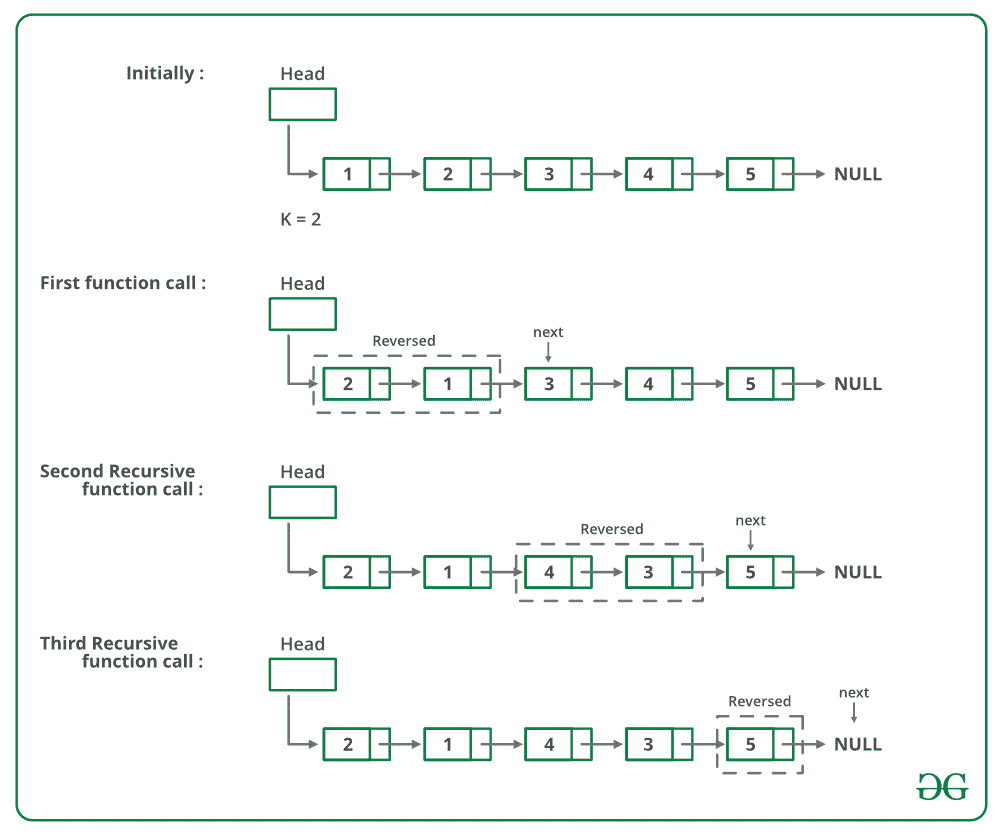

# 在给定大小的组中反转链表的 C++程序–集合 1

> 原文:[https://www . geeksforgeeks . org/CPP-用于反转给定大小的组中链表的程序集-1/](https://www.geeksforgeeks.org/cpp-program-for-reversing-a-linked-list-in-groups-of-given-size-set-1/)

给定一个链表，编写一个函数来反转每 k 个节点(其中 k 是函数的输入)。

**示例:**

> 输入:1->【2】>【3】>【4】>【5】>【6】>【7】>【8】>【null】，K = 3
> **输出【0】**

**算法:** [*反转*](https://www.geeksforgeeks.org/reverse-a-linked-list/) *(head，k)*

*   反转大小为 k 的第一个子列表。反转时，跟踪下一个节点和上一个节点。让指向下一个节点的指针为*下一个*，指向上一个节点的指针为*上一个*。反向链表见[本帖](https://www.geeksforgeeks.org/reverse-a-linked-list/)。
*   *head- > next = reverse(next，k)* (递归调用列表的其余部分并链接两个子列表)
*   返回 *prev* ( *prev* 成为新的列表头(参见[这篇文章](https://www.geeksforgeeks.org/reverse-a-linked-list/)的一个迭代方法的图表)

下图显示了反向功能的工作原理:



下面是上述方法的实现:

## C++

```
// C++ program to reverse a linked list
// in groups of given size
#include <bits/stdc++.h>
using namespace std;

// Link list node 
class Node 
{
    public:
    int data;
    Node* next;
};

/* Reverses the linked list in groups
  of size k and returns the pointer
  to the new head node. */
Node* reverse(Node* head, int k)
{
    // Base case
    if (!head)
        return NULL;
    Node* current = head;
    Node* next = NULL;
    Node* prev = NULL;
    int count = 0;

    // Reverse first k nodes of the
    // linked list 
    while (current != NULL && 
           count < k)  
    {
        next = current->next;
        current->next = prev;
        prev = current;
        current = next;
        count++;
    }

    /* next is now a pointer to (k+1)th node
       Recursively call for the list starting  
       from current. And make rest of the list 
       as next of first node */
    if (next != NULL)
        head->next = reverse(next, k);

    // prev is new head of the input list 
    return prev;
}

// UTILITY FUNCTIONS 
// Function to push a node 
void push(Node** head_ref, 
          int new_data)
{
    // Allocate node 
    Node* new_node = new Node();

    // Put in the data 
    new_node->data = new_data;

    // Link the old list off the 
    // new node 
    new_node->next = (*head_ref);

    // Move the head to point to 
    // the new node 
    (*head_ref) = new_node;
}

// Function to print linked list 
void printList(Node* node)
{
    while (node != NULL) 
    {
        cout << node->data << " ";
        node = node->next;
    }
}

// Driver code
int main()
{
    // Start with the empty list 
    Node* head = NULL;

    /* Create Linked list 
       1->2->3->4->5->6->7->8->9 */
    push(&head, 9);
    push(&head, 8);
    push(&head, 7);
    push(&head, 6);
    push(&head, 5);
    push(&head, 4);
    push(&head, 3);
    push(&head, 2);
    push(&head, 1);

    cout << "Given linked list ";
    printList(head);
    head = reverse(head, 3);

    cout << "Reversed Linked list ";
    printList(head);

    return (0);
}
// This code is contributed by rathbhupendra
```

**输出:**

```
Given Linked List
1 2 3 4 5 6 7 8 9 
Reversed list
3 2 1 6 5 4 9 8 7 
```

**复杂度分析:**

*   **时间复杂度:** O(n)。
    遍历列表只做一次，它有 n 个元素。
*   **辅助空间:** O(n/k)。
    对于每个大小为 n、n/k 或(n/k)+1 的链表，在递归过程中将进行调用。

更多详细信息，请参考完整的文章[在给定大小的组中反向链表|集合 1](https://www.geeksforgeeks.org/reverse-a-list-in-groups-of-given-size/) ！