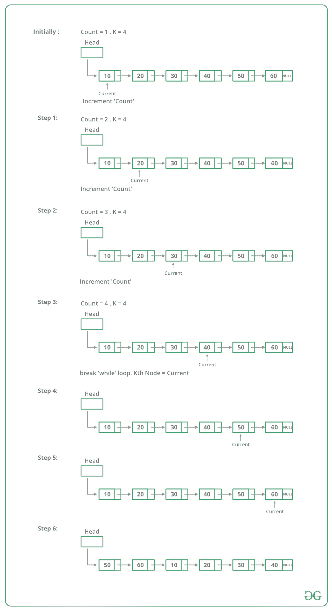

# 旋转链表的 C++程序

> 原文:[https://www . geeksforgeeks . org/CPP-用于旋转链表的程序/](https://www.geeksforgeeks.org/cpp-program-for-rotating-a-linked-list/)

给定一个单链表，逆时针旋转链表 k 个节点。其中 k 是给定的正整数。例如，如果给定的链表是 10->20->30->40->50->60，k 是 4，那么应该将链表修改为 50->60->10->20->30->40。假设 k 小于链表中的节点数。

**方法 1:**
要旋转链表，我们需要将第 kth 个节点的下一个节点改为 NULL，将最后一个节点的下一个节点改为前一个头节点，最后将头改为第(k+1)个节点。所以我们需要获得三个节点:第 k 个节点，(k+1)个节点和最后一个节点。
从头遍历列表，在第 kth 个节点停止。存储指向第 k 个节点的指针。接下来我们可以使用 kthNode- >获得第(k+1)个节点。一直遍历到最后，并存储一个指向最后一个节点的指针。最后，如上所述更改指针。

下图显示了旋转函数如何在代码中工作:



## C++

```
// C++ program to rotate a 
// linked list counter clock wise
#include <bits/stdc++.h>
using namespace std;

// Link list node 
class Node 
{
    public:
    int data;
    Node* next;
};

// This function rotates a linked list
// counter-clockwise and updates the
// head. The function assumes that k is
// smaller than size of linked list.
// It doesn't modify the list if
// k is greater than or equal to size
void rotate(Node** head_ref, int k)
{
    if (k == 0)
        return;

    // Let us understand the below
    // code for example k = 4 and
    // list = 10->20->30->40->50->60.
    Node* current = *head_ref;

    // current will either point to
    // kth or NULL after this loop.
    // current will point to node
    // 40 in the above example
    int count = 1;
    while (count < k && 
           current != NULL) 
    {
        current = current->next;
        count++;
    }

    // If current is NULL, k is greater 
    // than or equal to count of nodes 
    // in linked list. Don't change the 
    // list in this case
    if (current == NULL)
        return;

    // current points to kth node.
    // Store it in a variable. kthNode
    // points to node 40 in the above 
    // example
    Node* kthNode = current;

    // current will point to
    // last node after this loop
    // current will point to
    // node 60 in the above example
    while (current->next != NULL)
        current = current->next;

    // Change next of last node to 
    // previous head. Next of 60 is 
    // now changed to node 10
    current->next = *head_ref;

    // Change head to (k+1)th node
    // head is now changed to node 50
    *head_ref = kthNode->next;

    // Change next of kth node to NULL
    // next of 40 is now NULL
    kthNode->next = NULL;
}

// UTILITY FUNCTIONS 
// Function to push a node 
void push(Node** head_ref, 
          int new_data)
{
    // Allocate node 
    Node* new_node = new Node();

    // Put in the data 
    new_node->data = new_data;

    // Link the old list off the 
    // new node 
    new_node->next = (*head_ref);

    // Move the head to point to the 
    // new node 
    (*head_ref) = new_node;
}

// Function to print linked list 
void printList(Node* node)
{
    while (node != NULL) 
    {
        cout << node->data << " ";
        node = node->next;
    }
}

// Driver code
int main(void)
{
    // Start with the empty list 
    Node* head = NULL;

    // Create a list 
    // 10->20->30->40->50->60
    for (int i = 60; i > 0; i -= 10)
        push(&head, i);

    cout << "Given linked list ";
    printList(head);
    rotate(&head, 4);

    cout << "Rotated Linked list ";
    printList(head);

    return (0);
}
// This code is contributed by rathbhupendra
```