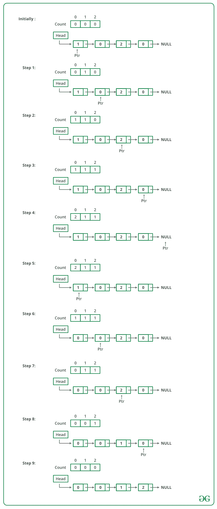

# 用于排序 0、1 和 2s 链表的 C++程序

> 原文:[https://www . geesforgeks . org/CPP-用于排序的程序-0-1-和-2s 的链表/](https://www.geeksforgeeks.org/cpp-program-for-sorting-a-linked-list-of-0s-1s-and-2s/)

给定一个 0、1 和 2 的链表，对其进行排序。
**例**:

```
Input: 1 -> 1 -> 2 -> 0 -> 2 -> 0 -> 1 -> NULL
Output: 0 -> 0 -> 1 -> 1 -> 1 -> 2 -> 2 -> NULL

Input: 1 -> 1 -> 2 -> 1 -> 0 -> NULL 
Output: 0 -> 1 -> 1 -> 1 -> 2 -> NULL

```

来源:[微软访谈|第一集](https://www.geeksforgeeks.org/microsoft-interview-set-1/)

可以使用以下步骤对给定的链表进行排序。

*   遍历列表，计算 0、1 和 2 的数量。让计数分别为 n1、n2 和 n3。
*   再次遍历列表，首先用 0 填充 n1 个节点，然后用 1 填充 n2 个节点，最后用 2 填充 n3 个节点。

下图是上述方法的模拟运行:



下面是上述方法的实现:

## C++

```
// C++ Program to sort a linked list 
// 0s, 1s or 2s 
#include <bits/stdc++.h>
using namespace std;

// Link list node 
class Node 
{ 
    public:
    int data; 
    Node* next; 
}; 

// Function to sort a linked list 
// of 0s, 1s and 2s 
void sortList(Node *head) 
{ 
    // Initialize count of '0', '1' 
    // and '2' as 0 
    int count[3] = {0, 0, 0}; 
    Node *ptr = head; 

    /* Count total number of '0', '1' and '2' 
       count[0] will store total number of '0's 
       count[1] will store total number of '1's 
       count[2] will store total number of '2's */
    while (ptr != NULL) 
    { 
        count[ptr->data] += 1; 
        ptr = ptr->next; 
    } 

    int i = 0; 
    ptr = head; 

    /* Let say count[0] = n1, count[1] = n2 
       and count[2] = n3.
       Now start traversing list from head node, 
       1) fill the list with 0, till n1 > 0 
       2) fill the list with 1, till n2 > 0 
       3) fill the list with 2, till n3 > 0 */
    while (ptr != NULL) 
    { 
        if (count[i] == 0) 
            ++i; 
        else
        { 
            ptr->data = i; 
            --count[i]; 
            ptr = ptr->next; 
        } 
    } 
} 

// Function to push a node
void push (Node** head_ref, 
           int new_data) 
{ 
    // Allocate node 
    Node* new_node = new Node();

    // Put in the data 
    new_node->data = new_data; 

    // Link the old list off the 
    // new node 
    new_node->next = (*head_ref); 

    // Move the head to point to the 
    // new node 
    (*head_ref) = new_node; 
} 

// Function to print linked list 
void printList(Node *node) 
{ 
    while (node != NULL) 
    { 
        cout << node->data << " "; 
        node = node->next; 
    } 
    cout << endl; 
} 

// Driver code
int main(void) 
{ 
    Node *head = NULL; 
    push(&head, 0); 
    push(&head, 1); 
    push(&head, 0); 
    push(&head, 2); 
    push(&head, 1); 
    push(&head, 1); 
    push(&head, 2); 
    push(&head, 1); 
    push(&head, 2); 

    cout << "Linked List Before Sorting"; 
    printList(head); 

    sortList(head); 

    cout << "Linked List After Sorting"; 
    printList(head); 

    return 0; 
} 
// This code is contributed by rathbhupendra
```

**输出:**

```
Linked List Before Sorting
2  1  2  1  1  2  0  1  0
Linked List After Sorting
0  0  1  1  1  1  2  2  2
```

**时间复杂度:** O(n)，其中 n 为链表中的节点数。
**辅助空间:** O(1)

更多详情请参考[整理 0，1，2s](https://www.geeksforgeeks.org/sort-a-linked-list-of-0s-1s-or-2s/) 链表整篇文章！