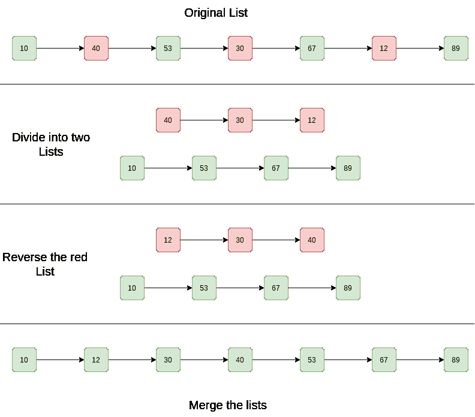

# C++程序，用于对按升序和降序交替排序的链表进行排序

> 原文:[https://www . geesforgeks . org/CPP-用于排序的程序-链接列表-即排序-交替-升序和降序/](https://www.geeksforgeeks.org/cpp-program-for-sorting-a-linked-list-that-is-sorted-alternating-ascending-and-descending-orders/)

给定一个链表。链表是以交替的升序和降序排列的。高效地对列表进行排序。

**示例:**

```
Input List: 10 -> 40 -> 53 -> 30 -> 67 -> 12 -> 89 -> NULL
Output List: 10 -> 12 -> 30 -> 40 -> 53 -> 67 -> 89 -> NULL

Input List: 1 -> 4 -> 3 -> 2 -> 5 -> NULL
Output List: 1 -> 2 -> 3 -> 4 -> 5 -> NULL
```

**简单解法:**
**方法:**基本思路是在链表上应用合并排序。
本文讨论了实现:[链表合并排序](https://www.geeksforgeeks.org/merge-sort-for-linked-list/)。
**复杂性分析:**

*   **时间复杂度:**链表的合并排序需要 O(n log n)时间。在合并排序树中，高度是 log n。对每个级别进行排序将花费 O(n)个时间。所以时间复杂度为 O(n ^ log n)。
*   **辅助空间:** O(n log n)，在合并排序树中高度为 log n，存储每一级将占用 O(n)空间。所以空间复杂度为 O(n ^ log n)。

**高效解决方案:**
**进场:**

1.  分开两个列表。
2.  以降序颠倒顺序
3.  合并两个列表。

**图示:**



以下是上述算法的实现:

## C++

```
// C++ program to sort a linked
// list that is alternatively sorted 
// in increasing and decreasing order
#include <bits/stdc++.h>
using namespace std;

// Linked list node
struct Node 
{
    int data;
    struct Node* next;
};

Node* mergelist(Node* head1, 
                Node* head2);
void splitList(Node* head, 
               Node** Ahead, 
               Node** Dhead);
void reverselist(Node*& head);

// This is the main function that 
// sorts the linked list
void sort(Node** head)
{
    // Split the list into lists
    Node *Ahead, *Dhead;
    splitList(*head, &Ahead, &Dhead);

    // Reverse the descending linked list
    reverselist(Dhead);

    // Merge the two linked lists
    *head = mergelist(Ahead, Dhead);
}

// A utility function to create a 
// new node
Node* newNode(int key)
{
    Node* temp = new Node;
    temp->data = key;
    temp->next = NULL;
    return temp;
}

// A utility function to reverse a 
// linked list
void reverselist(Node*& head)
{
    Node *prev = NULL, 
         *curr = head, *next;
    while (curr) 
    {
        next = curr->next;
        curr->next = prev;
        prev = curr;
        curr = next;
    }
    head = prev;
}

// A utility function to print 
// a linked list
void printlist(Node* head)
{
    while (head != NULL) 
    {
        cout << head->data << " ";
        head = head->next;
    }
    cout << endl;
}

// A utility function to merge 
// two sorted linked lists
Node* mergelist(Node* head1, 
                Node* head2)
{
    // Base cases
    if (!head1)
        return head2;
    if (!head2)
        return head1;

    Node* temp = NULL;
    if (head1->data < head2->data) 
    {
        temp = head1;
        head1->next = mergelist(head1->next, 
                                head2);
    }
    else 
    {
        temp = head2;
        head2->next = mergelist(head1, 
                                head2->next);
    }
    return temp;
}

// This function alternatively splits
// a linked list with head as head into two:
// For example, 10->20->30->15->40->7 
// is splitted into 10->30->40 and 20->15->7
// "Ahead" is reference to head of ascending 
// linked list
// "Dhead" is reference to head of descending 
// linked list
void splitList(Node* head, Node** Ahead, 
               Node** Dhead)
{
    // Create two dummy nodes to 
    // initialize heads of two 
    // linked list
    *Ahead = newNode(0);
    *Dhead = newNode(0);

    Node* ascn = *Ahead;
    Node* dscn = *Dhead;
    Node* curr = head;

    // Link alternate nodes
    while (curr) 
    {
        // Link alternate nodes of ascending 
        // linked list
        ascn->next = curr;
        ascn = ascn->next;
        curr = curr->next;

        // Link alternate nodes of descending 
        // linked list
        if (curr) 
        {
            dscn->next = curr;
            dscn = dscn->next;
            curr = curr->next;
        }
    }

    ascn->next = NULL;
    dscn->next = NULL;
    *Ahead = (*Ahead)->next;
    *Dhead = (*Dhead)->next;
}

// Driver code
int main()
{
    Node* head = newNode(10);
    head->next = newNode(40);
    head->next->next = newNode(53);
    head->next->next->next = 
    newNode(30);
    head->next->next->next->next = 
    newNode(67);
    head->next->next->next->next->next = 
    newNode(12);
    head->next->next->next->next->next->next = 
    newNode(89);

    cout << "Given Linked List is " << endl;
    printlist(head);

    sort(&head);

    cout << "Sorted Linked List is " << endl;
    printlist(head);

    return 0;
}
```

**输出:**

```
Given Linked List is
10 40 53 30 67 12 89
Sorted Linked List is
10 12 30 40 53 67 89
```

**复杂度分析:**

*   **时间复杂度:** O(n)。
    需要一次遍历来分离列表并反转它们。排序列表的合并需要 O(n)个时间。
*   **辅助空间:** O(1)。
    不需要额外空间。

请参考[整篇文章，排序一个升序和降序交替排序的链表？](https://www.geeksforgeeks.org/how-to-sort-a-linked-list-that-is-sorted-alternating-ascending-and-descending-orders/)了解更多详情！