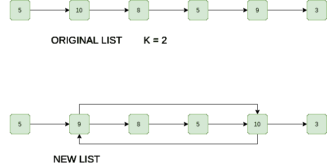

# 用于在链表中从开始到结束交换第 k 个节点的 C++程序

> 原文:[https://www . geesforgeks . org/CPP-program-for-swapping-kth-node-from-from-kth-node-from-end-in-a-link-list/](https://www.geeksforgeeks.org/cpp-program-for-swapping-kth-node-from-beginning-with-kth-node-from-end-in-a-linked-list/)

给定一个单链表，从开始交换第 k 个节点，从结束交换第 k 个节点。**不允许数据交换，只应更改指针。**在链表数据部分很大的许多情况下，这个要求可能是合乎逻辑的(例如，学生详细信息行名称、行号、地址，..等等)。指针总是固定的(大多数编译器为 4 字节)。
T3】例:

```
Input: 1 -> 2 -> 3 -> 4 -> 5, K = 2
Output: 1 -> 4 -> 3 -> 2 -> 5 
Explanation: The 2nd node from 1st is 2 and 
2nd node from last is 4, so swap them.

Input: 1 -> 2 -> 3 -> 4 -> 5, K = 5
Output: 5 -> 2 -> 3 -> 4 -> 1 
Explanation: The 5th node from 1st is 5 and 
5th node from last is 1, so swap them.
```

插图:



**方法:**思路很简单，从开始找第 k 个节点，最后第 k 个节点从开始就是第 n-k+1 个节点。交换两个节点。
*不过也有一些角落案例，必须要处理*

1.  y 紧挨着 X
2.  x 紧挨着 Y
3.  x 和 Y 是一样的
4.  x 和 Y 不存在(k 大于链表中的节点数)

下面是上述方法的实现。

## C++

```
// A C++ program to swap Kth node
// from beginning with kth node from end
#include <bits/stdc++.h>
using namespace std;

// A Linked List node
struct Node 
{
    int data;
    struct Node* next;
};

/* Utility function to insert
   a node at the beginning */
void push(struct Node** head_ref, 
          int new_data)
{
    struct Node* new_node = 
    (struct Node*)malloc(sizeof(struct Node));
    new_node->data = new_data;
    new_node->next = (*head_ref);
    (*head_ref) = new_node;
}

/* Utility function for displaying 
   linked list */
void printList(struct Node* node)
{
    while (node != NULL) 
    {
        cout << node->data << " ";
        node = node->next;
    }
    cout << endl;
}

/* Utility function for calculating 
   length of linked list */
int countNodes(struct Node* s)
{
    int count = 0;
    while (s != NULL) 
    {
        count++;
        s = s->next;
    }
    return count;
}

/* Function for swapping kth nodes 
   from both ends of linked list */
void swapKth(struct Node** head_ref, int k)
{
    // Count nodes in linked list
    int n = countNodes(*head_ref);

    // Check if k is valid
    if (n < k)
        return;

    // If x (kth node from start) and
    // y(kth node from end) are same
    if (2 * k - 1 == n)
        return;

    // Find the kth node from the beginning 
    // of the linked list. We also find
    // previous of kth node because we
    // need to update next pointer of
    // the previous.
    Node* x = *head_ref;
    Node* x_prev = NULL;
    for (int i = 1; i < k; i++) 
    {
        x_prev = x;
        x = x->next;
    }

    // Similarly, find the kth node from
    // end and its previous. kth node
    // from end is (n-k+1)th node from 
    // beginning
    Node* y = *head_ref;
    Node* y_prev = NULL;
    for (int i = 1; i < n - k + 1; i++) 
    {
        y_prev = y;
        y = y->next;
    }

    // If x_prev exists, then new next of
    // it will be y. Consider the case
    // when y->next is x, in this case,
    // x_prev and y are same. So the statement
    // "x_prev->next = y" creates a self loop.
    // This self loop will be broken
    // when we change y->next.
    if (x_prev)
        x_prev->next = y;

    // Same thing applies to y_prev
    if (y_prev)
        y_prev->next = x;

    // Swap next pointers of x and y.
    // These statements also break self
    // loop if x->next is y or y->next is x
    Node* temp = x->next;
    x->next = y->next;
    y->next = temp;

    // Change head pointers when k is 1 or n
    if (k == 1)
        *head_ref = y;
    if (k == n)
        *head_ref = x;
}

// Driver code
int main()
{
    // Let us create the following
    // linked list for testing
    // 1->2->3->4->5->6->7->8
    struct Node* head = NULL;
    for (int i = 8; i >= 1; i--)
        push(&head, i);

    cout << "Original Linked List: ";
    printList(head);

    for (int k = 1; k < 9; k++) 
    {
        swapKth(&head, k);
        cout << 
        "Modified List for k = " << k << endl;
        printList(head);
    }

    return 0;
}
```

**输出:**

```
Original Linked List: 1 2 3 4 5 6 7 8

Modified List for k = 1
8 2 3 4 5 6 7 1

Modified List for k = 2
8 7 3 4 5 6 2 1

Modified List for k = 3
8 7 6 4 5 3 2 1

Modified List for k = 4
8 7 6 5 4 3 2 1

Modified List for k = 5
8 7 6 4 5 3 2 1

Modified List for k = 6
8 7 3 4 5 6 2 1

Modified List for k = 7
8 2 3 4 5 6 7 1

Modified List for k = 8
1 2 3 4 5 6 7 8
```

**复杂度分析:**

*   **时间复杂度:** O(n)，其中 n 为列表长度。
    需要遍历列表一次。
*   **辅助空间:** O(1)。
    不需要额外空间。

更多详情请参考完整文章[在链表](https://www.geeksforgeeks.org/swap-kth-node-from-beginning-with-kth-node-from-end-in-a-linked-list/)中从开始到结束交换第 k 个节点！