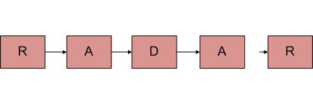
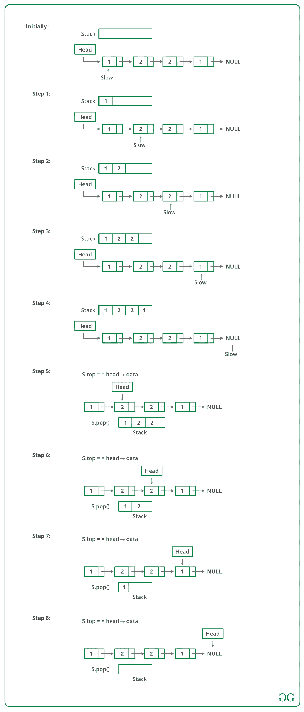

# 检查单链表是否回文的 C++程序

> 原文:[https://www . geesforgeks . org/CPP-程序检查单链表是否是回文/](https://www.geeksforgeeks.org/cpp-program-to-check-if-a-singly-linked-list-is-palindrome/)

给定一个字符的单链表，写一个函数，如果给定的列表是回文，则返回 true，否则返回 false。



**方法 1(使用堆栈):**

*   一个简单的解决方案是使用列表节点的堆栈。这主要涉及三个步骤。
*   从头到尾遍历给定的列表，并将每个访问过的节点推送到堆栈。
*   再次遍历列表。对于每个访问的节点，从堆栈中弹出一个节点，并将弹出的节点的数据与当前访问的节点进行比较。
*   如果所有节点都匹配，则返回 true，否则返回 false。

下图是上述方法的模拟运行:



下面是上述方法的实现:

## C++

```
// C++ program to implement
// the above approach
#include<bits/stdc++.h>
using namespace std;

class Node
{
    public:
    int data;
    Node(int d)
    {
        data = d;
    }
    Node *ptr;
};

// Function to check if the linked list
// is palindrome or not
bool isPalin(Node* head)
{       
    // Temp pointer
    Node* slow= head;

    // Declare a stack
    stack <int> s;

    // Push all elements of the list
    // to the stack
    while(slow != NULL)
    {
        s.push(slow->data);

        // Move ahead
        slow = slow->ptr;
    }

    // Iterate in the list again and
    // check by popping from the stack
    while(head != NULL )
    {           
        // Get the top most element
        int i=s.top();

        // Pop the element
        s.pop();

        // Check if data is not
        // same as popped element
        if(head -> data != i)
        {
            return false;
        }

        // Move ahead
        head=head->ptr;
        }
        return true;
}

// Driver Code
int main()
{
    // Addition of linked list
    Node one =  Node(1);
    Node two = Node(2);
    Node three = Node(3);
    Node four = Node(2);
    Node five = Node(1);

    // Initialize the next pointer
    // of every current pointer
    five.ptr = NULL;
    one.ptr = &two;
    two.ptr = &three;
    three.ptr = &four;
    four.ptr = &five;
    Node* temp = &one;

    // Call function to check
    // palindrome or not
    int result = isPalin(&one);

    if(result == 1)
            cout << "isPalindrome is true";
    else
        cout << "isPalindrome is true";

    return 0;
}
// This code has been contributed by Striver
```

**输出:**

```
 isPalindrome: true
```

**时间复杂度:** O(n)。

**方法 2(通过反转列表):**
这个方法需要 O(n)个时间和 O(1)个额外空间。
**1)** 获得链表的中间。
**2)** 反转后半部分链表。
**3)** 检查前半部分和后半部分是否相同。
**4)** 通过再次反转后半部分并将其附着回前半部分来构建原始链表

将列表分成两半，使用[这个](https://www.geeksforgeeks.org/write-a-c-function-to-print-the-middle-of-the-linked-list/)帖子的方法 2。

当节点数为偶数时，前半部分和后半部分正好包含一半节点。这种方法的挑战是处理节点数为奇数的情况。我们不希望中间节点成为列表的一部分，因为我们要比较它们是否相等。对于奇数情况，我们使用一个单独的变量“中间节点”。

## C++

```
// C++ program to check if a linked list
// is palindrome
#include <bits/stdc++.h>
using namespace std;

// Link list node
struct Node
{
    char data;
    struct Node* next;
};

void reverse(struct Node**);
bool compareLists(struct Node*,
                  struct Node*);

// Function to check if given linked list
// is palindrome or not
bool isPalindrome(struct Node* head)
{
    struct Node *slow_ptr = head,
                *fast_ptr = head;
    struct Node *second_half,
                *prev_of_slow_ptr = head;

    // To handle odd size list
    struct Node* midnode = NULL;

    // initialize result
    bool res = true;

    if (head != NULL &&
        head->next != NULL)
    {

        // Get the middle of the list.
        // Move slow_ptr by 1 and fast_ptrr
        // by 2, slow_ptr will have the middle
        // node
        while (fast_ptr != NULL &&
               fast_ptr->next != NULL)
        {
            fast_ptr = fast_ptr->next->next;

            // We need previous of the slow_ptr
            // for linked lists with odd elements
            prev_of_slow_ptr = slow_ptr;
            slow_ptr = slow_ptr->next;
        }

        // fast_ptr would become NULL when there
        // are even elements in list. And not NULL
        // for odd elements. We need to skip the
        // middle node for odd case and store it
        // somewhere so that we can restore the
        // original list
        if (fast_ptr != NULL)
        {
            midnode = slow_ptr;
            slow_ptr = slow_ptr->next;
        }

        // Now reverse the second half and
        // compare it with first half
        second_half = slow_ptr;

        // NULL terminate first half
        prev_of_slow_ptr->next = NULL;

        // Reverse the second half
        reverse(&second_half);

        // compare
        res = compareLists(head, second_half);

        // Construct the original list back
        // Reverse the second half again
        reverse(&second_half);

        // If there was a mid node (odd size case)
        // which was not part of either first half
        // or second half.
        if (midnode != NULL)
        {
            prev_of_slow_ptr->next = midnode;
            midnode->next = second_half;
        }
        else
            prev_of_slow_ptr->next = second_half;
    }
    return res;
}

// Function to reverse the linked list
// Note that this function may change
// the head
void reverse(struct Node** head_ref)
{
    struct Node* prev = NULL;
    struct Node* current = *head_ref;
    struct Node* next;

    while (current != NULL)
    {
        next = current->next;
        current->next = prev;
        prev = current;
        current = next;
    }
    *head_ref = prev;
}

// Function to check if two input
// lists have same data
bool compareLists(struct Node* head1,
                  struct Node* head2)
{
    struct Node* temp1 = head1;
    struct Node* temp2 = head2;

    while (temp1 && temp2)
    {
        if (temp1->data == temp2->data)
        {
            temp1 = temp1->next;
            temp2 = temp2->next;
        }
        else
            return 0;
    }

    // Both are empty return 1
    if (temp1 == NULL && temp2 == NULL)
        return 1;

    // Will reach here when one is NULL
    // and other is not
    return 0;
}

// Push a node to linked list. Note
// that this function changes the head
void push(struct Node** head_ref,
          char new_data)
{    
    // Allocate node
    struct Node* new_node =
          (struct Node*)malloc(sizeof(struct Node));

    // Put in the data
    new_node->data = new_data;

    // Link the old list off the new node
    new_node->next = (*head_ref);

    // Move the head to point to the new node
    (*head_ref) = new_node;
}

// A utility function to print a
// given linked list
void printList(struct Node* ptr)
{
    while (ptr != NULL)
    {
        cout << ptr->data << "->";
        ptr = ptr->next;
    }
    cout << "NULL" << "";
}

// Driver code
int main()
{    
    // Start with the empty list
    struct Node* head = NULL;
    char str[] = "abacaba";
    int i;

    for(i = 0; str[i] != ''; i++)
    {
        push(&head, str[i]);
        printList(head);
        isPalindrome(head) ? cout << "Is Palindrome" <<
                           "" : cout << "Not Palindrome" << "";
    }
    return 0;
}
// This code is contributed by Shivani
```

**输出:**

```
a->NULL
Is Palindrome

b->a->NULL
Not Palindrome

a->b->a->NULL
Is Palindrome

c->a->b->a->NULL
Not Palindrome

a->c->a->b->a->NULL
Not Palindrome

b->a->c->a->b->a->NULL
Not Palindrome

a->b->a->c->a->b->a->NULL
Is Palindrome
```

**时间复杂度:**O(n)
T3】辅助空间: O(1)

**方法 3(使用递归):**
使用左右两个指针。使用递归左右移动，并检查每个递归调用中的后续操作。
1)子列表是回文。
2)当前左右值匹配。

如果以上两个条件都成立，那么返回真。

其思想是使用函数调用堆栈作为容器。递归遍历，直到列表结束。当我们从最后一个空值返回时，我们将处于最后一个节点。要与列表的第一个节点进行比较的最后一个节点。

为了访问列表的第一个节点，我们需要列表头在递归的最后一次调用中可用。因此，我们也将 head 传递给递归函数。如果它们都匹配，我们需要比较(2，n-2)个节点。同样，当递归回落到(n-2)第二个节点时，我们需要从头引用第二个节点。我们在前面的调用中推进头指针，以引用列表中的下一个节点。
然而，诀窍在于识别双指针。传递一个指针就像传递一个值一样好，我们会一次又一次地传递同一个指针。我们需要传递头指针的地址，以反映父递归调用的变化。
感谢**沙拉德·钱德拉**提出这个方法。

## C++

```
// Recursive program to check if a given
// linked list is palindrome
#include <bits/stdc++.h>
using namespace std;

// Link list node
struct node
{
    char data;
    struct node* next;
};

// Initial parameters to this function
// are &head and head
bool isPalindromeUtil(struct node** left,
                      struct node* right)
{
    // Stop recursion when right
    // becomes NULL
    if (right == NULL)
        return true;

    /* If sub-list is not palindrome then no
       need to check for current left and right,
       return false */
    bool isp = isPalindromeUtil(left,
                                right->next);
    if (isp == false)
        return false;

    // Check values at current left and right
    bool isp1 = (right->data == (*left)->data);

    // Move left to next node
    *left = (*left)->next;

    return isp1;
}

// A wrapper over isPalindromeUtil()
bool isPalindrome(struct node* head)
{
    isPalindromeUtil(&head, head);
}

/* Push a node to linked list. Note that
   this function changes the head */
void push(struct node** head_ref,
          char new_data)
{
    // Allocate node
    struct node* new_node =
          (struct node*)malloc(sizeof(struct node));

    // Put in the data
    new_node->data = new_data;

    // Link the old list off the new node
    new_node->next = (*head_ref);

    // Move the head to point to the new node
    (*head_ref) = new_node;
}

// A utility function to print a
// given linked list
void printList(struct node* ptr)
{
    while (ptr != NULL)
    {
        cout << ptr->data << "->";
        ptr = ptr->next;
    }
    cout << "NULL" ;
}

// Driver code
int main()
{
    // Start with the empty list
    struct node* head = NULL;
    char str[] = "abacaba";
    int i;

    for (i = 0; str[i] != ''; i++)
    {
        push(&head, str[i]);
        printList(head);
        isPalindrome(head) ? cout <<
        "Is Palindrome" : cout << "Not Palindrome";
    }

    return 0;
}
// This code is contributed by shivanisinghss2110
```

**输出:**

```
a->NULL
Not Palindrome

b->a->NULL
Not Palindrome

a->b->a->NULL
Is Palindrome

c->a->b->a->NULL
Not Palindrome

a->c->a->b->a->NULL
Not Palindrome

b->a->c->a->b->a->NULL
Not Palindrome

a->b->a->c->a->b->a->NULL
Is Palindrome
```

**时间复杂度:**O(n)
T3】辅助空间: O(n)如果考虑函数调用栈大小，否则为 O(1)。

更多详情请参考[函数整篇文章，查看单链表是否回文](https://www.geeksforgeeks.org/function-to-check-if-a-singly-linked-list-is-palindrome/)！