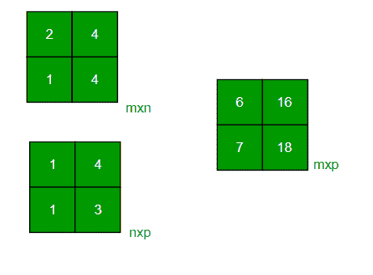

# C++程序相乘两个矩阵

> 原文:[https://www . geeksforgeeks . org/CPP-程序乘二矩阵/](https://www.geeksforgeeks.org/cpp-program-to-multiply-two-matrices/)

给定两个矩阵，将它们相乘的任务。矩阵可以是正方形或矩形。

**示例:**

```
Input : mat1[][] = {{1, 2}, 
                   {3, 4}}
        mat2[][] = {{1, 1}, 
                    {1, 1}}
Output : {{3, 3}, 
          {7, 7}}
Input : mat1[][] = {{2, 4}, 
                    {3, 4}}
        mat2[][] = {{1, 2}, 
                    {1, 3}}       
Output : {{6, 16}, 
          {7, 18}}
```



**方阵乘法:**
下面的程序将两个大小为 4*4 的方阵相乘，我们可以针对不同的维度改变 N。

## C++

```
// C++ program to multiply
// two square matrices.
#include <iostream>

using namespace std;

#define N 4

// This function multiplies
// mat1[][] and mat2[][], and
// stores the result in res[][]
void multiply(int mat1[][N],
              int mat2[][N],
              int res[][N])
{
    int i, j, k;
    for (i = 0; i < N; i++) {
        for (j = 0; j < N; j++) {
            res[i][j] = 0;
            for (k = 0; k < N; k++)
                res[i][j] += mat1[i][k] * mat2[k][j];
        }
    }
}

// Driver Code
int main()
{
    int i, j;
    int res[N][N]; // To store result
    int mat1[N][N] = { { 1, 1, 1, 1 },
                       { 2, 2, 2, 2 },
                       { 3, 3, 3, 3 },
                       { 4, 4, 4, 4 } };

    int mat2[N][N] = { { 1, 1, 1, 1 },
                       { 2, 2, 2, 2 },
                       { 3, 3, 3, 3 },
                       { 4, 4, 4, 4 } };

    multiply(mat1, mat2, res);

    cout << "Result matrix is 
";
    for (i = 0; i < N; i++) {
        for (j = 0; j < N; j++)
            cout << res[i][j] << " ";
        cout << "
";
    }

    return 0;
}

// This code is contributed
// by Soumik Mondal
```

**Output**

```
Result matrix is 
10 10 10 10 
20 20 20 20 
30 30 30 30 
40 40 40 40
```

**时间复杂度:** O(n <sup>3</sup> )。它可以使用斯特拉森矩阵乘法进行优化

**辅助空间:** O(n <sup>2</sup> )

**矩形矩阵的乘法:**
我们使用 C 语言中的指针与矩阵相乘。请参考以下帖子作为代码的先决条件。
[如何在 C 中传递一个 2D 阵作为参数？](https://www.geeksforgeeks.org/pass-2d-array-parameter-c/)

## C++

```
// C++ program to multiply two
// rectangular matrices
#include <bits/stdc++.h>
using namespace std;

// Multiplies two matrices mat1[][]
// and mat2[][] and prints result.
// (m1) x (m2) and (n1) x (n2) are
// dimensions of given matrices.
void multiply(int m1, int m2, int mat1[][2], int n1, int n2,
              int mat2[][2])
{
    int x, i, j;
    int res[m1][n2];
    for (i = 0; i < m1; i++) 
    {
        for (j = 0; j < n2; j++) 
        {
            res[i][j] = 0;
            for (x = 0; x < m2; x++) 
            {
                *(*(res + i) + j) += *(*(mat1 + i) + x)
                                     * *(*(mat2 + x) + j);
            }
        }
    }
    for (i = 0; i < m1; i++) 
    {
        for (j = 0; j < n2; j++) 
        {
            cout << *(*(res + i) + j) << " ";
        }
        cout << "
";
    }
}

// Driver code
int main()
{
    int mat1[][2] = { { 2, 4 }, { 3, 4 } };
    int mat2[][2] = { { 1, 2 }, { 1, 3 } };
    int m1 = 2, m2 = 2, n1 = 2, n2 = 2;

    // Function call
    multiply(m1, m2, mat1, n1, n2, mat2);
    return 0;
}

// This code is contributed
// by Akanksha Rai(Abby_akku)
```

**Output**

```
6 16 
7 18
```

**时间复杂度:** O(n <sup>3</sup> )。可以使用[斯特拉森的矩阵乘法](https://www.geeksforgeeks.org/strassens-matrix-multiplication/)进行优化

**辅助空间:** O(m1 * n2)

更多详情请参考[两矩阵相乘程序](https://www.geeksforgeeks.org/c-program-multiply-two-matrices/)整篇文章！