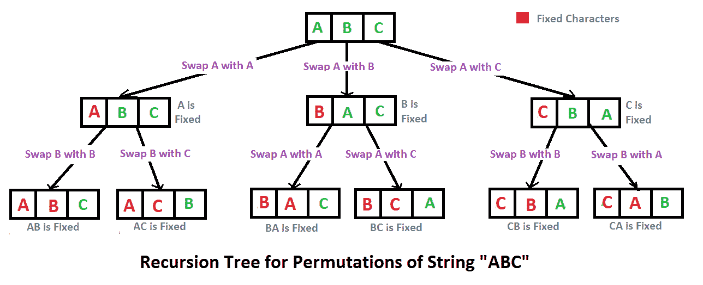

# C++程序打印给定字符串的所有排列

> 原文:[https://www . geesforgeks . org/CPP-程序打印给定字符串的所有排列/](https://www.geeksforgeeks.org/cpp-program-to-print-all-permutations-of-a-given-string/)

排列也称为“排列数”或“顺序”，是将有序列表 S 的元素重新排列成与 S 本身一一对应的关系。长度为 n 的字符串有 n！排列。

资料来源:mathword([http://mathworld . wolfram . com/switching . html](http://mathworld.wolfram.com/Permutation.html)

以下是字符串 ABC 的排列。
中航 ACB 北汽 BCA CBA CAB

这里有一个解决方案，作为回溯的基础。



## C++

```
// C++ program to print all permutations 
// with duplicates allowed 
#include <bits/stdc++.h> 
using namespace std; 

// Function to print permutations 
// of string 
// This function takes three parameters: 
// 1\. String 
// 2\. Starting index of the string 
// 3\. Ending index of the string. 
void permute(string a, int l, int r) 
{ 
    // Base case 
    if (l == r) 
        cout<<a<<endl; 
    else
    { 
        // Permutations made 
        for (int i = l; i <= r; i++) 
        { 
            // Swapping done 
            swap(a[l], a[i]); 

            // Recursion called 
            permute(a, l+1, r); 

            //backtrack 
            swap(a[l], a[i]); 
        } 
    } 
} 

// Driver Code 
int main() 
{ 
    string str = "ABC"; 
    int n = str.size(); 
    permute(str, 0, n-1); 
    return 0; 
} 
// This is code is contributed by rathbhupendra 
```

**输出:**

```
ABC
ACB
BAC
BCA
CBA
CAB
```

**算法范式:**回溯

**时间复杂度:** O(n*n！)注意有 n 个！排列，打印排列需要 O(n)个时间。

**辅助空间:**O(r–l)

**注意:**如果输入字符串中有重复字符，上述解决方案将打印重复排列。请查看下面的链接，了解即使输入中有重复，也只打印不同排列的解决方案。
[打印给定字符串的所有不同的重复排列。](https://www.geeksforgeeks.org/print-all-permutations-of-a-string-with-duplicates-allowed-in-input-string/)
[使用 STL](https://www.geeksforgeeks.org/permutations-of-a-given-string-using-stl/) 给定字符串的排列

**另一种方法:**

## C++

```
// C++ program to implement
// the above approach
#include <bits/stdc++.h>
#include <string>
using namespace std;

void permute(string s, 
             string answer)
{
    if(s.length() == 0)
    {
        cout << answer << "  ";
        return;
    }
    for(int i = 0; 
            i < s.length(); i++)
    {
        char ch = s[i];
        string left_substr = s.substr(0, i);
        string right_substr = s.substr(i + 1);
        string rest = left_substr + right_substr;
        permute(rest , answer+ch);
    }
}

// Driver code
int main()
{
    string s;
    string answer = "";

    cout << "Enter the string : ";
    cin >> s;

    cout << 
    "All possible strings are : ";
    permute(s, answer);
    return 0;
}
```

**输出:**

```
Enter the string : abc
All possible strings are : abc  acb  bac  bca  cab  cba
```

**时间复杂度:** O(n*n！)时间复杂度与上述方法相同，即有 n！排列，打印排列需要 O(n)个时间。

**辅助空间:** O(|s|)

更多详情请参考[完整文章编写程序打印给定字符串](https://www.geeksforgeeks.org/write-a-c-program-to-print-all-permutations-of-a-given-string/)的所有排列！