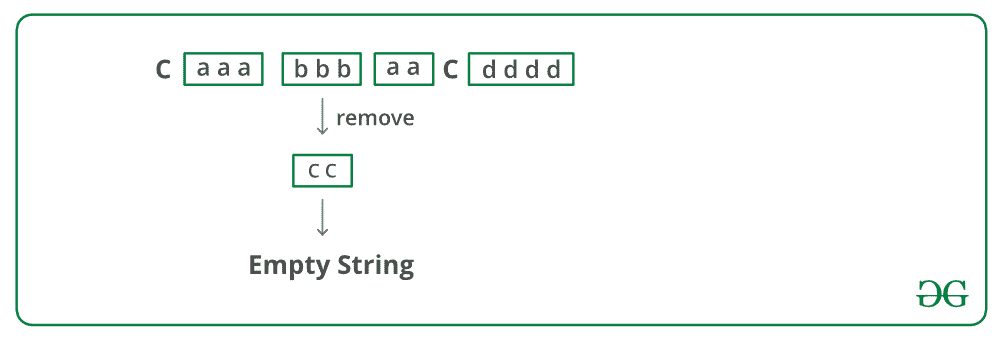

# 递归删除所有相邻副本的 C++程序

> 原文:[https://www . geeksforgeeks . org/CPP-program-to-recursive-remove-all-near-duplicates/](https://www.geeksforgeeks.org/cpp-program-to-recursively-remove-all-adjacent-duplicates/)

给定一个字符串，递归地从该字符串中移除相邻的重复字符。输出字符串不应有任何相邻的重复项。请参见以下示例。

**示例**:

> **输入**:azxzy
> 输出 : ay
> 第一个“azxzy”降为“azzy”。
> 字符串“azzy”包含重复项，
> 因此进一步简化为“ay”。
> 
> **输入**:极客 First
> 输出 : gksfor
> 第一个“极客 foreg”降为
> “gksforgg”。字符串“gksforgg”
> 包含重复项，因此进一步
> 简化为“gksfor”。
> 
> **输入** : caaabbbaacdddd
> **输出**:空字符串
> 
> **输入**:acaaabbbacdddd
> T3】输出 : acac

在 **O(N)** 时间内，可遵循以下**方法**删除重复项:

*   从最左边的字符开始，删除左上角的重复字符(如果有)。
*   第一个字符现在必须与其相邻字符不同。长度为 n-1 的字符串(没有第一个字符的字符串)重复出现。
*   让长度为 n-1 的右子串缩减后得到的字符串为 *rem_str* 。有三种可能的情况
    1.  如果 *rem_str* 的第一个字符与原始字符串的第一个字符匹配，则从 *rem_str* 中删除第一个字符。
    2.  如果剩余字符串为空，并且最后删除的字符与原始字符串的第一个字符相同。返回空字符串。
    3.  否则，在 *rem_str* 的开头追加原始字符串的第一个字符。
*   返回 *rem_str* 。

下图是上述方法的模拟运行:



下面是上述方法的实现:

## C++

```
// C/C++ program to remove all 
// adjacent duplicates from a string
#include <iostream>
#include <string.h>

using namespace std;

// Recursively removes adjacent 
// duplicates from str and returns
// new string. las_removed is a 
// pointer to last_removed character
char* removeUtil(char *str, 
                 char *last_removed)
{    
    // If length of string is 1 or 0
    if (str[0] == '' || str[1] == '')
        return str;

    // Remove leftmost same characters 
    // and recur for remaining 
    // string
    if (str[0] == str[1])
    {
        *last_removed = str[0];
        while (str[1] && str[0] == str[1])
            str++;
        str++;
        return removeUtil(str, last_removed);
    }

    // At this point, the first character 
    // is definiotely different 
    // from its adjacent. Ignore first 
    // character and recursively 
    // remove characters from remaining string
    char* rem_str = removeUtil(str+1, 
                               last_removed);

    // Check if the first character 
    // of the rem_string matches with 
    // the first character of the 
    // original string
    if (rem_str[0] && rem_str[0] == str[0])
    {
        *last_removed = str[0];

        // Remove first character
        return (rem_str+1); 
    }

    // If remaining string becomes 
    // empty and last removed character
    // is same as first character of 
    // original string. This is needed
    // for a string like "acbbcddc"
    if (rem_str[0] == '' && 
                 *last_removed == str[0])
        return rem_str;

    // If the two first characters 
    // of str and rem_str don't match, 
    // append first character of str 
    // before the first character of
    // rem_str. 
    rem_str--;
    rem_str[0] = str[0];
    return rem_str;
}

// Function to remove
char *remove(char *str)
{
    char last_removed = '';
    return removeUtil(str, &last_removed);
}

// Driver program to test 
// above functions
int main()
{
    char str1[] = "geeksforgeeg";
    cout << remove(str1) << endl;

    char str2[] = "azxxxzy";
    cout << remove(str2) << endl;

    char str3[] = "caaabbbaac";
    cout << remove(str3) << endl;

    char str4[] = "gghhg";
    cout << remove(str4) << endl;

    char str5[] = "aaaacddddcappp";
    cout << remove(str5) << endl;

    char str6[] = "aaaaaaaaaa";
    cout << remove(str6) << endl;

    char str7[] = "qpaaaaadaaaaadprq";
    cout << remove(str7) << endl;

    char str8[] = "acaaabbbacdddd";
    cout << remove(str8) << endl;

    char str9[] = "acbbcddc";
    cout << remove(str9) << endl;

    return 0;
}
```

**输出:**

```
gksfor
ay
g
a
qrq
acac
a
```

**时间复杂度:**解的时间复杂度可以写成 T(n) = T(n-k) + O(k)，其中 n 是输入字符串的长度，k 是相同的第一个字符的个数。递归的解是 O(n)

感谢 **Prachi Bodke** 提出这个问题和初步解决方案。

**另一种方法:**
这里的想法是检查字符串 remStr 是否具有与父字符串的最后一个字符匹配的重复字符。如果发生这种情况，那么我们必须在连接字符串 s 和字符串 remStr 之前继续删除该字符。

下面是上述方法的实现:

## C++

```
// C++ Program for above approach
#include <bits/stdc++.h>
using namespace std;

// Recursively removes adjacent 
// duplicates from str and returns 
// new string. las_removed is a 
// pointer to last_removed character
string removeDuplicates(string s,
                        char ch)
{
    // If length of string is 1 or 0
    if (s.length() <= 1) 
   {
        return s;
    }

    int i = 0;
    while (i < s.length()) 
    {
        if (i + 1 < s.length() && 
            s[i] == s[i + 1]) 
        {
            int j = i;
            while (j + 1 < s.length() && 
                   s[j] == s[j + 1]) 
            {
                j++;
            }
            char lastChar = i > 0 ? s[i - 1] : ch;

            string remStr = removeDuplicates(
                   s.substr(j + 1, s.length()), lastChar);

            s = s.substr(0, i);
            int k = s.length(), l = 0;

            // Recursively remove all the adjacent
            // characters formed by removing the
            // adjacent characters
            while (remStr.length() > 0 && 
                   s.length() > 0 && 
                   remStr[0] == s[s.length() - 1]) 
            {
                // Have to check whether this is the
                // repeated character that matches the
                // last char of the parent String
                while (remStr.length() > 0 && 
                       remStr[0] != ch && 
                       remStr[0] == s[s.length() - 1]) 
                {
                    remStr = remStr.substr(1, 
                             remStr.length());
                }
                s = s.substr(0, s.length() - 1);
            }
            s = s + remStr;
            i = j;
        }
        else 
        {
            i++;
        }
    }
    return s;
}

// Driver Code
int main()
{
    string str1 = "mississipie";
    cout << removeDuplicates(str1, ' ') << 
            endl;

    string str2 = "ocvvcolop";
    cout << removeDuplicates(str2, ' ') << 
            endl;
}
// This code is contributed by nirajgusain5
```

**输出:**

```
mpie
lop
```

**时间复杂度:** O(n)

更多详情请参考[完整文章递归移除所有相邻副本](https://www.geeksforgeeks.org/recursively-remove-adjacent-duplicates-given-string/)！