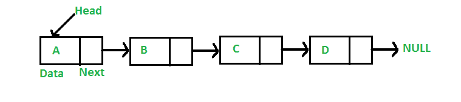
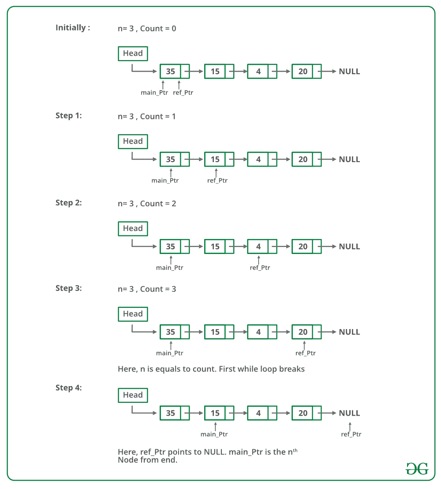

# 从链表末尾打印第 n 个节点的程序(重复)

> 原文:[https://www . geeksforgeeks . org/CPP 14-打印程序-链接列表末尾的第 n 个节点/](https://www.geeksforgeeks.org/cpp14-program-for-printing-nth-node-from-the-end-of-a-linked-list/)

给定一个链表和一个数字 n，写一个函数，返回链表末尾第 n 个节点的值。
例如，如果输入在列表下方，n = 3，则输出为“B”

[](https://media.geeksforgeeks.org/wp-content/cdn-uploads/gq/2013/03/Linkedlist.png)

**方法 1(使用链表长度)**
1)计算链表长度。让长度为 len。
2)打印链表开头的第(len–n+1)个节点。
**双指针概念:**第一指针用于存储变量的地址，第二指针用于存储第一指针的地址。如果我们希望通过一个函数来改变变量值，我们传递一个指向它的指针。如果我们希望改变指针的值(即，它应该开始指向其他东西)，我们将指针传递给指针。

下面是上述方法的实现:

## C++14

```
// Simple C++ program to find n'th node from end
#include <bits/stdc++.h>
using namespace std;

/* Link list node */
struct Node {
    int data;
    struct Node* next;
};

/* Function to get the nth node from the last of a linked list*/
void printNthFromLast(struct Node* head, int n)
{
    int len = 0, i;
    struct Node* temp = head;

    // count the number of nodes in Linked List
    while (temp != NULL) {
        temp = temp->next;
        len++;
    }

    // check if value of n is not
    // more than length of the linked list
    if (len < n)
        return;

    temp = head;

    // get the (len-n+1)th node from the beginning
    for (i = 1; i < len - n + 1; i++)
        temp = temp->next;

    cout << temp->data;

    return;
}

void push(struct Node** head_ref, int new_data)
{
    /* allocate node */
    struct Node* new_node = new Node();

    /* put in the data */
    new_node->data = new_data;

    /* link the old list off the new node */
    new_node->next = (*head_ref);

    /* move the head to point to the new node */
    (*head_ref) = new_node;
}

// Driver Code
int main()
{
    /* Start with the empty list */
    struct Node* head = NULL;

    // create linked 35->15->4->20
    push(&head, 20);
    push(&head, 4);
    push(&head, 15);
    push(&head, 35);

    printNthFromLast(head, 4);
    return 0;
}
```

**Output**

```
35
```

**时间复杂度:** O(n)其中 n 是链表的长度。
**方法 2(使用两个指针)**
维护两个指针——引用指针和主指针。初始化指向 head 的引用指针和主指针。首先，将引用指针从头部移动到 n 个节点。现在逐个移动两个指针，直到引用指针到达末尾。现在主指针将从末尾指向第 n 个节点。返回主指针。
下图是上述方法的模拟运行:



以下是上述方法的实现:

**Output**

```
Node no. 4 from last is 35 
```

**时间复杂度:** O(n)其中 n 是链表的长度。
详情请参考链表末尾第 n 节点[程序的完整文章！](https://www.geeksforgeeks.org/nth-node-from-the-end-of-a-linked-list/)