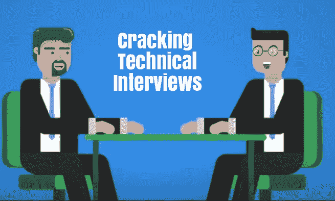

# 破解技术面试

> 原文:[https://www . geesforgeks . org/破解-技术-访谈/](https://www.geeksforgeeks.org/cracking-technical-interviews/)

技术面试有两种。对于以服务为基础的公司，如 TCS、埃森哲、Tech Mahindra、Wipro，另一个是以产品为基础的公司。破解服务型公司的面试比产品容易。

**以服务为基础的公司:**对于以服务为基础的公司，他们所要求的只是，如果你能够解释技术术语，并且你能够与他们沟通或不沟通。他们会问与他们的要求相关的问题。比如 oops 概念，或者如果你正在申请特定的领域，比如 react 或者 node profile，那么他们会问与此相关的问题。如果你能和他们沟通并解释事情，你就会被录用。有基本技术知识的非技术背景的人也可以进入这些公司。

**产品型公司:**现在来说说产品型公司。这些公司有困难的招聘程序，他们选择那些对计算机基础、数据结构和算法有很强掌握的学生或专业人士。这些公司是微软、谷歌、亚马逊、优步、Snapdeal、Zomato 等。还有，你要有很强的逻辑和分析思维。大多数公司忽略了你正在使用的编程语言，但是你必须精通至少一种编程语言。他们会检查你的解题技巧和编码。他们大多选择 CS 或 IT 背景的学生。但不要担心，如果你不是 IT 出身，但有足够的技能，这些公司需要的，你仍然可以破解面试。这些公司一般有 4-5 轮。我想分享一些破解这些公司面试的小技巧。
T3】1。简历建设:你的简历应该清楚地提到你的成就，你对计算机基础的掌握，你解决问题的能力。应该简短而精确。尝试与在这些公司工作的人建立联系，获得推荐并申请这份工作。如果有人推荐你，入围的几率会更高。
**2。问题解决和编码:**一旦你入围，你可能不得不进行电话面试或面对面的直接面试。可以是白板面试或在线测试，也可以是纸上谈兵。他们会给你与数据结构和算法相关的问题，你需要制作程序或解决问题。每当面试官提出问题时，消除所有的疑虑，提出问题。比如有多少输入，或者问题是否与数组相关，然后排序或不排序任何东西。你需要考虑所有的情况。
现在先用蛮力算法告诉他们你的方法。一旦你完成了，面试官相信了，就为它写程序。一些面试官也试图在编码时帮助你。他们会检查你的逻辑思维，以及你用更少的时间写出了多干净多好的代码。
他们还可以要求优化您的代码或其他最佳方法，他们还会提出与时间和空间复杂性相关的问题。他们还可以给你一个不同的场景来破解你的代码或算法，所以一定要考虑所有的场景。
**3。项目:**为自己在实习或就业生涯中做过的任何项目做好准备。你应该对你的项目有所有的了解，哪一个是你最喜欢的一切。
**4。系统设计:**像亚马逊、脸书这样的大公司都有与系统设计相关的问题。比如你会如何创建社交媒体、信使或推特。在那里你需要一步一步地告诉你的方法。
**5。文化契合度:**每家公司都在寻找能经营业务、能盈利的人，这也是本轮在所有公司进行的原因。你会如何处理压力，与你的同事协调一切，他们会检查这些事情。如果他们觉得你不符合他们的文化，那么你就会被拒绝，所以确保你在这里不要说任何负面的话。

最后，在面试中要表现得友好和礼貌，不要假装任何事情，微笑，适当地交流，眼神交流以显示你的自信，在面试中永远不要表现出你的自我。你可以查看**极客博客**门户网站了解各种面试问题，我也想建议你完成本书 ***【破解编码面试】***

**万事如意**

**重要环节:**

1.  [免费面试准备课程](https://practice.geeksforgeeks.org/courses/interview-preparation?vC=1)既面向学生，也面向职场人士。
2.  [TCS、Wipro、InfoSys 等跨国公司的安置准备课程。](https://practice.geeksforgeeks.org/courses/sudo-placement-2?vC=1)
3.  [破解任何编码面试需要解决的问题列表](https://www.geeksforgeeks.org/practice-for-cracking-any-coding-interview/)