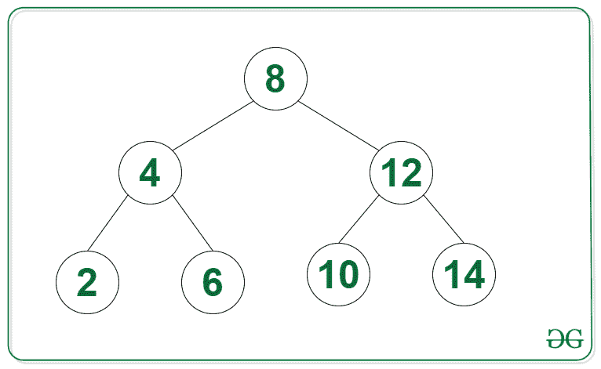
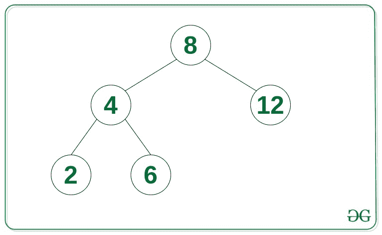

# 从给定的二叉查找树

创建波阵

> 原文:[https://www . geeksforgeeks . org/create-a-wave-array-from-then-binary-search-tree/](https://www.geeksforgeeks.org/create-a-wave-array-from-the-given-binary-search-tree/)

给定一个[二叉查找树](https://www.geeksforgeeks.org/binary-search-tree-set-1-search-and-insertion/)，任务是从给定的二叉查找树创建一个[波阵](https://www.geeksforgeeks.org/check-if-an-array-is-wave-array/)。一个数组 **arr[0..如果 arr[0]>= arr[1]<= arr[2]>= arr[3]<= arr[4]>=…**

**示例:**

> **输入:**
> 
> [](https://media.geeksforgeeks.org/wp-content/uploads/20210929091527/UntitledDiagramdrawio1.png)
> 
> **输出:** 4 2 8 6 12 10 14
> **说明:**上述阵列{4，2，8，6，12，10，14}是众多有效波阵之一。
> 
> **输入:**
> 
> [](https://media.geeksforgeeks.org/wp-content/uploads/20210929101230/BSTExample2.jpg)
> 
> **输出:** 4 2 8 6 12

**方法:**给定的问题可以通过观察[二叉查找树](https://www.geeksforgeeks.org/binary-search-tree-set-1-search-and-insertion/)的[有序遍历](https://www.geeksforgeeks.org/inorder-tree-traversal-without-recursion/)以非递减顺序给出节点来解决。因此，将给定树的有序遍历存储到[向量](https://www.geeksforgeeks.org/vector-in-cpp-stl/)中。由于向量包含有序排列的元素，因此可以使用本文中讨论的方法，通过将相邻元素替换为范围**【0，N】**中的所有元素，将其转换为波阵。

下面是上述方法的实现:

## C++

```
// C++ program for the above approach
#include <bits/stdc++.h>
using namespace std;

// Node of the Binary Search tree
struct Node {
    int data;
    Node* right;
    Node* left;

    // Constructor
    Node(int data)
    {
        this->data = data;
        this->left = NULL;
        this->right = NULL;
    }
};

// Function to convert Binary Search
// Tree into a wave Array
void toWaveArray(Node* root)
{
    // Stores the final wave array
    vector<int> waveArr;

    stack<Node*> s;
    Node* curr = root;

    // Perform the Inorder traversal
    // of the given BST
    while (curr != NULL || s.empty() == false) {

        // Reach the left most Node of
        // the curr Node
        while (curr != NULL) {

            // Place pointer to a tree node
            // in stack before traversing
            // the node's left subtree
            s.push(curr);
            curr = curr->left;
        }
        curr = s.top();
        s.pop();

        // Insert into wave array
        waveArr.push_back(curr->data);

        // Visit the right subtree
        curr = curr->right;
    }

    // Convert sorted array into wave array
    for (int i = 0;
         i + 1 < waveArr.size(); i += 2) {
        swap(waveArr[i], waveArr[i + 1]);
    }

    // Print the answer
    for (int i = 0; i < waveArr.size(); i++) {
        cout << waveArr[i] << " ";
    }
}

// Driver Code
int main()
{
    Node* root = new Node(8);
    root->left = new Node(4);
    root->right = new Node(12);
    root->right->left = new Node(10);
    root->right->right = new Node(14);
    root->left->left = new Node(2);
    root->left->right = new Node(6);

    toWaveArray(root);

    return 0;
}
```

## Java 语言(一种计算机语言，尤用于创建网站)

```
// Java program for the above approach
import java.util.*;

class GFG{

// Node of the Binary Search tree
static class Node {
    int data;
    Node right;
    Node left;

    // Constructor
    Node(int data)
    {
        this.data = data;
        this.left = null;
        this.right = null;
    }
};

// Function to convert Binary Search
// Tree into a wave Array
static void toWaveArray(Node root)
{

    // Stores the final wave array
    Vector<Integer> waveArr = new Vector<>();

    Stack<Node> s = new Stack<>();
    Node curr = root;

    // Perform the Inorder traversal
    // of the given BST
    while (curr != null || s.isEmpty() == false) {

        // Reach the left most Node of
        // the curr Node
        while (curr != null) {

            // Place pointer to a tree node
            // in stack before traversing
            // the node's left subtree
            s.add(curr);
            curr = curr.left;
        }
        curr = s.peek();
        s.pop();

        // Insert into wave array
        waveArr.add(curr.data);

        // Visit the right subtree
        curr = curr.right;
    }

    // Convert sorted array into wave array
    for (int i = 0;   i + 1 < waveArr.size(); i += 2) {
        int t = waveArr.get(i);
        waveArr.set(i, waveArr.get(i+1));
        waveArr.set(i+1, t);

    }

    // Print the answer
    for (int i = 0; i < waveArr.size(); i++) {
        System.out.print(waveArr.get(i)+ " ");
    }
}

// Driver Code
public static void main(String[] args)
{
    Node root = new Node(8);
    root.left = new Node(4);
    root.right = new Node(12);
    root.right.left = new Node(10);
    root.right.right = new Node(14);
    root.left.left = new Node(2);
    root.left.right = new Node(6);

    toWaveArray(root);

}
}

// This code is contributed by umadevi9616
```

## C#

```
// C# program for the above approach
using System;
using System.Collections.Generic;

public class GFG{

// Node of the Binary Search tree
public class Node {
    public int data;
    public Node right;
    public Node left;

    // Constructor
    public Node(int data)
    {
        this.data = data;
        this.left = null;
        this.right = null;
    }
};

// Function to convert Binary Search
// Tree into a wave Array
static void toWaveArray(Node root)
{

    // Stores the readonly wave array
    List<int> waveArr = new List<int>();

    Stack<Node> s = new Stack<Node>();
    Node curr = root;

    // Perform the Inorder traversal
    // of the given BST
    while (curr != null || s.Count!=0 ) {

        // Reach the left most Node of
        // the curr Node
        while (curr != null) {

            // Place pointer to a tree node
            // in stack before traversing
            // the node's left subtree
            s.Push(curr);
            curr = curr.left;
        }
        curr = s.Peek();
        s.Pop();

        // Insert into wave array
        waveArr.Add(curr.data);

        // Visit the right subtree
        curr = curr.right;
    }

    // Convert sorted array into wave array
    for (int i = 0;   i + 1 < waveArr.Count; i += 2) {
        int t = waveArr[i];
        waveArr[i]= waveArr[i+1];
        waveArr[i+1]= t;

    }

    // Print the answer
    for (int i = 0; i < waveArr.Count; i++) {
        Console.Write(waveArr[i]+ " ");
    }
}

// Driver Code
public static void Main(String[] args)
{
    Node root = new Node(8);
    root.left = new Node(4);
    root.right = new Node(12);
    root.right.left = new Node(10);
    root.right.right = new Node(14);
    root.left.left = new Node(2);
    root.left.right = new Node(6);

    toWaveArray(root);
}
}

// This code is contributed by umadevi9616
```

## java 描述语言

```
<script>
        // JavaScript Program to implement
        // the above approach
        class Node {
            constructor(data) {
                this.data = data;
                this.left = this.right = null;
            }
        }
        // Function to convert Binary Search
        // Tree into a wave Array
        function toWaveArray(root) {
            // Stores the final wave array
            let waveArr = [];

            let s = [];
            let curr = root;

            // Perform the Inorder traversal
            // of the given BST
            while (curr != null || s.length != 0) {

                // Reach the left most Node of
                // the curr Node
                while (curr != null) {

                    // Place pointer to a tree node
                    // in stack before traversing
                    // the node's left subtree
                    s.push(curr);
                    curr = curr.left;
                }
                curr = s[s.length - 1];
                s.pop();

                // Insert into wave array
                waveArr.push(curr.data);

                // Visit the right subtree
                curr = curr.right;
            }

            // Convert sorted array into wave array
            for (let i = 0;
                i + 1 < waveArr.length; i += 2) {
                let temp = waveArr[i]
                waveArr[i] = waveArr[i + 1]
                waveArr[i + 1] = temp
            }

            // Print the answer
            for (let i = 0; i < waveArr.length; i++) {
                document.write(waveArr[i] + " ");
            }
        }

        // Driver Code
        let root = new Node(8);
        root.left = new Node(4);
        root.right = new Node(12);
        root.right.left = new Node(10);
        root.right.right = new Node(14);
        root.left.left = new Node(2);
        root.left.right = new Node(6);

        toWaveArray(root);

     // This code is contributed by Potta Lokesh

    </script>
```

**Output:** 

```
4 2 8 6 12 10 14
```

***时间复杂度:**O(N)*
T5**辅助空间:** O(N)