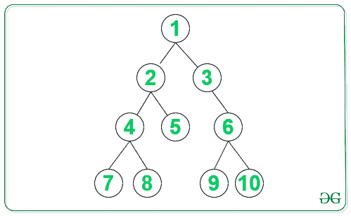
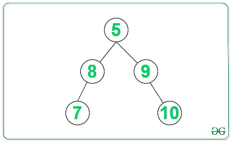
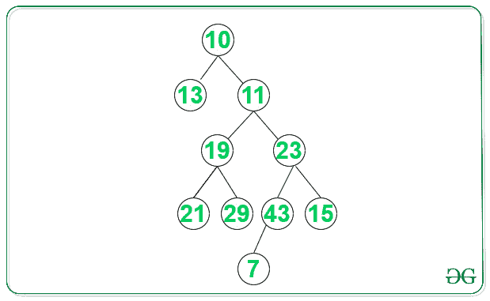

# 在不使用额外空间的情况下，使用叶节点创建平衡二叉树

> 原文:[https://www . geeksforgeeks . org/create-balanced-二叉树-使用其叶节点-不使用额外空间/](https://www.geeksforgeeks.org/create-balanced-binary-tree-using-its-leaf-nodes-without-using-extra-space/)

**先决条件:** [二叉树到双链表](https://www.geeksforgeeks.org/in-place-convert-a-given-binary-tree-to-doubly-linked-list/)
给定一棵[二叉树](https://www.geeksforgeeks.org/binary-tree-data-structure/)，任务是从给定二叉树的所有叶节点创建一棵[平衡二叉树](https://www.geeksforgeeks.org/how-to-determine-if-a-binary-tree-is-balanced/)。

**示例:**

```
Input: 
```



```
Output: 7 8 5 9 10 
Explanation: Required balanced binary tree will be:
```



```
Input:
```



```
Output: 13 21 29 7 15
Explanation: Required balanced binary tree is:
              29
             /  \
            21   7
           /       \
          13       15
```

**方法:**
按照以下步骤解决问题:

1.  找到给定二叉树中的所有[叶节点，并使用它们创建一个](https://www.geeksforgeeks.org/print-leaf-nodes-left-right-binary-tree/)[双向链表](https://www.geeksforgeeks.org/data-structures/linked-list/doubly-linked-list/)。
2.  要从上面的双向链表创建平衡二叉树，请执行以下操作:
    *   找到上面形成的双向链表的中间节点，并将其设置为结果[树](https://www.geeksforgeeks.org/binary-tree-data-structure/)的**根节点**。
    *   递归迭代双链表中当前中间节点的左右，重复以上步骤，直到覆盖所有节点。
3.  打印新创建的平衡二叉树。

下面是上述方法的实现:

## C++

```
// C++ program for the above approach
#include <bits/stdc++.h>
using namespace std;

// Structure for Linked list and tree
class Node {
public:
    int data;
    Node *left, *right;
};

// Function that returns the count of
// nodes in the given linked list
int countNodes(Node* head)
{
    // Initialize count
    int count = 0;

    Node* temp = head;

    // Iterate till the end of LL
    while (temp) {

        temp = temp->right;

        // Increment the count
        count++;
    }

    // Return the final count
    return count;
}

// Function to return the root of
// the newly created balanced binary
// tree from the given doubly LL
Node* sortedListToBSTRecur(
    Node** head_ref, int n)
{
    // Base Case
    if (n <= 0)
        return NULL;

    // Recursively construct
    // the left subtree
    Node* left = sortedListToBSTRecur(
        head_ref, n / 2);

    // head_ref now refers to
    // middle node, make middle node
    // as root of BST
    Node* root = *head_ref;

    // Set pointer to left subtree
    root->left = left;

    // Change head pointer of
    // Linked List for parent
    // recursive calls
    *head_ref = (*head_ref)->right;

    // Recursively construct the
    // right subtree and link it
    // with root
        root->right
        = sortedListToBSTRecur(
            head_ref, n - n / 2 - 1);

    // Return the root of Balanced BT
    return root;
}
Node* sortedListToBST(Node* head)
{
    /*Count the number of
    nodes in Linked List */
    int n = countNodes(head);

    /* Construct BST */
    return sortedListToBSTRecur(
        &head, n);
}

// Function to find the leaf nodes and
// make the doubly linked list of
// those nodes
Node* extractLeafList(Node* root,
                      Node** head_ref)
{
    // Base cases
    if (root == NULL)
        return NULL;

    if (root->left == NULL
        && root->right == NULL) {

        // This node is added to doubly
        // linked list of leaves, and
        // set right pointer of this
        // node as previous head of DLL
        root->right = *head_ref;

        // Change left pointer
        // of previous head
        if (*head_ref != NULL)
            (*head_ref)->left = root;

        // Change head of linked list
        *head_ref = root;

        // Return new root
        return NULL;
    }

    // Recur for right & left subtrees
    root->right = extractLeafList(root->right,
                                  head_ref);
    root->left = extractLeafList(root->left,
                                 head_ref);

    // Return the root
    return root;
}

// Function to allocating new Node
// int Binary Tree
Node* newNode(int data)
{
    Node* node = new Node();
    node->data = data;
    node->left = NULL;
    node->right = NULL;
    return node;
}

// Function for inorder traversal
void print(Node* root)
{
    // If root is not NULL
    if (root != NULL) {

        print(root->left);

        // Print the root's data
        cout << root->data
             << " ";
        print(root->right);
    }
}

// Function to display nodes of DLL
void printList(Node* head)
{
    while (head) {

        // Print the data
        cout << head->data << " ";
        head = head->right;
    }
}

// Driver Code
int main()
{
    // Given Binary Tree
    Node* head = NULL;
    Node* root = newNode(1);

    root->left = newNode(2);
    root->right = newNode(3);
    root->left->left = newNode(4);
    root->left->right = newNode(5);
    root->right->right = newNode(6);
    root->left->left->left = newNode(7);
    root->left->left->right = newNode(8);
    root->right->right->left = newNode(9);
    root->right->right->right = newNode(10);

    // Function Call to extract leaf Node
    root = extractLeafList(
        root, &head);

    // Function Call to create Balanced BT
    root = sortedListToBST(head);

    // Print Inorder traversal New Balanced BT
    print(root);
    return 0;
}
```

## Java 语言(一种计算机语言，尤用于创建网站)

```
// Java program for
// the above approach
import java.util.*;
class GFG{

// Structure for Linked
// list and tree
static class Node
{
  public int data;
  Node left, right;
};

static Node head;

// Function that returns the
// count of nodes in the given
// linked list
static int countNodes(Node head)
{
  // Initialize count
  int count = 0;

  Node temp = head;

  // Iterate till the
  // end of LL
  while (temp != null)
  {
    temp = temp.right;

    // Increment the count
    count++;
  }

  // Return the final count
  return count;
}

// Function to return the root of
// the newly created balanced binary
// tree from the given doubly LL
static Node sortedListToBSTRecur(int n)
{
  // Base Case
  if (n <= 0)
    return null;

  // Recursively construct
  // the left subtree
  Node left = sortedListToBSTRecur(n / 2);

  // head now refers to
  // middle node, make
  // middle node as root of BST
  Node root = head;

  // Set pointer to left subtree
  root.left = left;

  // Change head pointer of
  // Linked List for parent
  // recursive calls
  head = head.right;

  // Recursively construct the
  // right subtree and link it
  // with root
  root.right = sortedListToBSTRecur(n - n /
                                    2 - 1);

  // Return the root
  // of Balanced BT
  return root;
}

static Node sortedListToBST()
{
  // Count the number of
  // nodes in Linked List
  int n = countNodes(head);

  // ConBST
  return sortedListToBSTRecur(n);
}

// Function to find the leaf nodes and
// make the doubly linked list of
// those nodes
static Node extractLeafList(Node root)
{
  // Base cases
  if (root == null)
    return null;

  if (root.left == null &&
      root.right == null)
  {
    // This node is added to doubly
    // linked list of leaves, and
    // set right pointer of this
    // node as previous head of DLL
    root.right = head;

    // Change left pointer
    // of previous head
    if (head != null)
      head.left = root;

    // Change head of linked list
    head = root;

    // Return new root
    return head;
  }

  // Recur for right &
  // left subtrees
  root.right =
       extractLeafList(root.right);
  root.left =
       extractLeafList(root.left);

  // Return the root
  return root;
}

// Function to allocating new
// Node int Binary Tree
static Node newNode(int data)
{
  Node node = new Node();
  node.data = data;
  node.left = null;
  node.right = null;
  return node;
}

// Function for inorder traversal
static void print(Node root)
{
  // If root is not null
  if (root != null)
  {
    print(root.left);

    // Print the root's data
    System.out.print(root.data + " ");
    print(root.right);
  }
}

// Function to display nodes of DLL
static void printList(Node head)
{
  while (head != null)
  {
    // Print the data
    System.out.print(head.data + " ");
    head = head.right;
  }
}

// Driver Code
public static void main(String[] args)
{
  // Given Binary Tree
  head = null;
  Node root = newNode(1);

  root.left = newNode(2);
  root.right = newNode(3);
  root.left.left = newNode(4);
  root.left.right = newNode(5);
  root.right.right = newNode(6);
  root.left.left.left = newNode(7);
  root.left.left.right = newNode(8);
  root.right.right.left = newNode(9);
  root.right.right.right = newNode(10);

  // Function Call to
  // extract leaf Node
  root = extractLeafList(root);

  // Function Call to create
  // Balanced BT
  root = sortedListToBST();

  // Print Inorder traversal
  // New Balanced BT
  print(root);
}
}

// This code is contributed by Amit Katiyar
```

## 蟒蛇 3

```
# Python3 program for the above approach

# Structure for Linked list and tree
class newNode:

    def __init__(self, data):

        self.data = data
        self.left = None
        self.right = None

head  = None

# Function that returns the count of
# nodes in the given linked list
def countNodes(head1):

    # Initialize count
    count = 0

    temp = head1

    # Iterate till the end of LL
    while (temp):
        temp = temp.right

        # Increment the count
        count += 1

    # Return the final count
    return count

# Function to return the root of
# the newly created balanced binary
# tree from the given doubly LL
def sortedListToBSTRecur(n):

    global head

    # Base Case
    if (n <= 0):
        return None

    # Recursively construct
    # the left subtree
    left = sortedListToBSTRecur(n // 2)

    # head_ref now refers to
    # middle node, make middle node
    # as root of BST
    root = head

    # Set pointer to left subtree
    root.left = left

    # Change head pointer of
    # Linked List for parent
    # recursive calls
    head =  head.right

    # Recursively construct the
    # right subtree and link it
    # with root
    root.right = sortedListToBSTRecur(n - n //
                                      2 - 1)

    # Return the root of Balanced BT
    return root

def sortedListToBST():

    global head

    # Count the number of nodes
    # in Linked List
    n = countNodes(head)

    # Construct BST
    return sortedListToBSTRecur(n)

# Function to find the leaf nodes and
# make the doubly linked list of
# those nodes
def extractLeafList(root):

    global head

    # Base cases
    if (root == None):
        return None

    if (root.left == None and
       root.right == None):

        # This node is added to doubly
        # linked list of leaves, and
        # set right pointer of this
        # node as previous head of DLL
        root.right = head

        # Change left pointer
        # of previous head
        if (head != None):
            head.left = root

        # Change head of linked list
        head = root

        # Return new root
        return head

    # Recur for right & left subtrees
    root.right = extractLeafList(root.right)
    root.left = extractLeafList(root.left)

    # Return the root
    return root

# Function for inorder traversal
def print1(root):

    # If root is not NULL
    if (root != None):
        print1(root.left)

        # Print the root's data
        print(root.data, end = " ")
        print1(root.right)

# Function to display nodes of DLL
def printList(head):

    while(head):

        # Print the data
        print(head.data, end = " ")
        head = head.right

# Driver Code
if __name__ == '__main__':

    # Given Binary Tree
    root = newNode(1)
    root.left = newNode(2)
    root.right = newNode(3)
    root.left.left = newNode(4)
    root.left.right = newNode(5)
    root.right.right = newNode(6)
    root.left.left.left = newNode(7)
    root.left.left.right = newNode(8)
    root.right.right.left = newNode(9)
    root.right.right.right = newNode(10)

    # Function Call to extract leaf Node
    root = extractLeafList(root)

    # Function Call to create Balanced BT
    root = sortedListToBST()

    # Print Inorder traversal New Balanced BT
    print1(root)

# This code is contributed by ipg2016107
```

## C#

```
// C# program for the above approach
using System;

class GFG{

// Structure for Linked
// list and tree
public class Node
{
    public int data;
    public Node left, right;
};

static Node head;

// Function that returns the
// count of nodes in the given
// linked list
static int countNodes(Node head)
{

    // Initialize count
    int count = 0;

    Node temp = head;

    // Iterate till the
    // end of LL
    while (temp != null)
    {
        temp = temp.right;

        // Increment the count
        count++;
    }

    // Return the readonly count
    return count;
}

// Function to return the root of
// the newly created balanced binary
// tree from the given doubly LL
static Node sortedListToBSTRecur(int n)
{

    // Base Case
    if (n <= 0)
        return null;

    // Recursively construct
    // the left subtree
    Node left = sortedListToBSTRecur(n / 2);

    // head now refers to
    // middle node, make
    // middle node as root of BST
    Node root = head;

    // Set pointer to left subtree
    root.left = left;

    // Change head pointer of
    // Linked List for parent
    // recursive calls
    head = head.right;

    // Recursively construct the
    // right subtree and link it
    // with root
    root.right = sortedListToBSTRecur(n - n /
                                      2 - 1);

    // Return the root
    // of Balanced BT
    return root;
}

static Node sortedListToBST()
{

    // Count the number of
    // nodes in Linked List
    int n = countNodes(head);

    // Construct BST
    return sortedListToBSTRecur(n);
}

// Function to find the leaf nodes and
// make the doubly linked list of
// those nodes
static Node extractLeafList(Node root)
{

    // Base cases
    if (root == null)
        return null;

    if (root.left == null &&
        root.right == null)
    {

        // This node is added to doubly
        // linked list of leaves, and
        // set right pointer of this
        // node as previous head of DLL
        root.right = head;

        // Change left pointer
        // of previous head
        if (head != null)
            head.left = root;

        // Change head of linked list
        head = root;

        // Return new root
        return head;
    }

    // Recur for right &
    // left subtrees
    root.right = extractLeafList(
                 root.right);
    root.left = extractLeafList(
                root.left);

    // Return the root
    return root;
}

// Function to allocating new
// Node int Binary Tree
static Node newNode(int data)
{
    Node node = new Node();
    node.data = data;
    node.left = null;
    node.right = null;
    return node;
}

// Function for inorder traversal
static void print(Node root)
{

    // If root is not null
    if (root != null)
    {
        print(root.left);

        // Print the root's data
        Console.Write(root.data + " ");
        print(root.right);
    }
}

// Function to display nodes of DLL
static void printList(Node head)
{
    while (head != null)
    {

        // Print the data
        Console.Write(head.data + " ");
        head = head.right;
    }
}

// Driver Code
public static void Main(String[] args)
{

    // Given Binary Tree
    head = null;
    Node root = newNode(1);

    root.left = newNode(2);
    root.right = newNode(3);
    root.left.left = newNode(4);
    root.left.right = newNode(5);
    root.right.right = newNode(6);
    root.left.left.left = newNode(7);
    root.left.left.right = newNode(8);
    root.right.right.left = newNode(9);
    root.right.right.right = newNode(10);

    // Function call to
    // extract leaf Node
    root = extractLeafList(root);

    // Function call to create
    // Balanced BT
    root = sortedListToBST();

    // Print Inorder traversal
    // New Balanced BT
    print(root);
}
}

// This code is contributed by Amit Katiyar
```

## java 描述语言

```
<script>
    // Javascript program for the above approach

    // Structure for Linked
    // list and tree
    class Node
    {
        constructor(data) {
           this.left = null;
           this.right = null;
           this.data = data;
        }
    }

    let head;

    // Function that returns the
    // count of nodes in the given
    // linked list
    function countNodes(head)
    {
      // Initialize count
      let count = 0;

      let temp = head;

      // Iterate till the
      // end of LL
      while (temp != null)
      {
        temp = temp.right;

        // Increment the count
        count++;
      }

      // Return the final count
      return count;
    }

    // Function to return the root of
    // the newly created balanced binary
    // tree from the given doubly LL
    function sortedListToBSTRecur(n)
    {
      // Base Case
      if (n <= 0)
        return null;

      // Recursively construct
      // the left subtree
      let left = sortedListToBSTRecur(parseInt(n / 2, 10));

      // head now refers to
      // middle node, make
      // middle node as root of BST
      let root = head;

      // Set pointer to left subtree
      root.left = left;

      // Change head pointer of
      // Linked List for parent
      // recursive calls
      head = head.right;

      // Recursively construct the
      // right subtree and link it
      // with root
      root.right = sortedListToBSTRecur(n - parseInt(n / 2, 10) - 1);

      // Return the root
      // of Balanced BT
      return root;
    }

    function sortedListToBST()
    {
      // Count the number of
      // nodes in Linked List
      let n = countNodes(head);

      // ConBST
      return sortedListToBSTRecur(n);
    }

    // Function to find the leaf nodes and
    // make the doubly linked list of
    // those nodes
    function extractLeafList(root)
    {
      // Base cases
      if (root == null)
        return null;

      if (root.left == null &&
          root.right == null)
      {
        // This node is added to doubly
        // linked list of leaves, and
        // set right pointer of this
        // node as previous head of DLL
        root.right = head;

        // Change left pointer
        // of previous head
        if (head != null)
          head.left = root;

        // Change head of linked list
        head = root;

        // Return new root
        return head;
      }

      // Recur for right &
      // left subtrees
      root.right =
           extractLeafList(root.right);
      root.left =
           extractLeafList(root.left);

      // Return the root
      return root;
    }

    // Function to allocating new
    // Node int Binary Tree
    function newNode(data)
    {
      let node = new Node(data);
      return node;
    }

    // Function for inorder traversal
    function print(root)
    {
      // If root is not null
      if (root != null)
      {
        print(root.left);

        // Print the root's data
        document.write(root.data + " ");
        print(root.right);
      }
    }

    // Function to display nodes of DLL
    function printList(head)
    {
      while (head != null)
      {
        // Print the data
        document.write(head.data + " ");
        head = head.right;
      }
    }

    // Given Binary Tree
    head = null;
    let root = newNode(1);

    root.left = newNode(2);
    root.right = newNode(3);
    root.left.left = newNode(4);
    root.left.right = newNode(5);
    root.right.right = newNode(6);
    root.left.left.left = newNode(7);
    root.left.left.right = newNode(8);
    root.right.right.left = newNode(9);
    root.right.right.right = newNode(10);

    // Function Call to
    // extract leaf Node
    root = extractLeafList(root);

    // Function Call to create
    // Balanced BT
    root = sortedListToBST();

    // Print Inorder traversal
    // New Balanced BT
    print(root);

 // This code is contributed by mukesh07.
</script>
```

**Output:** 

```
7 8 5 9 10
```

**时间复杂度:** *O(N)* ，其中 N 是给定树中的节点数。
**辅助空间复杂度:** *O(1)*