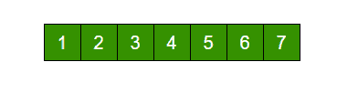
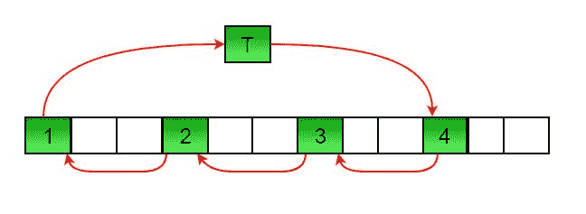

# 数组旋转程序的 C#程序

> 原文:[https://www . geesforgeks . org/cs harp-program-for-program-for-array-rotation/](https://www.geeksforgeeks.org/csharp-program-for-program-for-array-rotation/)

编写一个函数 rotate(ar[]，d，n)，将大小为 n 的 arr[]旋转 d 个元素。



将上面的数组旋转 2 将会形成数组


**方法 1(使用温度数组)**

```
Input arr[] = [1, 2, 3, 4, 5, 6, 7], d = 2, n =7
1) Store the first d elements in a temp array
   temp[] = [1, 2]
2) Shift rest of the arr[]
   arr[] = [3, 4, 5, 6, 7, 6, 7]
3) Store back the d elements
   arr[] = [3, 4, 5, 6, 7, 1, 2]
```

**时间复杂度:**O(n)
T3】辅助空间: O(d)

**方法 2(逐个旋转)**

```
leftRotate(arr[], d, n)
start
  For i = 0 to i < d
    Left rotate all elements of arr[] by one
end
```

要旋转 1，将 arr[0]存储在临时变量 temp 中，将 arr[1]移动到 arr[0]，将 arr[2]移动到 arr[1]…最后将 temp 移动到 arr[n-1]
让我们举同样的例子 arr[] = [1，2，3，4，5，6，7]，d = 2
将 arr[]旋转 1 2 次
我们在第一次旋转后得到[2，3，4，5，6，7，1]，在第二次旋转后得到[ 3，4，5，6，7，1，2]
以下是上述办法的实施:

## C#

```
// C# program for array rotation
using System;

class GFG {
    /* Function to left rotate arr[]
    of size n by d*/
    static void leftRotate(int[] arr, int d,
                           int n)
    {
        for (int i = 0; i < d; i++)
            leftRotatebyOne(arr, n);
    }

    static void leftRotatebyOne(int[] arr, int n)
    {
        int i, temp = arr[0];
        for (i = 0; i < n - 1; i++)
            arr[i] = arr[i + 1];

        arr[n-1] = temp;
    }

    /* utility function to print an array */
    static void printArray(int[] arr, int size)
    {
        for (int i = 0; i < size; i++)
            Console.Write(arr[i] + " ");
    }

    // Driver code
    public static void Main()
    {
        int[] arr = { 1, 2, 3, 4, 5, 6, 7 };
        leftRotate(arr, 2, 7);
        printArray(arr, 7);
    }
}

// This code is contributed by Sam007
```

**输出:**

```
3 4 5 6 7 1 2 
```

**时间复杂度:**O(n * d)
T3】辅助空间: O(1)
**方法 3(一种杂耍算法)**
这是方法 2 的扩展。不要一个接一个地移动，而是将数组分成不同的集合
，集合的数量等于 n 和 d 的 GCD，移动集合内的元素。
如果 GCD 为 1，就像上面的示例数组(n = 7，d =2)一样，那么元素将只在一个集合内移动，我们只需从 temp = arr[0]开始，继续将 arr[I+d]移动到 arr[I]，最后将 temp 存储在正确的位置。
这里有一个 n =12，d = 3 的例子。GCD 为 3 和

```
Let arr[] be {1, 2, 3, 4, 5, 6, 7, 8, 9, 10, 11, 12}

a) Elements are first moved in first set – (See below 
   diagram for this movement)
```



```
          arr[] after this step --> {4 2 3 7 5 6 10 8 9 1 11 12}

b)    Then in second set.
          arr[] after this step --> {4 5 3 7 8 6 10 11 9 1 2 12}

c)    Finally in third set.
          arr[] after this step --> {4 5 6 7 8 9 10 11 12 1 2 3}
```

以下是上述方法的实现:

## C#

```
// C# program for array rotation
using System;

class GFG {
    /* Function to left rotate arr[]
    of size n by d*/
    static void leftRotate(int[] arr, int d,
                           int n)
    {
        int i, j, k, temp;
        /* To handle if d >= n */
        d = d % n;
        int g_c_d = gcd(d, n);
        for (i = 0; i < g_c_d; i++) {
            /* move i-th values of blocks */
            temp = arr[i];
            j = i;
            while (true) {
                k = j + d;
                if (k >= n)
                    k = k - n;
                if (k == i)
                    break;
                arr[j] = arr[k];
                j = k;
            }
            arr[j] = temp;
        }
    }

    /*UTILITY FUNCTIONS*/
    /* Function to print an array */
    static void printArray(int[] arr, int size)
    {
        for (int i = 0; i < size; i++)
            Console.Write(arr[i] + " ");
    }

    /* Function to get gcd of a and b*/
    static int gcd(int a, int b)
    {
        if (b == 0)
            return a;
        else
            return gcd(b, a % b);
    }

    // Driver code
    public static void Main()
    {
        int[] arr = { 1, 2, 3, 4, 5, 6, 7 };
        leftRotate(arr, 2, 7);
        printArray(arr, 7);
    }
}

// This code is contributed by Sam007
```

**输出:**

```
3 4 5 6 7 1 2 
```

**时间复杂度:**O(n)
T3】辅助空间: O(1)

其他数组旋转的方法请看下面的帖子:
[数组旋转的块交换算法](https://www.geeksforgeeks.org/block-swap-algorithm-for-array-rotation/)
[数组旋转的反转算法](https://www.geeksforgeeks.org/program-for-array-rotation-continued-reversal-algorithm/)
如果发现以上程序/算法有 bug 请写评论。

更多详情请参考[数组旋转程序](https://www.geeksforgeeks.org/array-rotation/)的完整文章！