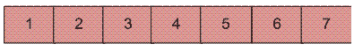
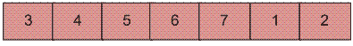

# 阵列旋转反转算法 C#程序

> 原文:[https://www . geeksforgeeks . org/cs harp-程序求逆-算法求阵-旋转/](https://www.geeksforgeeks.org/csharp-program-for-reversal-algorithm-for-array-rotation/)

编写一个函数 rotate(arr[]，d，n)，将大小为 n 的 arr[]旋转 d 个元素。
**例:**

```
Input :  arr[] = [1, 2, 3, 4, 5, 6, 7]
         d = 2
Output : arr[] = [3, 4, 5, 6, 7, 1, 2] 
```



将上面的数组旋转 2 将会形成数组



通过 d 元素旋转数组的前 3 种方法已经在[这篇](https://www.geeksforgeeks.org/array-rotation/)文章中讨论过了。
**方法 4(反转算法):**
**算法:**

```
rotate(arr[], d, n)
  reverse(arr[], 1, d) ;
  reverse(arr[], d + 1, n);
  reverse(arr[], 1, n);
```

假设 AB 是输入数组的两部分，其中 A = arr[0..d-1]和 B = arr[d..n-1]。算法的思路是:

*   反向 A 得到 ArB，其中 Ar 是 A 的反向。
*   反向 B 得到 ArBr，其中 Br 是 B 的反向。
*   全部反转得到(ArBr) r = BA。

**例:**
让数组为 arr[] = [1，2，3，4，5，6，7]，d =2 和 n = 7
A = [1，2]和 B = [3，4，5，6，7]

*   反过来，我们得到 ArB = [2，1，3，4，5，6，7]
*   反 B，我们得到 ArBr = [2，1，7，6，5，4，3]
*   反过来，我们得到(ArBr)r = [3，4，5，6，7，1，2]

以下是上述方法的实现:

## C#

```
// C# program for reversal algorithm
// of array rotation
using System;

class GFG {
    /* Function to left rotate arr[]
    of size n by d */
    static void leftRotate(int[] arr, int d)
    {

        if (d == 0)
            return;
        int n = arr.Length;
          // in case the rotating factor is
        // greater than array length
        d = d % n;
        reverseArray(arr, 0, d - 1);
        reverseArray(arr, d, n - 1);
        reverseArray(arr, 0, n - 1);
    }

    /* Function to reverse arr[] from
    index start to end*/
    static void reverseArray(int[] arr, int start,
                             int end)
    {
        int temp;
        while (start < end) {
            temp = arr[start];
            arr[start] = arr[end];
            arr[end] = temp;
            start++;
            end--;
        }
    }

    /*UTILITY FUNCTIONS*/
    /* function to print an array */
    static void printArray(int[] arr)
    {
        for (int i = 0; i < arr.Length; i++)
            Console.Write(arr[i] + " ");
    }

    // Driver code
    public static void Main()
    {
        int[] arr = { 1, 2, 3, 4, 5, 6, 7 };
        int n = arr.Length;
        int d = 2;

        leftRotate(arr, d); // Rotate array by 2
        printArray(arr);
    }
}

// This code is contributed by Sam007
```

**输出:**

```
3 4 5 6 7 1 2
```

**时间复杂度:** O(n)

更多详情请参考[数组旋转反转算法](https://www.geeksforgeeks.org/program-for-array-rotation-continued-reversal-algorithm/)的完整文章！