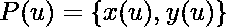
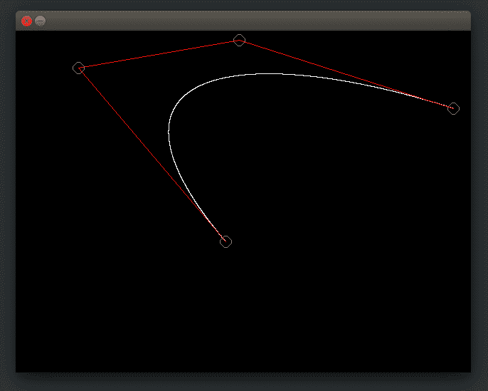

# 三次贝塞尔曲线在 C 中的实现

> 原文:[https://www . geesforgeks . org/cubic-bezier-curve-implement-in-c/](https://www.geeksforgeeks.org/cubic-bezier-curve-implementation-in-c/)

**什么是贝塞尔曲线？**
所以贝塞尔曲线是一种数学定义的曲线，用于二维图形应用，如家居插画、水墨等。曲线由四个点定义:**初始位置**和**终止位置**即 **P0** 和 **P3** (分别称为“锚”)和**两个独立的中间点**即 **P1** 和 **P2** (在我们的示例中称为“手柄”)。贝塞尔曲线常用于计算机图形、动画、建模等。
**我们如何用数学方法表示贝塞尔曲线？**
贝塞尔曲线可以在其他点的控制下生成。使用控制点近似切线用于生成曲线。贝塞尔曲线在数学上可以表示为–

，其中是点集，表示伯恩斯坦多项式，即由–

给出的混合函数，其中 **n** 是多项式阶次， **i** 是指数， **u/t** 是从 **0** 到 **1** 的变量。
让我们用数学的方法定义我们的三次贝塞尔曲线。
所以贝塞尔曲线 id 由一组控制点到定义，其中 n 称为它的阶数(n = 1 表示线性，n = 2 表示二次等)。).第一个和最后一个控制点总是曲线的端点；然而，中间控制点(如果有的话)通常不在曲线上。
对于三次贝塞尔曲线，多项式的阶数(n)为 **3** ，指数(I)从 **i = 0 变化到 i = n，即 3** ，u 将从变化。

```
Cubic Bezier Curve function is defined as :
```


```
Cubic Bezier Curve blending function are defined as :
```


所以

和

现在，


所以我们将通过将 u 的值递增 **0.0001** 来计算曲线 x 和 y 像素。


三次贝塞尔曲线的构造

```
Properties of bezier curves
```

1.他们总是经过第一个和最后一个控制点。
2。它们包含在它们定义的控制点的凸包中。
3。定义曲线段的多项式的次数比定义多边形点的次数少一次。因此，对于 4 个控制点，多项式的次数为 3，即三次多项式。
4。贝塞尔曲线通常遵循定义多边形
5 的形状。端点处切线向量的方向与第一段和最后一段确定的向量的方向相同。
6。贝塞尔曲线呈现全局控制意味着移动控制点会改变整个曲线的形状
**注**:以下实现使用 SDL 库在屏幕上绘制像素。如果你在像 ubuntu 这样的 Debian 系统上，只需运行以下命令来安装 SDL 库。

**例:给我们四个控制点 B<sub>0</sub>【1，0】，B<sub>1</sub>【2，2】，B<sub>2</sub>【6，3】，B<sub>3</sub>【8，2】，所以确定位于曲线上的五个点也就在图上画出了曲线。**

**Ans:** 给定曲线有四个控制点，因此它是三次贝塞尔曲线，所以，三次贝塞尔曲线的参数方程是

![\hspace{1.2cm}\mathbf{P(t)=B_0(1-t)^3+3*B_1*(1-t)^2*t+3*B_2*(1-t)*t^2+B_3*t^3} \\\\\hspace{5.8cm}\textbf{Where t is 0$\leq$t$\leq$1}\\\\ \\\\\hspace{2.8cm}\textbf{Where }\mathbf{[B_x\,\,B_y]}\textbf{ is representing scalar x \& y coordinates}](img/05677bcaab64322e9e6dcca75ca99007.png "Rendered by QuickLaTeX.com")

现在，将控制点代入上面的等式，我们将得到，

![\hspace{0cm}\mathbf{P(t)=[1\,\,0]*(1-t)^3+3*[2\,\,2]*(1-t)^2*t+3*[6\,\,2]*(1-t)*t^2+[8\,\,2]*t^3}](img/d7c2a49ae05b7ca90fff34410c0f6f04.png "Rendered by QuickLaTeX.com")

让我们假设 **t** 的五个不同值是 **{0，0.2，0.5，0.7，1}。**

**因此，对于 t=0，坐标将是，**

![\hspace{0cm}\mathbf{P(0)=[1\,\,0]*(1-0)^3+3*[2\,\,2]*(1-0)^2*0+3*[6\,\,2]*(1-0)*0^2+[8\,\,2]*0^3}\\ \hspace{0cm}\mathbf{P(0)=[1\,\,0]}](img/5b5fd83eb4e17ffb8604b347a5fc2a60.png "Rendered by QuickLaTeX.com")

**因此，对于 t=0.2，坐标将是，**

![\hspace{0cm}\mathbf{P(0.2)=[1\,\,0]*(1-0.2)^3+3*[2\,\,2]*(1-0.2)^2*0.2+3*[6\,\,2]*(1-0.2)*0.2^2+[8\,\,2]*0.2^3}\\ \\ \hspace{1.16cm}\mathbf{=[1\,\,0]*0.576+[2\,\,2]*0.384+[6\,\,2]*0.032+[8\,\,2]*0.2^3}\\ \hspace{1.16cm}\mathbf{=[0.576\,\,0]+[0.768\,\,0.768]+[0.192\,\,0.064]+[0.064\,\,0.016]}\\ \\ \hspace{0cm}\mathbf{P(0.2)=[1.48424\,\,\,0.848]}](img/aaa32ad59fdbf1f58a717bc763db8915.png "Rendered by QuickLaTeX.com")

**因此，对于 t=0.5，坐标将是，**

![\\\hspace{0cm}\mathbf{P(0.5)=[1\,\,0]*(1-0.5)^3+3*[2\,\,2]*(1-0.5)^2*0.5+3*[6\,\,2]*(1-0.5)*0.5^2+[8\,\,2]*0.5^3}\\ \\\hspace{0cm}\mathbf{P(0.5)=[4.125\,\,1.75]}](img/506e13a01af363cfa0d896950bc0e82c.png "Rendered by QuickLaTeX.com")

**因此，对于 t=0.7，坐标将是，**

![\hspace{0cm}\mathbf{P(0.7)=[1\,\,0]*(1-0.7)^3+3*[2\,\,2]*(1-0.7)^2*0.7+3*[6\,\,2]*(1-0.7)*0.7^2+[8\,\,2]*0.7^3}\\ \\\hspace{0cm}\mathbf{P(0.7)=[5.417\,\,\,2.108]}\\](img/4449c7c0be21cf218558afee4e0feb24.png "Rendered by QuickLaTeX.com")

**因此，对于 t=1.0，坐标将是，**

![\\\hspace{0cm}\mathbf{P(1.0)=[1\,\,0]*(1-1)^3+3*[2\,\,2]*(1-1)^2*1+3*[6\,\,2]*(1-1)*1^2+[8\,\,2]*1^3}\\ \hspace{0cm}\mathbf{P(1.0)=[8\,\,\,2]}](img/e7dcc21248705549e68694c99aa81bf7.png "Rendered by QuickLaTeX.com")


**图 1**

**<u>贝塞尔曲线的缺点</u> :**

**a)** 贝塞尔曲线的度数取决于与相应曲线相关联的控制点的数量，随着控制点数量的增加，曲线方程的多项式次数也随之增加，这使得曲线方程非常复杂，更难处理。

```
 Degree of curve = no. of control points - 1
```

**b)** 使用贝塞尔曲线的一个主要缺点是它们赋予曲线全局控制。也就是说，如果曲线的相对位置改变，整个曲线形状也会改变。这使得使用起来不太方便。


在改变任何一个控制点的相对位置时，整个曲线形状得到改变:


**c)** 贝塞尔曲线的另一个问题是，无论曲线的度数如何，它的混合函数对于任何参数都不会为零。

```
sudo apt-get install libsdl2-dev
```

建造使用

```
gcc fileName.c -lSDL2 -lm
```

## C

```
// C program to implement
// Cubic Bezier Curve

/* install SDL library for running thing code*/
/* install by using this commamnd line : sudo apt-get install libsdl2-dev */
/* run this code using command : gcc fileName.c -lSDL2 -lm*/

#include<stdio.h>
#include<stdlib.h>
#include<math.h>
#include<SDL2/SDL.h>

SDL_Window* window = NULL;
SDL_Renderer* renderer = NULL;
int mousePosX , mousePosY ;
int xnew , ynew ;

/*Function to draw all other 7 pixels present at symmetric position*/
void drawCircle(int xc, int yc, int x, int y)
{
    SDL_RenderDrawPoint(renderer,xc+x,yc+y) ;
    SDL_RenderDrawPoint(renderer,xc-x,yc+y);
    SDL_RenderDrawPoint(renderer,xc+x,yc-y);
    SDL_RenderDrawPoint(renderer,xc-x,yc-y);
    SDL_RenderDrawPoint(renderer,xc+y,yc+x);
    SDL_RenderDrawPoint(renderer,xc-y,yc+x);
    SDL_RenderDrawPoint(renderer,xc+y,yc-x);
    SDL_RenderDrawPoint(renderer,xc-y,yc-x);
}

/*Function for circle-generation using Bresenham's algorithm */
void circleBres(int xc, int yc, int r)
{
    int x = 0, y = r;
    int d = 3 - 2 * r;
    while (y >= x)
    {
        /*for each pixel we will draw all eight pixels */
        drawCircle(xc, yc, x, y);
        x++;

        /*check for decision parameter and correspondingly update d, x, y*/
        if (d > 0)
        {
            y--;
            d = d + 4 * (x - y) + 10;
        }
        else
            d = d + 4 * x + 6;
        drawCircle(xc, yc, x, y);
    }
}

/* Function that take input as Control Point x_coordinates and
Control Point y_coordinates and draw bezier curve */
void bezierCurve(int x[] , int y[])
{
    double xu = 0.0 , yu = 0.0 , u = 0.0 ;
    int i = 0 ;
    for(u = 0.0 ; u <= 1.0 ; u += 0.0001)
    {
        xu = pow(1-u,3)*x[0]+3*u*pow(1-u,2)*x[1]+3*pow(u,2)*(1-u)*x[2]
             +pow(u,3)*x[3];
        yu = pow(1-u,3)*y[0]+3*u*pow(1-u,2)*y[1]+3*pow(u,2)*(1-u)*y[2]
            +pow(u,3)*y[3];
        SDL_RenderDrawPoint(renderer , (int)xu , (int)yu) ;
    }
}
int main(int argc, char* argv[])
{
    /*initialize sdl*/
    if (SDL_Init(SDL_INIT_EVERYTHING) == 0)
    {
        /*
            This function is used to create a window and default renderer.
            int SDL_CreateWindowAndRenderer(int width
                                          ,int height
                                          ,Uint32 window_flags
                                          ,SDL_Window** window
                                          ,SDL_Renderer** renderer)
            return 0 on success and -1 on error
        */
        if(SDL_CreateWindowAndRenderer(640, 480, 0, &window, &renderer) == 0)
        {
            SDL_bool done = SDL_FALSE;

            int i = 0 ;
            int x[4] , y[4] , flagDrawn = 0 ;

            while (!done)
            {
                SDL_Event event;

                /*set background color to black*/
                SDL_SetRenderDrawColor(renderer, 0, 0, 0, SDL_ALPHA_OPAQUE);
                SDL_RenderClear(renderer);

                /*set draw color to white*/
                SDL_SetRenderDrawColor(renderer, 255, 255, 255, SDL_ALPHA_OPAQUE);

                /* We are drawing cubic bezier curve
                which has four control points */
                if(i==4)
                {
                    bezierCurve(x , y) ;
                    flagDrawn = 1 ;
                }

                /*grey color circle to encircle control Point P0*/
                SDL_SetRenderDrawColor(renderer, 128, 128, 128, SDL_ALPHA_OPAQUE);
                circleBres(x[0] , y[0] , 8) ;

                /*Red Line between control Point P0 & P1*/
                SDL_SetRenderDrawColor(renderer, 255, 0, 0, SDL_ALPHA_OPAQUE);
                SDL_RenderDrawLine(renderer , x[0] , y[0] , x[1] , y[1]) ;

                /*grey color circle to encircle control Point P1*/
                SDL_SetRenderDrawColor(renderer, 128, 128, 128, SDL_ALPHA_OPAQUE);
                circleBres(x[1] , y[1] , 8) ;

                /*Red Line between control Point P1 & P2*/
                SDL_SetRenderDrawColor(renderer, 255, 0, 0, SDL_ALPHA_OPAQUE);
                SDL_RenderDrawLine(renderer , x[1] , y[1] , x[2] , y[2]) ;

                /*grey color circle to encircle control Point P2*/
                SDL_SetRenderDrawColor(renderer, 128, 128, 128, SDL_ALPHA_OPAQUE);
                circleBres(x[2] , y[2] , 8) ;

                /*Red Line between control Point P2 & P3*/
                SDL_SetRenderDrawColor(renderer, 255, 0, 0, SDL_ALPHA_OPAQUE);
                SDL_RenderDrawLine(renderer , x[2] , y[2] , x[3] , y[3]) ;

                /*grey color circle to encircle control Point P3*/
                SDL_SetRenderDrawColor(renderer, 128, 128, 128, SDL_ALPHA_OPAQUE);
                circleBres(x[3] , y[3] , 8) ;

                /*We are Polling SDL events*/
                if (SDL_PollEvent(&event))
                {
                    /* if window cross button clicked then quit from window */
                    if (event.type == SDL_QUIT)
                    {
                        done = SDL_TRUE;
                    }
                    /*Mouse Button is Down */
                    if(event.type == SDL_MOUSEBUTTONDOWN)
                    {
                        /*If left mouse button down then store
                          that point as control point*/
                        if(event.button.button == SDL_BUTTON_LEFT)
                        {
                            /*store only four points
                            because of cubic bezier curve*/
                            if(i < 4)
                            {
                                printf("Control Point(P%d):(%d,%d)\n"
                                ,i,mousePosX,mousePosY) ;

                                /*Storing Mouse x and y positions
                                in our x and y coordinate array */
                                x[i] = mousePosX ;
                                y[i] = mousePosY ;
                                i++ ;
                            }
                        }
                    }
                    /*Mouse is in motion*/
                    if(event.type == SDL_MOUSEMOTION)
                    {
                        /*get x and y positions from motion of mouse*/
                        xnew = event.motion.x ;
                        ynew = event.motion.y ;

                        int j ;

                        /* change coordinates of control point
                         after bezier curve has been drawn */
                        if(flagDrawn == 1)
                        {
                            for(j = 0 ; j < i ; j++)
                            {
                                /*Check mouse position if in b/w circle then
                          change position of that control point to mouse new
                                position which are coming from mouse motion*/
                                if((float)sqrt(abs(xnew-x[j]) * abs(xnew-x[j])
                                     + abs(ynew-y[j]) * abs(ynew-y[j])) < 8.0)
                                {
                                    /*change coordinate of jth control point*/
                                    x[j] = xnew ;
                                    y[j] = ynew ;
                                    printf("Changed Control Point(P%d):(%d,%d)\n"
                                           ,j,xnew,ynew) ;
                                }
                            }
                        }
                        /*updating mouse positions to positions
                        coming from motion*/
                        mousePosX = xnew ;
                        mousePosY = ynew ;
                    }
                }
                /*show the window*/
                SDL_RenderPresent(renderer);
            }
        }
        /*Destroy the renderer and window*/
        if (renderer)
        {
            SDL_DestroyRenderer(renderer);
        }
        if (window)
        {
            SDL_DestroyWindow(window);
        }
    }
    /*clean up SDL*/
    SDL_Quit();
    return 0;
}
```

```
Output
```

**当鼠标位置为 b/w 圆时移动鼠标，则只有曲线形状会改变**




**参考文献:**
[https://en.wikipedia.org/wiki/B%C3%A9zier_curve](https://en.wikipedia.org/wiki/B%C3%A9zier_curve)
[https://www . tutorialspoint . com/computer _ graphics/computer _ graphics _ curves . htm](https://www.tutorialspoint.com/computer_graphics/computer_graphics_curves.htm)
[http://www . math . UCLA . edu/~ baker/149 . 1 . 02 w/讲义/bb_bezier.pdf](http://www.math.ucla.edu/~baker/149.1.02w/handouts/bb_bezier.pdf)
本文由**Palkansh Khandelwal**
供稿