# 布谷鸟哈希–最坏情况 O(1)查找！

> 原文:[https://www.geeksforgeeks.org/cuckoo-hashing/](https://www.geeksforgeeks.org/cuckoo-hashing/)

**背景:**
一个[哈希表](http://geeksquiz.com/hashing-set-1-introduction/)(或者字典)必须支持三个基本操作:

*   **查找(键):**返回**真**如果键在桌子上，否则**假**
*   **插入(键):**如果表中还没有“键”项，则将其添加到表中
*   **删除(键):**从表中删除“键”

即使我们有一张大桌子来存放钥匙，也很有可能发生碰撞。用[生日悖论](https://www.geeksforgeeks.org/birthday-paradox/)的结果:只有 23 个人，两个人共用同一个出生日期的概率是 50%！有 3 种解决哈希冲突的一般策略:

*   [**封闭寻址或链接**](http://geeksquiz.com/hashing-set-2-separate-chaining/) :将冲突元素存储在一个辅助数据结构中，如链表或二叉查找树。
*   [**开放寻址**](http://geeksquiz.com/hashing-set-3-open-addressing/) :允许元素溢出目标桶，进入其他空间。

虽然上述解决方案提供的预期查找成本为 O(1)，但在开放寻址(带有线性探测)中，查找的预期最坏情况成本是ω(log n)和θ(log n/log log n)，在简单链接中(来源:[斯坦福课堂讲稿](http://web.stanford.edu/class/cs166/lectures/13/Small13.pdf))。为了缩小预期时间和最坏情况下的预期时间之间的差距，使用了两种方法:

*   **多项选择散列**:为每个元素在散列表中的位置提供多项选择
*   **重定位哈希**:允许哈希表中的元素放置后移动

**布谷鸟哈希:**
布谷鸟哈希将选择题和重定位的思想结合在一起，保证 O(1)最坏情况查找时间！

*   **多选:**我们给一把钥匙**两个选择****T5【h1(钥匙)和 h2(钥匙)居住。**
*   **重定位**:可能会发生 h1(键)和 h2(键)被占用的情况。这是通过模仿布谷鸟来解决的:*当它孵化出*时，它会将其他蛋或幼鸟推出巢外。类似地，在布谷鸟散列表中插入新密钥可能会将旧密钥推到不同的位置。这就给我们留下了重新放置旧钥匙的问题。
    *   如果旧钥匙的备用位置是空的，没有问题。
    *   否则，较旧的键会替换另一个键。这种情况一直持续到程序找到一个空缺职位或进入一个周期。在循环的情况下，选择新的散列函数，整个数据结构被“重新散列”。在布谷鸟成功之前，可能需要多次重生。

**插入**预计 O(1)(摊销)的概率很高，即使考虑到重散列的可能性，只要键的数量保持在哈希表容量的一半以下，即加载因子在 50%以下。

**删除**是 O(1)最坏的情况，因为它只需要检查哈希表中的两个位置。

**插图**

**输入:**

```
{20, 50, 53, 75, 100, 67, 105, 3, 36, 39}
```

**散列函数:**

```
h1(key) = key%11
h2(key) = (key/11)%11
```

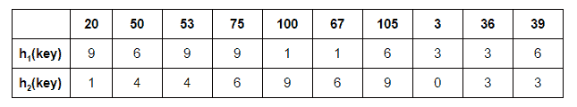

让我们首先在 h1(20)确定的第一个表中的可能位置插入 **20** :

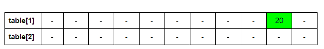

下一个: **50**

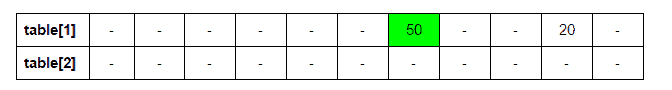

接下来: **53** 。h1(53) = 9。但是 9 点 20 已经到了。我们将表 1 中的 53&20 置于表 2 中的 h2(20)

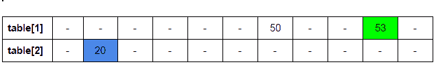

接下来: **75** 。h1(75) = 9。但是 53 已经在 9 点了。我们将表 1 中的 75&53 置于表 2 中的 h2(53)

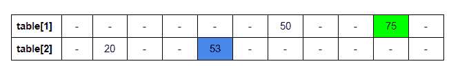

下一步: **100** 。h1(100) = 1。

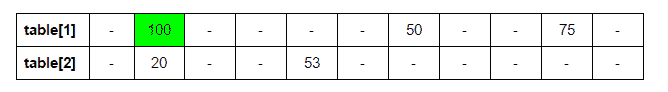

接下来: **67** 。h1(67) = 1。但是 100 已经在 1 点了。我们把 67 放在表 1 中& 100 放在表 2 中

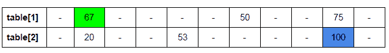

接下来: **105** 。h1(105) = 6。但是 6 点 50 已经到了。我们将表 1 中的 105&50 置于表 2 中的 h2(50) = 4。现在已经有 53 人流离失所。h1(53) = 9。75 移位:h2(75) = 6。

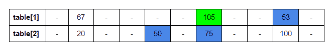

接下来: **3** 。h1(3) = 3。

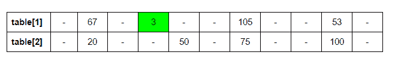

接下来: **36** 。h1(36) = 3。h2(3) = 0。

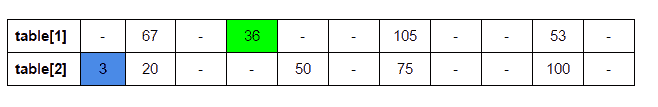

接下来: **39** 。h1(39) = 6。h2(105) = 9。h1(100) = 1。h2(67) = 6。h1(75) = 9。h2(53) = 4。h1(50) = 6。h2(39) = 3。
在这里，新密钥 39 在随后对 place 105 的递归调用中被置换，它被置换。

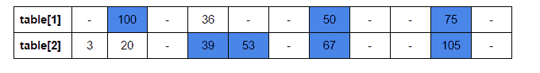

**实现:**
下面是布谷鸟哈希的实现

## C++

```
// C++ program to demonstrate working of Cuckoo
// hashing.
#include<bits/stdc++.h>

// upper bound on number of elements in our set
#define MAXN 11

// choices for position
#define ver 2

// Auxiliary space bounded by a small multiple
// of MAXN, minimizing wastage
int hashtable[ver][MAXN];

// Array to store possible positions for a key
int pos[ver];

/* function to fill hash table with dummy value
 * dummy value: INT_MIN
 * number of hashtables: ver */
void initTable()
{
    for (int j=0; j<MAXN; j++)
        for (int i=0; i<ver; i++)
            hashtable[i][j] = INT_MIN;
}

/* return hashed value for a key
 * function: ID of hash function according to which
    key has to hashed
 * key: item to be hashed */
int hash(int function, int key)
{
    switch (function)
    {
        case 1: return key%MAXN;
        case 2: return (key/MAXN)%MAXN;
    }
}

/* function to place a key in one of its possible positions
 * tableID: table in which key has to be placed, also equal
   to function according to which key must be hashed
 * cnt: number of times function has already been called
   in order to place the first input key
 * n: maximum number of times function can be recursively
   called before stopping and declaring presence of cycle */
void place(int key, int tableID, int cnt, int n)
{
    /* if function has been recursively called max number
       of times, stop and declare cycle. Rehash. */
    if (cnt==n)
    {
        printf("%d unpositioned\n", key);
        printf("Cycle present. REHASH.\n");
        return;
    }

    /* calculate and store possible positions for the key.
     * check if key already present at any of the positions.
      If YES, return. */
    for (int i=0; i<ver; i++)
    {
        pos[i] = hash(i+1, key);
        if (hashtable[i][pos[i]] == key)
           return;
    }

    /* check if another key is already present at the
       position for the new key in the table
     * If YES: place the new key in its position
     * and place the older key in an alternate position
       for it in the next table */
    if (hashtable[tableID][pos[tableID]]!=INT_MIN)
    {
        int dis = hashtable[tableID][pos[tableID]];
        hashtable[tableID][pos[tableID]] = key;
        place(dis, (tableID+1)%ver, cnt+1, n);
    }
    else //else: place the new key in its position
       hashtable[tableID][pos[tableID]] = key;
}

/* function to print hash table contents */
void printTable()
{
    printf("Final hash tables:\n");

    for (int i=0; i<ver; i++, printf("\n"))
        for (int j=0; j<MAXN; j++)
            (hashtable[i][j]==INT_MIN)? printf("- "):
                     printf("%d ", hashtable[i][j]);

    printf("\n");
}

/* function for Cuckoo-hashing keys
 * keys[]: input array of keys
 * n: size of input array */
void cuckoo(int keys[], int n)
{
    // initialize hash tables to a dummy value (INT-MIN)
    // indicating empty position
    initTable();

    // start with placing every key at its position in
    // the first hash table according to first hash
    // function
    for (int i=0, cnt=0; i<n; i++, cnt=0)
        place(keys[i], 0, cnt, n);

    //print the final hash tables
    printTable();
}

/* driver function */
int main()
{
    /* following array doesn't have any cycles and
       hence  all keys will be inserted without any
       rehashing */
    int keys_1[] = {20, 50, 53, 75, 100, 67, 105,
                    3, 36, 39};

    int n = sizeof(keys_1)/sizeof(int);

    cuckoo(keys_1, n);

    /* following array has a cycle and hence we will
       have to rehash to position every key */
    int keys_2[] = {20, 50, 53, 75, 100, 67, 105,
                    3, 36, 39, 6};

    int m = sizeof(keys_2)/sizeof(int);

    cuckoo(keys_2, m);

    return 0;
}
```

## Java 语言(一种计算机语言，尤用于创建网站)

```
// Java program to demonstrate working of
// Cuckoo hashing.
import java.util.*;

class GFG
{

// upper bound on number of elements in our set
static int MAXN = 11;

// choices for position
static int ver = 2;

// Auxiliary space bounded by a small multiple
// of MAXN, minimizing wastage
static int [][]hashtable = new int[ver][MAXN];

// Array to store possible positions for a key
static int []pos = new int[ver];

/* function to fill hash table with dummy value
* dummy value: INT_MIN
* number of hashtables: ver */
static void initTable()
{
    for (int j = 0; j < MAXN; j++)
        for (int i = 0; i < ver; i++)
            hashtable[i][j] = Integer.MIN_VALUE;
}

/* return hashed value for a key
* function: ID of hash function according to which
    key has to hashed
* key: item to be hashed */
static int hash(int function, int key)
{
    switch (function)
    {
        case 1: return key % MAXN;
        case 2: return (key / MAXN) % MAXN;
    }
    return Integer.MIN_VALUE;
}

/* function to place a key in one of its possible positions
* tableID: table in which key has to be placed, also equal
  to function according to which key must be hashed
* cnt: number of times function has already been called
  in order to place the first input key
* n: maximum number of times function can be recursively
  called before stopping and declaring presence of cycle */
static void place(int key, int tableID, int cnt, int n)
{
    /* if function has been recursively called max number
    of times, stop and declare cycle. Rehash. */
    if (cnt == n)
    {
        System.out.printf("%d unpositioned\n", key);
        System.out.printf("Cycle present. REHASH.\n");
        return;
    }

    /* calculate and store possible positions for the key.
    * check if key already present at any of the positions.
    If YES, return. */
    for (int i = 0; i < ver; i++)
    {
        pos[i] = hash(i + 1, key);
        if (hashtable[i][pos[i]] == key)
        return;
    }

    /* check if another key is already present at the
       position for the new key in the table
    * If YES: place the new key in its position
    * and place the older key in an alternate position
    for it in the next table */
    if (hashtable[tableID][pos[tableID]] != Integer.MIN_VALUE)
    {
        int dis = hashtable[tableID][pos[tableID]];
        hashtable[tableID][pos[tableID]] = key;
        place(dis, (tableID + 1) % ver, cnt + 1, n);
    }
    else // else: place the new key in its position
    hashtable[tableID][pos[tableID]] = key;
}

/* function to print hash table contents */
static void printTable()
{
    System.out.printf("Final hash tables:\n");

    for (int i = 0; i < ver; i++, System.out.printf("\n"))
        for (int j = 0; j < MAXN; j++)
            if(hashtable[i][j] == Integer.MIN_VALUE)
                System.out.printf("- ");
            else
                System.out.printf("%d ", hashtable[i][j]);

    System.out.printf("\n");
}

/* function for Cuckoo-hashing keys
* keys[]: input array of keys
* n: size of input array */
static void cuckoo(int keys[], int n)
{
    // initialize hash tables to a dummy value
    // (INT-MIN) indicating empty position
    initTable();

    // start with placing every key at its position in
    // the first hash table according to first hash
    // function
    for (int i = 0, cnt = 0; i < n; i++, cnt = 0)
        place(keys[i], 0, cnt, n);

    // print the final hash tables
    printTable();
}

// Driver Code
public static void main(String[] args)
{
    /* following array doesn't have any cycles and
    hence all keys will be inserted without any
    rehashing */
    int keys_1[] = {20, 50, 53, 75, 100,
                    67, 105, 3, 36, 39};

    int n = keys_1.length;

    cuckoo(keys_1, n);

    /* following array has a cycle and hence we will
    have to rehash to position every key */
    int keys_2[] = {20, 50, 53, 75, 100,
                    67, 105, 3, 36, 39, 6};

    int m = keys_2.length;

    cuckoo(keys_2, m);
}
}

// This code is contributed by Princi Singh
```

## C#

```
// C# program to demonstrate working of
// Cuckoo hashing.
using System;

class GFG
{

// upper bound on number of
// elements in our set
static int MAXN = 11;

// choices for position
static int ver = 2;

// Auxiliary space bounded by a small
// multiple of MAXN, minimizing wastage
static int [,]hashtable = new int[ver, MAXN];

// Array to store
// possible positions for a key
static int []pos = new int[ver];

/* function to fill hash table
with dummy value
* dummy value: INT_MIN
* number of hashtables: ver */
static void initTable()
{
    for (int j = 0; j < MAXN; j++)
        for (int i = 0; i < ver; i++)
            hashtable[i, j] = int.MinValue;
}

/* return hashed value for a key
* function: ID of hash function
according to which key has to hashed
* key: item to be hashed */
static int hash(int function, int key)
{
    switch (function)
    {
        case 1: return key % MAXN;
        case 2: return (key / MAXN) % MAXN;
    }
    return int.MinValue;
}

/* function to place a key in one of
its possible positions
* tableID: table in which key
has to be placed, also equal to function
according to which key must be hashed
* cnt: number of times function has already
been called in order to place the first input key
* n: maximum number of times function
can be recursively called before stopping and
declaring presence of cycle */
static void place(int key, int tableID,
                  int cnt, int n)
{
    /* if function has been recursively
    called max number of times,
    stop and declare cycle. Rehash. */
    if (cnt == n)
    {
        Console.Write("{0} unpositioned\n", key);
        Console.Write("Cycle present. REHASH.\n");
        return;
    }

    /* calculate and store possible positions
    * for the key. Check if key already present
    at any of the positions. If YES, return. */
    for (int i = 0; i < ver; i++)
    {
        pos[i] = hash(i + 1, key);
        if (hashtable[i, pos[i]] == key)
        return;
    }

    /* check if another key is already present
    at the position for the new key in the table
    * If YES: place the new key in its position
    * and place the older key in an alternate position
    for it in the next table */
    if (hashtable[tableID,
              pos[tableID]] != int.MinValue)
    {
        int dis = hashtable[tableID, pos[tableID]];
        hashtable[tableID, pos[tableID]] = key;
        place(dis, (tableID + 1) % ver, cnt + 1, n);
    }
    else // else: place the new key in its position
    hashtable[tableID, pos[tableID]] = key;
}

/* function to print hash table contents */
static void printTable()
{
    Console.Write("Final hash tables:\n");

    for (int i = 0; i < ver;
             i++, Console.Write("\n"))
        for (int j = 0; j < MAXN; j++)
            if(hashtable[i, j] == int.MinValue)
                Console.Write("- ");
            else
                Console.Write("{0} ",
                        hashtable[i, j]);

    Console.Write("\n");
}

/* function for Cuckoo-hashing keys
* keys[]: input array of keys
* n: size of input array */
static void cuckoo(int []keys, int n)
{
    // initialize hash tables to a
    // dummy value (INT-MIN)
    // indicating empty position
    initTable();

    // start with placing every key
    // at its position in the first
    // hash table according to first
    // hash function
    for (int i = 0, cnt = 0;
             i < n; i++, cnt = 0)
        place(keys[i], 0, cnt, n);

    // print the final hash tables
    printTable();
}

// Driver Code
public static void Main(String[] args)
{
    /* following array doesn't have
    any cycles and hence all keys
    will be inserted without any rehashing */
    int []keys_1 = {20, 50, 53, 75, 100,
                    67, 105, 3, 36, 39};

    int n = keys_1.Length;

    cuckoo(keys_1, n);

    /* following array has a cycle and
    hence we will have to rehash to
    position every key */
    int []keys_2 = {20, 50, 53, 75, 100,
                    67, 105, 3, 36, 39, 6};

    int m = keys_2.Length;

    cuckoo(keys_2, m);
}
}

// This code is contributed by PrinciRaj1992
```

## java 描述语言

```
<script>

// Javascript program to demonstrate working of
// Cuckoo hashing.

// upper bound on number of elements in our set
let MAXN = 11;

// choices for position
let ver = 2;

// Auxiliary space bounded by a small multiple
// of MAXN, minimizing wastage
let hashtable = new Array(ver);
for (var i = 0; i < hashtable.length; i++) {
    hashtable[i] = new Array(2);
}

// Array to store possible positions for a key
let pos = Array(ver).fill(0);

/* function to fill hash table with dummy value
* dummy value: let_MIN
* number of hashtables: ver */
function initTable()
{
    for (let j = 0; j < MAXN; j++)
        for (let i = 0; i < ver; i++)
            hashtable[i][j] = Number.MIN_VALUE;
}

/* return hashed value for a key
* function: ID of hash function according to which
    key has to hashed
* key: item to be hashed */
function hash(function, key)
{
    switch (function)
    {
        case 1: return key % MAXN;
        case 2: return (Math.floor(key / MAXN)) % MAXN;
    }
    return Number.MIN_VALUE;
}

/* function to place a key in one of its possible positions
* tableID: table in which key has to be placed, also equal
  to function according to which key must be hashed
* cnt: number of times function has already been called
  in order to place the first input key
* n: maximum number of times function can be recursively
  called before stopping and declaring presence of cycle */
function place(key, tableID, cnt, n)
{
    /* if function has been recursively called max number
    of times, stop and declare cycle. Rehash. */
    if (cnt == n)
    {
        document.write(key + " unpositioned" + "<br/>");
        document.write("Cycle present. REHASH." + "<br/>");
        return;
    }

    /* calculate and store possible positions for the key.
    * check if key already present at any of the positions.
    If YES, return. */
    for (let i = 0; i < ver; i++)
    {
        pos[i] = hash(i + 1, key);
        if (hashtable[i][pos[i]] == key)
            return;
    }

    /* check if another key is already present at the
       position for the new key in the table
    * If YES: place the new key in its position
    * and place the older key in an alternate position
    for it in the next table */
    if (hashtable[tableID][pos[tableID]] != Number.MIN_VALUE)
    {
        let dis = hashtable[tableID][pos[tableID]];
        hashtable[tableID][pos[tableID]] = key;
        place(dis, (tableID + 1) % ver, cnt + 1, n);
    }
    else // else: place the new key in its position
        hashtable[tableID][pos[tableID]] = key;
}

/* function to print hash table contents */
function printTable()
{
    document.write("Final hash tables:" + "<br/>");

    for (let i = 0; i < ver; i++, document.write("<br/>"))
        for (let j = 0; j < MAXN; j++)
            if(hashtable[i][j] == Number.MIN_VALUE)
                document.write("- ");
            else
                document.write(hashtable[i][j] + " ");

    document.write("<br/>");
}

/* function for Cuckoo-hashing keys
* keys[]: input array of keys
* n: size of input array */
function cuckoo(keys, n)
{
    // initialize hash tables to a dummy value
    // (let-MIN) indicating empty position
    initTable();

    // start with placing every key at its position in
    // the first hash table according to first hash
    // function
    for (let i = 0, cnt = 0; i < n; i++, cnt = 0)
        place(keys[i], 0, cnt, n);

    // print the final hash tables
    printTable();
}

// Driver program

      /* following array doesn't have any cycles and
    hence all keys will be inserted without any
    rehashing */
    let keys_1 = [20, 50, 53, 75, 100,
                    67, 105, 3, 36, 39];

    let n = keys_1.length;

    cuckoo(keys_1, n);

    /* following array has a cycle and hence we will
    have to rehash to position every key */
    let keys_2 = [20, 50, 53, 75, 100,
                    67, 105, 3, 36, 39, 6];

    let m = keys_2.length;

    cuckoo(keys_2, m);

</script>
```

**输出:**

```
Final hash tables:

- 100 - 36 - - 50 - - 75 - 

3 20 - 39 53 - 67 - - 105 - 
105 unpositioned

Cycle present. REHASH.

Final hash tables:

- 67 - 3 - - 39 - - 53 - 

6 20 - 36 50 - 75 - - 100 -
```

使用 2 个以上替代散列函数的布谷鸟散列的推广可以预期有效地利用散列表的更大部分容量，同时牺牲一些查找和插入速度。示例:如果我们使用 3 个散列函数，那么加载 91%是安全的，并且仍然在预期范围内运行。

本文由**雅什·瓦利亚尼供稿。**如果你喜欢 GeeksforGeeks 并想投稿，你也可以写一篇文章，把你的文章邮寄到 review-team@geeksforgeeks.org。看到你的文章出现在极客博客主页上，帮助其他极客。
如果你发现任何不正确的地方，或者你想分享更多关于上面讨论的话题的信息，请写评论。